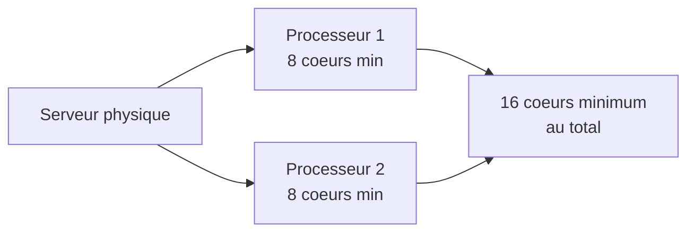

<!--
  Copyright 2026 Julien Bombled

  Licensed under the Apache License, Version 2.0 (the "License");
  you may not use this file except in compliance with the License.
  You may obtain a copy of the License at

      http://www.apache.org/licenses/LICENSE-2.0

  Unless required by applicable law or agreed to in writing, software
  distributed under the License is distributed on an "AS IS" BASIS,
  WITHOUT WARRANTIES OR CONDITIONS OF ANY KIND, either express or implied.
  See the License for the specific language governing permissions and
  limitations under the License.
-->

# Editions et licences

<span class="level-beginner">Debutant</span> · Temps estime : 15 minutes

## Les editions de Windows Server 2022

!!! example "Analogie"

    Imaginez un immeuble de bureaux. L'edition **Essentials** est un petit local pour une startup de 25 personnes.
    L'edition **Standard** est un etage entier avec deux salles de reunion. L'edition **Datacenter** est
    l'immeuble complet, avec un nombre illimite de salles, un parking souterrain et un systeme de securite avance.

Microsoft propose trois editions principales, chacune adaptee a des besoins differents.

### Essentials

| Caracteristique | Valeur |
|-----------------|--------|
| Utilisateurs max | 25 |
| Coeurs CPU max | 10 |
| RAM max | 64 Go |
| Hyper-V | Non |
| Licence | Par serveur |

!!! tip "Usage type"

    Petites entreprises sans besoin de virtualisation. Inclut les roles AD DS, DNS, DHCP, fichiers.

### Standard

| Caracteristique | Valeur |
|-----------------|--------|
| Utilisateurs max | Illimite (CAL requises) |
| Coeurs CPU max | Illimite |
| RAM max | 48 To |
| Hyper-V | Oui (2 VMs incluses) |
| Licence | Par coeur + CAL |

!!! tip "Usage type"

    Environnements physiques ou faiblement virtualises. Convient a la majorite des PME.

### Datacenter

| Caracteristique | Valeur |
|-----------------|--------|
| Utilisateurs max | Illimite (CAL requises) |
| Coeurs CPU max | Illimite |
| RAM max | 48 To |
| Hyper-V | Oui (VMs illimitees) |
| Licence | Par coeur + CAL |

!!! tip "Usage type"

    Environnements fortement virtualises, cloud prive, Software Defined (Storage Spaces Direct, SDN).

### Tableau comparatif des fonctionnalites

| Fonctionnalite | Essentials | Standard | Datacenter |
|----------------|:----------:|:--------:|:----------:|
| AD DS, DNS, DHCP | :material-check: | :material-check: | :material-check: |
| Serveur de fichiers | :material-check: | :material-check: | :material-check: |
| Hyper-V | :material-close: | :material-check: (2 VMs) | :material-check: (illimite) |
| Storage Spaces Direct | :material-close: | :material-close: | :material-check: |
| Storage Replica | :material-close: | Limite | :material-check: |
| Conteneurs Windows | :material-close: | Illimite | Illimite |
| Shielded VMs | :material-close: | :material-close: | :material-check: |
| SDN (Software Defined Networking) | :material-close: | :material-close: | :material-check: |

## Modeles de licence

### Licence par coeur (Standard et Datacenter)

Le modele de licence par coeur s'applique aux editions Standard et Datacenter :

- Vendue par packs de **2 coeurs**
- Minimum **16 coeurs** par serveur physique (8 packs de 2 coeurs)
- Tous les coeurs physiques doivent etre licencies
- Un processeur necessite un minimum de **8 coeurs licencies**



### CAL (Client Access License)

!!! example "Analogie"

    La licence serveur, c'est le loyer du bureau. Les CAL, ce sont les badges d'acces individuels :
    chaque employe (CAL utilisateur) ou chaque poste de travail (CAL appareil) a besoin de son propre badge
    pour entrer dans le batiment. Sans badge, pas d'acces.

En plus de la licence serveur, chaque utilisateur ou appareil qui accede au serveur a besoin d'une CAL :

- **CAL utilisateur** : attribuee a une personne, quel que soit le nombre d'appareils
- **CAL appareil** : attribuee a un appareil, quel que soit le nombre d'utilisateurs

!!! tip "Comment choisir ?"

    - **CAL utilisateur** : quand chaque employe a plusieurs appareils (PC, tablette, telephone)
    - **CAL appareil** : quand un appareil est partage entre plusieurs utilisateurs (kiosque, salle de reunion)

### Licence Essentials

L'edition Essentials est licenciee **par serveur** :

- Pas de CAL requise
- Limitee a 25 utilisateurs / 50 appareils
- Un seul serveur Essentials par organisation

## Windows Server 2022 vs versions precedentes

| Version | Support standard | Support etendu | Fin de vie |
|---------|-----------------|----------------|------------|
| Windows Server 2016 | Termine | Janvier 2027 | Janvier 2027 |
| Windows Server 2019 | Termine | Janvier 2029 | Janvier 2029 |
| Windows Server 2022 | Octobre 2025 | Octobre 2031 | Octobre 2031 |

!!! warning "Attention"

    Pour un nouvel environnement, privilegiez toujours Windows Server 2022 afin de beneficier
    du support le plus long et des fonctionnalites les plus recentes (TLS 1.3, Secured-core, etc.).

## Edition d'evaluation

Microsoft met a disposition une version d'evaluation gratuite de 180 jours :

- Telechargeable depuis le [Centre d'evaluation Microsoft](https://www.microsoft.com/fr-fr/evalcenter/evaluate-windows-server-2022)
- Disponible en ISO ou VHDX
- Toutes les fonctionnalites Datacenter activees
- Convertible en licence complete avec une cle produit

```powershell
# Check the current evaluation period remaining
slmgr /dlv

# Convert evaluation to retail (requires a valid product key)
DISM /Online /Set-Edition:ServerStandard /ProductKey:VDYBN-27WPP-D4HQT-9VMD4-3K6UX /AcceptEula
```

Resultat de `slmgr /dlv` :

```text
Name: Windows(R), ServerDatacenterEval edition
Description: Windows(R) Operating System, TIMEBASED_EVAL channel
Partial Product Key: 3V66T
License Status: Licensed
Timebased activation expiration: 180 days (172 day(s) remaining)
```

## Scenario pratique

!!! example "Scenario pratique"

    **Contexte** : Sophie, administratrice systeme dans une PME de 80 employes, doit deployer un nouveau
    serveur pour heberger Active Directory, un partage de fichiers et deux machines virtuelles de test.

    **Probleme** : Elle hesite entre l'edition Standard et Datacenter, et ne sait pas combien de CAL acheter.

    **Analyse** :

    1. L'entreprise compte 80 employes avec chacun un PC fixe → 80 CAL necessaires
    2. Elle a besoin de seulement 2 VMs → l'edition Standard suffit (2 VMs incluses)
    3. Pas de besoin de Storage Spaces Direct ni de SDN → Datacenter est surdimensionnee
    4. Le serveur physique dispose d'un processeur 8 coeurs → minimum 16 coeurs a licencier (8 packs de 2)

    **Solution** :

    ```powershell
    # Verify the edition installed on the new server
    Get-ComputerInfo | Select-Object WindowsProductName, OsVersion
    ```

    ```text
    WindowsProductName              OsVersion
    ------------------              ---------
    Windows Server 2022 Standard    10.0.20348
    ```

    **Decision** : Edition **Standard** + **80 CAL utilisateur** (car chaque employe n'a qu'un seul appareil).
    Cout optimise, fonctionnalites adaptees au besoin.

## Erreurs courantes

!!! danger "Erreurs courantes"

    1. **Confondre la licence serveur et les CAL** : Acheter la licence Standard ne suffit pas. Chaque
       utilisateur ou appareil qui se connecte au serveur necessite egalement une CAL. Un audit Microsoft
       peut reveler un manque de conformite couteux.

    2. **Choisir Datacenter "au cas ou"** : L'edition Datacenter est significativement plus chere.
       Si vous n'avez pas besoin de virtualisation illimitee, de Storage Spaces Direct ou de SDN,
       l'edition Standard suffit largement.

    3. **Oublier le minimum de 16 coeurs** : Meme si votre serveur n'a que 4 coeurs physiques,
       vous devez acheter au minimum 16 coeurs de licences (8 packs de 2 coeurs).

    4. **Laisser expirer la periode d'evaluation** : Apres 180 jours, le serveur s'eteint toutes les
       heures. Pensez a activer la licence ou a convertir l'evaluation avant l'echeance.

## Points cles a retenir

- **Essentials** : petites structures, pas de virtualisation, pas de CAL
- **Standard** : usage general, virtualisation limitee a 2 VMs
- **Datacenter** : virtualisation intensive, fonctionnalites avancees (S2D, SDN)
- Le modele de licence par coeur exige un minimum de 16 coeurs par serveur
- Les CAL sont obligatoires pour Standard et Datacenter

## Pour aller plus loin

- [Installation de Windows Server](installation-server.md)
- [Server Core vs GUI](server-core-vs-gui.md)

