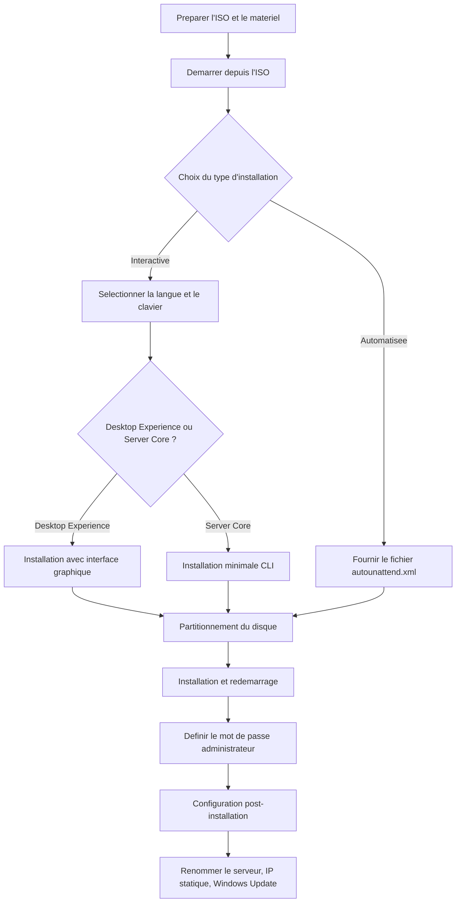

<!--
  Copyright 2026 Julien Bombled

  Licensed under the Apache License, Version 2.0 (the "License");
  you may not use this file except in compliance with the License.
  You may obtain a copy of the License at

      http://www.apache.org/licenses/LICENSE-2.0

  Unless required by applicable law or agreed to in writing, software
  distributed under the License is distributed on an "AS IS" BASIS,
  WITHOUT WARRANTIES OR CONDITIONS OF ANY KIND, either express or implied.
  See the License for the specific language governing permissions and
  limitations under the License.
-->
---
title: Installation de Windows Server
description: Guide pas a pas pour installer Windows Server 2022.
tags:
  - fondamentaux
  - installation
  - debutant
---

# Installation de Windows Server

<span class="level-beginner">Debutant</span> · Temps estime : 30 minutes

## Introduction

!!! example "Analogie"

    Installer Windows Server, c'est comme emmenager dans un nouveau bureau. Vous choisissez d'abord
    le type de local (Server Core = open space minimaliste, Desktop Experience = bureau amenage avec
    tout le mobilier). Ensuite vous branchez l'electricite (IP), posez la plaque sur la porte (nom du serveur)
    et installez la serrure (mot de passe administrateur).

L'installation de Windows Server 2022 est la premiere etape pour mettre en place une infrastructure serveur. Cette page couvre les differentes methodes d'installation et les choix a effectuer.

## Prerequis

- ISO Windows Server 2022 (telechargeable depuis le centre d'evaluation Microsoft)
- Machine virtuelle Hyper-V ou poste physique
- Minimum 512 Mo de RAM (2 Go recommande)
- Minimum 32 Go d'espace disque

## Vue d'ensemble du processus d'installation



## Methodes d'installation

=== "Installation interactive"

    L'installation interactive est la methode standard via l'assistant graphique.

    ### Etape 1 : Demarrer depuis l'ISO

    Configurez le BIOS/UEFI ou la VM pour demarrer sur l'ISO.

    ### Etape 2 : Choix de la langue

    Selectionnez la langue, le format horaire et la disposition du clavier.

    ### Etape 3 : Type d'installation

    Choisissez entre :

    - **Desktop Experience** : installation avec interface graphique complete
    - **Server Core** : installation minimale en ligne de commande

    !!! tip "Astuce"

        Server Core est recommande en production pour reduire la surface d'attaque
        et les besoins en mises a jour.

    ### Etape 4 : Partitionnement

    Selectionnez le disque et la partition cible. Pour un lab, acceptez les valeurs par defaut.

    ### Etape 5 : Configuration post-installation

    Apres le redemarrage, definissez le mot de passe administrateur.

=== "Installation automatisee"

    L'installation automatisee utilise un fichier `autounattend.xml`.

    ```xml
    <!-- Structure de base d'un fichier autounattend.xml -->
    <!-- Voir la documentation Microsoft pour les details -->
    ```

    !!! warning "Attention"

        La creation d'un fichier de reponse est un sujet avance.
        Voir la section [Automatisation](../../automatisation/index.md).

## Verification post-installation

```powershell
# Verify Windows Server version
Get-ComputerInfo | Select-Object WindowsProductName, OsVersion, OsBuildNumber

# Verify network configuration
Get-NetIPConfiguration

# Verify hostname
hostname
```

Resultat :

```text
WindowsProductName                 OsVersion   OsBuildNumber
------------------                 ---------   -------------
Windows Server 2022 Datacenter     10.0.20348  20348


InterfaceAlias       : Ethernet
InterfaceIndex       : 3
InterfaceDescription : Microsoft Hyper-V Network Adapter
NetProfile.Name      : lab.local
IPv4Address          : 10.0.0.20
IPv4DefaultGateway   : 10.0.0.1
DNSServer            : 10.0.0.10

WIN-A1B2C3D4E5F6
```

## Scenario pratique

!!! example "Scenario pratique"

    **Contexte** : Marc, technicien junior, doit installer un nouveau serveur Windows Server 2022 dans
    un lab Hyper-V pour heberger un controleur de domaine de test.

    **Probleme** : Apres le premier demarrage, il ne parvient pas a demarrer depuis l'ISO. La VM demarre
    sur un ecran noir avec le message "No operating system found".

    **Diagnostic** :

    1. Verifier que l'ISO est bien montee dans les parametres de la VM Hyper-V
    2. Verifier l'ordre de demarrage dans le firmware de la VM
    3. S'assurer que la generation de VM est compatible (Generation 2 recommandee pour UEFI)

    **Solution** :

    ```powershell
    # Check VM generation
    Get-VM -Name "DC-01" | Select-Object Name, Generation

    # Set boot order to DVD first on a Generation 2 VM
    $vm = Get-VM -Name "DC-01"
    $dvd = Get-VMDvdDrive -VM $vm
    Set-VMFirmware -VM $vm -FirstBootDevice $dvd
    ```

    ```text
    Name    Generation
    ----    ----------
    DC-01            2
    ```

    **Resultat** : Apres avoir reconfigure l'ordre de demarrage, la VM demarre correctement sur l'ISO
    et l'assistant d'installation se lance.

## Erreurs courantes

!!! danger "Erreurs courantes"

    1. **Choisir Desktop Experience par reflexe** : En production, Server Core est recommande. Desktop
       Experience consomme plus de ressources et augmente la surface d'attaque. Reservez-le au lab
       ou aux serveurs d'administration.

    2. **Ne pas definir un mot de passe administrateur fort** : Le mot de passe par defaut doit respecter
       la complexite Windows (majuscules, minuscules, chiffres, caracteres speciaux, 8 caracteres minimum).
       Un mot de passe faible compromet toute l'infrastructure.

    3. **Oublier de retirer l'ISO apres installation** : Si l'ISO reste montee, le serveur peut
       redemarrer sur l'installateur au lieu du systeme installe. Pensez a ejecter le media.

    4. **Installer sans verifier les prerequis materiels** : Un disque trop petit (< 32 Go) ou une
       RAM insuffisante (< 512 Mo) provoque des echecs d'installation silencieux ou des performances
       desastreuses.

    5. **Ne pas noter la cle produit ou le type d'edition** : Apres installation, il est difficile de
       changer d'edition. Verifiez votre choix avant de lancer l'installation.

## Points cles a retenir

- Choisir entre Desktop Experience et Server Core selon l'usage
- Toujours definir un mot de passe administrateur fort
- Configurer le nom du serveur et l'adresse IP statique apres installation
- Installer les dernieres mises a jour Windows Update

## Pour aller plus loin

- [Configuration initiale](configuration-initiale.md) - etapes post-installation
- [Server Core vs GUI](server-core-vs-gui.md) - comparatif des deux modes
- [Lab 01 : Installation](../../labs/exercices/lab-01-installation.md) - exercice pratique

