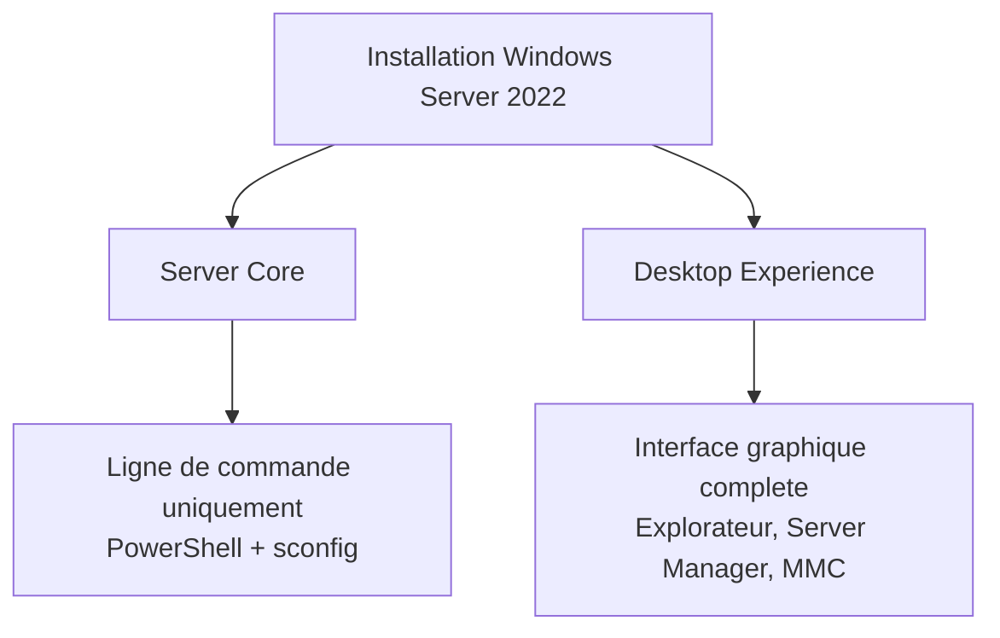
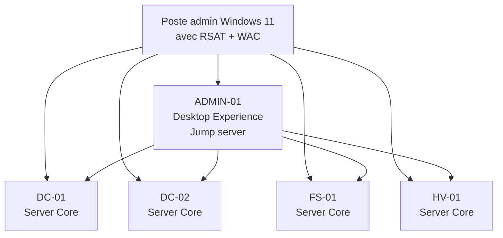

# Server Core vs Desktop Experience

<span class="level-beginner">Debutant</span> · Temps estime : 15 minutes

## Les deux modes d'installation

Lors de l'installation de Windows Server 2022, vous choisissez entre deux experiences :



## Comparatif detaille

| Critere | Server Core | Desktop Experience |
|---------|:-----------:|:------------------:|
| Interface graphique | :material-close: | :material-check: |
| Empreinte disque | ~6 Go | ~10 Go |
| Empreinte RAM | ~512 Mo | ~1.5 Go |
| Surface d'attaque | Reduite | Plus large |
| Mises a jour | Moins frequentes | Plus frequentes |
| Redemarrages | Moins nombreux | Plus nombreux |
| Gestion locale | PowerShell, sconfig | GUI + PowerShell |
| Gestion a distance | WAC, RSAT, PowerShell | WAC, RSAT, PowerShell, RDP |
| Roles supportes | La plupart | Tous |

## Server Core

### Avantages

- **Securite renforcee** : moins de composants = moins de vulnerabilites
- **Performance** : moins de ressources consommees par l'OS
- **Stabilite** : moins de mises a jour = moins de redemarrages
- **Recommandation Microsoft** : c'est le mode par defaut depuis Windows Server 2016

### Outils de gestion disponibles

#### sconfig

L'outil `sconfig` fournit un menu texte pour les taches courantes :

```
===============================================================================
                         Server Configuration
===============================================================================

 1) Domain/Workgroup:                    Workgroup: WORKGROUP
 2) Computer Name:                       SRV-CORE-01
 3) Add Local Administrator
 4) Configure Remote Management          Enabled
 5) Windows Update Settings:             Manual
 6) Download and Install Updates
 7) Remote Desktop:                      Disabled
 8) Network Settings
 9) Date and Time
10) Telemetry settings
11) Windows Activation
12) Log Off User
13) Restart Server
14) Shut Down Server
15) Exit to Command Line
```

#### PowerShell

Toute l'administration se fait en PowerShell :

```powershell
# System information
Get-ComputerInfo | Select-Object WindowsProductName, OsVersion

# Network configuration
Get-NetIPConfiguration

# Installed roles and features
Get-WindowsFeature | Where-Object Installed

# Service management
Get-Service | Where-Object Status -eq "Running"

# Event logs
Get-EventLog -LogName System -Newest 20
```

#### Gestion a distance

!!! tip "Best practice"

    Gerez les serveurs Core a distance avec :

    - **Windows Admin Center** (WAC) : interface web moderne
    - **RSAT** : outils d'administration depuis un poste Windows 10/11
    - **PowerShell Remoting** : automatisation et scripts

```powershell
# Connect to a remote Core server from another machine
Enter-PSSession -ComputerName SRV-CORE-01 -Credential (Get-Credential)

# Run a command on a remote Core server
Invoke-Command -ComputerName SRV-CORE-01 -ScriptBlock {
    Get-WindowsFeature | Where-Object Installed
}
```

### Roles non disponibles en Server Core

Quelques roles necessitent Desktop Experience :

- Fax Server
- MultiPoint Services
- Windows Deployment Services (WDS) - interface graphique uniquement

!!! note "Remarque"

    Tous les roles principaux (AD DS, DNS, DHCP, Hyper-V, File Server, IIS, etc.)
    sont disponibles en Server Core.

## Desktop Experience

### Avantages

- **Apprentissage** : plus facile pour les debutants
- **Depannage visuel** : acces direct aux outils graphiques
- **Applications tierces** : certaines applications necessitent une interface graphique
- **Compatibilite** : tous les roles et fonctionnalites sont disponibles

### Quand choisir Desktop Experience

- Serveur d'administration central (jump server)
- Environnement de lab et d'apprentissage
- Applications qui exigent une interface graphique
- Transition progressive depuis des environnements anciens

## Recommandations par role

| Role serveur | Recommandation | Raison |
|-------------|:--------------:|--------|
| Controleur de domaine (DC) | Core | Securite, pas besoin de GUI |
| Serveur DNS / DHCP | Core | Services reseau simples |
| Serveur de fichiers | Core | Gere facilement via RSAT/WAC |
| Hyper-V | Core | Performance maximale pour la virtualisation |
| IIS / Web | Core | Securite, moins de surface d'attaque |
| Serveur d'administration | GUI | Acces aux outils graphiques |
| SQL Server | GUI | Certains outils SQL necessitent une GUI |
| Lab / Formation | GUI | Facilite l'apprentissage |

## Conversion entre les modes

!!! danger "Important"

    Depuis Windows Server 2019, il n'est **plus possible** de convertir
    entre Server Core et Desktop Experience apres l'installation.
    Sous Windows Server 2016 et anterieur, la conversion etait possible
    avec `Install-WindowsFeature` / `Uninstall-WindowsFeature`.

    Si vous devez changer de mode, vous devez **reinstaller** le serveur.

## Strategie hybride recommandee

Pour un environnement de production, combinez les deux :



!!! tip "Approche recommandee"

    - Deployer les serveurs d'infrastructure en **Server Core**
    - Avoir **un seul** serveur Desktop Experience comme poste d'administration
    - Installer **RSAT** sur votre poste Windows 10/11 pour la gestion quotidienne
    - Utiliser **Windows Admin Center** comme interface web centralisee

## Points cles a retenir

- Server Core est le mode recommande par Microsoft pour la production
- Desktop Experience offre le confort graphique au prix de plus de ressources et de mises a jour
- La conversion entre les deux modes est impossible depuis Windows Server 2019
- La gestion a distance (RSAT, WAC, PowerShell Remoting) rend Server Core aussi simple a gerer que la GUI

## Pour aller plus loin

- [RSAT](../console/rsat.md) - outils d'administration a distance
- [Windows Admin Center](../../gestion-moderne/wac/index.md) - gestion web centralisee
- [PowerShell - Premiers pas](../powershell/premiers-pas.md) - indispensable pour Server Core
