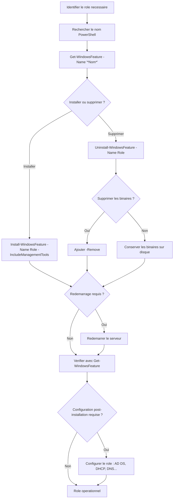

# Ajout et suppression de roles

<span class="level-beginner">Debutant</span> · Temps estime : 10 minutes

## Workflow d'ajout et de suppression de roles



## Installation via PowerShell

!!! example "Analogie"

    Installer un role sur Windows Server, c'est comme ajouter une application sur votre telephone. Vous parcourez le catalogue (`Get-WindowsFeature`), vous choisissez l'application (`Install-WindowsFeature`), et parfois le telephone doit redemarrer pour finaliser l'installation. Pour desinstaller, c'est le chemin inverse — et avec l'option `-Remove`, vous supprimez aussi les fichiers d'installation pour liberer de l'espace, comme vider le cache d'une application.

### Lister les roles disponibles

```powershell
# List all available roles and features
Get-WindowsFeature

# List with display name and install state
Get-WindowsFeature | Format-Table Name, DisplayName, InstallState -AutoSize

# Search for a specific role
Get-WindowsFeature -Name "*DNS*"
Get-WindowsFeature -Name "*DHCP*"
Get-WindowsFeature -Name "*AD*"

# List only installed roles
Get-WindowsFeature | Where-Object Installed
```

Resultat (extrait de `Get-WindowsFeature -Name "*DNS*"`) :

```text
PS C:\> Get-WindowsFeature -Name "*DNS*"

Display Name                                            Name            Install State
------------                                            ----            -------------
    [ ] DNS Server                                      DNS             Available
        [ ] DNS Server Tools                            RSAT-DNS-Server Available

PS C:\> Get-WindowsFeature -Name "*AD*"

Display Name                                            Name                   Install State
------------                                            ----                   -------------
    [ ] Active Directory Domain Services                AD-Domain-Services     Available
    [ ] Active Directory Federation Services            ADFS-Federation        Available
    [ ] Active Directory Lightweight Directory Serv.    ADLDS                  Available
    [ ] Active Directory Rights Management Services     ADRMS                  Available
```

### Installer un role

```powershell
# Install a single role with management tools
Install-WindowsFeature -Name "DNS" -IncludeManagementTools

# Install multiple roles at once
Install-WindowsFeature -Name "AD-Domain-Services", "DNS" -IncludeManagementTools

# Install with all sub-features
Install-WindowsFeature -Name "Web-Server" -IncludeAllSubFeature -IncludeManagementTools

# Install and automatically restart if needed
Install-WindowsFeature -Name "DHCP" -IncludeManagementTools -Restart
```

Resultat :

```text
PS C:\> Install-WindowsFeature -Name "DNS" -IncludeManagementTools

Success Restart Needed Exit Code      Feature Result
------- -------------- ---------      --------------
True    No             Success        {DNS Server, DNS Server Tools}

PS C:\> Install-WindowsFeature -Name "Web-Server" -IncludeAllSubFeature -IncludeManagementTools

Success Restart Needed Exit Code      Feature Result
------- -------------- ---------      --------------
True    No             Success        {Web Server (IIS), Common HTTP Features,
                                       Default Document, Directory Browsing,
                                       HTTP Errors, Static Content, HTTP Logging,
                                       Request Monitor, Static Content Compression,
                                       IIS Management Console, ...}
```

!!! warning "Parametres importants"

    | Parametre | Role |
    |-----------|------|
    | `-IncludeManagementTools` | Installe les consoles d'administration |
    | `-IncludeAllSubFeature` | Installe tous les services de role |
    | `-Restart` | Redemarrage automatique si requis |
    | `-Source` | Chemin vers les fichiers source (utile si Features on Demand) |

### Installer sur un serveur distant

```powershell
# Install a role on a remote server
Install-WindowsFeature -Name "DNS" -ComputerName "SRV-02" -IncludeManagementTools -Credential (Get-Credential)
```

Resultat :

```text
PS C:\> Install-WindowsFeature -Name "DNS" -ComputerName "SRV-01" -IncludeManagementTools -Credential (Get-Credential)

cmdlet Get-Credential at command pipeline position 1
Supply values for the following parameters:
Credential

Success Restart Needed Exit Code      Feature Result
------- -------------- ---------      --------------
True    No             Success        {DNS Server, DNS Server Tools}
```

### Verifier l'installation

```powershell
# Verify a specific role is installed
Get-WindowsFeature -Name "DNS"

# List all installed roles
Get-WindowsFeature | Where-Object InstallState -eq "Installed" |
    Select-Object Name, DisplayName |
    Sort-Object DisplayName
```

Resultat :

```text
PS C:\> Get-WindowsFeature -Name "DNS"

Display Name                                            Name            Install State
------------                                            ----            -------------
    [X] DNS Server                                      DNS             Installed
        [X] DNS Server Tools                            RSAT-DNS-Server Installed

PS C:\> Get-WindowsFeature | Where-Object InstallState -eq "Installed" |
    Select-Object Name, DisplayName | Sort-Object DisplayName

Name                    DisplayName
----                    -----------
AD-Domain-Services      Active Directory Domain Services
DHCP                    DHCP Server
DNS                     DNS Server
FS-FileServer           File Server
GPMC                    Group Policy Management
NET-Framework-45-Core   .NET Framework 4.8
PowerShellRoot          Windows PowerShell
RSAT-AD-Tools           AD DS and AD LDS Tools
RSAT-DHCP               DHCP Server Tools
RSAT-DNS-Server         DNS Server Tools
```

## Suppression d'un role

### Desinstaller un role

```powershell
# Uninstall a role (keeps binaries on disk)
Uninstall-WindowsFeature -Name "DHCP"

# Uninstall and remove binaries from disk (Features on Demand)
Uninstall-WindowsFeature -Name "DHCP" -Remove

# Uninstall with automatic restart
Uninstall-WindowsFeature -Name "DHCP" -Remove -Restart
```

Resultat :

```text
PS C:\> Uninstall-WindowsFeature -Name "DHCP"

Success Restart Needed Exit Code      Feature Result
------- -------------- ---------      --------------
True    No             Success        {DHCP Server}

WARNING: You must restart this server to finish the removal process.

PS C:\> Uninstall-WindowsFeature -Name "Web-Server" -Remove

Success Restart Needed Exit Code      Feature Result
------- -------------- ---------      --------------
True    Yes            SuccessRest... {Web Server (IIS), Common HTTP Features, ...}

WARNING: You must restart this server to finish the removal process.
```

!!! danger "Attention avec -Remove"

    Le flag `-Remove` supprime les fichiers binaires du disque.
    Pour reinstaller le role, il faudra specifier un chemin source
    (`-Source`) ou avoir acces a Windows Update.

### Reinstaller un role dont les binaires ont ete supprimes

```powershell
# Install from Windows Update
Install-WindowsFeature -Name "DHCP" -IncludeManagementTools

# Install from a local source (ISO mounted or folder)
Install-WindowsFeature -Name "DHCP" -IncludeManagementTools -Source "D:\sources\sxs"
```

Resultat :

```text
PS C:\> Install-WindowsFeature -Name "DHCP" -IncludeManagementTools -Source "D:\sources\sxs"

Success Restart Needed Exit Code      Feature Result
------- -------------- ---------      --------------
True    No             Success        {DHCP Server, DHCP Server Tools}
```

## Installation via Server Manager (GUI)

### Ajouter un role

1. Ouvrir **Server Manager**
2. Cliquer sur **Manage** > **Add Roles and Features**
3. **Installation Type** : choisir "Role-based or feature-based installation"
4. **Server Selection** : selectionner le serveur cible
5. **Server Roles** : cocher les roles souhaites
6. **Features** : cocher les fonctionnalites supplementaires
7. Parcourir les ecrans de configuration specifiques au role
8. **Confirmation** : verifier et lancer l'installation

### Supprimer un role

1. **Manage** > **Remove Roles and Features**
2. Selectionner le serveur
3. Decocher les roles a supprimer
4. Confirmer et redemarrer si necessaire

## Noms des roles courants (pour PowerShell)

| Nom affiche | Nom PowerShell | Notes |
|-------------|---------------|-------|
| Active Directory Domain Services | `AD-Domain-Services` | Necessite une promotion apres installation |
| DNS Server | `DNS` | Souvent installe avec AD DS |
| DHCP Server | `DHCP` | Necessite une autorisation AD |
| File Server | `FS-FileServer` | Installe par defaut |
| Hyper-V | `Hyper-V` | Necessite un redemarrage |
| Web Server (IIS) | `Web-Server` | Utiliser `-IncludeAllSubFeature` |
| Windows Server Backup | `Windows-Server-Backup` | Fonctionnalite, pas un role |
| Failover Clustering | `Failover-Clustering` | Fonctionnalite |
| RSAT AD Tools | `RSAT-AD-Tools` | Sur le serveur d'administration |
| GPMC | `GPMC` | Console de gestion des GPO |

!!! tip "Trouver le bon nom"

    ```powershell
    # Search by keyword to find the exact name
    Get-WindowsFeature | Where-Object DisplayName -like "*Active*"
    ```

    Resultat :

    ```text
    Display Name                                            Name                   Install State
    ------------                                            ----                   -------------
        [ ] Active Directory Domain Services                AD-Domain-Services     Available
        [ ] Active Directory Federation Services            ADFS-Federation        Available
        [ ] Active Directory Lightweight Directory Serv.    ADLDS                  Available
        [ ] Active Directory Rights Management Services     ADRMS                  Available
    ```

## Workflow type pour un nouveau serveur

```powershell
# 1. Rename the server
Rename-Computer -NewName "SRV-DC-01" -Restart

# 2. Configure network
New-NetIPAddress -InterfaceAlias "Ethernet" -IPAddress 192.168.10.10 -PrefixLength 24

# 3. Install required roles
Install-WindowsFeature -Name "AD-Domain-Services", "DNS", "DHCP" -IncludeManagementTools

# 4. Verify installation
Get-WindowsFeature | Where-Object Installed

# 5. Proceed with role-specific configuration
# (AD DS promotion, DNS zones, DHCP scopes...)
```

Resultat (etape 3 - installation des roles) :

```text
PS C:\> Install-WindowsFeature -Name "AD-Domain-Services", "DNS", "DHCP" -IncludeManagementTools

Success Restart Needed Exit Code      Feature Result
------- -------------- ---------      --------------
True    No             Success        {Active Directory Domain Services,
                                       DNS Server, DHCP Server,
                                       Group Policy Management,
                                       AD DS and AD LDS Tools,
                                       DNS Server Tools, DHCP Server Tools}
```

!!! example "Scenario pratique"

    **Contexte** : Antoine, technicien IT, doit preparer un nouveau serveur `SRV-01` (10.0.0.20) pour heberger le role serveur de fichiers et DFS dans l'environnement `lab.local`. Le serveur vient d'etre installe avec Windows Server 2022.

    **Etape 1** : Verifier les roles actuellement installes

    ```powershell
    Get-WindowsFeature | Where-Object Installed
    ```

    ```text
    Display Name                                            Name            Install State
    ------------                                            ----            -------------
        [X] File and Storage Services                       FileAndStorage  Installed
            [X] Storage Services                            Storage-Serv... Installed
        [X] .NET Framework 4.8                              NET-Framework.. Installed
        [X] Windows PowerShell                              PowerShellRoot  Installed
    ```

    Seuls les composants par defaut sont installes.

    **Etape 2** : Rechercher les fonctionnalites necessaires

    ```powershell
    Get-WindowsFeature -Name "*FS*", "*DFS*"
    ```

    ```text
    Display Name                                            Name            Install State
    ------------                                            ----            -------------
        [X] File and Storage Services                       FileAndStorage  Installed
            [X] File Server                                 FS-FileServer   Installed
            [ ] DFS Namespaces                              FS-DFS-Names... Available
            [ ] DFS Replication                             FS-DFS-Repli... Available
            [ ] File Server Resource Manager                FS-Resource-... Available
    ```

    **Etape 3** : Installer DFS avec les outils de gestion

    ```powershell
    Install-WindowsFeature -Name "FS-DFS-Namespace", "FS-DFS-Replication" -IncludeManagementTools
    ```

    ```text
    Success Restart Needed Exit Code      Feature Result
    ------- -------------- ---------      --------------
    True    No             Success        {DFS Namespaces, DFS Replication,
                                           DFS Management Tools}
    ```

    **Etape 4** : Verifier l'installation

    ```powershell
    Get-WindowsFeature -Name "*DFS*"
    ```

    ```text
    Display Name                                            Name            Install State
    ------------                                            ----            -------------
            [X] DFS Namespaces                              FS-DFS-Names... Installed
            [X] DFS Replication                             FS-DFS-Repli... Installed
    ```

    Antoine peut maintenant passer a la configuration des espaces de noms DFS et de la replication.

!!! danger "Erreurs courantes"

    1. **Oublier `-IncludeManagementTools`** : installer un role sans ses outils d'administration oblige ensuite a les ajouter manuellement. Prenez le reflexe d'ajouter ce parametre systematiquement.

    2. **Installer un role sur un serveur de production sans tester** : utilisez toujours le parametre `-WhatIf` pour simuler l'installation avant de l'executer reellement : `Install-WindowsFeature -Name "DNS" -WhatIf`.

    3. **Utiliser `-Remove` sans reflexion** : supprimer les binaires avec `-Remove` economise de l'espace disque mais rend la reinstallation plus complexe (necessite une source ISO ou Windows Update). En lab, evitez `-Remove` pour pouvoir reinstaller facilement.

    4. **Ne pas redemarrer apres une installation qui le demande** : certains roles (comme Hyper-V) necessitent un redemarrage obligatoire. Ignorer cet avertissement laisse le role dans un etat partiel non fonctionnel.

    5. **Confondre le nom affiche et le nom PowerShell** : "Active Directory Domain Services" s'appelle `AD-Domain-Services` en PowerShell, pas `ActiveDirectory` ni `ADDS`. Utilisez `Get-WindowsFeature | Where-Object DisplayName -like "*motcle*"` pour trouver le nom exact.

## Points cles a retenir

- `Install-WindowsFeature` pour installer, `Uninstall-WindowsFeature` pour supprimer
- Toujours ajouter `-IncludeManagementTools`
- Certains roles necessitent un redemarrage
- Certains roles necessitent une configuration post-installation (AD DS, DHCP)
- `-Remove` supprime les binaires du disque (economie d'espace mais reinstallation plus complexe)

## Pour aller plus loin

- [Comprendre les roles](comprendre-les-roles.md) - theorie sur les roles
- [AD DS - Installer le premier DC](../../active-directory/adds/installer-premier-dc.md) - exemple concret
