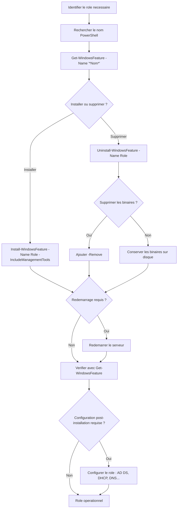

# Ajout et suppression de roles

<span class="level-beginner">Debutant</span> · Temps estime : 10 minutes

## Workflow d'ajout et de suppression de roles



## Installation via PowerShell

### Lister les roles disponibles

```powershell
# List all available roles and features
Get-WindowsFeature

# List with display name and install state
Get-WindowsFeature | Format-Table Name, DisplayName, InstallState -AutoSize

# Search for a specific role
Get-WindowsFeature -Name "*DNS*"
Get-WindowsFeature -Name "*DHCP*"
Get-WindowsFeature -Name "*AD*"

# List only installed roles
Get-WindowsFeature | Where-Object Installed
```

### Installer un role

```powershell
# Install a single role with management tools
Install-WindowsFeature -Name "DNS" -IncludeManagementTools

# Install multiple roles at once
Install-WindowsFeature -Name "AD-Domain-Services", "DNS" -IncludeManagementTools

# Install with all sub-features
Install-WindowsFeature -Name "Web-Server" -IncludeAllSubFeature -IncludeManagementTools

# Install and automatically restart if needed
Install-WindowsFeature -Name "DHCP" -IncludeManagementTools -Restart
```

!!! warning "Parametres importants"

    | Parametre | Role |
    |-----------|------|
    | `-IncludeManagementTools` | Installe les consoles d'administration |
    | `-IncludeAllSubFeature` | Installe tous les services de role |
    | `-Restart` | Redemarrage automatique si requis |
    | `-Source` | Chemin vers les fichiers source (utile si Features on Demand) |

### Installer sur un serveur distant

```powershell
# Install a role on a remote server
Install-WindowsFeature -Name "DNS" -ComputerName "SRV-02" -IncludeManagementTools -Credential (Get-Credential)
```

### Verifier l'installation

```powershell
# Verify a specific role is installed
Get-WindowsFeature -Name "DNS"

# List all installed roles
Get-WindowsFeature | Where-Object InstallState -eq "Installed" |
    Select-Object Name, DisplayName |
    Sort-Object DisplayName
```

## Suppression d'un role

### Desinstaller un role

```powershell
# Uninstall a role (keeps binaries on disk)
Uninstall-WindowsFeature -Name "DHCP"

# Uninstall and remove binaries from disk (Features on Demand)
Uninstall-WindowsFeature -Name "DHCP" -Remove

# Uninstall with automatic restart
Uninstall-WindowsFeature -Name "DHCP" -Remove -Restart
```

!!! danger "Attention avec -Remove"

    Le flag `-Remove` supprime les fichiers binaires du disque.
    Pour reinstaller le role, il faudra specifier un chemin source
    (`-Source`) ou avoir acces a Windows Update.

### Reinstaller un role dont les binaires ont ete supprimes

```powershell
# Install from Windows Update
Install-WindowsFeature -Name "DHCP" -IncludeManagementTools

# Install from a local source (ISO mounted or folder)
Install-WindowsFeature -Name "DHCP" -IncludeManagementTools -Source "D:\sources\sxs"
```

## Installation via Server Manager (GUI)

### Ajouter un role

1. Ouvrir **Server Manager**
2. Cliquer sur **Manage** > **Add Roles and Features**
3. **Installation Type** : choisir "Role-based or feature-based installation"
4. **Server Selection** : selectionner le serveur cible
5. **Server Roles** : cocher les roles souhaites
6. **Features** : cocher les fonctionnalites supplementaires
7. Parcourir les ecrans de configuration specifiques au role
8. **Confirmation** : verifier et lancer l'installation

### Supprimer un role

1. **Manage** > **Remove Roles and Features**
2. Selectionner le serveur
3. Decocher les roles a supprimer
4. Confirmer et redemarrer si necessaire

## Noms des roles courants (pour PowerShell)

| Nom affiche | Nom PowerShell | Notes |
|-------------|---------------|-------|
| Active Directory Domain Services | `AD-Domain-Services` | Necessite une promotion apres installation |
| DNS Server | `DNS` | Souvent installe avec AD DS |
| DHCP Server | `DHCP` | Necessite une autorisation AD |
| File Server | `FS-FileServer` | Installe par defaut |
| Hyper-V | `Hyper-V` | Necessite un redemarrage |
| Web Server (IIS) | `Web-Server` | Utiliser `-IncludeAllSubFeature` |
| Windows Server Backup | `Windows-Server-Backup` | Fonctionnalite, pas un role |
| Failover Clustering | `Failover-Clustering` | Fonctionnalite |
| RSAT AD Tools | `RSAT-AD-Tools` | Sur le serveur d'administration |
| GPMC | `GPMC` | Console de gestion des GPO |

!!! tip "Trouver le bon nom"

    ```powershell
    # Search by keyword to find the exact name
    Get-WindowsFeature | Where-Object DisplayName -like "*Active*"
    ```

## Workflow type pour un nouveau serveur

```powershell
# 1. Rename the server
Rename-Computer -NewName "SRV-DC-01" -Restart

# 2. Configure network
New-NetIPAddress -InterfaceAlias "Ethernet" -IPAddress 192.168.10.10 -PrefixLength 24

# 3. Install required roles
Install-WindowsFeature -Name "AD-Domain-Services", "DNS", "DHCP" -IncludeManagementTools

# 4. Verify installation
Get-WindowsFeature | Where-Object Installed

# 5. Proceed with role-specific configuration
# (AD DS promotion, DNS zones, DHCP scopes...)
```

## Points cles a retenir

- `Install-WindowsFeature` pour installer, `Uninstall-WindowsFeature` pour supprimer
- Toujours ajouter `-IncludeManagementTools`
- Certains roles necessitent un redemarrage
- Certains roles necessitent une configuration post-installation (AD DS, DHCP)
- `-Remove` supprime les binaires du disque (economie d'espace mais reinstallation plus complexe)

## Pour aller plus loin

- [Comprendre les roles](comprendre-les-roles.md) - theorie sur les roles
- [AD DS - Installer le premier DC](../../active-directory/adds/installer-premier-dc.md) - exemple concret
