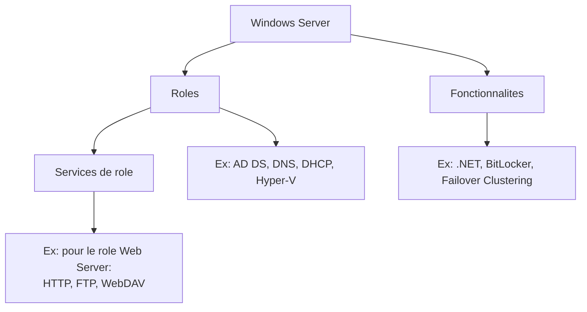

# Comprendre les roles et fonctionnalites

<span class="level-beginner">Debutant</span> · Temps estime : 15 minutes

## Roles vs fonctionnalites

!!! example "Analogie"

    Pensez a un immeuble de bureaux. Un **role**, c'est la fonction d'un etage : le rez-de-chaussee est l'accueil (DNS), le premier etage est la comptabilite (DHCP), le deuxieme est la direction (AD DS). Une **fonctionnalite**, c'est un equipement partage par tous les etages : l'ascenseur (.NET Framework), le systeme d'alarme (BitLocker) ou le reseau electrique de secours (Failover Clustering). Chaque etage a sa mission, les equipements servent a tout le batiment.

Windows Server distingue trois niveaux :



### Roles

Un **role** est la fonction principale du serveur. Il definit ce que le serveur *fait* dans l'infrastructure :

| Role | Description | Cas d'usage |
|------|-------------|-------------|
| AD DS | Services de domaine Active Directory | Authentification, annuaire |
| DNS Server | Resolution de noms | Obligatoire avec AD DS |
| DHCP Server | Attribution automatique d'adresses IP | Distribution d'IP |
| File and Storage Services | Partage de fichiers | Serveur de fichiers |
| Hyper-V | Virtualisation | Hebergement de VMs |
| Web Server (IIS) | Serveur web | Sites et applications web |
| Windows Server Update Services | Mises a jour | Distribution de patches |
| Remote Desktop Services | Bureau a distance | Acces aux applications |
| Print and Document Services | Impression | Gestion des imprimantes |
| Network Policy and Access Services | Acces reseau | VPN, NPS/RADIUS |

### Services de role

Chaque role peut contenir des **services de role** optionnels. Exemple pour le role **Web Server (IIS)** :

- Web Server
    - Common HTTP Features (Default Document, Static Content, Directory Browsing)
    - Application Development (ASP.NET, CGI, WebSocket)
    - Security (Windows Authentication, SSL)
    - Performance (Static/Dynamic Compression)
- Management Tools
    - IIS Management Console
    - IIS Management Scripts

### Fonctionnalites

Les **fonctionnalites** sont des composants supplementaires qui ne definissent pas la fonction du serveur mais ajoutent des capacites :

| Fonctionnalite | Description |
|----------------|-------------|
| .NET Framework | Runtime pour les applications .NET |
| BitLocker Drive Encryption | Chiffrement de disque |
| Failover Clustering | Haute disponibilite |
| Group Policy Management | Console de gestion des GPO |
| PowerShell | Shell et scripting (installe par defaut) |
| Remote Server Administration Tools | Outils d'administration a distance |
| SNMP Service | Protocole de supervision |
| Telnet Client | Client Telnet (test de ports) |
| Windows Server Backup | Sauvegarde integree |
| Windows Defender | Antivirus (installe par defaut) |

## Un serveur = un ou plusieurs roles

!!! tip "Bonne pratique : separation des roles"

    En production, la bonne pratique est de **dedier chaque serveur a un role principal**.
    Cela facilite la maintenance, la securite et la disponibilite.

    En lab ou PME, il est courant de combiner plusieurs roles sur un meme serveur.

### Exemple d'architecture PME

| Serveur | Roles combines | Acceptable ? |
|---------|---------------|:------------:|
| DC-01 | AD DS + DNS + DHCP | :material-check: Courant |
| FS-01 | File Server + Print Server | :material-check: OK |
| WEB-01 | IIS + .NET | :material-check: OK |
| DC-01 | AD DS + SQL Server | :material-close: Deconseille |
| SRV-01 | Tous les roles | :material-close: Anti-pattern |

### Roles souvent combines

Certains roles sont naturellement associes :

- **AD DS + DNS** : le DNS est requis par Active Directory
- **AD DS + DHCP** : souvent deploye sur le meme serveur dans les petites structures
- **File Server + DFS** : le DFS necessite le role File Server
- **Hyper-V + Failover Clustering** : pour la haute disponibilite des VMs

## Dependances entre roles

Certains roles installent automatiquement leurs dependances :

```powershell
# View dependencies before installation
Get-WindowsFeature -Name "AD-Domain-Services" | Select-Object -ExpandProperty DependsOn

# The AD DS role automatically requires:
# - .NET Framework
# - Group Policy Management
# - Remote Server Administration Tools (AD DS tools)
```

Resultat :

```text
PS C:\> Get-WindowsFeature -Name "AD-Domain-Services" | Select-Object -ExpandProperty DependsOn
NET-Framework-45-Core
```

!!! example "Analogie"

    Les dependances entre roles fonctionnent comme les ingredients d'une recette de cuisine. Pour faire un gateau (AD DS), il vous faut de la farine (.NET Framework) et des oeufs (RSAT). Vous ne pouvez pas faire le gateau sans ces ingredients de base — Windows Server les ajoute automatiquement a votre panier quand vous lancez la recette.

!!! example "Scenario pratique"

    **Contexte** : Nadia, responsable IT d'une PME de 50 personnes, doit concevoir l'infrastructure serveur pour son nouveau bureau. Elle dispose de 3 serveurs physiques et doit repartir les roles intelligemment.

    **Etape 1** : Lister les besoins

    - Active Directory pour l'authentification
    - DNS pour la resolution de noms
    - DHCP pour l'attribution automatique d'adresses IP
    - Un serveur de fichiers pour les partages
    - IIS pour l'application web interne de l'entreprise

    **Etape 2** : Repartir les roles sur les serveurs

    | Serveur | Roles | Justification |
    |---------|-------|---------------|
    | `DC-01` (10.0.0.10) | AD DS + DNS + DHCP | Roles complementaires, combinaison courante |
    | `SRV-01` (10.0.0.20) | File Server + DFS | DFS necessite le role File Server |
    | `WEB-01` (10.0.0.30) | IIS + .NET Framework | Isole du controleur de domaine pour la securite |

    **Etape 3** : Verifier les roles sur `DC-01`

    ```powershell
    Get-WindowsFeature | Where-Object Installed | Select-Object Name, DisplayName
    ```

    ```text
    Name                      DisplayName
    ----                      -----------
    AD-Domain-Services        Active Directory Domain Services
    DNS                       DNS Server
    DHCP                      DHCP Server
    GPMC                      Group Policy Management
    RSAT-AD-Tools             AD DS and AD LDS Tools
    RSAT-DNS-Server           DNS Server Tools
    RSAT-DHCP                 DHCP Server Tools
    ```

    Nadia a separe les roles applicatifs (IIS) du controleur de domaine, ce qui est une bonne pratique de securite. En cas de compromission du serveur web, le domaine AD reste protege.

!!! danger "Erreurs courantes"

    1. **Installer tous les roles sur un seul serveur** : en production, regrouper AD DS, SQL Server, IIS et le serveur de fichiers sur une meme machine cree un point de defaillance unique et complique la maintenance. Separez les roles autant que possible.

    2. **Oublier d'installer DNS avec AD DS** : Active Directory depend fortement de DNS pour la localisation des services (enregistrements SRV). Installer AD DS sans DNS provoque des dysfonctionnements de l'authentification et de la replication.

    3. **Confondre roles et fonctionnalites** : installer "Failover Clustering" en pensant que c'est un role ne donnera pas au serveur une fonction principale. C'est une fonctionnalite qui ajoute une capacite a un role existant (comme Hyper-V ou File Server).

    4. **Ne pas planifier les dependances** : installer un role sans comprendre ses prerequis peut entrainer des redemarrages non planifies ou des echecs d'installation. Verifiez toujours les dependances avec `Get-WindowsFeature -Name <role> | Select-Object -ExpandProperty DependsOn`.

## Points cles a retenir

- Un **role** definit la fonction du serveur (AD DS, DNS, IIS...)
- Un **service de role** est un sous-composant optionnel d'un role
- Une **fonctionnalite** ajoute des capacites transversales (.NET, BitLocker...)
- En production, separez les roles sur des serveurs dedies
- Certains roles ont des dependances automatiques

## Pour aller plus loin

- [Ajout et suppression de roles](ajout-suppression.md) - installer des roles en pratique
- [Server Manager](../console/server-manager.md) - l'outil graphique pour gerer les roles
