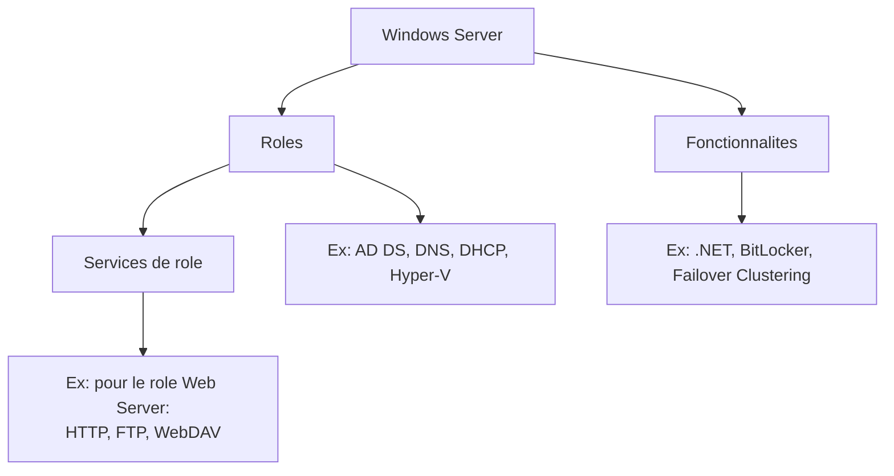

# Comprendre les roles et fonctionnalites

!!! info "Niveau : Debutant"

    Temps estime : 15 minutes

## Roles vs fonctionnalites

Windows Server distingue trois niveaux :



### Roles

Un **role** est la fonction principale du serveur. Il definit ce que le serveur *fait* dans l'infrastructure :

| Role | Description | Cas d'usage |
|------|-------------|-------------|
| AD DS | Services de domaine Active Directory | Authentification, annuaire |
| DNS Server | Resolution de noms | Obligatoire avec AD DS |
| DHCP Server | Attribution automatique d'adresses IP | Distribution d'IP |
| File and Storage Services | Partage de fichiers | Serveur de fichiers |
| Hyper-V | Virtualisation | Hebergement de VMs |
| Web Server (IIS) | Serveur web | Sites et applications web |
| Windows Server Update Services | Mises a jour | Distribution de patches |
| Remote Desktop Services | Bureau a distance | Acces aux applications |
| Print and Document Services | Impression | Gestion des imprimantes |
| Network Policy and Access Services | Acces reseau | VPN, NPS/RADIUS |

### Services de role

Chaque role peut contenir des **services de role** optionnels. Exemple pour le role **Web Server (IIS)** :

- Web Server
    - Common HTTP Features (Default Document, Static Content, Directory Browsing)
    - Application Development (ASP.NET, CGI, WebSocket)
    - Security (Windows Authentication, SSL)
    - Performance (Static/Dynamic Compression)
- Management Tools
    - IIS Management Console
    - IIS Management Scripts

### Fonctionnalites

Les **fonctionnalites** sont des composants supplementaires qui ne definissent pas la fonction du serveur mais ajoutent des capacites :

| Fonctionnalite | Description |
|----------------|-------------|
| .NET Framework | Runtime pour les applications .NET |
| BitLocker Drive Encryption | Chiffrement de disque |
| Failover Clustering | Haute disponibilite |
| Group Policy Management | Console de gestion des GPO |
| PowerShell | Shell et scripting (installe par defaut) |
| Remote Server Administration Tools | Outils d'administration a distance |
| SNMP Service | Protocole de supervision |
| Telnet Client | Client Telnet (test de ports) |
| Windows Server Backup | Sauvegarde integree |
| Windows Defender | Antivirus (installe par defaut) |

## Un serveur = un ou plusieurs roles

!!! tip "Bonne pratique : separation des roles"

    En production, la bonne pratique est de **dedier chaque serveur a un role principal**.
    Cela facilite la maintenance, la securite et la disponibilite.

    En lab ou PME, il est courant de combiner plusieurs roles sur un meme serveur.

### Exemple d'architecture PME

| Serveur | Roles combines | Acceptable ? |
|---------|---------------|:------------:|
| DC-01 | AD DS + DNS + DHCP | :material-check: Courant |
| FS-01 | File Server + Print Server | :material-check: OK |
| WEB-01 | IIS + .NET | :material-check: OK |
| DC-01 | AD DS + SQL Server | :material-close: Deconseille |
| SRV-01 | Tous les roles | :material-close: Anti-pattern |

### Roles souvent combines

Certains roles sont naturellement associes :

- **AD DS + DNS** : le DNS est requis par Active Directory
- **AD DS + DHCP** : souvent deploye sur le meme serveur dans les petites structures
- **File Server + DFS** : le DFS necessite le role File Server
- **Hyper-V + Failover Clustering** : pour la haute disponibilite des VMs

## Dependances entre roles

Certains roles installent automatiquement leurs dependances :

```powershell
# View dependencies before installation
Get-WindowsFeature -Name "AD-Domain-Services" | Select-Object -ExpandProperty DependsOn

# The AD DS role automatically requires:
# - .NET Framework
# - Group Policy Management
# - Remote Server Administration Tools (AD DS tools)
```

## Points cles a retenir

- Un **role** definit la fonction du serveur (AD DS, DNS, IIS...)
- Un **service de role** est un sous-composant optionnel d'un role
- Une **fonctionnalite** ajoute des capacites transversales (.NET, BitLocker...)
- En production, separez les roles sur des serveurs dedies
- Certains roles ont des dependances automatiques

## Pour aller plus loin

- [Ajout et suppression de roles](ajout-suppression.md) - installer des roles en pratique
- [Server Manager](../console/server-manager.md) - l'outil graphique pour gerer les roles
