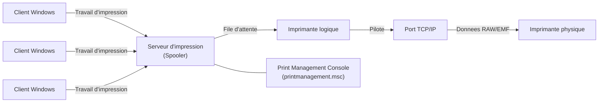
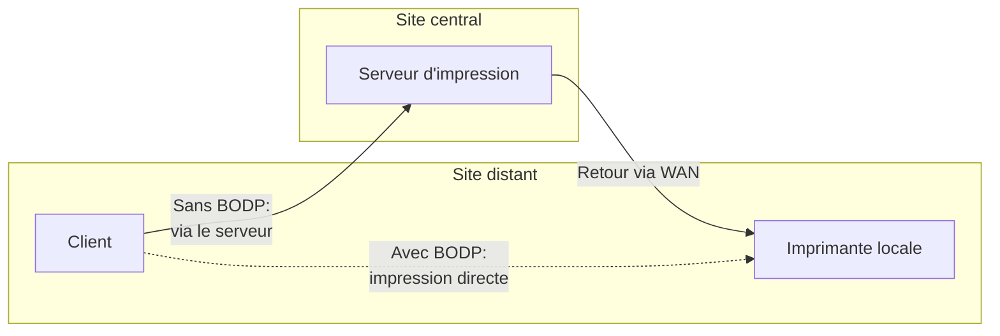

<!--
  Copyright 2026 Julien Bombled

  Licensed under the Apache License, Version 2.0 (the "License");
  you may not use this file except in compliance with the License.
  You may obtain a copy of the License at

      http://www.apache.org/licenses/LICENSE-2.0

  Unless required by applicable law or agreed to in writing, software
  distributed under the License is distributed on an "AS IS" BASIS,
  WITHOUT WARRANTIES OR CONDITIONS OF ANY KIND, either express or implied.
  See the License for the specific language governing permissions and
  limitations under the License.
-->

# Services d'impression (Print Services)

<span class="level-intermediate">Intermediaire</span> · Temps estime : 25 minutes

## Vue d'ensemble

Le role **Print and Document Services** transforme un serveur Windows en serveur d'impression centralise. Il permet de partager des imprimantes, gerer les files d'attente, deployer des pilotes et superviser l'ensemble du parc d'impression depuis une console unique.

!!! example "Analogie"

    Imaginez un bureau de poste central dans une grande ville. Au lieu que chaque habitant aille deposer son courrier directement dans la boite du destinataire (impression locale), tout le monde depose son courrier au bureau de poste (serveur d'impression). Le bureau de poste trie les envois par destination (file d'attente), verifie que le format est correct (pilotes), et envoie le tout aux bons centres de distribution (imprimantes). Si un centre de distribution est en panne, le bureau de poste garde le courrier et le renvoie des que possible. Le directeur de la poste (administrateur) peut voir en temps reel combien de lettres attendent dans chaque file.

## Architecture du service d'impression



### Composants cles

| Composant | Description | Role dans l'architecture |
|-----------|-------------|--------------------------|
| **Spooler** | Service `Spooler` (spoolsv.exe) | Recoit et met en file d'attente les travaux |
| **File d'attente** | Queue par imprimante logique | Ordonne les travaux avant envoi |
| **Pilote** | Logiciel de conversion | Traduit les donnees pour l'imprimante |
| **Port** | TCP/IP, USB, LPR, WSD | Canal de communication vers l'imprimante |
| **Imprimante logique** | Objet Windows | Associe un nom partage, un pilote et un port |

### Services de role disponibles

Le role **Print and Document Services** comporte trois services de role :

| Service de role | Nom PowerShell | Description |
|----------------|----------------|-------------|
| Print Server | `Print-Server` | Serveur d'impression, files d'attente et pilotes |
| Internet Printing | `Print-Internet` | Publication d'imprimantes via IIS (protocole IPP) |
| LPD Service | `Print-LPD-Service` | Prise en charge du protocole Line Printer Daemon (Unix/Linux) |

## Installation du role

### Via PowerShell

```powershell
# Install the Print Server role with management tools
Install-WindowsFeature -Name "Print-Server" -IncludeManagementTools

# Verify installation
Get-WindowsFeature -Name "Print*"
```

Resultat :

```text
PS C:\> Install-WindowsFeature -Name "Print-Server" -IncludeManagementTools

Success Restart Needed Exit Code      Feature Result
------- -------------- ---------      --------------
True    No             Success        {Print Server, Print and Document Services}

PS C:\> Get-WindowsFeature -Name "Print*"

Display Name                                            Name              Install State
------------                                            ----              -------------
    [X] Print and Document Services                     Print-Services    Installed
        [X] Print Server                                Print-Server      Installed
        [ ] Internet Printing                           Print-Internet    Available
        [ ] LPD Service                                 Print-LPD-Service Available
```

!!! tip "Internet Printing"

    Le service **Internet Printing** installe un composant IIS qui expose les imprimantes via une URL du type `https://serveur/printers`. Il est utile pour les utilisateurs externes ou les sites distants sans VPN. Installez-le uniquement si ce scenario s'applique a votre environnement.

### Installation complete (tous les services de role)

```powershell
# Install all Print Services sub-features
Install-WindowsFeature -Name "Print-Services" -IncludeAllSubFeature -IncludeManagementTools
```

## Console de gestion d'impression

La console **Print Management** (`printmanagement.msc`) permet de gerer l'ensemble du parc d'impression :

- Ajouter des serveurs d'impression
- Creer et partager des imprimantes
- Gerer les pilotes et les ports
- Superviser les files d'attente
- Deployer des imprimantes par GPO
- Configurer des filtres personnalises (imprimantes en erreur, files non vides)

```powershell
# Open Print Management console
printmanagement.msc
```

!!! info "Filtres personnalises"

    La console propose des **filtres personnalises** tres utiles en production. Par exemple, le filtre "Printers Not Ready" affiche toutes les imprimantes en erreur sur l'ensemble des serveurs geres. Le filtre "Printers With Jobs" montre les files d'attente actives.

## Gestion des imprimantes via PowerShell

### Creer un port TCP/IP

```powershell
# Create a Standard TCP/IP printer port
Add-PrinterPort -Name "TCP_192.168.10.50" -PrinterHostAddress "192.168.10.50"

# Verify the port
Get-PrinterPort -Name "TCP_192.168.10.50"
```

### Ajouter un pilote d'impression

```powershell
# List available printer drivers on the system
Get-PrinterDriver

# Add a printer driver (the driver INF must be available)
Add-PrinterDriver -Name "HP Universal Printing PCL 6"

# Add a driver from a specific INF file
# pnputil /add-driver "C:\Drivers\HP\hpcu255u.inf"
# Add-PrinterDriver -Name "HP Universal Printing PCL 6"
```

### Creer et partager une imprimante

```powershell
# Create a shared printer
Add-Printer -Name "IMP-RDC-01" `
    -DriverName "HP Universal Printing PCL 6" `
    -PortName "TCP_192.168.10.50" `
    -ShareName "IMP-RDC-01" `
    -Shared `
    -Location "Batiment A - Rez-de-chaussee" `
    -Comment "Imprimante couleur A3 - Rez-de-chaussee"

# Verify the printer
Get-Printer -Name "IMP-RDC-01"
```

### Gerer les travaux d'impression

```powershell
# List all print jobs on a printer
Get-PrintJob -PrinterName "IMP-RDC-01"

# Remove a stuck print job
Remove-PrintJob -PrinterName "IMP-RDC-01" -ID 3

# Remove all jobs from a printer
Get-PrintJob -PrinterName "IMP-RDC-01" | Remove-PrintJob

# Restart the Spooler service (clears all queues)
Restart-Service -Name "Spooler"
```

### Script complet de deploiement

```powershell
# Full deployment: port, driver, and shared printer
$printerName   = "IMP-COMPTA-01"
$ipAddress     = "192.168.10.51"
$portName      = "TCP_$ipAddress"
$driverName    = "HP Universal Printing PCL 6"
$shareName     = "IMP-COMPTA-01"
$location      = "Batiment A - 1er etage"

# Step 1: Create TCP/IP port
Add-PrinterPort -Name $portName -PrinterHostAddress $ipAddress

# Step 2: Ensure driver is installed
Add-PrinterDriver -Name $driverName

# Step 3: Create and share the printer
Add-Printer -Name $printerName `
    -DriverName $driverName `
    -PortName $portName `
    -ShareName $shareName `
    -Shared `
    -Location $location `
    -Comment "Imprimante departement comptabilite"

# Step 4: Verify
Get-Printer -Name $printerName | Format-List Name, ShareName, PortName, DriverName, Shared
```

## Deploiement d'imprimantes par GPO

Le deploiement par GPO permet de connecter automatiquement les imprimantes aux postes et utilisateurs du domaine.

### Methode 1 : Deploiement par ordinateur (Computer Configuration)

Cette methode connecte l'imprimante a **tous les utilisateurs** qui se connectent a l'ordinateur cible.

1. Ouvrir la console **Print Management** (`printmanagement.msc`)
2. Clic droit sur l'imprimante partagee > **Deploy with Group Policy...**
3. Selectionner ou creer une GPO
4. Choisir **The computers that this GPO applies to (per machine)**
5. Cliquer sur **Add** puis **OK**

### Methode 2 : Deploiement par utilisateur (User Configuration)

Cette methode connecte l'imprimante a **l'utilisateur**, quel que soit le poste utilise.

1. Meme procedure, mais choisir **The users that this GPO applies to (per user)**

### Methode 3 : Preferences de GPO (Group Policy Preferences)

Les preferences offrent plus de flexibilite (ciblage au niveau de l'element) :

**Computer Configuration** ou **User Configuration** > **Preferences** > **Control Panel Settings** > **Printers**

| Option | Description |
|--------|-------------|
| **Action** | Create, Replace, Update, Delete |
| **Shared Printer** | Chemin UNC `\\PRINT-01\IMP-RDC-01` |
| **Set as default** | Definir comme imprimante par defaut |
| **Item-level targeting** | Cibler par OU, groupe de securite, plage IP, site AD |

!!! tip "Ciblage au niveau de l'element"

    Le **Item-level targeting** est la methode recommandee pour deployer des imprimantes differentes selon les departements. Par exemple, deployer `IMP-COMPTA-01` uniquement aux membres du groupe `GG_Comptabilite` et `IMP-RH-01` uniquement au groupe `GG_RH`.

## Branch Office Direct Printing

Le **Branch Office Direct Printing** (BODP) optimise l'impression pour les sites distants. Au lieu d'envoyer le travail d'impression au serveur central puis de le retransmettre a l'imprimante locale du site distant, le client envoie le travail directement a l'imprimante.



### Activer Branch Office Direct Printing

```powershell
# Enable BODP on a specific printer
Set-Printer -Name "IMP-SITE-LYON-01" -RenderingMode BranchOffice

# Verify BODP status
Get-Printer -Name "IMP-SITE-LYON-01" | Select-Object Name, RenderingMode
```

Resultat :

```text
PS C:\> Get-Printer -Name "IMP-SITE-LYON-01" | Select-Object Name, RenderingMode

Name                RenderingMode
----                -------------
IMP-SITE-LYON-01   BranchOffice
```

!!! info "Quand utiliser BODP"

    Activez BODP pour les imprimantes situees dans des sites distants connectes au site central via une liaison WAN. Cela reduit la bande passante consommee et accelere l'impression. Le serveur d'impression central conserve la gestion des pilotes et des files d'attente, mais le rendu est effectue localement.

## Pooling d'imprimantes et priorites

### Printer Pooling (regroupement d'imprimantes)

Le **printer pooling** associe plusieurs imprimantes physiques identiques a une seule imprimante logique. Les travaux sont distribues automatiquement a la premiere imprimante disponible.

```powershell
# Create ports for two identical printers
Add-PrinterPort -Name "TCP_192.168.10.60" -PrinterHostAddress "192.168.10.60"
Add-PrinterPort -Name "TCP_192.168.10.61" -PrinterHostAddress "192.168.10.61"

# Create the pooled printer with multiple ports
Add-Printer -Name "IMP-POOL-OPEN-SPACE" `
    -DriverName "HP Universal Printing PCL 6" `
    -PortName "TCP_192.168.10.60", "TCP_192.168.10.61" `
    -ShareName "IMP-POOL-OPEN-SPACE" `
    -Shared
```

!!! warning "Prerequis du pooling"

    Les imprimantes physiques regroupees dans un pool **doivent utiliser le meme pilote** (modeles identiques ou compatibles). Sinon, les travaux d'impression produiront des resultats imprevisibles.

### Priorites d'impression

Deux imprimantes logiques peuvent pointer vers la meme imprimante physique avec des priorites differentes (1 = basse, 99 = haute). Les travaux de priorite haute passent en premier.

```powershell
# Create a high-priority logical printer for managers
Add-Printer -Name "IMP-DIRECTION-PRIORITE" `
    -DriverName "HP Universal Printing PCL 6" `
    -PortName "TCP_192.168.10.50" `
    -ShareName "IMP-DIRECTION-PRIORITE" `
    -Shared `
    -Priority 99

# Standard priority printer for everyone else
Add-Printer -Name "IMP-DIRECTION-STANDARD" `
    -DriverName "HP Universal Printing PCL 6" `
    -PortName "TCP_192.168.10.50" `
    -ShareName "IMP-DIRECTION-STANDARD" `
    -Shared `
    -Priority 1
```

Securisez l'acces avec les permissions de partage : restreignez `IMP-DIRECTION-PRIORITE` au groupe `GG_Direction` uniquement.

## Scenario pratique

!!! example "Scenario : deployer 3 imprimantes partagees pour 2 departements"

    **Contexte** : Sophie, administratrice systeme chez ContosoPharma, doit deployer 3 imprimantes partagees sur le serveur `PRINT-01` (10.0.0.15) du domaine `contoso.local`. Les departements Comptabilite et Ressources Humaines doivent chacun recevoir leurs imprimantes automatiquement via GPO.

    | Imprimante | IP | Departement | Groupe AD |
    |------------|----|-------------|-----------|
    | IMP-COMPTA-01 | 192.168.10.51 | Comptabilite | GG_Comptabilite |
    | IMP-COMPTA-02 | 192.168.10.52 | Comptabilite | GG_Comptabilite |
    | IMP-RH-01 | 192.168.10.53 | RH | GG_RH |

    **Etape 1** : Installer le role Print Server

    ```powershell
    Install-WindowsFeature -Name "Print-Server" -IncludeManagementTools
    ```

    **Etape 2** : Creer les ports et les imprimantes

    ```powershell
    # Define printer configurations
    $printers = @(
        @{ Name = "IMP-COMPTA-01"; IP = "192.168.10.51"; Location = "Bat A - 1er" }
        @{ Name = "IMP-COMPTA-02"; IP = "192.168.10.52"; Location = "Bat A - 1er" }
        @{ Name = "IMP-RH-01";     IP = "192.168.10.53"; Location = "Bat B - RDC" }
    )

    $driverName = "HP Universal Printing PCL 6"

    foreach ($p in $printers) {
        $portName = "TCP_$($p.IP)"

        # Create port
        Add-PrinterPort -Name $portName -PrinterHostAddress $p.IP

        # Create and share printer
        Add-Printer -Name $p.Name `
            -DriverName $driverName `
            -PortName $portName `
            -ShareName $p.Name `
            -Shared `
            -Location $p.Location
    }
    ```

    **Etape 3** : Deployer par GPO avec ciblage

    1. Ouvrir `printmanagement.msc`
    2. Pour `IMP-COMPTA-01` et `IMP-COMPTA-02` :
        - Clic droit > **Deploy with Group Policy...**
        - Creer une GPO `GPO_Imprimantes_Comptabilite`
        - Deployer en **per user** et appliquer le **security filtering** au groupe `GG_Comptabilite`
    3. Pour `IMP-RH-01` :
        - Meme procedure avec une GPO `GPO_Imprimantes_RH`
        - Cibler le groupe `GG_RH`

    **Etape 4** : Verifier le deploiement

    ```powershell
    # List all shared printers on the server
    Get-Printer | Where-Object Shared | Select-Object Name, ShareName, PortName, Location
    ```

??? success "Resultat attendu"

    ```text
    PS C:\> Get-Printer | Where-Object Shared | Select-Object Name, ShareName, PortName, Location

    Name           ShareName      PortName          Location
    ----           ---------      --------          --------
    IMP-COMPTA-01  IMP-COMPTA-01  TCP_192.168.10.51 Bat A - 1er
    IMP-COMPTA-02  IMP-COMPTA-02  TCP_192.168.10.52 Bat A - 1er
    IMP-RH-01      IMP-RH-01      TCP_192.168.10.53 Bat B - RDC
    ```

    Sur un poste client du departement Comptabilite, apres un `gpupdate /force` et une deconnexion/reconnexion :

    ```text
    PS C:\> Get-Printer | Select-Object Name, Type

    Name                                   Type
    ----                                   ----
    \\PRINT-01\IMP-COMPTA-01               Connection
    \\PRINT-01\IMP-COMPTA-02               Connection
    Microsoft Print to PDF                 Local
    ```

    Les imprimantes RH ne sont pas visibles pour les utilisateurs du departement Comptabilite et inversement.

## Erreurs courantes

!!! failure "Erreur 1 : Incompatibilite de pilotes (v3 vs v4)"

    **Symptome** : l'imprimante est ajoutee mais les impressions echouent ou le formatage est incorrect.

    **Cause** : Windows Server 2022 prend en charge les pilotes v3 et v4. Un pilote v3 ancien peut etre incompatible avec certaines fonctionnalites ou causer des instabilites. A l'inverse, un pilote v4 peut ne pas supporter toutes les options specifiques de l'imprimante.

    **Solution** : privilegiez les pilotes v4 quand ils sont disponibles. Verifiez la version avec `Get-PrinterDriver | Select-Object Name, MajorVersion`. Un `MajorVersion` de 3 indique un pilote v3, et 4 indique un pilote v4. Consultez le site du fabricant pour obtenir le pilote certifie Windows Server 2022.

!!! failure "Erreur 2 : Boucle de crash du service Spooler"

    **Symptome** : le service **Print Spooler** demarre puis s'arrete immediatement, en boucle. Les evenements du journal systeme montrent l'ID 7031 (service termine de maniere inattendue).

    **Cause** : un pilote defectueux ou un travail d'impression corrompu provoque le crash du spooler a chaque demarrage.

    **Solution** :

    1. Arreter le service : `Stop-Service -Name "Spooler" -Force`
    2. Supprimer les fichiers de la file d'attente : `Remove-Item -Path "C:\Windows\System32\spool\PRINTERS\*" -Force`
    3. Redemarrer le service : `Start-Service -Name "Spooler"`
    4. Si le probleme persiste, identifier le pilote fautif en les supprimant un par un avec `Remove-PrinterDriver`.

!!! failure "Erreur 3 : File d'attente bloquee (travail coince)"

    **Symptome** : un travail reste en statut "Printing" ou "Error" et bloque tous les travaux suivants.

    **Cause** : une erreur de communication avec l'imprimante (papier, reseau, imprimante eteinte) ou un travail corrompu.

    **Solution** :

    ```powershell
    # Remove the stuck job by ID
    Remove-PrintJob -PrinterName "IMP-RDC-01" -ID 5

    # If the job cannot be deleted, restart the Spooler
    Restart-Service -Name "Spooler"

    # Clear spool files manually if needed
    Stop-Service -Name "Spooler" -Force
    Remove-Item -Path "C:\Windows\System32\spool\PRINTERS\*" -Force
    Start-Service -Name "Spooler"
    ```

!!! failure "Erreur 4 : Imprimante deployee par GPO non visible sur le poste client"

    **Symptome** : la GPO est configuree et liee, mais l'imprimante n'apparait pas sur le poste cible.

    **Cause possible** :

    - Le **security filtering** exclut l'utilisateur ou l'ordinateur
    - Le client ne peut pas atteindre le serveur d'impression (DNS, pare-feu)
    - Le deploiement est en **per user** mais la GPO est liee a une OU d'ordinateurs (ou inversement)
    - L'extension **PushPrinterConnections.exe** n'est pas declenchee

    **Solution** : verifier avec `gpresult /h C:\rapport_gpo.html` que la GPO est bien appliquee. S'assurer que le service **Print Spooler** est actif sur le client. Verifier que le poste client peut acceder a `\\PRINT-01\IMP-RDC-01` via UNC. Forcer la mise a jour avec `gpupdate /force` puis deconnexion/reconnexion.

!!! failure "Erreur 5 : Impression lente depuis un site distant (Branch Office)"

    **Symptome** : les utilisateurs d'un site distant signalent des temps d'impression tres longs (plusieurs minutes pour une page).

    **Cause** : sans **Branch Office Direct Printing**, les donnees d'impression traversent la liaison WAN deux fois : du client vers le serveur d'impression central, puis du serveur central vers l'imprimante du site distant.

    **Solution** : activer le BODP sur les imprimantes des sites distants :

    ```powershell
    # Enable Branch Office Direct Printing
    Set-Printer -Name "IMP-SITE-LYON-01" -RenderingMode BranchOffice

    # Verify
    Get-Printer -Name "IMP-SITE-LYON-01" | Select-Object Name, RenderingMode
    ```

    Le rendu est desormais effectue localement sur le poste client, et les donnees sont envoyees directement a l'imprimante sans transiter par le serveur central.

## Points cles a retenir

- Le role **Print Server** centralise la gestion des imprimantes, pilotes et files d'attente
- La console `printmanagement.msc` offre une vue unifiee de tout le parc d'impression
- Le deploiement par **GPO** (via Print Management ou preferences) automatise la connexion des imprimantes
- Le **Branch Office Direct Printing** optimise l'impression pour les sites distants
- Le **printer pooling** repartit la charge sur plusieurs imprimantes identiques
- Les **priorites d'impression** permettent de donner la preference a certains utilisateurs

## Pour aller plus loin

- [Comprendre les roles](comprendre-les-roles.md) - theorie sur les roles et fonctionnalites
- [Ajout et suppression de roles](ajout-suppression.md) - installer et desinstaller des roles en pratique
- [Concepts GPO](../../active-directory/gpo/concepts-gpo.md) - comprendre les strategies de groupe pour le deploiement
