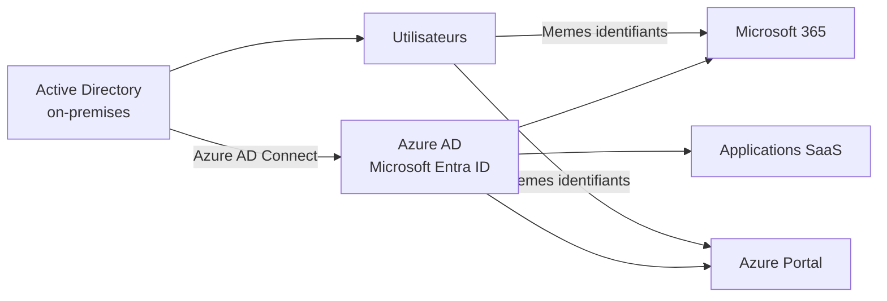
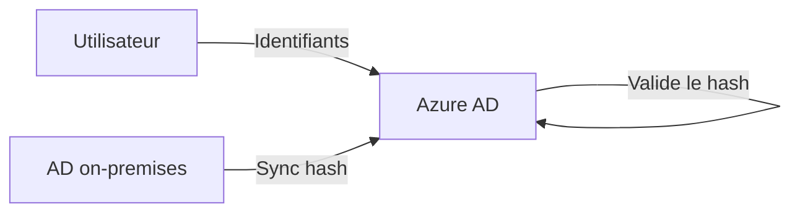
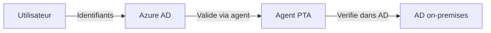

# Azure AD Connect

!!! info "Niveau : Intermediaire"

    Temps estime : 30 minutes

## Presentation

Azure AD Connect (renomme **Microsoft Entra Connect** depuis 2023) est l'outil qui synchronise les identites de votre Active Directory on-premises vers Azure AD (Microsoft Entra ID). Il permet aux utilisateurs de se connecter aux services cloud Microsoft (Microsoft 365, Azure) avec leurs identifiants Active Directory existants.



## Modes d'authentification

Azure AD Connect propose trois modes d'authentification :

### Password Hash Synchronization (PHS)

| Caracteristique | Valeur |
|-----------------|--------|
| Complexite | Faible |
| Dependance on-premises | Aucune (auth cloud) |
| Haute disponibilite | Native (Azure AD) |
| Recommandation | Mode par defaut recommande |

Le hash du mot de passe est synchronise vers Azure AD. L'authentification se fait entierement dans le cloud.



### Pass-through Authentication (PTA)

| Caracteristique | Valeur |
|-----------------|--------|
| Complexite | Moyenne |
| Dependance on-premises | Oui (agents PTA) |
| Haute disponibilite | Necessite plusieurs agents |
| Recommandation | Quand PHS n'est pas acceptable (conformite) |

Azure AD redirige la validation du mot de passe vers un agent PTA on-premises.



### Federation (AD FS)

| Caracteristique | Valeur |
|-----------------|--------|
| Complexite | Elevee |
| Dependance on-premises | Forte (ferme AD FS) |
| Haute disponibilite | Necessite une infrastructure AD FS HA |
| Recommandation | Scenarios avances (smartcard, MFA tiers, etc.) |

L'authentification est entierement geree par AD FS on-premises.

!!! tip "Recommandation Microsoft"

    Microsoft recommande **Password Hash Sync** comme mode par defaut. Il offre
    la meilleure resilience et ne depend pas de l'infrastructure on-premises pour
    l'authentification. Activez-le meme en complement de PTA ou AD FS comme
    solution de secours.

## Prerequis

### Infrastructure

| Element | Requis |
|---------|--------|
| AD DS | Foret Active Directory fonctionnelle |
| Niveau fonctionnel | Windows Server 2003+ |
| Serveur AAD Connect | Windows Server 2016+ (dedie, joint au domaine) |
| SQL | SQL Server Express (inclus) ou SQL Server existant |
| .NET Framework | 4.7.2+ |

### Reseau

| Endpoint | Port | Description |
|----------|------|-------------|
| `*.microsoftonline.com` | 443 | Authentification Azure AD |
| `*.windows.net` | 443 | Azure AD Graph |
| `*.msappproxy.net` | 443 | Proxy d'application (PTA) |
| `*.servicebus.windows.net` | 443 | Service Bus (PTA) |

### Compte requis

| Compte | Permissions |
|--------|-------------|
| **Administrateur Global Azure AD** | Configuration initiale |
| **Administrateur d'entreprise AD** | Configuration du connecteur AD |
| **Compte de service ADSync** | Cree automatiquement lors de l'installation |

## Installation

### Installation Express

Le mode Express convient a la plupart des environnements mono-foret :

1. Telecharger Azure AD Connect depuis le centre de telechargement Microsoft
2. Executer `AzureADConnect.msi`
3. Accepter les termes de licence
4. Cliquer sur **Configuration Express**
5. Saisir les identifiants de l'administrateur global Azure AD
6. Saisir les identifiants de l'administrateur d'entreprise AD
7. Cliquer sur **Installer**

Le mode Express configure automatiquement :

- Password Hash Synchronization
- Synchronisation de tous les utilisateurs et groupes
- Seamless Single Sign-On (SSO)
- Cycle de synchronisation toutes les 30 minutes

### Installation personnalisee

Pour les environnements complexes (multi-foret, filtrage, PTA, federation) :

1. Selectionner **Personnaliser** au lieu de Configuration Express
2. Options disponibles :
    - Choix du mode d'authentification (PHS, PTA, AD FS)
    - Filtrage par OU, domaine ou attribut
    - Configuration du serveur SQL
    - Writeback des attributs (mot de passe, appareils, groupes)
    - Mappage d'attributs personnalise

## Filtrage de la synchronisation

### Filtrage par OU

Synchroniser uniquement certaines unites d'organisation :

1. Azure AD Connect > **Configuration** > **Personnaliser les options de synchronisation**
2. Decocher les OU a exclure (ex. : exclure les OU de test, comptes de service)

### Filtrage par attribut

```powershell
# Set a custom attribute to control sync
# Example: only sync users where extensionAttribute1 = "SyncToAzure"
Set-ADUser -Identity "j.bombled" -Replace @{extensionAttribute1="SyncToAzure"}
```

## Gestion du cycle de synchronisation

```powershell
# Import the ADSync module
Import-Module ADSync

# Check synchronization status
Get-ADSyncScheduler

# Force a full synchronization cycle
Start-ADSyncSyncCycle -PolicyType Initial

# Force a delta synchronization (changes only)
Start-ADSyncSyncCycle -PolicyType Delta

# Disable the scheduler (for maintenance)
Set-ADSyncScheduler -SyncCycleEnabled $false

# Re-enable the scheduler
Set-ADSyncScheduler -SyncCycleEnabled $true

# Change sync interval (minimum 30 minutes)
Set-ADSyncScheduler -CustomizedSyncCycleInterval 00:30:00
```

## Seamless SSO

Le Seamless Single Sign-On permet aux utilisateurs sur des postes joints au domaine de se connecter automatiquement aux services cloud sans ressaisir leur mot de passe.

### Prerequis

- Azure AD Connect avec PHS ou PTA
- Postes de travail joints au domaine AD
- La zone Intranet doit inclure l'URL Azure AD

### Activation

Le Seamless SSO est active automatiquement avec l'installation Express. Pour l'activer manuellement :

1. Relancer l'assistant Azure AD Connect
2. **Modifier la connexion utilisateur**
3. Cocher **Activer l'authentification unique**

## Password Writeback

Le writeback de mot de passe permet aux utilisateurs de reinitialiser leur mot de passe dans Azure AD et de le synchroniser vers l'AD on-premises (Azure AD Self-Service Password Reset).

### Activation

1. Relancer l'assistant Azure AD Connect
2. **Fonctionnalites facultatives**
3. Cocher **Ecriture diferee de mot de passe**

### Prerequis

- Licence Azure AD Premium P1 ou P2
- Le compte de service ADSync doit avoir les permissions de reinitialisation de mot de passe dans AD

## Surveillance et depannage

```powershell
# Check synchronization errors
Get-ADSyncCSObject -ConnectorName "winopslab.local - AAD" |
    Where-Object { $_.HasSyncError }

# View sync statistics
Get-ADSyncRunProfileResult -ConnectorName "winopslab.local" -RunProfileName "Delta Synchronization" |
    Select-Object -First 5

# Check connector space
Get-ADSyncConnectorStatistics -ConnectorName "winopslab.local"

# Azure AD Connect Health (portal)
# Navigate to: portal.azure.com > Azure AD Connect Health
```

### Erreurs courantes

| Erreur | Cause probable | Solution |
|--------|---------------|----------|
| **IdentitySynchronizationError** | Attribut en double (UPN, proxyAddress) | Corriger les doublons dans l'AD on-premises |
| **InvalidSoftMatch** | Objet existant dans Azure AD sans correspondance | Verifier le mappage des attributs |
| **LargeObject** | Attribut depassant la limite de taille Azure AD | Reduire la taille de l'attribut |
| **DataValidationFailed** | Format d'attribut invalide | Corriger le format (ex. : UPN valide) |

## Points cles a retenir

- Azure AD Connect synchronise les identites AD on-premises vers Azure AD (Microsoft Entra ID)
- **Password Hash Sync** est le mode recommande : simple, resilient, pas de dependance on-premises
- Le mode **Express** couvre la majorite des besoins (mono-foret, PHS, Seamless SSO)
- Le cycle de synchronisation par defaut est de **30 minutes** (delta sync)
- Le **Password Writeback** permet le Self-Service Password Reset depuis le cloud vers l'AD
- Azure AD Connect doit etre installe sur un serveur dedie, joint au domaine

## Pour aller plus loin

- [Azure Arc](azure-arc.md) pour la gestion hybride des serveurs
- [Azure Monitor](azure-monitor.md) pour la surveillance des serveurs
- [Azure Backup](azure-backup.md) pour la sauvegarde cloud
