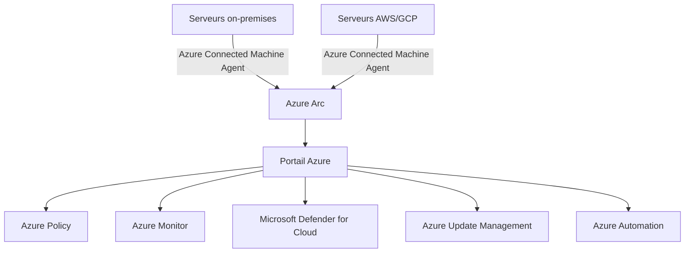

<!--
  Copyright 2026 Julien Bombled

  Licensed under the Apache License, Version 2.0 (the "License");
  you may not use this file except in compliance with the License.
  You may obtain a copy of the License at

      http://www.apache.org/licenses/LICENSE-2.0

  Unless required by applicable law or agreed to in writing, software
  distributed under the License is distributed on an "AS IS" BASIS,
  WITHOUT WARRANTIES OR CONDITIONS OF ANY KIND, either express or implied.
  See the License for the specific language governing permissions and
  limitations under the License.
-->

# Azure Arc pour serveurs

<span class="level-intermediate">Intermediaire</span> · Temps estime : 30 minutes

## Presentation

Azure Arc permet de projeter des serveurs on-premises (ou heberges dans d'autres clouds) dans le plan de gestion Azure. Une fois inscrits, ces serveurs apparaissent dans le portail Azure comme des ressources natives et beneficient des services Azure : policies, monitoring, update management et securite.



!!! example "Analogie"

    Azure Arc, c'est comme attacher une etiquette de suivi GPS a vos colis physiques qui restent dans votre entrepot. Les colis ne bougent pas, mais vous pouvez les voir, les suivre et les gerer depuis le tableau de bord central de la compagnie de livraison, comme si c'etaient des colis geres par eux.

## Concepts fondamentaux

| Concept | Description |
|---------|-------------|
| **Azure Connected Machine Agent** | Agent installe sur le serveur on-premises qui etablit la connexion avec Azure |
| **Resource Group** | Groupe de ressources Azure contenant les serveurs Arc |
| **Managed Identity** | Identite geree automatiquement pour chaque serveur Arc |
| **Extensions** | Agents supplementaires deployes via Arc (Log Analytics, Defender, etc.) |
| **Azure Policy** | Strategies de conformite appliquees aux serveurs Arc |

## Prerequis

### Prerequis Azure

| Element | Requis |
|---------|--------|
| Abonnement Azure | Actif avec un Resource Group |
| Role RBAC | **Azure Connected Machine Onboarding** (minimum) |
| Resource Provider | `Microsoft.HybridCompute` et `Microsoft.GuestConfiguration` enregistres |

### Prerequis sur le serveur

| Element | Requis |
|---------|--------|
| OS | Windows Server 2012 R2+ ou Linux supporte |
| Connectivite | HTTPS (port 443) vers les endpoints Azure |
| PowerShell | Version 4.0+ |
| .NET Framework | 4.6+ |

### Endpoints reseau requis

| Endpoint | Usage |
|----------|-------|
| `management.azure.com` | Azure Resource Manager |
| `login.microsoftonline.com` | Authentification Azure AD |
| `guestnotificationservice.azure.com` | Service de notification |
| `*.his.arc.azure.com` | Service d'identite hybride |
| `*.guestconfiguration.azure.com` | Guest Configuration |
| `dc.services.visualstudio.com` | Telemetrie Application Insights |

## Inscrire un serveur (onboarding)

### Methode interactive (un serveur)

1. Dans le portail Azure, rechercher **Azure Arc** > **Serveurs** > **Ajouter**
2. Selectionner **Ajouter un seul serveur**
3. Configurer : abonnement, resource group, region, OS
4. Telecharger le script genere
5. Executer le script sur le serveur on-premises

```powershell
# Download and run the onboarding script (generated by the portal)
# The script installs the agent and registers the server

# Manual agent download
Invoke-WebRequest -Uri "https://aka.ms/azcmagent-windows" `
    -OutFile "C:\Temp\AzureConnectedMachineAgent.msi"

# Install the agent
msiexec /i "C:\Temp\AzureConnectedMachineAgent.msi" /l*v "C:\Temp\azcmagent-install.log" /qn

# Connect the server to Azure Arc
& "$env:ProgramW6432\AzureConnectedMachineAgent\azcmagent.exe" connect `
    --resource-group "RG-Arc-Servers" `
    --tenant-id "<tenant-id>" `
    --location "westeurope" `
    --subscription-id "<subscription-id>" `
    --cloud "AzureCloud"
```

### Methode a grande echelle (plusieurs serveurs)

Pour inscrire de nombreux serveurs, utiliser un **Service Principal** :

```powershell
# Create a Service Principal for Arc onboarding
$sp = New-AzADServicePrincipal -DisplayName "Arc-Onboarding-SP"

# Assign the role
New-AzRoleAssignment -ObjectId $sp.Id `
    -RoleDefinitionName "Azure Connected Machine Onboarding" `
    -ResourceGroupName "RG-Arc-Servers"

# On each server, connect using the Service Principal
& "$env:ProgramW6432\AzureConnectedMachineAgent\azcmagent.exe" connect `
    --service-principal-id "<app-id>" `
    --service-principal-secret "<secret>" `
    --resource-group "RG-Arc-Servers" `
    --tenant-id "<tenant-id>" `
    --location "westeurope" `
    --subscription-id "<subscription-id>"
```

!!! tip "Deploiement GPO"

    Pour les environnements Active Directory, le script d'onboarding peut etre deploye
    via une GPO de demarrage ou une tache planifiee, en utilisant le Service Principal
    pour l'authentification automatique.

## Verifier l'etat de l'agent

```powershell
# Check agent status
& "$env:ProgramW6432\AzureConnectedMachineAgent\azcmagent.exe" show

# Check agent connectivity
& "$env:ProgramW6432\AzureConnectedMachineAgent\azcmagent.exe" check

# View agent logs
Get-Content "$env:ProgramData\AzureConnectedMachineAgent\Log\himds.log" -Tail 50
```

Resultat :

```text
# azcmagent show
Agent Status              : Connected
Last Heartbeat            : 2026-02-20T08:31:02Z
Agent Version             : 1.38.02849.1604
Resource Name             : SRV-DC01
Resource Group Name       : RG-Arc-Servers
Resource Group Location   : westeurope
Subscription ID           : xxxxxxxx-xxxx-xxxx-xxxx-xxxxxxxxxxxx
Tenant ID                 : yyyyyyyy-yyyy-yyyy-yyyy-yyyyyyyyyyyy

# azcmagent check
INFO    Starting connectivity check
INFO    Checking endpoint management.azure.com:443 ... OK
INFO    Checking endpoint login.microsoftonline.com:443 ... OK
INFO    Checking endpoint *.his.arc.azure.com:443 ... OK
INFO    All connectivity checks passed.
```

## Azure Policy pour serveurs Arc

Azure Policy permet d'evaluer et d'appliquer des configurations de conformite sur les serveurs Arc.

### Policies courantes pour Windows Server

| Policy | Description |
|--------|-------------|
| **Audit Windows machines that have not restarted within specified days** | Detecter les serveurs sans redemarrage recent |
| **Audit Windows machines on which Windows Defender Exploit Guard is not enabled** | Verifier la protection Exploit Guard |
| **Windows machines should have Log Analytics agent installed** | Assurer la presence de l'agent de monitoring |
| **Configure Windows Arc machines to run Azure Monitor Agent** | Deployer Azure Monitor Agent automatiquement |
| **Audit Windows machines that do not have specified Windows PowerShell execution policy** | Verifier la politique d'execution PowerShell |

### Assigner une policy

1. Portail Azure > **Policy** > **Definitions**
2. Rechercher la policy souhaitee
3. Cliquer sur **Assigner**
4. Selectionner le scope (abonnement ou resource group contenant les serveurs Arc)
5. Configurer les parametres
6. Creer l'assignation

## Extensions Arc

Les extensions ajoutent des fonctionnalites aux serveurs Arc :

| Extension | Description |
|-----------|-------------|
| **Azure Monitor Agent** | Collecte des metriques et logs vers Log Analytics |
| **Microsoft Defender for Cloud** | Protection contre les menaces |
| **Custom Script Extension** | Execution de scripts a distance |
| **Key Vault Extension** | Distribution de certificats depuis Azure Key Vault |
| **Azure Automation Hybrid Worker** | Execution de runbooks Azure Automation |

```powershell
# Install Azure Monitor Agent extension via Azure CLI
az connectedmachine extension create `
    --machine-name "SRV-DC01" `
    --resource-group "RG-Arc-Servers" `
    --name "AzureMonitorWindowsAgent" `
    --publisher "Microsoft.Azure.Monitor" `
    --type "AzureMonitorWindowsAgent" `
    --location "westeurope"
```

Resultat :

```text
{
  "id": "/subscriptions/.../resourceGroups/RG-Arc-Servers/providers/Microsoft.HybridCompute/machines/SRV-DC01/extensions/AzureMonitorWindowsAgent",
  "name": "AzureMonitorWindowsAgent",
  "properties": {
    "provisioningState": "Succeeded",
    "publisher": "Microsoft.Azure.Monitor",
    "type": "AzureMonitorWindowsAgent",
    "typeHandlerVersion": "1.22.0"
  }
}
```

## Desinscription

```powershell
# Disconnect a server from Azure Arc
& "$env:ProgramW6432\AzureConnectedMachineAgent\azcmagent.exe" disconnect

# Uninstall the agent
msiexec /x "{00000000-0000-0000-0000-000000000000}" /qn
```

!!! example "Scenario pratique"

    **Context :** Nicolas, ingenieur infrastructure, doit inscrire 4 serveurs Windows on-premises (SRV-DC01, SRV-01, SRV-WEB01, SRV-FS01) dans Azure Arc pour pouvoir appliquer des Azure Policies et demarrer la supervision avec Azure Monitor.

    **Etape 1 : Preparer Azure**

    Nicolas cree un Resource Group `RG-Arc-Servers` dans la region West Europe et enregistre les resource providers requis :

    ```powershell
    Register-AzResourceProvider -ProviderNamespace "Microsoft.HybridCompute"
    Register-AzResourceProvider -ProviderNamespace "Microsoft.GuestConfiguration"
    ```

    **Etape 2 : Creer un Service Principal pour l'onboarding en masse**

    ```powershell
    $sp = New-AzADServicePrincipal -DisplayName "Arc-Onboarding-lab"
    New-AzRoleAssignment -ObjectId $sp.Id `
        -RoleDefinitionName "Azure Connected Machine Onboarding" `
        -ResourceGroupName "RG-Arc-Servers"
    ```

    **Etape 3 : Generer et deployer le script d'onboarding**

    Nicolas genere le script depuis le portail Azure Arc > Ajouter des serveurs > Script de deploiement. Il l'execute sur chaque serveur via PSRemoting :

    ```powershell
    $servers = @("SRV-DC01", "SRV-01", "SRV-WEB01", "SRV-FS01")
    foreach ($srv in $servers) {
        Invoke-Command -ComputerName $srv -FilePath "C:\Temp\OnboardingScript.ps1"
    }
    ```

    **Etape 4 : Verifier dans le portail**

    5 minutes plus tard, les 4 serveurs apparaissent dans Azure Portal > Azure Arc > Serveurs avec le statut "Connected". Nicolas applique immediatement une Azure Policy pour auditer la presence de Windows Defender et assigne Azure Monitor Agent a tous via une seule operation depuis le portail.

!!! danger "Erreurs courantes"

    **Bloquer les endpoints Azure requis au niveau du pare-feu.** L'agent Arc doit atteindre plusieurs endpoints HTTPS (management.azure.com, login.microsoftonline.com, *.his.arc.azure.com). Un seul endpoint bloque empeche l'enregistrement ou maintient l'agent en etat "Disconnected". Verifier avec `azcmagent check` avant le deploiement.

    **Donner le role "Contributor" au lieu de "Azure Connected Machine Onboarding".** Le role Contributor accorde des droits bien trop larges. Le role minimal "Azure Connected Machine Onboarding" suffit pour l'inscription des serveurs et respecte le principe du moindre privilege.

    **Negliger la securite du Service Principal d'onboarding.** Le Service Principal et son secret permettent d'inscrire autant de serveurs que souhaite dans votre abonnement Azure. Restreindre son scope au Resource Group Arc, definir une date d'expiration courte, et supprimer le SP une fois le deploiement termine.

    **Ignorer la consommation Azure apres inscription.** L'inscription Arc est gratuite, mais les extensions (Azure Monitor, Defender) et les donnees envoyees dans Log Analytics generent des couts. Estimer la consommation avant d'activer les extensions sur un grand nombre de serveurs.

    **Ne pas surveiller l'etat de connexion des agents.** Un agent Arc peut passer en "Disconnected" sans alerte visible (expiration du certificat agent, probleme reseau). Configurer une Azure Policy ou une alerte Azure Monitor sur le statut de connexion des machines Arc.

## Points cles a retenir

- Azure Arc projette les serveurs on-premises dans le portail Azure sans les migrer
- L'**Azure Connected Machine Agent** est le composant cle installe sur chaque serveur
- L'onboarding a grande echelle utilise un **Service Principal** deployable par GPO
- **Azure Policy** permet d'auditer et d'appliquer des standards de conformite
- Les **extensions** ajoutent des fonctionnalites (monitoring, securite, automation)
- Le serveur conserve son fonctionnement on-premises ; seule la gestion est etendue a Azure

## Pour aller plus loin

- [Azure Monitor](azure-monitor.md) pour la surveillance des serveurs Arc
- [Azure Backup](azure-backup.md) pour la sauvegarde cloud
- [Azure AD Connect](azure-ad-connect.md) pour l'identite hybride

