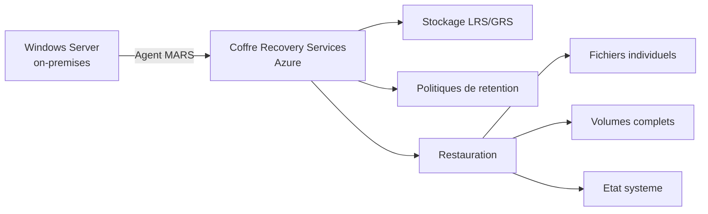

# Azure Backup pour Windows Server

<span class="level-intermediate">Intermediaire</span> · Temps estime : 25 minutes

## Presentation

Azure Backup permet de sauvegarder les fichiers, dossiers et l'etat systeme de serveurs Windows on-premises vers le cloud Azure. La solution utilise l'agent **MARS** (Microsoft Azure Recovery Services) et stocke les sauvegardes dans un **coffre Recovery Services**.



!!! example "Analogie"

    Azure Backup avec l'agent MARS, c'est comme confier une copie de vos documents importants a un garde-meuble securise en dehors de votre maison. Si un incendie detruit votre maison (panne serveur, ransomware), vous pouvez recuperer vos documents au garde-meuble. La passphrase de chiffrement, c'est la cle unique du garde-meuble que seul vous possedez.

## Composants

| Composant | Description |
|-----------|-------------|
| **Coffre Recovery Services** | Conteneur Azure qui stocke les donnees de sauvegarde |
| **Agent MARS** | Agent installe sur le serveur, gere les sauvegardes et restaurations |
| **Politique de sauvegarde** | Planification et retention des sauvegardes |
| **Passphrase de chiffrement** | Cle de chiffrement pour proteger les donnees (cote client) |

## Prerequis

### Azure

| Element | Requis |
|---------|--------|
| Abonnement Azure | Actif |
| Coffre Recovery Services | Cree dans une region Azure |
| Redundance | LRS (local) ou GRS (geo-redondant) |

### Serveur

| Element | Requis |
|---------|--------|
| OS | Windows Server 2012 R2+ |
| .NET Framework | 4.5+ |
| PowerShell | 3.0+ |
| Connectivite | HTTPS (port 443) vers Azure |
| Espace local | Volume "scratch" pour le staging (minimum 5% des donnees) |

## Creer un coffre Recovery Services

1. Portail Azure > **Creer une ressource** > **Recovery Services vault**
2. Configurer :
    - **Nom** : `vault-backup-winopslab`
    - **Region** : `West Europe`
    - **Resource Group** : `RG-Backup`
    - **Redundance** : GRS (recommande) ou LRS
3. Cliquer sur **Creer**

## Installer et configurer l'agent MARS

### Telecharger l'agent

1. Portail Azure > Coffre Recovery Services > **Sauvegarde**
2. **Objectif de sauvegarde** : On-premises, Fichiers et dossiers
3. Cliquer sur **Telecharger l'agent** pour Windows Server
4. Telecharger egalement les **informations d'identification du coffre** (fichier `.VaultCredentials`)

### Installer l'agent

```powershell
# Install MARS agent silently
MARSAgentInstaller.exe /q

# The agent installs to:
# C:\Program Files\Microsoft Azure Recovery Services Agent
```

### Enregistrer le serveur

1. Lancer la console MARS : `"C:\Program Files\Microsoft Azure Recovery Services Agent\bin\wabadmin.msc"`
2. Cliquer sur **Inscrire un serveur** dans le volet Actions
3. Selectionner le fichier `.VaultCredentials` telecharge
4. Definir la **passphrase de chiffrement**

!!! danger "Passphrase critique"

    La passphrase de chiffrement est **indispensable** pour restaurer les donnees.
    Si elle est perdue, les sauvegardes deviennent irrecuperables. Conservez-la
    dans un endroit securise (coffre-fort, gestionnaire de mots de passe).

## Configurer une sauvegarde

### Via la console MARS

1. Ouvrir la console MARS
2. Cliquer sur **Planifier une sauvegarde**
3. Selectionner les elements a sauvegarder :
    - **Fichiers et dossiers** : selection granulaire
    - **Etat systeme** : Active Directory, registre, fichiers de demarrage
4. Configurer la planification :
    - Frequence : jusqu'a 3 fois par jour
    - Jours : tous les jours ou jours specifiques
5. Configurer la retention :
    - Quotidienne, hebdomadaire, mensuelle, annuelle
6. Choisir le type de sauvegarde initiale :
    - **En ligne** (via reseau) ou **Hors connexion** (disque physique pour les gros volumes)

### Politique de retention recommandee

| Type | Retention | Exemples |
|------|-----------|---------|
| **Quotidienne** | 30 jours | Derniers 30 jours de sauvegardes |
| **Hebdomadaire** | 12 semaines | Un point par semaine pendant 3 mois |
| **Mensuelle** | 12 mois | Un point par mois pendant 1 an |
| **Annuelle** | 3 ans | Un point par an pendant 3 ans |

## Lancer une sauvegarde manuelle

```powershell
# Trigger an on-demand backup via the MARS console
# Actions > "Back Up Now" in the MARS agent console

# Via PowerShell (OBPolicy module)
$policy = Get-OBPolicy
Start-OBBackup -Policy $policy
```

Resultat :

```text
# Get-OBPolicy
PolicyState     : Active
PolicyName      : WinOpsLab-Backup-Policy
BackupSchedule  : Daily at 22:00, 06:00
RetentionPolicy : Retain daily for 30 days, weekly for 12 weeks

# Start-OBBackup
Backup job started. Job ID: {a8f42c10-d1b3-4e7f-95c2-3e4f8b6c7d1a}
Backup started at: 2026-02-20 10:14:32
```

## Restauration

### Restaurer des fichiers

1. Console MARS > **Recuperer des donnees**
2. Selectionner :
    - **Ce serveur** ou **Un autre serveur**
    - **Date du point de restauration**
    - **Volume et fichiers** a restaurer
3. Choisir la destination :
    - **Emplacement d'origine** : ecrase les fichiers existants
    - **Autre emplacement** : restaure vers un dossier specifique

### Restaurer l'etat systeme

1. Console MARS > **Recuperer des donnees**
2. Selectionner **Etat systeme**
3. Choisir le point de restauration
4. Lancer la restauration (necessite un redemarrage en mode DSRM pour les DC)

!!! warning "Restauration d'etat systeme sur un DC"

    La restauration de l'etat systeme d'un controleur de domaine necessite un demarrage
    en **mode DSRM** (Directory Services Restore Mode). Cela restaure la base AD DS,
    SYSVOL, le registre et les fichiers de demarrage.

## Surveillance des sauvegardes

### Portail Azure

1. Coffre Recovery Services > **Elements de sauvegarde**
2. Voir l'etat de chaque serveur protege
3. **Travaux de sauvegarde** : historique des operations

### Alertes

Configurer des alertes pour les echecs de sauvegarde :

1. Coffre Recovery Services > **Alertes de sauvegarde**
2. Les alertes sont generees automatiquement pour :
    - Echecs de sauvegarde
    - Echecs de restauration
    - Sauvegardes manquees

### PowerShell

```powershell
# Check MARS agent status
$policy = Get-OBPolicy
$policy | Format-List

# Check last backup status
Get-OBJob -Previous 5 | Select-Object JobStatus, StartTime, EndTime, WorkItemType
```

Resultat :

```text
# Get-OBJob -Previous 5
JobStatus  StartTime             EndTime               WorkItemType
---------  ---------             -------               ------------
Completed  2026-02-20 22:00:14   2026-02-20 22:47:38   Backup
Completed  2026-02-19 22:00:11   2026-02-19 22:45:22   Backup
Completed  2026-02-19 06:00:09   2026-02-19 06:41:15   Backup
Completed  2026-02-18 22:00:13   2026-02-18 22:49:07   Backup
Completed  2026-02-18 06:00:11   2026-02-18 06:42:33   Backup
```

## Estimation des couts

| Composant | Facturation |
|-----------|-------------|
| **Instance protegee** | Par serveur protege / mois |
| **Stockage** | Par Go stocke / mois (LRS ou GRS) |
| **Restauration** | Gratuit (pas de frais de sortie) |
| **Transfert reseau** | Inclus (pas de frais d'entree) |

!!! tip "Optimisation des couts"

    - Utilisez **LRS** si les donnees sont deja repliquees localement
    - Ajustez les politiques de retention pour ne garder que le necessaire
    - Excluez les fichiers temporaires et les caches des sauvegardes

!!! example "Scenario pratique"

    **Context :** Emilie, administratrice systeme, recoit un appel a 9h : un utilisateur a supprime accidentellement un dossier entier (`D:\Partages\RH\Contrats\2025`) contenant 340 fichiers. SRV-FS01 est protege par Azure Backup (agent MARS, sauvegarde quotidienne a 22h).

    **Etape 1 : Ouvrir la console MARS**

    Emilie se connecte en RDP sur SRV-FS01 et ouvre la console MARS : `"C:\Program Files\Microsoft Azure Recovery Services Agent\bin\wabadmin.msc"`.

    **Etape 2 : Lancer la restauration de fichiers**

    Elle clique sur **Recuperer des donnees** > **Ce serveur** > **Fichiers et dossiers** > point de restauration du 19 fevrier 22:47 (la derniere sauvegarde).

    **Etape 3 : Selectionner les elements**

    Elle navigue jusqu'a `D:\Partages\RH\Contrats\2025` et selectionne le dossier complet.

    **Etape 4 : Choisir la destination**

    Emilie choisit **Autre emplacement** et specifie `D:\Restauration\2025-02-20` pour eviter d'ecraser des fichiers potentiellement existants.

    **Etape 5 : Lancer et valider**

    La restauration de 340 fichiers (environ 1,2 Go) prend 18 minutes. Emilie verifie l'integrite de quelques fichiers, puis deplace le dossier restaure vers son emplacement d'origine.

    **Resultat :** L'utilisateur retrouve ses fichiers a 9h35. La perte de donnees se limite aux modifications effectuees entre 22h47 et l'heure de suppression (9h), soit moins de 11 heures de travail dans le pire cas, couvertes par d'autres sauvegardes locales.

!!! danger "Erreurs courantes"

    **Perdre ou oublier la passphrase de chiffrement.** C'est l'erreur la plus grave : sans la passphrase, toutes les sauvegardes sont irrecuperables, meme si le coffre Azure est intact. La passphrase doit etre stockee dans un gestionnaire de mots de passe ou un coffre physique, independamment du serveur sauvegarde.

    **Sauvegarder les fichiers temporaires, les caches et les bases de donnees ouvertes.** Les bases SQL ou Exchange ne doivent pas etre sauvegardees avec MARS "a chaud" via le systeme de fichiers. Utiliser les sauvegardes applicatives natives (SQL Server Backup, Exchange-aware backup). MARS est adapte aux fichiers et a l'etat systeme.

    **Ne pas tester la restauration.** Une sauvegarde n'est valable que si la restauration fonctionne. Planifier des tests de restauration trimestriels sur un environnement isole pour valider l'integrite des sauvegardes.

    **Ignorer les alertes de sauvegarde manquee.** Si le serveur est eteint a l'heure planifiee, la sauvegarde est manquee sans retentative automatique. Verifier les travaux hebdomadairement dans le portail Azure (coffre > Travaux de sauvegarde).

    **Choisir LRS pour des donnees critiques sans copie locale.** Le LRS (Locally Redundant Storage) replique les donnees dans le meme datacenter Azure. En cas de sinistre affectant la region entiere, les donnees seraient perdues. Pour des donnees critiques, privilegier GRS (Geo-Redundant Storage).

## Points cles a retenir

- Azure Backup avec l'agent MARS sauvegarde fichiers, dossiers et etat systeme vers Azure
- La **passphrase de chiffrement** est critique et irremplacable : la conserver precieusement
- Les sauvegardes sont chiffrees cote client (AES-256) avant le transfert
- La retention peut etre configuree sur plusieurs niveaux : quotidien, hebdomadaire, mensuel, annuel
- La restauration de l'etat systeme d'un DC necessite le mode DSRM
- Les alertes dans le portail Azure permettent de detecter rapidement les echecs de sauvegarde

## Pour aller plus loin

- [Azure Monitor](azure-monitor.md) pour la surveillance des serveurs
- [Azure Arc](azure-arc.md) pour la gestion hybride
- [Strategie de sauvegarde](../../haute-disponibilite/backup/strategie-sauvegarde.md) pour les principes generaux
