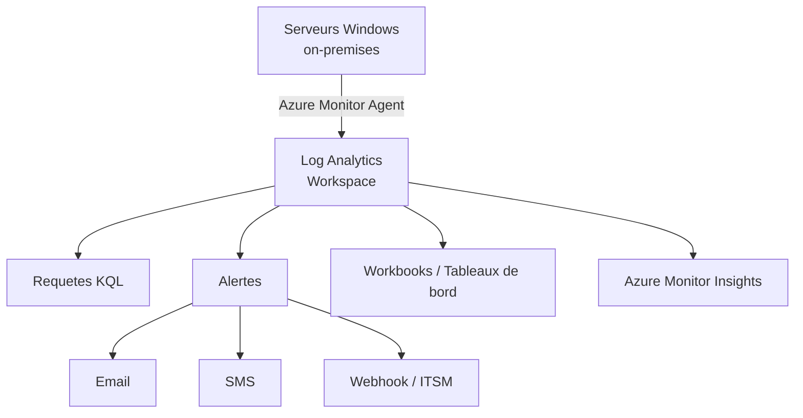

# Azure Monitor pour serveurs on-premises

<span class="level-intermediate">Intermediaire</span> · Temps estime : 30 minutes

## Presentation

Azure Monitor est la plateforme unifiee de surveillance de Microsoft. Elle collecte, analyse et reagit aux donnees de telemetrie provenant de serveurs (Azure, on-premises, multi-cloud). Pour les serveurs Windows on-premises, Azure Monitor utilise des agents pour envoyer les metriques et les logs vers un **workspace Log Analytics**.



## Agents de collecte

### Azure Monitor Agent (AMA) - Recommande

L'Azure Monitor Agent est l'agent unifie qui remplace les anciens agents (MMA/OMS et Dependency Agent).

| Caracteristique | Azure Monitor Agent |
|-----------------|-------------------|
| Deploiement | Via Azure Arc (on-premises) ou directement |
| Configuration | Data Collection Rules (DCR) centralisees |
| Multi-homing | Support natif de plusieurs workspaces |
| Performance | Optimise, faible impact |

### Agent Log Analytics (MMA) - Heritage

| Caracteristique | Log Analytics Agent (MMA) |
|-----------------|--------------------------|
| Statut | **En cours de deprecation** |
| Installation | Manuelle ou via GPO |
| Configuration | Sur l'agent ou via le portail |

!!! warning "Deprecation"

    L'agent Log Analytics (MMA/OMS) est en cours de deprecation.
    Migrez vers l'**Azure Monitor Agent** pour les nouveaux deploiements.

## Prerequis

| Element | Requis |
|---------|--------|
| Abonnement Azure | Actif |
| Log Analytics Workspace | Cree dans une region Azure |
| Azure Arc (pour AMA) | Serveurs inscrits dans Azure Arc |
| Connectivite | HTTPS (port 443) vers Azure |

## Creer un workspace Log Analytics

1. Portail Azure > **Log Analytics workspaces** > **Creer**
2. Configurer :
    - **Nom** : `law-winopslab`
    - **Region** : `West Europe`
    - **Resource Group** : `RG-Monitoring`
3. Configurer la retention (30 jours gratuits, extensible)

## Deployer l'Azure Monitor Agent

### Via Azure Arc (recommande)

Pour les serveurs deja inscrits dans Azure Arc :

1. Portail Azure > Serveur Arc > **Extensions**
2. Ajouter l'extension **Azure Monitor Windows Agent**
3. L'agent est installe et configure automatiquement

### Via le portail Azure

1. Log Analytics workspace > **Agents** > **Windows servers**
2. Telecharger l'agent Windows
3. Installer en specifiant le Workspace ID et la cle

```powershell
# Install Azure Monitor Agent via Azure CLI (for Arc-connected servers)
az connectedmachine extension create `
    --machine-name "SRV-DC01" `
    --resource-group "RG-Arc-Servers" `
    --name "AzureMonitorWindowsAgent" `
    --publisher "Microsoft.Azure.Monitor" `
    --type "AzureMonitorWindowsAgent" `
    --location "westeurope"
```

## Data Collection Rules (DCR)

Les DCR definissent quelles donnees collecter et ou les envoyer.

### Creer une DCR

1. Portail Azure > **Monitor** > **Data Collection Rules** > **Creer**
2. Configurer :
    - **Nom** : `dcr-windows-servers`
    - **Region** : `West Europe`
    - **Platform** : Windows
3. **Ressources** : selectionner les serveurs Arc
4. **Collecter et livrer** : definir les sources de donnees

### Sources de donnees courantes

| Source | Description |
|--------|-------------|
| **Windows Event Logs** | Journaux Security, System, Application |
| **Performance Counters** | CPU, memoire, disque, reseau |
| **IIS Logs** | Journaux d'acces IIS |
| **Custom Logs** | Fichiers de log personnalises |
| **Syslog** | Messages Syslog (via agent Linux) |

### Exemple de DCR pour Windows Server

```json
{
    "dataSources": {
        "windowsEventLogs": [
            {
                "name": "SecurityEvents",
                "streams": ["Microsoft-SecurityEvent"],
                "xPathQueries": [
                    "Security!*[System[(EventID=4624 or EventID=4625 or EventID=4720)]]",
                    "System!*[System[(Level=1 or Level=2 or Level=3)]]",
                    "Application!*[System[(Level=1 or Level=2)]]"
                ]
            }
        ],
        "performanceCounters": [
            {
                "name": "PerfCounters",
                "streams": ["Microsoft-Perf"],
                "samplingFrequencyInSeconds": 60,
                "counterSpecifiers": [
                    "\\Processor(_Total)\\% Processor Time",
                    "\\Memory\\Available MBytes",
                    "\\LogicalDisk(*)\\% Free Space",
                    "\\PhysicalDisk(_Total)\\Avg. Disk Queue Length"
                ]
            }
        ]
    },
    "destinations": {
        "logAnalytics": [
            {
                "workspaceResourceId": "/subscriptions/.../law-winopslab",
                "name": "law-winopslab"
            }
        ]
    }
}
```

## Requetes KQL (Kusto Query Language)

KQL est le langage de requete utilise dans Log Analytics pour interroger les donnees collectees.

### Requetes essentielles

```
// CPU usage over the last hour
Perf
| where ObjectName == "Processor" and CounterName == "% Processor Time"
| where InstanceName == "_Total"
| where TimeGenerated > ago(1h)
| summarize AvgCPU = avg(CounterValue) by Computer, bin(TimeGenerated, 5m)
| render timechart
```

```
// Failed logon attempts in the last 24 hours
SecurityEvent
| where EventID == 4625
| where TimeGenerated > ago(24h)
| summarize FailedAttempts = count() by TargetAccount, Computer, IpAddress
| sort by FailedAttempts desc
```

```
// Disk space alerts (less than 15% free)
Perf
| where ObjectName == "LogicalDisk" and CounterName == "% Free Space"
| where InstanceName != "_Total"
| where TimeGenerated > ago(1h)
| summarize AvgFreeSpace = avg(CounterValue) by Computer, InstanceName
| where AvgFreeSpace < 15
| sort by AvgFreeSpace asc
```

```
// Recent critical and error events
Event
| where EventLevelName in ("Error", "Critical")
| where TimeGenerated > ago(24h)
| summarize Count = count() by Computer, Source, EventID, EventLevelName
| sort by Count desc
| take 20
```

## Alertes

### Creer une alerte

1. Portail Azure > **Monitor** > **Alertes** > **Creer une regle d'alerte**
2. **Scope** : selectionner le workspace Log Analytics
3. **Condition** : definir la requete KQL et le seuil
4. **Actions** : configurer le groupe d'actions (email, SMS, webhook)
5. **Details** : nommer la regle et definir la severite

### Exemples d'alertes recommandees

| Alerte | Requete KQL simplifiee | Seuil |
|--------|----------------------|-------|
| CPU eleve | `Perf \| where CounterName == "% Processor Time"` | > 90% pendant 15 min |
| Memoire faible | `Perf \| where CounterName == "Available MBytes"` | < 500 Mo pendant 10 min |
| Espace disque critique | `Perf \| where CounterName == "% Free Space"` | < 10% |
| Echecs de connexion | `SecurityEvent \| where EventID == 4625` | > 10 en 5 min |
| Service arrete | `Event \| where EventID == 7036` | Service critique arrete |

### Groupes d'actions

| Type d'action | Description |
|---------------|-------------|
| **Email** | Notification par email |
| **SMS** | Notification par SMS |
| **Webhook** | Appel HTTP vers un service externe |
| **ITSM** | Integration avec ServiceNow, BMC, etc. |
| **Azure Function** | Declenchement d'une fonction Azure |
| **Logic App** | Declenchement d'un workflow Logic App |

## Workbooks et tableaux de bord

### Workbooks

Les Workbooks sont des rapports interactifs qui combinent des requetes KQL, des graphiques et du texte.

1. **Monitor** > **Workbooks** > **Nouveau**
2. Ajouter des elements : requete KQL, graphique, texte, parametre
3. Les workbooks predefinies couvrent les scenarios courants :
    - **VM Insights** : performances et dependances
    - **Windows Events** : analyse des journaux
    - **Network Insights** : metriques reseau

### Tableaux de bord Azure

Epingler des requetes et graphiques sur un tableau de bord Azure partage :

1. Executer une requete dans Log Analytics
2. Cliquer sur **Epingler au tableau de bord**
3. Choisir un tableau de bord existant ou en creer un nouveau

## Points cles a retenir

- Azure Monitor centralise la surveillance des serveurs on-premises dans le cloud Azure
- L'**Azure Monitor Agent** (AMA) via Azure Arc est l'approche recommandee pour les nouveaux deploiements
- Les **Data Collection Rules** (DCR) definissent precisement quelles donnees collecter
- **KQL** est le langage de requete pour interroger les donnees dans Log Analytics
- Les **alertes** declenchent des notifications automatiques lors de depassements de seuils
- Les **Workbooks** fournissent des tableaux de bord interactifs pour la visualisation
- La retention par defaut est de 30 jours (gratuit), extensible moyennant un cout supplementaire

## Pour aller plus loin

- [Azure Arc](azure-arc.md) pour inscrire les serveurs on-premises dans Azure
- [Azure Backup](azure-backup.md) pour la sauvegarde cloud
- [Analyseur de performances](../../supervision/surveillance/performance-monitor.md) pour la surveillance locale
