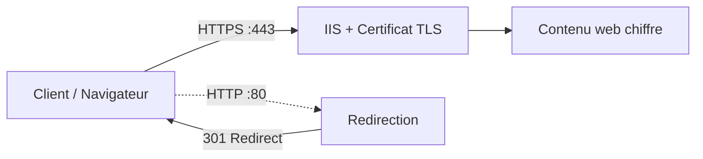

<!--
  Copyright 2026 Julien Bombled

  Licensed under the Apache License, Version 2.0 (the "License");
  you may not use this file except in compliance with the License.
  You may obtain a copy of the License at

      http://www.apache.org/licenses/LICENSE-2.0

  Unless required by applicable law or agreed to in writing, software
  distributed under the License is distributed on an "AS IS" BASIS,
  WITHOUT WARRANTIES OR CONDITIONS OF ANY KIND, either express or implied.
  See the License for the specific language governing permissions and
  limitations under the License.
-->

# Certificats SSL/TLS sur IIS

<span class="level-intermediate">Intermediaire</span> · Temps estime : 25 minutes

## Presentation

HTTPS chiffre les communications entre le navigateur et le serveur web via TLS (Transport Layer Security). Configurer SSL/TLS sur IIS implique d'obtenir un certificat, de le lier au site web et de rediriger le trafic HTTP vers HTTPS.



!!! example "Analogie"

    Le certificat TLS sur un site web, c'est comme le sceau officiel sur une lettre notariale : il prouve que la lettre vient bien du notaire (authentification), et l'enveloppe cachetee garantit que personne n'a pu lire le contenu en chemin (chiffrement). Un certificat auto-signe, c'est comme fabriquer soi-meme son propre sceau : il a la meme forme, mais personne ne le reconnait officiellement.

## Types de certificats

| Type | Delivre par | Usage |
|------|-------------|-------|
| **Auto-signe** | Le serveur lui-meme | Tests et labs uniquement |
| **CA d'entreprise (AD CS)** | Autorite de certification interne | Intranet, applications internes |
| **CA publique** | DigiCert, Let's Encrypt, etc. | Sites accessibles depuis Internet |

## Obtenir un certificat

### Certificat auto-signe (lab/test)

```powershell
# Create a self-signed certificate
$cert = New-SelfSignedCertificate `
    -DnsName "intranet.winopslab.local" `
    -CertStoreLocation "Cert:\LocalMachine\My" `
    -NotAfter (Get-Date).AddYears(2) `
    -KeyAlgorithm RSA `
    -KeyLength 2048 `
    -HashAlgorithm SHA256 `
    -FriendlyName "Intranet WinOpsLab - Self-Signed"

$cert.Thumbprint
```

!!! warning "Auto-signe"

    Les certificats auto-signes ne sont pas approuves par les navigateurs.
    Ils generent un avertissement de securite. Utilisez-les uniquement en lab.

### Certificat d'une CA d'entreprise (AD CS)

```powershell
# Request a certificate from the enterprise CA
$certRequest = Get-Certificate `
    -Template "WebServer" `
    -DnsName "intranet.winopslab.local", "www.intranet.winopslab.local" `
    -SubjectName "CN=intranet.winopslab.local" `
    -CertStoreLocation "Cert:\LocalMachine\My"

$certRequest.Certificate.Thumbprint
```

### Creer une demande CSR (pour CA publique)

```powershell
# Generate a CSR (Certificate Signing Request) via IIS Manager:
# 1. IIS Manager > Server level > "Server Certificates"
# 2. "Create Certificate Request" in the Actions pane
# 3. Fill in:
#    - Common Name: www.example.com
#    - Organization, OU, City, State, Country
# 4. Cryptographic: RSA, 2048 bits minimum
# 5. Save the CSR to a file

# Alternative: via certreq
$infContent = @"
[Version]
Signature="$Windows NT$"

[NewRequest]
Subject = "CN=intranet.winopslab.local, O=WinOpsLab, L=Paris, C=FR"
KeySpec = 1
KeyLength = 2048
HashAlgorithm = SHA256
Exportable = TRUE
MachineKeySet = TRUE
RequestType = PKCS10
ProviderName = "Microsoft RSA SChannel Cryptographic Provider"

[Extensions]
2.5.29.17 = "{text}"
_continue_ = "dns=intranet.winopslab.local&"
_continue_ = "dns=www.intranet.winopslab.local"
"@

$infContent | Out-File -FilePath "C:\Temp\cert-request.inf" -Encoding ASCII

# Generate the CSR
certreq -new "C:\Temp\cert-request.inf" "C:\Temp\cert-request.csr"

# After receiving the certificate from the CA, complete the request:
certreq -accept "C:\Temp\certificate.cer"
```

## Lier le certificat au site (HTTPS Binding)

### Via IIS Manager

1. Ouvrir `inetmgr`
2. Selectionner le site > **Liaisons** dans le volet Actions
3. Cliquer sur **Ajouter**
4. Type : **https**
5. Port : **443**
6. Nom d'hote : `intranet.winopslab.local`
7. Cocher **Exiger l'indication du nom du serveur (SNI)**
8. Selectionner le certificat SSL dans la liste
9. Cliquer sur **OK**

### Via PowerShell

```powershell
# Get the certificate thumbprint
$thumbprint = (Get-ChildItem Cert:\LocalMachine\My |
    Where-Object { $_.Subject -like "*intranet.winopslab.local*" }).Thumbprint

# Add HTTPS binding with SNI
New-WebBinding -Name "intranet" -Protocol "https" -Port 443 `
    -HostHeader "intranet.winopslab.local" -SslFlags 1

# Bind the certificate to the HTTPS binding
$binding = Get-WebBinding -Name "intranet" -Protocol "https"
$binding.AddSslCertificate($thumbprint, "My")

# Verify the binding
Get-WebBinding -Name "intranet" | Select-Object protocol, bindingInformation
```

Resultat :

```text
# Get-WebBinding -Name "intranet"
protocol  bindingInformation
--------  ------------------
http      *:80:intranet.winopslab.local
https     *:443:intranet.winopslab.local
```

## Forcer la redirection HTTP vers HTTPS

### Methode 1 : URL Rewrite Module

Le module URL Rewrite doit etre installe separement depuis le site Microsoft.

```xml
<!-- web.config - HTTP to HTTPS redirect via URL Rewrite -->
<configuration>
    <system.webServer>
        <rewrite>
            <rules>
                <rule name="HTTP to HTTPS" stopProcessing="true">
                    <match url="(.*)" />
                    <conditions>
                        <add input="{HTTPS}" pattern="off" ignoreCase="true" />
                    </conditions>
                    <action type="Redirect" url="https://{HTTP_HOST}/{R:1}"
                            redirectType="Permanent" />
                </rule>
            </rules>
        </rewrite>
    </system.webServer>
</configuration>
```

### Methode 2 : HTTP Redirect natif IIS

```powershell
# Enable HTTP Redirect feature
Install-WindowsFeature Web-Http-Redirect

# Configure redirect via IIS Manager:
# 1. Select the HTTP binding site
# 2. "HTTP Redirect" feature
# 3. Check "Redirect requests to this destination"
# 4. Enter: https://intranet.winopslab.local
# 5. Check "Redirect all requests to exact destination"
# 6. Status code: 301 (Permanent)
```

### Methode 3 : HSTS (HTTP Strict Transport Security)

HSTS indique aux navigateurs de toujours utiliser HTTPS pour ce site.

```powershell
# Enable HSTS on IIS 10.0 (Windows Server 2022 native support)
$siteName = "intranet"

# Configure HSTS settings
Set-WebConfigurationProperty -PSPath "IIS:\Sites\$siteName" `
    -Filter "system.webServer/httpProtocol/customHeaders" `
    -Name "." -Value @{
        name  = "Strict-Transport-Security"
        value = "max-age=31536000; includeSubDomains"
    }

# IIS 10.0 native HSTS (preferred method)
# Via IIS Manager > Site > HSTS Settings
# Or via PowerShell:
Set-IISHstsSetting -Location $siteName -MaxAge 31536000 -IncludeSubDomains -Preload
```

## Configurer les protocoles TLS

### Desactiver les anciens protocoles

```powershell
# Disable TLS 1.0
New-Item -Path "HKLM:\SYSTEM\CurrentControlSet\Control\SecurityProviders\SCHANNEL\Protocols\TLS 1.0\Server" -Force
New-ItemProperty -Path "HKLM:\SYSTEM\CurrentControlSet\Control\SecurityProviders\SCHANNEL\Protocols\TLS 1.0\Server" `
    -Name "Enabled" -Value 0 -PropertyType DWord
New-ItemProperty -Path "HKLM:\SYSTEM\CurrentControlSet\Control\SecurityProviders\SCHANNEL\Protocols\TLS 1.0\Server" `
    -Name "DisabledByDefault" -Value 1 -PropertyType DWord

# Disable TLS 1.1
New-Item -Path "HKLM:\SYSTEM\CurrentControlSet\Control\SecurityProviders\SCHANNEL\Protocols\TLS 1.1\Server" -Force
New-ItemProperty -Path "HKLM:\SYSTEM\CurrentControlSet\Control\SecurityProviders\SCHANNEL\Protocols\TLS 1.1\Server" `
    -Name "Enabled" -Value 0 -PropertyType DWord
New-ItemProperty -Path "HKLM:\SYSTEM\CurrentControlSet\Control\SecurityProviders\SCHANNEL\Protocols\TLS 1.1\Server" `
    -Name "DisabledByDefault" -Value 1 -PropertyType DWord

# TLS 1.2 and TLS 1.3 remain enabled (default on Server 2022)
```

!!! danger "Production"

    En production, desactivez TLS 1.0 et TLS 1.1. Seuls TLS 1.2 et TLS 1.3
    doivent etre actifs. Windows Server 2022 supporte nativement TLS 1.3.

### Verifier la configuration TLS

```powershell
# Check enabled protocols
Get-ItemProperty -Path "HKLM:\SYSTEM\CurrentControlSet\Control\SecurityProviders\SCHANNEL\Protocols\*\Server" `
    -ErrorAction SilentlyContinue | Select-Object PSPath, Enabled

# Test TLS from PowerShell
[Net.ServicePointManager]::SecurityProtocol
```

## Verification et depannage

```powershell
# Verify certificate binding
netsh http show sslcert

# Check certificate expiration
Get-ChildItem Cert:\LocalMachine\My | Where-Object { $_.HasPrivateKey } |
    Select-Object Subject, NotAfter, Thumbprint,
    @{N='DaysRemaining';E={($_.NotAfter - (Get-Date)).Days}} |
    Sort-Object NotAfter

# Test HTTPS connectivity
Test-NetConnection -ComputerName intranet.winopslab.local -Port 443

# Check IIS site bindings
Get-WebBinding | Select-Object protocol, bindingInformation, sslFlags
```

Resultat :

```text
# Get-ChildItem Cert:\LocalMachine\My (extrait)
Subject                             NotAfter             DaysRemaining Thumbprint
-------                             --------             ------------- ----------
CN=intranet.winopslab.local         2027-02-20 10:22:14  365           A3F2B891C4D5E6F70812345678901234ABCDEF01
CN=api.winopslab.local              2027-01-15 09:11:02  329           B4E3C902D5E6F81923456789012345BCDEF012
CN=wac.winopslab.local              2026-04-01 14:00:00  40            C5D4EA13E6F7A92034567890123456CDEF0123

# Test-NetConnection intranet.winopslab.local -Port 443
ComputerName     : intranet.winopslab.local
RemoteAddress    : 10.0.0.20
RemotePort       : 443
TcpTestSucceeded : True
```

!!! example "Scenario pratique"

    **Context :** Karim, administrateur systeme, doit securiser en HTTPS le site intranet de SRV-WEB01 (`intranet.lab.local`). L'entreprise dispose d'une CA interne Active Directory Certificate Services. Le site est actuellement accessible uniquement en HTTP.

    **Etape 1 : Demander un certificat a la CA d'entreprise**

    ```powershell
    $certRequest = Get-Certificate `
        -Template "WebServer" `
        -DnsName "intranet.lab.local" `
        -SubjectName "CN=intranet.lab.local" `
        -CertStoreLocation "Cert:\LocalMachine\My"

    $thumbprint = $certRequest.Certificate.Thumbprint
    Write-Output "Thumbprint: $thumbprint"
    ```

    **Etape 2 : Ajouter le binding HTTPS avec SNI**

    ```powershell
    Import-Module WebAdministration
    New-WebBinding -Name "intranet" -Protocol "https" -Port 443 `
        -HostHeader "intranet.lab.local" -SslFlags 1

    $binding = Get-WebBinding -Name "intranet" -Protocol "https"
    $binding.AddSslCertificate($thumbprint, "My")
    ```

    **Etape 3 : Configurer la redirection HTTP vers HTTPS**

    Karim installe le module URL Rewrite et ajoute dans `D:\WebSites\intranet\web.config` la regle de redirection permanente (301) de HTTP vers HTTPS.

    **Etape 4 : Activer HSTS**

    ```powershell
    Set-IISHstsSetting -Location "intranet" -MaxAge 31536000 -IncludeSubDomains
    ```

    **Etape 5 : Verifier depuis un poste client**

    Karim ouvre `http://intranet.lab.local` dans Edge : il est automatiquement redirige vers `https://intranet.lab.local` sans avertissement de securite (le certificat est emis par la CA interne, approuvee par tous les postes du domaine).

    **Etape 6 : Surveiller l'expiration**

    ```powershell
    Get-ChildItem Cert:\LocalMachine\My | Where-Object { $_.HasPrivateKey } |
        Select-Object Subject, NotAfter,
        @{N='DaysRemaining';E={($_.NotAfter - (Get-Date)).Days}} |
        Where-Object { $_.DaysRemaining -lt 60 }
    ```

    Karim planifie cette commande en tache planifiee hebdomadaire avec envoi par email si un certificat expire dans moins de 60 jours.

!!! danger "Erreurs courantes"

    **Utiliser un certificat auto-signe en production.** Les navigateurs modernes bloquent les certificats auto-signes (ou affichent un avertissement intrusif). Les utilisateurs apprennent a ignorer les alertes de securite, ce qui les rend vulnerables aux vraies attaques. En entreprise, toujours utiliser la CA interne pour l'intranet.

    **Oublier de surveiller l'expiration des certificats.** Un certificat expire rend le site HTTPS inaccessible (erreur de connexion dans tous les navigateurs). Mettre en place une surveillance proactive (script PowerShell, monitoring) et agir avant J-30.

    **Associer le certificat sans SNI sur une IP partagee.** Sans SNI (`-SslFlags 0`), IIS ne peut associer qu'un seul certificat SSL par combinaison IP:port. Tous les sites HTTPS sur la meme IP recevront le meme certificat, ce qui provoque des erreurs de nom pour les autres sites. Toujours utiliser `-SslFlags 1` (SNI).

    **Ne pas desactiver TLS 1.0 et TLS 1.1.** Ces protocoles ont des vulnerabilites connues (POODLE, BEAST). Windows Server 2022 les desactive par defaut, mais des configurations heritees peuvent les reactiver. Verifier avec `Get-ItemProperty HKLM:\SYSTEM\CurrentControlSet\Control\SecurityProviders\SCHANNEL\Protocols\*`.

    **Confondre certificat "exporte" et cle privee.** Exporter un certificat sans sa cle privee (format `.cer`) ne permet pas de le lier a un binding IIS. Pour migrer un certificat vers un autre serveur, toujours exporter en format `.pfx` qui inclut la cle privee.

## Points cles a retenir

- Utilisez des certificats d'une CA d'entreprise (AD CS) pour l'intranet et d'une CA publique pour les sites Internet
- **SNI** est indispensable pour heberger plusieurs sites HTTPS sur une meme adresse IP
- Configurez toujours une **redirection HTTP vers HTTPS** (URL Rewrite ou HSTS)
- **HSTS** empeche les navigateurs de revenir au HTTP apres la premiere visite HTTPS
- Desactivez TLS 1.0 et TLS 1.1 en production ; Windows Server 2022 supporte TLS 1.3 nativement
- Surveillez les dates d'expiration des certificats pour eviter les interruptions de service

## Pour aller plus loin

- [Installation d'IIS](installation-iis.md) pour la mise en place du role
- [Sites et applications](sites-et-applications.md) pour la configuration des sites
- [Concepts PKI](../../securite/pki/concepts-pki.md) pour comprendre l'infrastructure de certificats

