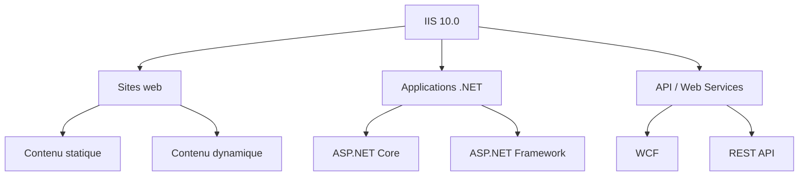
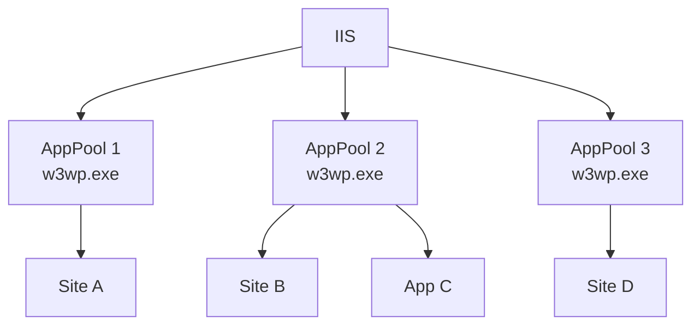

<!--
  Copyright 2026 Julien Bombled

  Licensed under the Apache License, Version 2.0 (the "License");
  you may not use this file except in compliance with the License.
  You may obtain a copy of the License at

      http://www.apache.org/licenses/LICENSE-2.0

  Unless required by applicable law or agreed to in writing, software
  distributed under the License is distributed on an "AS IS" BASIS,
  WITHOUT WARRANTIES OR CONDITIONS OF ANY KIND, either express or implied.
  See the License for the specific language governing permissions and
  limitations under the License.
-->
---
title: "Installation d'IIS"
description: Installer et configurer Internet Information Services sur Windows Server 2022 - selection des roles, site par defaut et pools d'applications.
tags:
  - gestion-moderne
  - iis
  - intermediaire
---

# Installation d'IIS

<span class="level-intermediate">Intermediaire</span> · Temps estime : 25 minutes

## Presentation

Internet Information Services (IIS) est le serveur web integre a Windows Server. IIS 10.0 sur Windows Server 2022 prend en charge HTTP/2, TLS 1.3 et offre des performances ameliorees pour l'hebergement de sites web, d'applications .NET et de services web.



!!! example "Analogie"

    IIS, c'est comme un bibliothecaire specialise : quand un visiteur arrive et demande un livre (une page web), le bibliothecaire sait exactement dans quelle salle aller chercher ce livre (quel dossier sur le disque), le format dans lequel le presenter, et qui a le droit de le consulter. Le pool d'applications, c'est comme avoir un bibliothecaire distinct par salle, pour que la desorganisation d'une salle n'affecte pas les autres.

## Installation du role

### Via Server Manager

1. Ouvrir **Server Manager** > **Gerer** > **Ajouter des roles et fonctionnalites**
2. Selectionner le role **Serveur Web (IIS)**
3. Accepter l'ajout des fonctionnalites requises (outils de gestion)
4. Selectionner les services de role necessaires
5. Confirmer et installer

### Via PowerShell

```powershell
# Install IIS with default features
Install-WindowsFeature -Name Web-Server -IncludeManagementTools

# Install IIS with common features for web hosting
Install-WindowsFeature -Name Web-Server,
    Web-Common-Http,
    Web-Default-Doc,
    Web-Dir-Browsing,
    Web-Http-Errors,
    Web-Static-Content,
    Web-Http-Redirect,
    Web-Health,
    Web-Http-Logging,
    Web-Custom-Logging,
    Web-Log-Libraries,
    Web-Request-Monitor,
    Web-Performance,
    Web-Stat-Compression,
    Web-Dyn-Compression,
    Web-Security,
    Web-Filtering,
    Web-Basic-Auth,
    Web-Windows-Auth,
    Web-Mgmt-Tools,
    Web-Mgmt-Console -IncludeManagementTools

# Install ASP.NET support
Install-WindowsFeature -Name Web-Asp-Net45, Web-Net-Ext45

# Install ASP.NET Core hosting bundle separately (download from Microsoft)
# https://dotnet.microsoft.com/download/dotnet

# Verify installation
Get-WindowsFeature -Name Web-* | Where-Object Installed
```

## Services de role disponibles

### Services HTTP communs

| Service | Description | Recommandation |
|---------|-------------|----------------|
| **Default Document** | Page par defaut (index.html, default.aspx) | :material-check: Installer |
| **Directory Browsing** | Navigation dans les repertoires | :material-close: Desactiver en production |
| **HTTP Errors** | Pages d'erreur personnalisees | :material-check: Installer |
| **Static Content** | Fichiers statiques (HTML, CSS, JS, images) | :material-check: Installer |
| **HTTP Redirection** | Redirections HTTP | :material-check: Installer |

### Sante et diagnostic

| Service | Description |
|---------|-------------|
| **HTTP Logging** | Journalisation des requetes HTTP |
| **Custom Logging** | Format de journalisation personnalise |
| **Logging Tools** | Outils d'analyse des logs |
| **Request Monitor** | Surveillance des requetes en temps reel |
| **Tracing** | Trace detaillee des requetes echouees |

### Performance

| Service | Description |
|---------|-------------|
| **Static Content Compression** | Compression gzip/deflate du contenu statique |
| **Dynamic Content Compression** | Compression du contenu dynamique |

### Securite

| Service | Description |
|---------|-------------|
| **Request Filtering** | Filtrage des requetes (extensions, taille, methodes) |
| **Basic Authentication** | Authentification basique (nom d'utilisateur / mot de passe) |
| **Windows Authentication** | Authentification integree Windows (Kerberos/NTLM) |
| **Client Certificate Mapping** | Authentification par certificat client |
| **IP and Domain Restrictions** | Restriction d'acces par adresse IP |

## Le site web par defaut

Apres l'installation, IIS cree automatiquement un site par defaut :

| Propriete | Valeur |
|-----------|--------|
| **Nom** | Default Web Site |
| **Repertoire physique** | `C:\inetpub\wwwroot` |
| **Binding** | `*:80` (HTTP, toutes interfaces, port 80) |
| **Pool d'applications** | DefaultAppPool |
| **Document par defaut** | iisstart.htm |

```powershell
# Verify the default site
Import-Module WebAdministration
Get-Website -Name "Default Web Site"

# Check if IIS is responding
Test-NetConnection -ComputerName localhost -Port 80
```

Resultat :

```text
# Get-Website -Name "Default Web Site"
Name             ID   State      Physical Path                  Bindings
----             --   -----      -------------                  --------
Default Web Site 1    Started    C:\inetpub\wwwroot             http *:80:

# Test-NetConnection
ComputerName     : localhost
RemoteAddress    : 127.0.0.1
RemotePort       : 80
TcpTestSucceeded : True
```

### Tester l'installation

1. Ouvrir un navigateur sur le serveur
2. Naviguer vers `http://localhost`
3. La page d'accueil IIS par defaut doit s'afficher

## Pools d'applications (Application Pools)

Un pool d'applications isole les applications web les unes des autres. Chaque pool execute un processus worker (`w3wp.exe`) distinct.

### Concepts



| Propriete | Description |
|-----------|-------------|
| **Identite** | Compte sous lequel le pool s'execute |
| **Pipeline mode** | Integrated (recommande) ou Classic |
| **Version .NET CLR** | v4.0 ou No Managed Code |
| **Recyclage** | Redemarrage periodique du processus worker |

### Creer un pool d'applications

```powershell
# Create a new application pool
New-WebAppPool -Name "MonSitePool"

# Configure the pool
Set-ItemProperty "IIS:\AppPools\MonSitePool" -Name "managedRuntimeVersion" -Value "v4.0"
Set-ItemProperty "IIS:\AppPools\MonSitePool" -Name "managedPipelineMode" -Value "Integrated"

# Set the pool identity to a specific account (optional)
Set-ItemProperty "IIS:\AppPools\MonSitePool" -Name "processModel.identityType" -Value "SpecificUser"
Set-ItemProperty "IIS:\AppPools\MonSitePool" -Name "processModel.userName" -Value "WINOPSLAB\svc_iis"
Set-ItemProperty "IIS:\AppPools\MonSitePool" -Name "processModel.password" -Value "P@ssw0rd!"

# For ASP.NET Core, use "No Managed Code"
Set-ItemProperty "IIS:\AppPools\MonSitePool" -Name "managedRuntimeVersion" -Value ""
```

### Identites de pool predefinies

| Identite | Description | Usage |
|----------|-------------|-------|
| **ApplicationPoolIdentity** | Compte virtuel unique par pool (defaut) | Recommande |
| **NetworkService** | Compte reseau | Acces reseau necessaire |
| **LocalService** | Compte avec privileges limites | Securite renforcee |
| **LocalSystem** | Privileges eleves | :material-close: A eviter |
| **Compte specifique** | Compte de domaine | Acces a des ressources specifiques |

!!! tip "Bonne pratique"

    Utilisez **ApplicationPoolIdentity** (defaut) sauf si l'application necessite
    un acces specifique a des ressources reseau ou des bases de donnees. Chaque pool
    obtient une identite virtuelle unique (`IIS AppPool\NomDuPool`).

Resultat apres creation du pool :

```text
# Get-WebAppPool -Name "MonSitePool"
Name         State   ManagedRuntimeVersion ManagedPipelineMode
----         -----   --------------------- -------------------
MonSitePool  Started v4.0                  Integrated
```

### Configuration du recyclage

```powershell
# Configure recycling: restart every 29 hours (avoid fixed midnight restarts)
Set-ItemProperty "IIS:\AppPools\MonSitePool" -Name "recycling.periodicRestart.time" -Value "1.05:00:00"

# Disable regular time-based recycling (for long-running apps)
Set-ItemProperty "IIS:\AppPools\MonSitePool" -Name "recycling.periodicRestart.time" -Value "00:00:00"

# Configure memory-based recycling (restart if memory exceeds 1 GB)
Set-ItemProperty "IIS:\AppPools\MonSitePool" -Name "recycling.periodicRestart.privateMemory" -Value 1048576
```

## Console de gestion IIS

La console de gestion IIS Manager (`inetmgr`) est l'interface graphique principale :

```powershell
# Launch IIS Manager
inetmgr
```

### Structure de la console

| Volet | Contenu |
|-------|---------|
| **Connexions (gauche)** | Arborescence : serveur > sites > applications |
| **Fonctionnalites (centre)** | Parametres de l'element selectionne |
| **Actions (droite)** | Actions contextuelles (demarrer, arreter, ajouter) |

!!! example "Scenario pratique"

    **Context :** Celine, administratrice systeme, doit deployer IIS sur SRV-WEB01 pour heberger une application intranet ASP.NET Core. Elle part d'un Windows Server 2022 en Core installation (sans GUI).

    **Etape 1 : Installer IIS via PowerShell (a distance)**

    ```powershell
    Invoke-Command -ComputerName SRV-WEB01 -ScriptBlock {
        Install-WindowsFeature -Name Web-Server,
            Web-Common-Http, Web-Static-Content, Web-Default-Doc,
            Web-Http-Errors, Web-Http-Logging, Web-Request-Monitor,
            Web-Stat-Compression, Web-Dyn-Compression,
            Web-Security, Web-Filtering, Web-Windows-Auth,
            Web-Mgmt-Tools, Web-Mgmt-Console `
            -IncludeManagementTools
    }
    ```

    **Etape 2 : Verifier l'installation**

    ```powershell
    Invoke-Command -ComputerName SRV-WEB01 -ScriptBlock {
        Get-WindowsFeature -Name Web-* | Where-Object Installed |
            Select-Object Name, DisplayName
    }
    ```

    **Etape 3 : Creer un pool d'applications dedie pour ASP.NET Core**

    ASP.NET Core utilise le modele "No Managed Code" (le runtime est gere par le processus de l'application, pas par IIS) :

    ```powershell
    Invoke-Command -ComputerName SRV-WEB01 -ScriptBlock {
        Import-Module WebAdministration
        New-WebAppPool -Name "IntranetCorePool"
        Set-ItemProperty "IIS:\AppPools\IntranetCorePool" `
            -Name "managedRuntimeVersion" -Value ""
    }
    ```

    **Etape 4 : Tester l'accessibilite**

    ```powershell
    Test-NetConnection -ComputerName SRV-WEB01 -Port 80
    ```

    IIS repond. Celine deploiera ensuite le package ASP.NET Core et creera un site dedie.

!!! danger "Erreurs courantes"

    **Laisser le Directory Browsing active en production.** Avec le Directory Browsing actif, un visiteur qui accede a un repertoire sans document par defaut voit la liste complete des fichiers. Cela peut exposer des fichiers de configuration, des logs ou des donnees sensibles. Desactiver systematiquement en production.

    **Utiliser l'identite LocalSystem pour les pools d'applications.** LocalSystem a des privileges complets sur la machine. Une faille dans l'application web permet alors a un attaquant de prendre le controle total du serveur. Toujours utiliser ApplicationPoolIdentity ou un compte de domaine avec le minimum de droits.

    **Ne pas installer le ASP.NET Core Hosting Bundle pour les applications Core.** IIS seul ne sait pas executer les applications ASP.NET Core. Sans le Hosting Bundle (composant supplementaire a telecharger depuis Microsoft), le site renvoie une erreur 500.19 ou 502.5. Installer le bundle avant de deployer l'application.

    **Oublier de recycler ou redemarrer le pool apres modification de la configuration.** Certains changements IIS (identite du pool, version .NET) ne prennent effet qu'apres recyclage du pool. Si l'application ne se comporte pas comme attendu apres une modification, recycler le pool avant de chercher plus loin.

    **Placer les fichiers du site dans C:\inetpub\wwwroot sans changer les permissions.** Le dossier wwwroot par defaut a des permissions larges. Pour des applications en production, creer un dossier dedie (ex. `D:\WebSites\monsite`) avec des permissions restreintes au compte du pool d'applications uniquement.

## Points cles a retenir

- IIS 10.0 sur Windows Server 2022 supporte HTTP/2 et TLS 1.3
- L'installation via `Install-WindowsFeature` avec `-IncludeManagementTools` inclut la console IIS Manager
- Chaque site doit idealement avoir son propre **pool d'applications** pour l'isolation
- L'identite par defaut **ApplicationPoolIdentity** est le choix le plus securise
- Le recyclage periodique des pools evite les fuites memoire dans les applications
- Desactiver le **Directory Browsing** en production pour ne pas exposer la structure des fichiers

## Pour aller plus loin

- [Sites et applications](sites-et-applications.md) pour creer et configurer des sites
- [Certificats SSL/TLS](certificats-ssl.md) pour securiser les sites avec HTTPS

