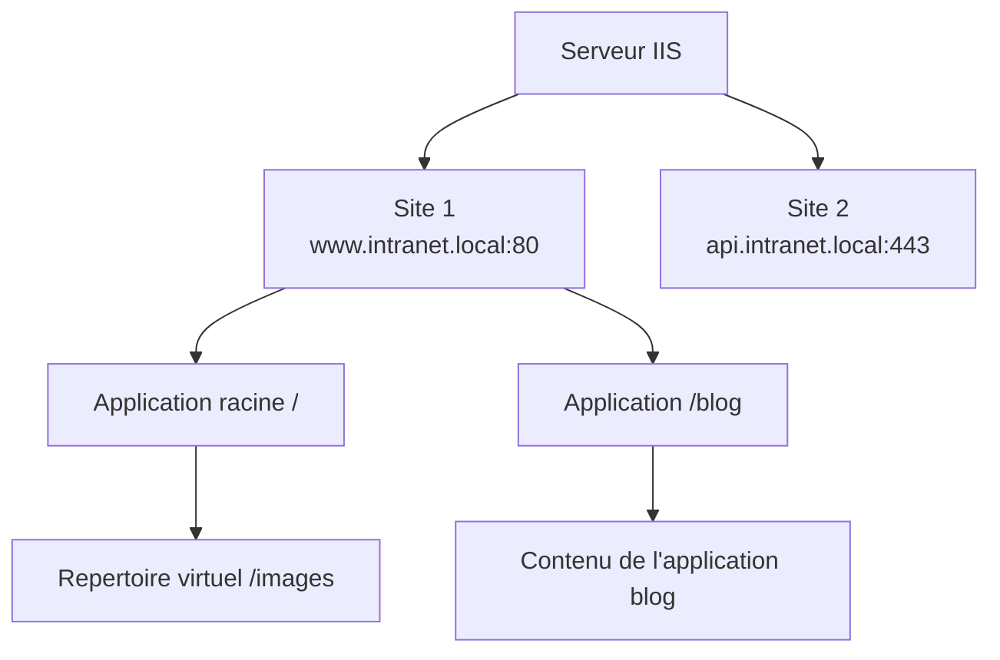
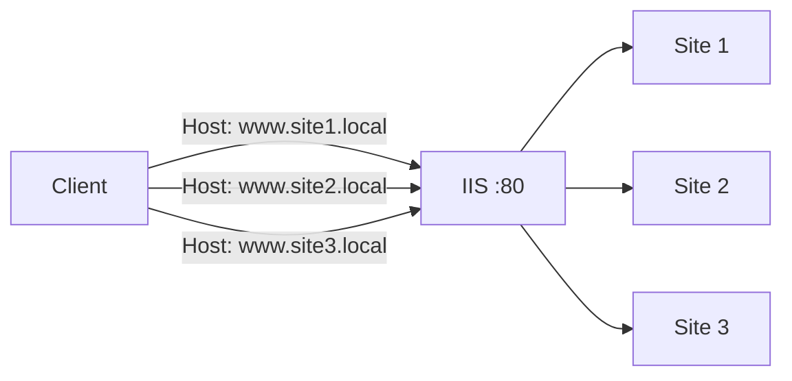

# Sites et applications IIS

<span class="level-intermediate">Intermediaire</span> · Temps estime : 25 minutes

## Presentation

IIS organise le contenu web en une hierarchie de **sites**, **applications** et **repertoires virtuels**. Chaque site est identifie par un ou plusieurs **bindings** (combinaison protocole + IP + port + nom d'hote).



!!! example "Analogie"

    Un serveur IIS, c'est comme un immeuble de bureaux. Chaque site est un locataire avec sa propre porte d'entree (binding : IP + port + nom d'hote). Les applications sont les differents departements au sein d'un meme locataire, chacun avec sa propre organisation. Les repertoires virtuels sont des panneaux directionnels qui indiquent "les archives sont dans le sous-sol voisin" sans que les visiteurs sachent qu'ils changent de batiment.

## Concepts fondamentaux

| Concept | Description |
|---------|-------------|
| **Site** | Point d'entree web avec un ou plusieurs bindings |
| **Application** | Sous-ensemble d'un site avec son propre pool d'applications |
| **Repertoire virtuel** | Alias pointant vers un dossier physique |
| **Binding** | Association protocole + IP + port + nom d'hote |
| **Pool d'applications** | Processus worker isolant l'execution |

## Creer un site web

### Via IIS Manager

1. Ouvrir `inetmgr`
2. Clic droit sur **Sites** > **Ajouter un site Web**
3. Configurer :
    - **Nom du site** : `intranet`
    - **Pool d'applications** : selectionner ou creer un pool
    - **Chemin d'acces physique** : `D:\WebSites\intranet`
    - **Binding** : type HTTP, port 80, nom d'hote `intranet.winopslab.local`
4. Cliquer sur **OK**

### Via PowerShell

```powershell
# Import the WebAdministration module
Import-Module WebAdministration

# Create the physical directory
New-Item -Path "D:\WebSites\intranet" -ItemType Directory -Force

# Create a dedicated application pool
New-WebAppPool -Name "IntranetPool"
Set-ItemProperty "IIS:\AppPools\IntranetPool" -Name "managedRuntimeVersion" -Value "v4.0"

# Create the website
New-Website -Name "intranet" `
    -PhysicalPath "D:\WebSites\intranet" `
    -ApplicationPool "IntranetPool" `
    -HostHeader "intranet.winopslab.local" `
    -Port 80 `
    -IPAddress "*"

# Create a simple test page
Set-Content -Path "D:\WebSites\intranet\index.html" `
    -Value "<html><body><h1>Intranet WinOpsLab</h1></body></html>"
```

## Bindings (liaisons)

Les bindings determinent comment les requetes sont dirigees vers un site. Un site peut avoir plusieurs bindings.

### Types de bindings

| Protocole | Port par defaut | Usage |
|-----------|----------------|-------|
| **HTTP** | 80 | Trafic non chiffre |
| **HTTPS** | 443 | Trafic chiffre (necessite un certificat) |
| **net.tcp** | Variable | WCF services |
| **net.pipe** | - | Communication locale WCF |

### Host Headers (en-tetes d'hote)

Les host headers permettent d'heberger **plusieurs sites sur la meme adresse IP et le meme port** :



```powershell
# Add a binding with a host header
New-WebBinding -Name "intranet" -Protocol "http" -Port 80 `
    -HostHeader "intranet.winopslab.local" -IPAddress "*"

# Add an HTTPS binding (requires a certificate)
New-WebBinding -Name "intranet" -Protocol "https" -Port 443 `
    -HostHeader "intranet.winopslab.local" -IPAddress "*" `
    -SslFlags 1  # SNI (Server Name Indication)

# List all bindings for a site
Get-WebBinding -Name "intranet"

# Remove a binding
Remove-WebBinding -Name "intranet" -Protocol "http" -Port 8080
```

### SNI (Server Name Indication)

SNI permet d'utiliser des certificats SSL differents pour chaque site sur la meme adresse IP (port 443). Sans SNI, un seul certificat SSL peut etre associe a une combinaison IP:port.

!!! tip "Recommandation"

    Activez toujours **SNI** pour les bindings HTTPS afin de pouvoir heberger
    plusieurs sites SSL sur une meme adresse IP.

## Repertoires virtuels

Un repertoire virtuel est un alias qui pointe vers un dossier physique situe en dehors de la racine du site.

```powershell
# Create a virtual directory
New-WebVirtualDirectory -Site "intranet" -Name "docs" `
    -PhysicalPath "D:\SharedDocs"

# The virtual directory is accessible at:
# http://intranet.winopslab.local/docs

# List virtual directories
Get-WebVirtualDirectory -Site "intranet"

# Remove a virtual directory
Remove-WebVirtualDirectory -Site "intranet" -Name "docs"
```

## Applications web

Une application est un repertoire virtuel promu en application, avec son propre pool d'applications et sa propre configuration.

```powershell
# Create an application within a site
New-WebApplication -Site "intranet" -Name "api" `
    -PhysicalPath "D:\WebSites\intranet\api" `
    -ApplicationPool "IntranetPool"

# The application is accessible at:
# http://intranet.winopslab.local/api

# Create with a dedicated pool for isolation
New-WebAppPool -Name "ApiPool"
New-WebApplication -Site "intranet" -Name "api" `
    -PhysicalPath "D:\WebSites\intranet\api" `
    -ApplicationPool "ApiPool"

# List applications
Get-WebApplication -Site "intranet"
```

## Documents par defaut

Les documents par defaut sont les fichiers servis automatiquement quand l'URL ne specifie pas de fichier.

```powershell
# View current default documents
Get-WebConfigurationProperty -Filter "//defaultDocument/files" `
    -PSPath "IIS:\Sites\intranet" -Name "Collection" |
    Select-Object value

# Add a default document
Add-WebConfigurationProperty -Filter "//defaultDocument/files" `
    -PSPath "IIS:\Sites\intranet" -Name "." `
    -Value @{value="home.html"}
```

Ordre de recherche par defaut :

1. `Default.htm`
2. `Default.asp`
3. `index.htm`
4. `index.html`
5. `iisstart.htm`
6. `default.aspx`

## Gestion des sites

```powershell
# Start a site
Start-Website -Name "intranet"

# Stop a site
Stop-Website -Name "intranet"

# Restart a site (stop then start)
Stop-Website -Name "intranet"
Start-Website -Name "intranet"

# List all sites with their status
Get-Website | Select-Object Name, ID, State,
    @{N='Bindings';E={$_.Bindings.Collection | ForEach-Object { $_.bindingInformation }}}

# Remove a site
Remove-Website -Name "intranet"
```

Resultat :

```text
# Get-Website
Name             ID   State   Bindings
----             --   -----   --------
Default Web Site 1    Stopped *:80:
intranet         2    Started *:80:intranet.lab.local
api              3    Started *:443:api.lab.local
```

## Configuration du fichier web.config

Chaque site peut avoir un fichier `web.config` qui surcharge la configuration IIS pour ce site.

```xml
<?xml version="1.0" encoding="UTF-8"?>
<!-- D:\WebSites\intranet\web.config -->
<configuration>
    <system.webServer>
        <!-- Custom error pages -->
        <httpErrors errorMode="Custom" existingResponse="Replace">
            <remove statusCode="404" />
            <error statusCode="404" path="/errors/404.html" responseMode="ExecuteURL" />
        </httpErrors>

        <!-- Enable static compression -->
        <urlCompression doStaticCompression="true" doDynamicCompression="true" />

        <!-- Security headers -->
        <httpProtocol>
            <customHeaders>
                <add name="X-Content-Type-Options" value="nosniff" />
                <add name="X-Frame-Options" value="SAMEORIGIN" />
                <add name="X-XSS-Protection" value="1; mode=block" />
            </customHeaders>
        </httpProtocol>
    </system.webServer>
</configuration>
```

## Journalisation IIS

```powershell
# Configure logging for a site
Set-ItemProperty "IIS:\Sites\intranet" -Name "logFile.directory" -Value "D:\Logs\IIS"
Set-ItemProperty "IIS:\Sites\intranet" -Name "logFile.period" -Value "Daily"
Set-ItemProperty "IIS:\Sites\intranet" -Name "logFile.logExtFileFlags" -Value `
    "Date,Time,ClientIP,UserName,SiteName,ComputerName,ServerIP,Method,UriStem,UriQuery,HttpStatus,Win32Status,BytesSent,BytesRecv,TimeTaken,ServerPort,UserAgent,Referer,HttpSubStatus"

# View recent logs
Get-ChildItem "D:\Logs\IIS\W3SVC*" | Sort-Object LastWriteTime -Descending | Select-Object -First 5
```

Resultat :

```text
# Get-ChildItem "D:\Logs\IIS\W3SVC*"
Mode   LastWriteTime          Length Name
----   -------------          ------ ----
-a---- 2026-02-20 23:59:58   1847392 u_ex260220.log
-a---- 2026-02-19 23:59:58   1923104 u_ex260219.log
-a---- 2026-02-18 23:59:58   1765840 u_ex260218.log
-a---- 2026-02-17 23:59:58   1654912 u_ex260217.log
-a---- 2026-02-16 23:59:58   1712048 u_ex260216.log
```

!!! example "Scenario pratique"

    **Context :** Antoine administre SRV-WEB01 et doit heberger trois sites distincts sur la meme adresse IP (10.0.0.20) : l'intranet (`intranet.lab.local`), un portail RH (`rh.lab.local`) et une API REST (`api.lab.local` sur le port 8080).

    **Etape 1 : Preparer les dossiers et pools**

    ```powershell
    Import-Module WebAdministration
    $sites = @{
        "intranet" = "D:\WebSites\intranet"
        "rh"       = "D:\WebSites\rh"
        "api"      = "D:\WebSites\api"
    }
    foreach ($name in $sites.Keys) {
        New-Item -Path $sites[$name] -ItemType Directory -Force
        New-WebAppPool -Name "${name}Pool"
    }
    ```

    **Etape 2 : Creer les sites avec host headers**

    ```powershell
    New-Website -Name "intranet" -PhysicalPath "D:\WebSites\intranet" `
        -ApplicationPool "intranetPool" -HostHeader "intranet.lab.local" -Port 80 -IPAddress "*"

    New-Website -Name "rh" -PhysicalPath "D:\WebSites\rh" `
        -ApplicationPool "rhPool" -HostHeader "rh.lab.local" -Port 80 -IPAddress "*"

    New-Website -Name "api" -PhysicalPath "D:\WebSites\api" `
        -ApplicationPool "apiPool" -HostHeader "api.lab.local" -Port 8080 -IPAddress "*"
    ```

    **Etape 3 : Verifier les bindings**

    ```powershell
    Get-WebBinding | Select-Object protocol, bindingInformation
    ```

    Les trois sites sont actifs et bien isoles : si le pool `rhPool` plante, l'intranet et l'API continuent de fonctionner sans interruption.

!!! danger "Erreurs courantes"

    **Creer plusieurs sites avec le meme binding (IP + port + host header).** IIS refuse de demarrer un site dont le binding entre en conflit avec un site existant. Le second site reste dans l'etat "Stopped" avec une erreur dans les logs. Verifier les bindings existants avant d'en creer de nouveaux avec `Get-WebBinding`.

    **Placer plusieurs applications dans le meme pool d'applications sans raison.** Si une application plante le pool, toutes les autres applications partageant ce pool tombent simultanement. Utiliser un pool dedie par application critique.

    **Oublier de mettre a jour les enregistrements DNS.** Creer un site avec le host header `intranet.lab.local` ne sert a rien si DNS ne resout pas ce nom vers l'IP du serveur IIS. Creer l'enregistrement A ou CNAME correspondant dans le DNS interne avant de tester.

    **Modifier directement `applicationHost.config` a la main.** Ce fichier XML est la configuration centrale d'IIS. Une erreur de syntaxe empechera IIS de demarrer. Toujours utiliser IIS Manager ou les cmdlets PowerShell WebAdministration. Si une edition manuelle est indispensable, faire une sauvegarde au prealable.

    **Ne pas configurer les en-tetes de securite HTTP.** Sans en-tetes comme `X-Content-Type-Options`, `X-Frame-Options` ou `Content-Security-Policy`, les sites sont vulnerables a des attaques de type clickjacking ou injection de contenu. Les ajouter dans `web.config` ou dans la configuration IIS du site.

## Points cles a retenir

- Les **host headers** permettent d'heberger plusieurs sites sur une meme IP et un meme port
- Chaque site doit avoir un **pool d'applications** dedie pour l'isolation des processus
- Les **repertoires virtuels** mappent des dossiers physiques sous l'arborescence URL du site
- Les **applications** offrent un niveau d'isolation superieur aux repertoires virtuels
- **SNI** est indispensable pour heberger plusieurs sites HTTPS sur une meme adresse IP
- Le fichier `web.config` permet de surcharger la configuration IIS au niveau du site

## Pour aller plus loin

- [Installation d'IIS](installation-iis.md) pour la mise en place du role
- [Certificats SSL/TLS](certificats-ssl.md) pour securiser les sites avec HTTPS
