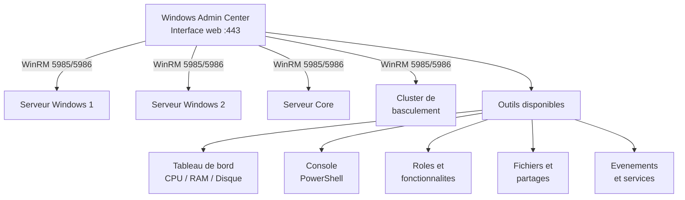

<!--
  Copyright 2026 Julien Bombled

  Licensed under the Apache License, Version 2.0 (the "License");
  you may not use this file except in compliance with the License.
  You may obtain a copy of the License at

      http://www.apache.org/licenses/LICENSE-2.0

  Unless required by applicable law or agreed to in writing, software
  distributed under the License is distributed on an "AS IS" BASIS,
  WITHOUT WARRANTIES OR CONDITIONS OF ANY KIND, either express or implied.
  See the License for the specific language governing permissions and
  limitations under the License.
-->
---
title: "Gestion des serveurs via WAC"
description: Gerer des serveurs Windows avec Windows Admin Center - ajouter des connexions, tableau de bord, outils disponibles et gestion quotidienne.
tags:
  - gestion-moderne
  - wac
  - intermediaire
---

# Gestion des serveurs via WAC

<span class="level-intermediate">Intermediaire</span> · Temps estime : 25 minutes

## Presentation

Une fois Windows Admin Center installe, il devient le point central pour gerer tous vos serveurs Windows. L'interface web offre un tableau de bord synthetique et un acces rapide a la plupart des outils d'administration.



!!! example "Analogie"

    Gerer des serveurs via WAC, c'est comme passer d'une flotte de voitures ou vous devez monter dans chaque vehicule pour lire les compteurs, a un tableau de bord centralise dans votre bureau qui affiche en temps reel la vitesse, le niveau d'essence et l'etat de chaque vehicule de la flotte.

## Ajouter des connexions

### Types de connexions

| Type | Description |
|------|-------------|
| **Windows Server** | Serveur individuel (GUI ou Core) |
| **Windows PC** | Poste de travail Windows 10/11 |
| **Cluster de basculement** | Cluster Windows Server |
| **Azure VM** | Machine virtuelle dans Azure |
| **Hyper-Converged Cluster** | Cluster HCI avec Storage Spaces Direct |

### Ajouter un serveur

1. Sur la page d'accueil de WAC, cliquer sur **+ Ajouter**
2. Selectionner **Serveur** (ou **Connexion de serveur**)
3. Saisir le nom FQDN ou l'adresse IP du serveur
4. Specifier les credentials si differents du compte actuel
5. Cliquer sur **Ajouter**

### Import en masse

WAC permet d'importer une liste de serveurs depuis un fichier texte :

1. Cliquer sur **+ Ajouter** > **Importer des serveurs**
2. Fournir un fichier texte avec un nom de serveur par ligne
3. WAC ajoute toutes les connexions automatiquement

```powershell
# Prepare a server list for import
$servers = Get-ADComputer -Filter { OperatingSystem -like "*Server*" } |
    Select-Object -ExpandProperty DNSHostName
$servers | Out-File -FilePath "C:\Temp\server-list.txt" -Encoding UTF8
```

Resultat :

```text
# Contenu du fichier server-list.txt genere :
SRV-DC01.lab.local
SRV-01.lab.local
SRV-WEB01.lab.local
SRV-FS01.lab.local
SRV-PRINT01.lab.local
```

### Organiser les connexions par tags

Les tags permettent de categoriser les serveurs :

1. Selectionner un ou plusieurs serveurs
2. Cliquer sur **Gerer les tags**
3. Ajouter des tags (ex. : `Production`, `Test`, `DC`, `FileServer`)
4. Filtrer la liste par tag dans la barre de recherche

## Tableau de bord (Vue d'ensemble)

Lorsqu'on se connecte a un serveur, le tableau de bord affiche :

| Section | Contenu |
|---------|---------|
| **CPU** | Utilisation en temps reel, nombre de coeurs |
| **Memoire** | Utilisation, RAM totale, RAM disponible |
| **Disques** | Espace utilise/disponible par volume |
| **Reseau** | Debit entrant/sortant par interface |
| **Evenements recents** | Derniers evenements critiques et erreurs |
| **Services** | Nombre de services en cours/arretes |

!!! tip "Rafraichissement"

    Le tableau de bord se rafraichit automatiquement. La frequence depend de la connexion
    reseau et du nombre de serveurs geres simultanement.

## Outils disponibles

WAC integre de nombreux outils, organises dans le volet de navigation gauche :

### Administration generale

| Outil | Equivalent classique | Fonctionnalites |
|-------|---------------------|-----------------|
| **Vue d'ensemble** | Server Manager | Tableau de bord systeme |
| **Certificats** | certlm.msc | Gestion des certificats machine |
| **Appareils** | devmgmt.msc | Gestionnaire de peripheriques |
| **Evenements** | eventvwr.msc | Observateur d'evenements avec filtrage |
| **Fichiers et partages** | Explorer + fsmgmt.msc | Navigation de fichiers, gestion des partages |
| **Pare-feu** | wf.msc | Regles de pare-feu entrantes/sortantes |

### Performance et surveillance

| Outil | Equivalent classique | Fonctionnalites |
|-------|---------------------|-----------------|
| **Performance Monitor** | perfmon.msc | Compteurs de performance en temps reel |
| **Processus** | taskmgr.exe | Liste des processus, arret, priorite |
| **Services** | services.msc | Gestion des services (demarrer, arreter, configurer) |

### Stockage et reseau

| Outil | Equivalent classique | Fonctionnalites |
|-------|---------------------|-----------------|
| **Disques** | diskmgmt.msc | Gestion des volumes, initialisation, formatage |
| **Reseau** | ncpa.cpl | Interfaces reseau, configuration IP |
| **Stockage** | - | Storage Spaces, Storage Replica |

### Roles et fonctionnalites

| Outil | Equivalent classique | Fonctionnalites |
|-------|---------------------|-----------------|
| **Roles et fonctionnalites** | Server Manager | Installation/suppression de roles |
| **Hyper-V** | virtmgmt.msc | Gestion des VMs, commutateurs, replication |
| **Mises a jour** | WSUS / WU | Installation des mises a jour Windows |
| **Registre** | regedit.exe | Navigation et modification du registre |
| **Taches planifiees** | taskschd.msc | Gestion des taches planifiees |
| **Utilisateurs et groupes** | lusrmgr.msc | Comptes locaux et groupes |

### Outils avances

| Outil | Description |
|-------|-------------|
| **PowerShell** | Console PowerShell distante directement dans le navigateur |
| **Bureau a distance** | Connexion RDP dans le navigateur (necessite une extension) |
| **Azure Hybrid** | Integration Azure Arc, Azure Backup, Azure Monitor |

## Gestion quotidienne via WAC

### Gerer les services

1. Naviguer vers **Services** dans le volet gauche
2. La liste affiche tous les services avec leur etat
3. Clic sur un service pour le demarrer, arreter ou configurer
4. Utiliser le filtre pour rechercher un service specifique

### Gerer les evenements

1. Naviguer vers **Evenements**
2. Filtrer par journal (System, Application, Security)
3. Filtrer par niveau (Critique, Erreur, Avertissement)
4. Cliquer sur un evenement pour voir les details
5. Exporter les resultats au format CSV

### Console PowerShell a distance

1. Naviguer vers **PowerShell**
2. Une session PowerShell a distance s'ouvre dans le navigateur
3. Executer des commandes comme dans une console locale
4. Copier/coller depuis et vers la console

!!! tip "PowerShell dans WAC"

    La console PowerShell de WAC est une vraie session a distance (PowerShell Remoting).
    Elle est particulierement utile pour les serveurs Core qui n'ont pas d'interface graphique.

### Gerer les fichiers

1. Naviguer vers **Fichiers et partages de fichiers**
2. Parcourir l'arborescence des disques
3. Telecharger ou envoyer des fichiers via le navigateur
4. Creer des partages et configurer les permissions

### Installer des roles

1. Naviguer vers **Roles et fonctionnalites**
2. Cocher les roles ou fonctionnalites a installer
3. Cliquer sur **Installer**
4. Suivre la progression dans la barre de notification

## Gestion de plusieurs serveurs

### Vue multi-serveurs

La page d'accueil de WAC affiche la liste de tous les serveurs connectes avec un indicateur d'etat :

| Indicateur | Signification |
|------------|---------------|
| **Vert** | Serveur en ligne, pas d'alerte |
| **Jaune** | Serveur en ligne, avertissements detectes |
| **Rouge** | Serveur hors ligne ou erreurs critiques |
| **Gris** | Etat inconnu (connexion en cours) |

### Actions en masse

Selectionner plusieurs serveurs pour effectuer des actions groupees :

- Redemarrer plusieurs serveurs
- Installer des mises a jour en lot
- Appliquer des tags

## Prerequis sur les serveurs geres

```powershell
# Ensure WinRM is configured on managed servers
Enable-PSRemoting -Force

# For non-domain servers, add to TrustedHosts on the WAC gateway
Set-Item WSMan:\localhost\Client\TrustedHosts -Value "192.168.10.*" -Force

# Verify WinRM connectivity from WAC server
Test-WSMan -ComputerName SRV-DC01
```

Resultat :

```text
# Enable-PSRemoting -Force
WinRM has been updated to receive requests.
WinRM service type changed successfully.
WinRM service started.

# Test-WSMan -ComputerName SRV-DC01
wsmid           : http://schemas.dmtf.org/wbem/wsman/identity/1/wsmanidentity.xsd
ProtocolVersion : http://schemas.dmtf.org/wbem/wsman/1/wsman.xsd
ProductVendor   : Microsoft Corporation
ProductVersion  : OS: 0.0.0 SP: 0.0 Stack: 3.0
```

### Ports requis

| Port | Protocole | Direction | Usage |
|------|-----------|-----------|-------|
| **5985** | TCP | WAC -> Serveur | WinRM HTTP |
| **5986** | TCP | WAC -> Serveur | WinRM HTTPS |
| **443** | TCP | Client -> WAC | Interface web WAC |
| **445** | TCP | WAC -> Serveur | SMB (fichiers, partages) |

!!! example "Scenario pratique"

    **Context :** Marc administre un parc de 8 serveurs Windows. Il recoit une alerte a 7h30 du matin : SRV-WEB01 repond lentement. Il dispose de WAC sur SRV-01.

    **Etape 1 : Connexion rapide depuis le navigateur**

    Marc ouvre `https://SRV-01.lab.local` depuis son poste, clique sur SRV-WEB01 dans la liste. Le tableau de bord s'affiche immediatement.

    **Constat :** CPU a 97%, memoire disponible : 210 Mo, aucun evenement critique recent.

    **Etape 2 : Identifier le processus responsable**

    Marc navigue vers **Processus** dans WAC. Il trie par CPU decroissant et identifie `w3wp.exe` (le worker IIS) qui consomme 92% du CPU.

    **Etape 3 : Consulter les evenements**

    Il navigue vers **Evenements** > Security + Application, filtre les 2 dernieres heures. Il voit 3 erreurs Application ID 1000 indiquant un crash repetitif de l'application web.

    **Etape 4 : Recycler le pool d'applications via PowerShell WAC**

    Sans ouvrir de session RDP, Marc utilise la console PowerShell integree dans WAC :

    ```powershell
    Import-Module WebAdministration
    Restart-WebAppPool -Name "IntranetPool"
    Get-WebAppPool -Name "IntranetPool" | Select-Object Name, State
    ```

    Le CPU retombe a 12%, la memoire disponible remonte a 1,8 Go. Probleme resolu en 8 minutes sans jamais ouvrir une connexion RDP.

!!! danger "Erreurs courantes"

    **Ajouter les serveurs par adresse IP plutot que par nom FQDN.** Kerberos ne fonctionne pas avec des adresses IP. WAC ne pourra pas utiliser l'authentification integree et demandera des credentials a chaque action. Toujours utiliser le nom DNS complet (`SRV-DC01.lab.local`).

    **Ne pas activer WinRM sur les serveurs Core.** Les serveurs sans interface graphique ont souvent WinRM desactive par defaut. Sans WinRM, WAC ne peut pas se connecter. Activer avec `Enable-PSRemoting -Force` ou via GPO avant d'ajouter le serveur dans WAC.

    **Croire que WAC remplace toutes les consoles MMC.** Certaines fonctionnalites avancees (gestion ADCS, ADFS, outils specialises) ne sont pas disponibles nativement dans WAC. Pour ces cas, les MMC restent necessaires.

    **Laisser WAC ouvert sans expiration de session.** Par defaut, les sessions WAC n'expirent pas apres inactivite sur certaines versions. Configurer une politique de timeout ou fermer le navigateur apres chaque session d'administration.

    **Ne pas superviser l'etat du service ServerManagementGateway.** Si le service WAC s'arrete, toute l'administration centralisee est perdue. Ajouter une surveillance du service et une alerte dans votre outil de monitoring.

## Points cles a retenir

- WAC centralise la gestion de tous les serveurs Windows dans une interface web unique
- Les connexions peuvent etre organisees par tags pour un filtrage rapide
- Le tableau de bord fournit une vue synthetique CPU, memoire, disque et reseau
- La console PowerShell integree permet d'administrer les serveurs Core directement depuis le navigateur
- WAC utilise WinRM pour communiquer avec les serveurs geres (ports 5985/5986)
- L'import en masse et les tags facilitent la gestion de parcs importants

## Pour aller plus loin

- [Installation de WAC](installation.md) pour la mise en place initiale
- [Extensions WAC](extensions.md) pour etendre les fonctionnalites

