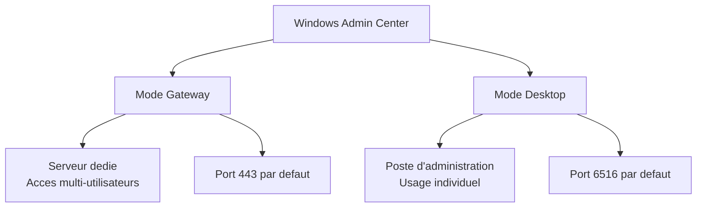

<!--
  Copyright 2026 Julien Bombled

  Licensed under the Apache License, Version 2.0 (the "License");
  you may not use this file except in compliance with the License.
  You may obtain a copy of the License at

      http://www.apache.org/licenses/LICENSE-2.0

  Unless required by applicable law or agreed to in writing, software
  distributed under the License is distributed on an "AS IS" BASIS,
  WITHOUT WARRANTIES OR CONDITIONS OF ANY KIND, either express or implied.
  See the License for the specific language governing permissions and
  limitations under the License.
-->

# Installation de Windows Admin Center

<span class="level-intermediate">Intermediaire</span> · Temps estime : 25 minutes

## Presentation

Windows Admin Center (WAC) est l'outil de gestion graphique moderne de Microsoft pour Windows Server. Il fonctionne dans un navigateur web et remplace progressivement les consoles MMC traditionnelles (Server Manager, Hyper-V Manager, etc.).



!!! example "Analogie"

    Windows Admin Center, c'est comme passer des visites physiques dans chaque bureau de votre entreprise pour verifier le travail de chaque employe, a ouvrir une application web unique depuis votre poste qui vous donne une vue d'ensemble de tous les bureaux en meme temps. Plus besoin de se deplacer.

## Modes d'installation

| Mode | Cible | Port par defaut | Usage |
|------|-------|----------------|-------|
| **Gateway** | Windows Server (Core ou GUI) | TCP 443 | Production - acces multi-utilisateurs via navigateur |
| **Desktop** | Windows 10/11 | TCP 6516 | Poste d'administration individuel |

!!! tip "Recommandation"

    En production, installez WAC en **mode Gateway** sur un serveur dedie
    (pas sur un controleur de domaine). Cela permet a toute l'equipe d'administration
    d'y acceder depuis n'importe quel navigateur.

## Prerequis

| Element | Specification |
|---------|---------------|
| OS | Windows Server 2016+ (Gateway) ou Windows 10/11 (Desktop) |
| RAM | 2 Go minimum |
| Navigateur | Microsoft Edge ou Google Chrome |
| Reseau | Connectivite vers les serveurs a gerer (WinRM, ports 5985/5986) |
| Certificat | Auto-signe (test) ou certificat d'une CA (production) |

## Installation en mode Gateway

### Telechargement

Telecharger Windows Admin Center depuis le site officiel de Microsoft.

### Installation via l'interface

1. Executer le fichier `.msi` telecharge
2. Accepter les termes de licence
3. Cocher **Use Microsoft Update** (recommande)
4. Configurer les options :
    - **Port** : 443 (ou un port personnalise)
    - **Certificat** : generer un certificat auto-signe ou selectionner un certificat existant
    - **Autoriser WAC a modifier les parametre TrustedHosts** : cocher pour les serveurs hors domaine
5. Cliquer sur **Install**

### Installation silencieuse (PowerShell)

```powershell
# Silent install with self-signed certificate on port 443
msiexec /i "WindowsAdminCenter.msi" /qn /L*v "C:\Logs\wac-install.log" `
    SME_PORT=443 `
    SSL_CERTIFICATE_OPTION=generate

# Silent install with a specific certificate thumbprint
msiexec /i "WindowsAdminCenter.msi" /qn /L*v "C:\Logs\wac-install.log" `
    SME_PORT=443 `
    SME_THUMBPRINT=<thumbprint-du-certificat>

# Silent install on a custom port
msiexec /i "WindowsAdminCenter.msi" /qn /L*v "C:\Logs\wac-install.log" `
    SME_PORT=8443 `
    SSL_CERTIFICATE_OPTION=generate
```

### Verification post-installation

```powershell
# Verify the WAC service is running
Get-Service ServerManagementGateway | Select-Object Name, Status, StartType

# Check the listening port
Get-NetTCPConnection -LocalPort 443 -State Listen -ErrorAction SilentlyContinue

# Verify the WAC URL is accessible
Test-NetConnection -ComputerName localhost -Port 443
```

Resultat :

```text
Name                        Status  StartType
----                        ------  ---------
ServerManagementGateway     Running Automatic

LocalAddress  LocalPort RemoteAddress RemotePort State
------------  --------- ------------- ---------- -----
0.0.0.0       443       0.0.0.0       0          Listen

ComputerName : localhost
RemoteAddress : 127.0.0.1
RemotePort   : 443
TcpTestSucceeded : True
```

## Configuration du certificat

### Certificat auto-signe (test/lab)

L'installation genere un certificat auto-signe valide 60 jours. Les navigateurs afficheront un avertissement de securite.

### Certificat d'une autorite de certification (production)

```powershell
# Request a certificate from an enterprise CA
$certParams = @{
    Subject           = "CN=wac.winopslab.local"
    DnsName           = "wac.winopslab.local", "SRV-WAC"
    CertStoreLocation = "Cert:\LocalMachine\My"
    KeyExportPolicy   = "Exportable"
    KeyLength         = 2048
    KeyAlgorithm      = "RSA"
    HashAlgorithm     = "SHA256"
    NotAfter          = (Get-Date).AddYears(2)
    KeyUsage          = "DigitalSignature", "KeyEncipherment"
    Template          = "WebServer"
}
$cert = Get-Certificate @certParams

# Get the thumbprint
$cert.Certificate.Thumbprint
```

Pour changer le certificat apres l'installation :

```powershell
# Update WAC to use a new certificate
# Method 1: Reinstall with the new thumbprint
msiexec /i "WindowsAdminCenter.msi" /qn SME_PORT=443 SME_THUMBPRINT=<new-thumbprint>

# Method 2: Update via netsh (advanced)
netsh http delete sslcert ipport=0.0.0.0:443
netsh http add sslcert ipport=0.0.0.0:443 certhash=<new-thumbprint> appid='{00000000-0000-0000-0000-000000000000}'
```

## Configuration du pare-feu

```powershell
# WAC port (should be opened automatically during install)
New-NetFirewallRule -DisplayName "Windows Admin Center" `
    -Direction Inbound -Protocol TCP -LocalPort 443 -Action Allow

# WinRM ports for managing remote servers
New-NetFirewallRule -DisplayName "WinRM HTTP" `
    -Direction Inbound -Protocol TCP -LocalPort 5985 -Action Allow
New-NetFirewallRule -DisplayName "WinRM HTTPS" `
    -Direction Inbound -Protocol TCP -LocalPort 5986 -Action Allow
```

## Premier acces

1. Ouvrir un navigateur (Edge ou Chrome) sur un poste d'administration
2. Naviguer vers `https://SRV-WAC.winopslab.local` (ou l'IP du serveur)
3. Si certificat auto-signe : accepter l'avertissement de securite
4. S'authentifier avec un compte administrateur du domaine
5. La page d'accueil affiche la liste des connexions disponibles

### Navigateurs supportes

| Navigateur | Support |
|------------|---------|
| Microsoft Edge | :material-check: Recommande |
| Google Chrome | :material-check: Supporte |
| Mozilla Firefox | :material-check: Supporte (certaines limitations) |
| Internet Explorer | :material-close: Non supporte |

## Controle d'acces

### Roles d'acces WAC

| Role | Permissions |
|------|------------|
| **Gateway Administrators** | Gestion complete de WAC (utilisateurs, extensions, parametres) |
| **Gateway Users** | Acces aux connexions et outils (gestion des serveurs) |

```powershell
# Configure access via WAC Settings > Access
# Or via PowerShell on the WAC server:

# Add a group as Gateway Users
Add-LocalGroupMember -Group "Windows Admin Center Gateway Users" -Member "WINOPSLAB\AdminsIT"

# Add a group as Gateway Administrators
Add-LocalGroupMember -Group "Windows Admin Center Gateway Administrators" -Member "WINOPSLAB\AdminsSenior"
```

Resultat :

```text
# Aucune sortie = succes. Pour verifier :
# Get-LocalGroupMember -Group "Windows Admin Center Gateway Users"

ObjectClass Name                   PrincipalSource
----------- ----                   ---------------
Group       WINOPSLAB\AdminsIT     ActiveDirectory
```

### Integration avec Active Directory

En environnement de domaine, WAC utilise l'authentification Kerberos. Les groupes AD peuvent etre ajoutes directement aux roles WAC.

!!! example "Scenario pratique"

    **Context :** Sophie, nouvelle responsable IT dans une PME de 80 personnes, herite d'un parc de 6 serveurs Windows administres via RDP et des MMC lancees individuellement. Elle souhaite centraliser l'administration avec WAC.

    **Etape 1 : Preparer un serveur dedie**

    Sophie choisit SRV-01 (Windows Server 2022, 4 Go RAM) comme gateway WAC. Elle s'assure qu'il n'heberge aucun autre role critique.

    **Etape 2 : Installation silencieuse**

    ```powershell
    msiexec /i "WindowsAdminCenter.msi" /qn /L*v "C:\Logs\wac-install.log" `
        SME_PORT=443 `
        SSL_CERTIFICATE_OPTION=generate
    ```

    **Etape 3 : Verifier que le service demarre**

    ```powershell
    Get-Service ServerManagementGateway | Select-Object Name, Status
    Test-NetConnection -ComputerName localhost -Port 443
    ```

    **Etape 4 : Configurer l'acces**

    Sophie ajoute le groupe `lab\AdminsIT` en tant que Gateway Users et `lab\AdminsSenior` en Gateway Administrators. Elle informe l'equipe : l'URL est `https://SRV-01.lab.local`.

    **Etape 5 : Remplacement du certificat auto-signe**

    Pour eviter les avertissements de securite, Sophie demande un certificat a la CA interne avec le nom `SRV-01.lab.local` et met a jour WAC via une reinstallation silencieuse en specifiant le thumbprint. Desormais, les navigateurs ne signalent aucune alerte.

## Mise a jour de WAC

```powershell
# Check current version
Get-ItemProperty "HKLM:\SOFTWARE\Microsoft\ServerManagementGateway" |
    Select-Object Version

# Update: download the new MSI and run the installer
# WAC preserves settings and connections during the upgrade
msiexec /i "WindowsAdminCenter-NEW.msi" /qn /L*v "C:\Logs\wac-upgrade.log" SME_PORT=443
```

!!! danger "Erreurs courantes"

    **Installer WAC sur un controleur de domaine.** Microsoft deconseille formellement cette pratique. En cas de compromission de l'interface WAC (accessible depuis le reseau), l'attaquant se retrouve directement sur le DC. Toujours utiliser un serveur dedie.

    **Oublier de configurer WinRM sur les serveurs a gerer.** Si `Enable-PSRemoting` n'a pas ete execute sur les serveurs cibles, WAC affiche une erreur de connexion sans indication claire. Tester avec `Test-WSMan -ComputerName SRV-DC01` depuis le serveur WAC.

    **Utiliser le certificat auto-signe en production.** Le certificat auto-signe expire apres 60 jours. Apres expiration, WAC devient inaccessible jusqu'a reinstallation. Toujours utiliser un certificat emis par une CA interne ou publique.

    **Ne pas ouvrir les ports WinRM sur le pare-feu des serveurs geres.** WAC necessite les ports 5985 (WinRM HTTP) et 5986 (WinRM HTTPS) entre le serveur WAC et les serveurs cibles. Un pare-feu intermediaire bloquant ces ports rend les serveurs injoignables depuis WAC.

    **Confondre le compte de connexion WAC et les droits sur les serveurs geres.** WAC utilise Kerberos pour s'authentifier : si le compte connecte a WAC n'est pas administrateur local du serveur cible, certains outils WAC seront desactives ou en erreur.

## Points cles a retenir

- Windows Admin Center est l'outil de gestion moderne basee sur navigateur pour Windows Server
- Le mode **Gateway** (sur un serveur dedie, port 443) est recommande en production
- Un certificat d'une CA interne est fortement recommande pour eviter les avertissements de securite
- WAC utilise **WinRM** (ports 5985/5986) pour communiquer avec les serveurs geres
- Les roles **Gateway Administrators** et **Gateway Users** controlent l'acces a l'interface
- La mise a jour se fait simplement en relancant l'installeur avec la nouvelle version

## Pour aller plus loin

- [Gestion des serveurs via WAC](gestion-serveurs.md) pour decouvrir les outils disponibles
- [Extensions WAC](extensions.md) pour etendre les fonctionnalites

