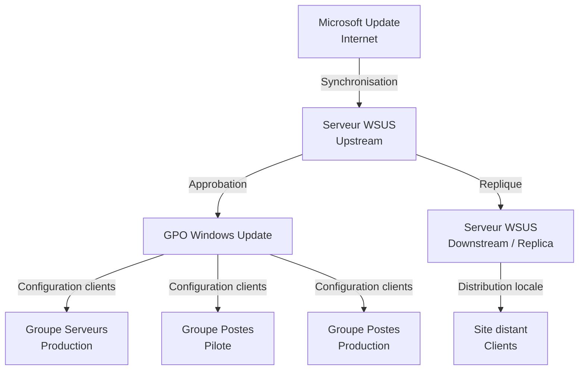
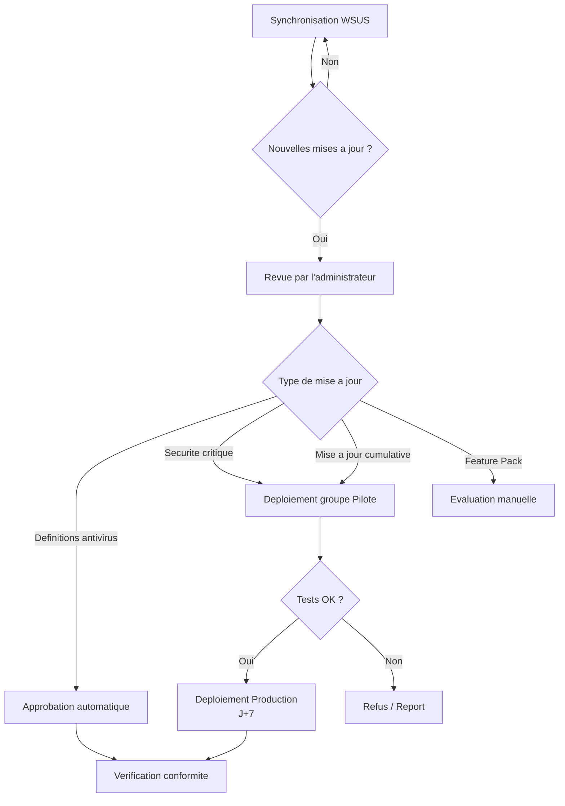

<!--
  Copyright 2026 Julien Bombled

  Licensed under the Apache License, Version 2.0 (the "License");
  you may not use this file except in compliance with the License.
  You may obtain a copy of the License at

      http://www.apache.org/licenses/LICENSE-2.0

  Unless required by applicable law or agreed to in writing, software
  distributed under the License is distributed on an "AS IS" BASIS,
  WITHOUT WARRANTIES OR CONDITIONS OF ANY KIND, either express or implied.
  See the License for the specific language governing permissions and
  limitations under the License.
-->

# Deployer et gerer WSUS

<span class="level-intermediate">Intermediaire</span> · Temps estime : 40 minutes

## Presentation

Windows Server Update Services (WSUS) permet de gerer de maniere centralisee la distribution des mises a jour Microsoft au sein d'une infrastructure Windows. Au lieu de laisser chaque machine telecharger individuellement ses mises a jour depuis Internet, WSUS agit comme un relais local : il telecharge les mises a jour une seule fois, puis les distribue aux postes et serveurs du reseau.

!!! example "Analogie"

    WSUS fonctionne comme un centre de tri postal pour les mises a jour. Au lieu que chaque employe (poste client) aille chercher son courrier (mise a jour) directement au bureau de poste central (Microsoft Update), un centre de tri local (le serveur WSUS) recoit tout le courrier en gros, le trie par destinataire (groupes d'ordinateurs), et le distribue en interne. Le responsable du centre de tri (l'administrateur) decide quel courrier est distribue, lequel est mis en attente, et lequel est refuse. Cela economise de la bande passante (un seul voyage vers le bureau de poste), et permet un controle total sur ce qui est livre.

### Pourquoi WSUS

| Avantage | Description |
|----------|-------------|
| **Economie de bande passante** | Les mises a jour sont telechargees une seule fois depuis Microsoft Update |
| **Controle centralise** | L'administrateur approuve ou refuse chaque mise a jour |
| **Conformite** | Rapports sur l'etat de mise a jour de chaque machine |
| **Planification** | Deploiement en phases (pilote, puis production) |
| **Gratuit** | Role integre a Windows Server, aucun cout de licence supplementaire |

## Architecture WSUS

### Vue d'ensemble



### Modes de deploiement

| Mode | Description | Usage |
|------|-------------|-------|
| **Standalone** | Serveur WSUS unique, gere ses propres approbations | PME, site unique |
| **Replica** | Replique les approbations du serveur upstream | Sites distants, succursales |
| **Autonomous (Downstream)** | Synchronise le contenu depuis un upstream mais gere ses propres approbations | Grandes organisations avec equipes IT distinctes |

!!! tip "Bonne pratique"

    Pour les organisations de moins de 500 machines sur un seul site, un serveur WSUS standalone suffit. Au-dela, ou pour des sites distants avec des liens WAN limites, deployer des serveurs downstream ou replica.

## Installation du role WSUS

### Prerequis

| Prerequis | Minimum | Recommande |
|-----------|---------|------------|
| **Processeur** | 1.4 GHz x64 | 2 GHz+ x64 |
| **RAM** | 2 Go | 4 Go+ |
| **Stockage contenu** | 40 Go | 100 Go+ (volume dedie) |
| **Base de donnees** | WID (Windows Internal Database) | SQL Server pour > 20 000 clients |
| **Systeme d'exploitation** | Windows Server 2016+ | Windows Server 2022 |

### Installation via PowerShell

```powershell
# Install the WSUS role with Windows Internal Database (WID)
Install-WindowsFeature -Name UpdateServices, UpdateServices-WidDB, UpdateServices-Services `
    -IncludeManagementTools

# Verify the installation
Get-WindowsFeature -Name UpdateServices*
```

!!! info "Base de donnees"

    **WID (Windows Internal Database)** est la base par defaut. Elle convient pour la plupart des deploiements (jusqu'a 20 000 clients). Pour des environnements plus grands, installez `UpdateServices-DB` a la place de `UpdateServices-WidDB` et connectez-vous a une instance SQL Server.

### Configuration post-installation

Apres l'installation du role, il faut initialiser WSUS avec un repertoire de stockage pour le contenu des mises a jour :

```powershell
# Create the content directory on a dedicated volume
New-Item -Path "D:\WSUS" -ItemType Directory -Force

# Run post-install configuration (initialize WSUS database and content directory)
& "C:\Program Files\Update Services\Tools\wsusutil.exe" postinstall CONTENT_DIR=D:\WSUS

# Verify WSUS is running
Get-Service -Name WsusService, W3SVC | Select-Object Name, Status
```

Resultat attendu :

```text
# wsusutil.exe postinstall
Post install has successfully completed.

# Get-Service
Name         Status
----         ------
WsusService  Running
W3SVC        Running
```

## Configuration initiale

### Lancer l'assistant de configuration

Apres l'installation, ouvrir la console **WSUS** (`wsus.msc`) pour lancer l'assistant de configuration.

Les etapes principales sont :

1. **Connexion au serveur upstream** : Microsoft Update (ou un autre serveur WSUS)
2. **Selection des langues** : Limiter aux langues utilisees (francais, anglais)
3. **Selection des produits** : Choisir uniquement les produits presents dans l'infrastructure
4. **Selection des classifications** : Types de mises a jour a synchroniser
5. **Planification de la synchronisation** : Heure et frequence

### Selection des produits et classifications

```powershell
# Connect to the local WSUS server
$wsus = Get-WsusServer -Name "localhost" -PortNumber 8530

# List all available products
$wsus.GetSubscription().GetUpdateCategories() | Select-Object Title | Sort-Object Title

# List current classifications
$wsus.GetSubscription().GetUpdateClassifications() | Select-Object Title
```

#### Produits recommandes (infrastructure Windows Server)

| Produit | Inclure |
|---------|---------|
| **Windows Server 2022** | :material-check: |
| **Windows Server 2019** | :material-check: si present |
| **Windows 11** | :material-check: si postes clients |
| **Windows 10** | :material-check: si postes clients |
| **Microsoft Defender Antivirus** | :material-check: |
| **SQL Server** | :material-check: si present |
| **Office** | Selon les besoins |

#### Classifications recommandees

| Classification | Description | Recommandation |
|----------------|-------------|----------------|
| **Critical Updates** | Corrections critiques non liees a la securite | :material-check: Approuver |
| **Security Updates** | Correctifs de securite | :material-check: Approuver |
| **Update Rollups** | Ensemble cumule de correctifs | :material-check: Approuver |
| **Service Packs** | Mises a jour majeures | :material-check: Tester d'abord |
| **Definition Updates** | Signatures antivirus Defender | :material-check: Approbation automatique |
| **Feature Packs** | Nouvelles fonctionnalites | :material-close: Evaluer au cas par cas |
| **Drivers** | Pilotes materiel | :material-close: Desactiver sauf besoin |

### Planification de la synchronisation

```powershell
# Connect to WSUS
$wsus = Get-WsusServer -Name "localhost" -PortNumber 8530
$subscription = $wsus.GetSubscription()

# Configure automatic synchronization (daily at 02:00)
$subscription.SynchronizeAutomatically = $true
$subscription.SynchronizeAutomaticallyTimeOfDay = [TimeSpan]::New(2, 0, 0)
$subscription.NumberOfSynchronizationsPerDay = 1
$subscription.Save()

# Trigger a manual first synchronization
$subscription.StartSynchronization()

# Monitor synchronization progress
$subscription.GetSynchronizationProgress()
```

!!! tip "Bonne pratique"

    Planifiez la synchronisation pendant les heures creuses (entre 2h et 5h du matin). Une synchronisation quotidienne suffit pour les mises a jour de securite. Pour les definitions antivirus Defender, envisagez plusieurs synchronisations par jour.

## Configuration des clients via GPO

Les clients Windows sont configures par strategie de groupe (GPO) pour pointer vers le serveur WSUS.

### Creer la GPO

Chemin dans l'editeur de strategie de groupe :

```
Configuration ordinateur
  └─ Strategies
       └─ Modeles d'administration
            └─ Composants Windows
                 └─ Windows Update
```

### Parametres essentiels

| Parametre GPO | Valeur | Description |
|---------------|--------|-------------|
| **Specifier l'emplacement intranet du service de mise a jour** | `http://SRV-WSUS:8530` | Adresse du serveur WSUS |
| **Configuration du service de mises a jour automatiques** | `4 - Telechargement auto et installation planifiee` | Comportement de mise a jour |
| **Jour d'installation planifie** | `0 - Tous les jours` | Frequence d'installation |
| **Heure d'installation planifiee** | `03:00` | Heure d'installation |
| **Activer le ciblage cote client** | `Active` | Permet l'affectation a un groupe WSUS via GPO |
| **Nom du groupe cible** | `Serveurs-Production` | Groupe WSUS de destination |

### Configuration via PowerShell (registre)

```powershell
# Configure WSUS server URL
$registryPath = "HKLM:\SOFTWARE\Policies\Microsoft\Windows\WindowsUpdate"
New-Item -Path $registryPath -Force
Set-ItemProperty -Path $registryPath -Name "WUServer" -Value "http://SRV-WSUS:8530"
Set-ItemProperty -Path $registryPath -Name "WUStatusServer" -Value "http://SRV-WSUS:8530"

# Configure automatic updates
$auPath = "$registryPath\AU"
New-Item -Path $auPath -Force
Set-ItemProperty -Path $auPath -Name "UseWUServer" -Value 1
Set-ItemProperty -Path $auPath -Name "AUOptions" -Value 4
Set-ItemProperty -Path $auPath -Name "ScheduledInstallDay" -Value 0
Set-ItemProperty -Path $auPath -Name "ScheduledInstallTime" -Value 3

# Force group policy refresh on the client
gpupdate /force

# Trigger Windows Update detection cycle
wuauclt /detectnow /reportnow
```

### Groupes d'ordinateurs

WSUS permet de classer les machines en groupes pour un deploiement progressif :

| Groupe | Contenu | Strategie d'approbation |
|--------|---------|-------------------------|
| **Pilote** | 5-10 machines representatives | Approbation immediate apres tests |
| **Serveurs-Production** | Serveurs de production critiques | Approbation J+7 apres le groupe pilote |
| **Postes-Production** | Postes de travail | Approbation J+3 apres le groupe pilote |
| **DMZ** | Serveurs exposes | Approbation prioritaire pour les correctifs de securite |

```powershell
# Connect to WSUS
$wsus = Get-WsusServer -Name "localhost" -PortNumber 8530

# Create computer groups
$wsus.CreateComputerTargetGroup("Pilote")
$wsus.CreateComputerTargetGroup("Serveurs-Production")
$wsus.CreateComputerTargetGroup("Postes-Production")
$wsus.CreateComputerTargetGroup("DMZ")

# List all groups
$wsus.GetComputerTargetGroups() | Select-Object Name
```

## Workflow d'approbation

### Processus d'approbation



### Approbation manuelle

```powershell
# Connect to WSUS
$wsus = Get-WsusServer -Name "localhost" -PortNumber 8530

# List unapproved updates
$updates = $wsus.GetUpdates() | Where-Object {
    $_.IsApproved -eq $false -and $_.IsDeclined -eq $false
}
$updates | Select-Object Title, MsrcSeverity, CreationDate |
    Sort-Object MsrcSeverity | Format-Table -AutoSize

# Approve a specific update for a target group
$targetGroup = $wsus.GetComputerTargetGroups() |
    Where-Object { $_.Name -eq "Pilote" }
$update = $updates | Where-Object { $_.Title -like "*KB5034*" }
$update.Approve("Install", $targetGroup)

# Decline a superseded update
$superseded = $wsus.GetUpdates() | Where-Object { $_.IsSuperseded -eq $true }
$superseded | ForEach-Object { $_.Decline() }
```

### Regles d'approbation automatique

```powershell
# Connect to WSUS
$wsus = Get-WsusServer -Name "localhost" -PortNumber 8530

# Create an auto-approval rule for definition updates
$rule = $wsus.CreateInstallApprovalRule("Auto-Approve Definitions")

# Set the classification to "Definition Updates"
$classifications = $wsus.GetUpdateClassifications() |
    Where-Object { $_.Title -eq "Definition Updates" }
$rule.SetUpdateClassifications(
    [Microsoft.UpdateServices.Administration.UpdateClassificationCollection]$classifications
)

# Set the target group to "All Computers"
$allComputers = $wsus.GetComputerTargetGroups() |
    Where-Object { $_.Name -eq "All Computers" }
$rule.SetComputerTargetGroups(
    [Microsoft.UpdateServices.Administration.ComputerTargetGroupCollection]$allComputers
)

# Enable and run the rule
$rule.Enabled = $true
$rule.Save()
$rule.ApplyRule()
```

## Maintenance WSUS

La maintenance reguliere de WSUS est essentielle pour eviter la degradation des performances.

### Nettoyage du serveur

```powershell
# Connect to WSUS
$wsus = Get-WsusServer -Name "localhost" -PortNumber 8530

# Run the Server Cleanup Wizard programmatically
$cleanupParams = [Microsoft.UpdateServices.Administration.CleanupScope]::new()
$cleanupParams.DeclineSupersededUpdates = $true
$cleanupParams.DeclineExpiredUpdates = $true
$cleanupParams.CleanupObsoleteUpdates = $true
$cleanupParams.CleanupObsoleteComputers = $true
$cleanupParams.CleanupUnneededContentFiles = $true
$cleanupParams.CompressUpdates = $true

$cleanupManager = $wsus.GetCleanupManager()
$results = $cleanupManager.PerformCleanup($cleanupParams)

# Display cleanup results
Write-Output "Superseded updates declined: $($results.SupersededUpdatesDeclined)"
Write-Output "Expired updates declined: $($results.ExpiredUpdatesDeclined)"
Write-Output "Obsolete updates deleted: $($results.ObsoleteUpdatesDeleted)"
Write-Output "Obsolete computers deleted: $($results.ObsoleteComputersDeleted)"
Write-Output "Disk space freed (MB): $([math]::Round($results.DiskSpaceFreed / 1MB, 2))"
```

### Reindexation de la base SUSDB

La base de donnees WSUS (SUSDB) necessite une reindexation periodique pour maintenir les performances :

```powershell
# For WID (Windows Internal Database), use sqlcmd
# Download the official WSUS maintenance script from Microsoft documentation
# Execute the reindex script against the SUSDB database
sqlcmd -S "\\.\pipe\MICROSOFT##WID\tsql\query" -d "SUSDB" -i "C:\Scripts\WsusDBMaintenance.sql"
```

!!! warning "Planification"

    Planifiez la reindexation mensuellement via une tache planifiee. L'operation peut prendre plusieurs minutes et ralentir temporairement WSUS.

### Recyclage du pool IIS

WSUS utilise IIS comme serveur web. Le pool d'applications WsusPool peut consommer beaucoup de memoire :

```powershell
# Check current WsusPool memory usage
Get-Process -Name w3wp -ErrorAction SilentlyContinue |
    Where-Object { $_.CommandLine -like "*WsusPool*" } |
    Select-Object Id, WorkingSet64, @{N="MemoryMB"; E={[math]::Round($_.WorkingSet64/1MB,2)}}

# Recycle the WSUS application pool
Import-Module WebAdministration
Restart-WebAppPool -Name "WsusPool"

# Configure memory limit for WsusPool (4 GB private memory limit)
Set-ItemProperty "IIS:\AppPools\WsusPool" -Name "recycling.periodicRestart.privateMemory" -Value 4194304
```

### Script de maintenance complet

```powershell
# Full WSUS maintenance script (run monthly via scheduled task)

# Step 1: Decline superseded and expired updates
$wsus = Get-WsusServer -Name "localhost" -PortNumber 8530
$cleanupParams = [Microsoft.UpdateServices.Administration.CleanupScope]::new()
$cleanupParams.DeclineSupersededUpdates = $true
$cleanupParams.DeclineExpiredUpdates = $true
$cleanupParams.CleanupObsoleteUpdates = $true
$cleanupParams.CleanupObsoleteComputers = $true
$cleanupParams.CleanupUnneededContentFiles = $true
$cleanupParams.CompressUpdates = $true

$cleanupManager = $wsus.GetCleanupManager()
$results = $cleanupManager.PerformCleanup($cleanupParams)

# Step 2: Reindex SUSDB
sqlcmd -S "\\.\pipe\MICROSOFT##WID\tsql\query" -d "SUSDB" -i "C:\Scripts\WsusDBMaintenance.sql"

# Step 3: Recycle IIS application pool
Import-Module WebAdministration
Restart-WebAppPool -Name "WsusPool"

Write-Output "WSUS maintenance completed at $(Get-Date)"
```

## Rapports de conformite

### Etat des mises a jour par ordinateur

```powershell
# Connect to WSUS
$wsus = Get-WsusServer -Name "localhost" -PortNumber 8530

# Get update status summary for all computers
$computers = $wsus.GetComputerTargets()
$report = foreach ($computer in $computers) {
    $status = $computer.GetUpdateInstallationSummary()
    [PSCustomObject]@{
        Name              = $computer.FullDomainName
        Group             = ($computer.GetComputerTargetGroups() |
                            Where-Object { $_.Name -ne "All Computers" }).Name -join ", "
        Installed         = $status.InstalledCount
        PendingInstall    = $status.DownloadedCount
        NotInstalled      = $status.NotInstalledCount
        Failed            = $status.FailedCount
        LastContact       = $computer.LastReportedStatusTime
    }
}

$report | Sort-Object Name | Format-Table -AutoSize
```

Resultat attendu :

```text
Name                    Group                 Installed PendingInstall NotInstalled Failed LastContact
----                    -----                 --------- -------------- ------------ ------ -----------
DC-01.winopslab.local   Serveurs-Production        142              0            2      0 2026-02-19
DC-02.winopslab.local   Serveurs-Production        142              0            2      0 2026-02-19
SRV-FILE.winopslab.local Serveurs-Production       138              3            1      0 2026-02-18
PC-PILOT01.winopslab.local Pilote                  156              0            0      0 2026-02-20
```

### Machines non conformes

```powershell
# Find computers that have not contacted WSUS in more than 30 days
$wsus = Get-WsusServer -Name "localhost" -PortNumber 8530
$threshold = (Get-Date).AddDays(-30)

$staleComputers = $wsus.GetComputerTargets() |
    Where-Object { $_.LastReportedStatusTime -lt $threshold } |
    Select-Object FullDomainName, LastReportedStatusTime, IPAddress

$staleComputers | Format-Table -AutoSize

# Find computers with failed updates
$failedComputers = $wsus.GetComputerTargets() | Where-Object {
    $_.GetUpdateInstallationSummary().FailedCount -gt 0
}
$failedComputers | Select-Object FullDomainName,
    @{N="FailedUpdates"; E={$_.GetUpdateInstallationSummary().FailedCount}} |
    Format-Table -AutoSize
```

## Scenario pratique

!!! example "Deployer WSUS pour 50 serveurs avec groupes d'ordinateurs"

    **Contexte** : Votre entreprise possede 50 serveurs Windows Server 2022 repartis en trois environnements : developpement (10 serveurs), preproduction (10 serveurs) et production (30 serveurs). Vous devez deployer WSUS pour centraliser les mises a jour avec un deploiement progressif.

    **Objectifs** :

    - Installer WSUS sur `SRV-WSUS01`
    - Creer trois groupes d'ordinateurs : `Dev`, `Preprod`, `Prod`
    - Configurer une GPO par groupe avec ciblage cote client
    - Mettre en place une regle d'approbation automatique pour les definitions antivirus
    - Planifier la synchronisation quotidienne a 2h du matin

    **Etapes** :

    1. Installez le role WSUS et configurez le repertoire de contenu :

        ```powershell
        Install-WindowsFeature -Name UpdateServices, UpdateServices-WidDB, `
            UpdateServices-Services -IncludeManagementTools
        New-Item -Path "D:\WSUS" -ItemType Directory -Force
        & "C:\Program Files\Update Services\Tools\wsusutil.exe" postinstall CONTENT_DIR=D:\WSUS
        ```

    2. Creez les groupes d'ordinateurs :

        ```powershell
        $wsus = Get-WsusServer -Name "localhost" -PortNumber 8530
        $wsus.CreateComputerTargetGroup("Dev")
        $wsus.CreateComputerTargetGroup("Preprod")
        $wsus.CreateComputerTargetGroup("Prod")
        ```

    3. Selectionnez les produits et lancez la synchronisation :

        ```powershell
        $subscription = $wsus.GetSubscription()
        $subscription.SynchronizeAutomatically = $true
        $subscription.SynchronizeAutomaticallyTimeOfDay = [TimeSpan]::New(2, 0, 0)
        $subscription.Save()
        $subscription.StartSynchronization()
        ```

    4. Creez les GPO de ciblage (une par environnement) avec les valeurs suivantes :

        | GPO | Serveur WSUS | Groupe cible | Heure d'installation |
        |-----|-------------|--------------|----------------------|
        | `GPO-WSUS-Dev` | `http://SRV-WSUS01:8530` | `Dev` | 02:00 |
        | `GPO-WSUS-Preprod` | `http://SRV-WSUS01:8530` | `Preprod` | 03:00 |
        | `GPO-WSUS-Prod` | `http://SRV-WSUS01:8530` | `Prod` | 04:00 |

    5. Approuvez les mises a jour en cascade : Dev (J+0), Preprod (J+3), Prod (J+7)

??? success "Resultat attendu"

    - Les 50 serveurs apparaissent dans la console WSUS, repartis dans leurs groupes respectifs
    - Les definitions antivirus sont automatiquement approuvees pour tous les groupes
    - Les mises a jour de securite sont deployes d'abord sur `Dev`, puis `Preprod` apres 3 jours, puis `Prod` apres 7 jours
    - Le rapport de conformite montre un taux de mise a jour superieur a 95%

## Erreurs courantes

!!! failure "La base SUSDB grossit de maniere incontrole"

    **Symptome** : Le volume hebergeant la base de donnees WSUS se remplit progressivement. La base SUSDB depasse plusieurs dizaines de gigaoctets.

    **Cause** : L'assistant de nettoyage du serveur n'est pas execute regulierement. Les mises a jour obsoletes, remplacees et expirees s'accumulent dans la base.

    **Solution** : Planifier le nettoyage mensuel du serveur WSUS (decline des mises a jour remplacees, suppression du contenu inutile) et la reindexation de SUSDB. Automatiser via une tache planifiee executant le script de maintenance complet.

!!! failure "Les clients ne remontent pas leur etat dans WSUS"

    **Symptome** : Les machines apparaissent dans la console WSUS mais la colonne `Last Contact` affiche une date ancienne ou `Not yet reported`.

    **Cause** : La GPO n'est pas appliquee correctement, le service Windows Update est arrete sur le client, ou le pare-feu bloque le port 8530.

    **Solution** :

    ```powershell
    # On the client machine, verify GPO is applied
    gpresult /r /scope:computer | Select-String "WindowsUpdate"

    # Check Windows Update service status
    Get-Service -Name wuauserv | Select-Object Name, Status

    # Test connectivity to WSUS server
    Test-NetConnection -ComputerName SRV-WSUS01 -Port 8530

    # Force detection and reporting
    wuauclt /detectnow /reportnow
    ```

!!! failure "La synchronisation WSUS echoue"

    **Symptome** : La synchronisation avec Microsoft Update echoue avec des erreurs HTTP 503 ou des timeouts.

    **Cause** : Le serveur proxy n'est pas configure dans WSUS, le pool IIS `WsusPool` a plante par manque de memoire, ou le serveur n'a pas acces a Internet.

    **Solution** :

    ```powershell
    # Check if WsusPool is running
    Import-Module WebAdministration
    Get-WebAppPoolState -Name "WsusPool"

    # Restart the pool if stopped
    Start-WebAppPool -Name "WsusPool"

    # Test Internet connectivity to Microsoft Update
    Test-NetConnection -ComputerName "windowsupdate.microsoft.com" -Port 443

    # Configure proxy if needed (in WSUS console: Options > Update Source and Proxy Server)
    ```

!!! failure "Les mises a jour approuvees ne s'installent pas sur les clients"

    **Symptome** : Les mises a jour sont approuvees dans WSUS mais les clients restent dans l'etat `Not Installed` ou `Downloaded` sans jamais installer.

    **Cause** : La fenetre de maintenance n'est pas atteinte, le client est dans le mauvais groupe WSUS, ou le telechargement du contenu n'est pas termine sur le serveur WSUS.

    **Solution** : Verifier que le contenu des mises a jour est bien telecharge (icone verte dans la console WSUS). Confirmer que le client est affecte au bon groupe. Forcer l'installation manuellement pour diagnostiquer :

    ```powershell
    # On the client, list pending updates
    $session = New-Object -ComObject Microsoft.Update.Session
    $searcher = $session.CreateUpdateSearcher()
    $results = $searcher.Search("IsInstalled=0")
    $results.Updates | Select-Object Title, IsDownloaded

    # Force installation of downloaded updates
    usoclient StartInstall
    ```

!!! failure "Le repertoire de contenu WSUS sature le disque"

    **Symptome** : Le volume `D:\WSUS` est plein. Les nouvelles mises a jour ne peuvent plus etre telechargees.

    **Cause** : Trop de produits et classifications sont selectionnes, les fichiers de mises a jour refusees ne sont pas supprimes, ou les fichiers d'installation express sont actives (ils consomment beaucoup d'espace).

    **Solution** :

    ```powershell
    # Check content directory size
    Get-ChildItem -Path "D:\WSUS" -Recurse |
        Measure-Object -Property Length -Sum |
        Select-Object @{N="SizeGB"; E={[math]::Round($_.Sum/1GB, 2)}}

    # Run cleanup to remove unneeded content files
    $wsus = Get-WsusServer -Name "localhost" -PortNumber 8530
    $cleanupParams = [Microsoft.UpdateServices.Administration.CleanupScope]::new()
    $cleanupParams.CleanupUnneededContentFiles = $true
    $cleanupManager = $wsus.GetCleanupManager()
    $cleanupManager.PerformCleanup($cleanupParams)

    # Disable express installation files (Options > Update Files and Languages)
    # Reduces content storage by approximately 50%
    ```

## Points cles a retenir

- WSUS centralise le telechargement et la distribution des mises a jour Microsoft
- L'architecture upstream/downstream permet de couvrir plusieurs sites avec un controle centralise
- Les groupes d'ordinateurs et le deploiement progressif (pilote puis production) reduisent les risques
- La configuration GPO **cote ordinateur** dirige les clients vers le serveur WSUS
- La maintenance reguliere (nettoyage, reindexation SUSDB, recyclage IIS) est indispensable
- Les regles d'approbation automatique accelerent le deploiement des definitions antivirus

## Pour aller plus loin

- :material-link: [Bonnes pratiques de securite](../../securite/durcissement/bonnes-pratiques.md) -- durcissement et strategies de mise a jour
- :material-link: [Concepts GPO](../../active-directory/gpo/concepts-gpo.md) -- comprendre les strategies de groupe pour le ciblage WSUS
- :material-link: [Creer et lier des GPO](../../active-directory/gpo/creer-et-lier.md) -- deployer les GPO de configuration WSUS
