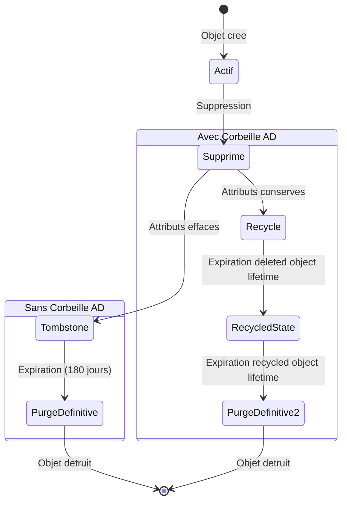

<!--
  Copyright 2026 Julien Bombled

  Licensed under the Apache License, Version 2.0 (the "License");
  you may not use this file except in compliance with the License.
  You may obtain a copy of the License at

      http://www.apache.org/licenses/LICENSE-2.0

  Unless required by applicable law or agreed to in writing, software
  distributed under the License is distributed on an "AS IS" BASIS,
  WITHOUT WARRANTIES OR CONDITIONS OF ANY KIND, either express or implied.
  See the License for the specific language governing permissions and
  limitations under the License.
-->

# Corbeille Active Directory

<span class="level-advanced">Avance</span> · Temps estime : 35 minutes

## Introduction

La **corbeille Active Directory** (AD Recycle Bin) est une fonctionnalite qui permet de restaurer des objets AD supprimes (utilisateurs, groupes, OU) sans avoir besoin d'une restauration authoritative ni d'un temps d'arret. Disponible depuis Windows Server 2008 R2, elle est devenue un indispensable de l'administration AD.

!!! warning "Prerequis critique"

    La corbeille AD necessite un **niveau fonctionnel de foret** minimum de Windows Server 2008 R2. Verifiez le niveau fonctionnel avant d'activer la fonctionnalite.

!!! example "Analogie"

    La corbeille Active Directory fonctionne exactement comme la corbeille du bureau d'un ordinateur. Quand vous supprimez un fichier, il va dans la corbeille et vous pouvez le restaurer avec tous ses attributs intacts (nom, date, contenu). Sans la corbeille AD, supprimer un compte utilisateur revient a utiliser "Supprimer definitivement" (Shift+Suppr) : l'objet disparait immediatement et ses attributs sont effaces. Avec la corbeille AD, il suffit de faire un clic droit > Restaurer pour recuperer le compte avec tous ses groupes, ses mots de passe speciaux et ses permissions.

## Cycle de vie d'un objet AD supprime

### Sans la corbeille AD

Sans la corbeille, un objet supprime passe par l'etat **tombstone** : la plupart de ses attributs sont effaces, ne laissant qu'un objet minimal pendant la duree de vie du tombstone (180 jours par defaut).

### Avec la corbeille AD

Avec la corbeille, un objet supprime conserve **tous ses attributs** pendant une duree configurable, permettant une restauration complete.



### Durees de retention

| Phase | Duree par defaut | Attributs conserves |
|---|---|---|
| **Deleted** (corbeille) | 180 jours | Tous les attributs |
| **Recycled** | 180 jours | Attributs minimaux (comme tombstone) |
| **Purge definitive** | - | Objet completement supprime |

```powershell
# Check the deleted object lifetime (days in Deleted state)
(Get-ADObject "CN=Directory Service,CN=Windows NT,CN=Services,CN=Configuration,DC=yourdomain,DC=local" `
    -Properties "msDS-DeletedObjectLifetime")."msDS-DeletedObjectLifetime"

# Check tombstone lifetime
(Get-ADObject "CN=Directory Service,CN=Windows NT,CN=Services,CN=Configuration,DC=yourdomain,DC=local" `
    -Properties tombstoneLifetime).tombstoneLifetime
```

Resultat :

```text
180

180
```

## Verification du niveau fonctionnel

```powershell
# Check forest functional level
(Get-ADForest).ForestMode

# Check domain functional level
(Get-ADDomain).DomainMode
```

Le niveau fonctionnel minimum requis est **Windows2008R2Forest** pour la foret.

!!! danger "Elevation du niveau fonctionnel"

    L'elevation du niveau fonctionnel de la foret est une operation **irreversible**. Assurez-vous que TOUS les controleurs de domaine de la foret executent au minimum Windows Server 2008 R2 avant de proceder.

```powershell
# Raise forest functional level (IRREVERSIBLE)
Set-ADForestMode -Identity "yourdomain.local" -ForestMode Windows2016Forest -Confirm
```

## Activer la corbeille AD

### Via PowerShell

```powershell
# Enable AD Recycle Bin (requires Enterprise Admin)
Enable-ADOptionalFeature `
    -Identity "Recycle Bin Feature" `
    -Scope ForestOrConfigurationSet `
    -Target "yourdomain.local" `
    -Confirm

# Verify activation
Get-ADOptionalFeature -Filter 'Name -like "Recycle*"' | Format-List Name, EnabledScopes
```

Resultat :

```text
Confirm
Are you sure you want to perform this action?
Performing the operation "Enable" on target "Recycle Bin Feature:CN=Recycle Bin Feature,CN=Optional Features,...".
[Y] Yes [A] Yes to All [N] No [L] No to All [S] Suspend [?] Help (default is "Y"): Y

Name          : Recycle Bin Feature
EnabledScopes : {CN=Partitions,CN=Configuration,DC=lab,DC=local}
```

### Via Active Directory Administrative Center (ADAC)

1. Ouvrir **Active Directory Administrative Center** (`dsac.exe`)
2. Selectionner le domaine dans le panneau de navigation
3. Dans le panneau Tasks, cliquer sur **Enable Recycle Bin**
4. Confirmer l'activation
5. Actualiser la console (F5)

!!! warning "Activation irreversible"

    Une fois activee, la corbeille AD ne peut **pas etre desactivee**. Cette operation est definitive. Cela ne pose generalement aucun probleme car la fonctionnalite n'a pas d'effets negatifs.

## Restaurer des objets supprimes

### Via PowerShell

```powershell
# List all deleted objects
Get-ADObject -Filter 'IsDeleted -eq $true' -IncludeDeletedObjects -Properties * |
    Select-Object Name, ObjectClass, WhenChanged, IsDeleted |
    Sort-Object WhenChanged -Descending

# Find a specific deleted user
Get-ADObject -Filter 'IsDeleted -eq $true -and Name -like "*jdupont*"' `
    -IncludeDeletedObjects -Properties *

# Restore a deleted user
Get-ADObject -Filter 'IsDeleted -eq $true -and Name -like "*jdupont*"' `
    -IncludeDeletedObjects | Restore-ADObject

# Restore a deleted user to a different OU
Get-ADObject -Filter 'IsDeleted -eq $true -and Name -like "*jdupont*"' `
    -IncludeDeletedObjects | Restore-ADObject -TargetPath "OU=Users,DC=yourdomain,DC=local"
```

Resultat :

```text
Name                  ObjectClass  WhenChanged           IsDeleted
----                  -----------  -----------           ---------
jdupont\0ADEL:abc123  user         20/02/2026 14:23:11   True
GRP-Finance\0ADEL:xyz group        19/02/2026 09:10:05   True
OU-Marketing\0ADEL:fg  org.Unit   18/02/2026 16:45:22   True

DistinguishedName : CN=jdupont\0ADEL:abc123,...,CN=Deleted Objects,...
Name              : jdupont
SamAccountName    : jdupont
DisplayName       : Jean Dupont
Department        : Comptabilite
Manager           : CN=Marie Martin,...

(Restore-ADObject ne produit pas de sortie en cas de succes)
```

### Restaurer une OU et son contenu

La restauration d'une OU supprimee doit se faire dans l'ordre : d'abord l'OU parent, puis son contenu.

```powershell
# Step 1: Restore the OU itself
Get-ADObject -Filter 'IsDeleted -eq $true -and Name -like "*OU-Marketing*" -and ObjectClass -eq "organizationalUnit"' `
    -IncludeDeletedObjects | Restore-ADObject

# Step 2: Restore all objects that were in the OU
Get-ADObject -Filter 'IsDeleted -eq $true -and LastKnownParent -like "*OU=OU-Marketing*"' `
    -IncludeDeletedObjects | Restore-ADObject
```

!!! tip "Ordre de restauration"

    Si l'OU parente a ete supprimee avec tout son contenu, restaurez d'abord le conteneur (OU), puis les objets enfants. Sinon, les objets enfants n'auront plus de conteneur cible.

### Via Active Directory Administrative Center

1. Ouvrir **ADAC** (`dsac.exe`)
2. Cliquer sur le conteneur **Deleted Objects** dans le domaine
3. Rechercher l'objet supprime
4. Clic droit > **Restore** (restaurer a l'emplacement d'origine) ou **Restore To** (choisir un emplacement)

## Restauration avancee

### Restaurer un groupe avec ses membres

Lorsqu'un groupe est supprime, les liens de membership ne sont pas automatiquement restaures.

```powershell
# Restore the group
Get-ADObject -Filter 'IsDeleted -eq $true -and Name -like "*GRP-Finance*" -and ObjectClass -eq "group"' `
    -IncludeDeletedObjects | Restore-ADObject

# After restoring, manually verify and re-add members if needed
Get-ADGroupMember -Identity "GRP-Finance"
```

!!! warning "Attributs linked-value"

    Les attributs de type linked-value (comme la membership de groupe) sont generalement conserves dans la corbeille, mais il est recommande de verifier apres restauration. Si des membres manquent, il faut les re-ajouter manuellement.

### Verifier les attributs d'un objet supprime

```powershell
# Examine all attributes of a deleted object before restoring
Get-ADObject -Filter 'IsDeleted -eq $true -and Name -like "*jdupont*"' `
    -IncludeDeletedObjects -Properties * | Format-List *
```

## Modifier la duree de retention

```powershell
# Set deleted object lifetime to 365 days
Set-ADObject "CN=Directory Service,CN=Windows NT,CN=Services,CN=Configuration,DC=yourdomain,DC=local" `
    -Replace @{ "msDS-DeletedObjectLifetime" = 365 }

# Set tombstone (recycled object) lifetime to 365 days
Set-ADObject "CN=Directory Service,CN=Windows NT,CN=Services,CN=Configuration,DC=yourdomain,DC=local" `
    -Replace @{ tombstoneLifetime = 365 }
```

## Protection contre la suppression accidentelle

Pour prevenir les suppressions, activez la protection sur les OU critiques :

```powershell
# Enable accidental deletion protection on an OU
Set-ADOrganizationalUnit -Identity "OU=Users,DC=yourdomain,DC=local" `
    -ProtectedFromAccidentalDeletion $true

# Enable protection on all OUs
Get-ADOrganizationalUnit -Filter * | Set-ADOrganizationalUnit -ProtectedFromAccidentalDeletion $true

# Verify protection status
Get-ADOrganizationalUnit -Filter * -Properties ProtectedFromAccidentalDeletion |
    Select-Object Name, ProtectedFromAccidentalDeletion
```

!!! example "Scenario pratique"

    **Contexte :** Emilie est administratrice AD dans une entreprise de 300 personnes (domaine `lab.local`). Lors d'une reorganisation, un technicien junior a supprime par erreur l'OU `OU=Comptabilite` qui contenait 22 comptes utilisateurs et 4 groupes. La suppression a ete effectuee il y a 2 heures. Les utilisateurs de la comptabilite ne peuvent plus se connecter.

    **Verification de la corbeille AD :**

    ```powershell
    # Check if AD Recycle Bin is enabled
    Get-ADOptionalFeature -Filter 'Name -like "Recycle*"' | Select-Object Name, EnabledScopes
    ```

    ```text
    Name               EnabledScopes
    ----               -------------
    Recycle Bin Feature {CN=Partitions,CN=Configuration,DC=lab,DC=local}
    ```

    La corbeille est active. Emilie peut restaurer les objets.

    ```powershell
    # Step 1: Find the deleted OU
    Get-ADObject -Filter 'IsDeleted -eq $true -and Name -like "*Comptabilite*"' `
        -IncludeDeletedObjects -Properties WhenChanged | Select-Object Name, WhenChanged
    ```

    ```text
    Name                              WhenChanged
    ----                              -----------
    Comptabilite\0ADEL:f1e2d3c4-...   20/02/2026 14:23:11
    ```

    ```powershell
    # Step 2: Restore the OU first (container before its contents)
    Get-ADObject -Filter 'IsDeleted -eq $true -and Name -like "*Comptabilite*" -and ObjectClass -eq "organizationalUnit"' `
        -IncludeDeletedObjects | Restore-ADObject

    # Step 3: Restore all users and groups that were in the OU
    $deleted = Get-ADObject -Filter 'IsDeleted -eq $true -and LastKnownParent -like "*OU=Comptabilite*"' `
        -IncludeDeletedObjects -Properties ObjectClass, DisplayName
    $deleted | ForEach-Object {
        Restore-ADObject -Identity $_
        Write-Host "Restored: $($_.DisplayName) ($($_.ObjectClass))"
    }
    ```

    ```text
    Restored: Jean Dupont (user)
    Restored: Marie Martin (user)
    Restored: Pierre Leclerc (user)
    ... (22 utilisateurs + 4 groupes)
    Restored: GRP-Comptabilite-RW (group)
    ```

    ```powershell
    # Step 4: Verify users can be found again
    Get-ADUser -Filter 'Department -eq "Comptabilite"' | Measure-Object
    ```

    ```text
    Count : 22
    ```

    L'integralite des 22 comptes et des 4 groupes a ete restauree en 4 minutes, avec tous leurs attributs (mot de passe, groupes d'appartenance, profil). Les utilisateurs ont pu se reconnecter immediatement.

!!! danger "Erreurs courantes"

    **Restaurer les objets enfants avant le conteneur** — Si l'OU a ete supprimee avec son contenu, il faut restaurer l'OU en premier, puis les objets qu'elle contenait. Inverser cet ordre fait echouer la restauration car les objets enfants n'ont plus de conteneur valide.

    **La corbeille AD n'est pas encore activee** — Si la corbeille n'a pas ete activee avant la suppression, les objets passent directement en etat tombstone et perdent la plupart de leurs attributs. Sans corbeille, la seule option est une restauration authoritative depuis une sauvegarde — bien plus complexe.

    **Elever le niveau fonctionnel sans verifier tous les DC** — L'elevation du niveau fonctionnel de la foret echoue si un DC execute une version de Windows Server anterieure au niveau cible. Verifiez tous les DC avec `Get-ADDomainController -Filter *` avant de proceder.

    **Confondre la duree de vie "Deleted" et "Recycled"** — La periode de 180 jours pendant laquelle tous les attributs sont conserves correspond a l'etat "Deleted". Apres, l'objet passe en etat "Recycled" et perd la plupart de ses attributs (comme un tombstone classique). Ne vous fiez pas a la duree de vie du tombstone pour estimer la fenetre de restauration complete.

    **Negliger la protection contre la suppression accidentelle** — La corbeille AD est un filet de securite, pas une excuse pour ne pas activer `ProtectedFromAccidentalDeletion` sur les OU critiques. Une suppression protegee echoue immediatement et evite d'avoir a recourir a la corbeille.

## Points cles a retenir

- La corbeille AD conserve **tous les attributs** des objets supprimes (contrairement au tombstone)
- L'activation est **irreversible** et necessite le niveau fonctionnel de foret **2008 R2 minimum**
- La duree de retention par defaut est de **180 jours** (configurable)
- Restaurez d'abord les conteneurs (OU) avant les objets enfants
- Activez la protection contre la suppression accidentelle sur toutes les OU critiques
- La corbeille AD ne remplace pas les sauvegardes : elle ne protege pas contre la corruption ou les modifications

## Pour aller plus loin

- Restauration systeme : [Restauration systeme](restauration-systeme.md)
- Windows Server Backup : [Windows Server Backup](windows-server-backup.md)
- Documentation Microsoft : Active Directory Recycle Bin Step-by-Step Guide

