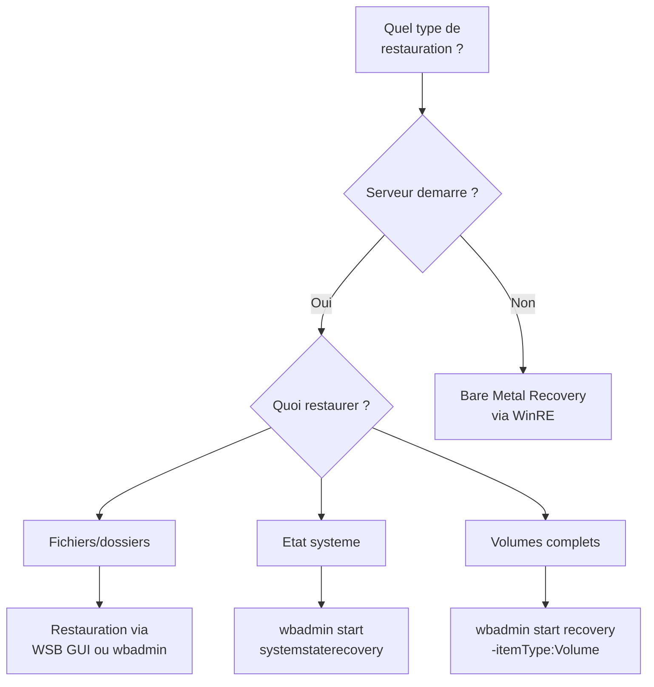
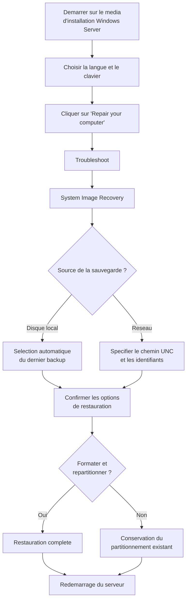

# Restauration systeme

<span class="level-advanced">Avance</span> · Temps estime : 50 minutes

## Introduction

Savoir sauvegarder est essentiel, mais savoir **restaurer** est critique. Ce chapitre couvre les differentes methodes de restauration sous Windows Server 2022, depuis la restauration de fichiers individuels jusqu'a la reconstruction complete d'un serveur (Bare Metal Recovery).

## Types de restauration



## Restauration de fichiers et dossiers

La restauration la plus courante : recuperer des fichiers supprimes ou corrompus.

### Via PowerShell (wbadmin)

```powershell
# List available backup versions
wbadmin get versions

# Restore specific files from the latest backup
wbadmin start recovery `
    -version:01/15/2025-21:00 `
    -itemType:File `
    -items:"D:\Data\ImportantFile.xlsx" `
    -recoveryTarget:"D:\Restored" `
    -quiet
```

### Via l'interface graphique

1. Ouvrir **Windows Server Backup** (`wbadmin.msc`)
2. Cliquer sur **Recover** dans le panneau Actions
3. Selectionner la source : serveur local ou autre emplacement
4. Choisir la date de la sauvegarde
5. Selectionner **Files and folders**
6. Naviguer dans l'arborescence et selectionner les elements
7. Choisir la destination : emplacement d'origine ou repertoire alternatif

!!! tip "Gestion des conflits"

    Lors de la restauration vers l'emplacement d'origine, WSB propose de : ecraser la version existante, creer une copie, ou ignorer le fichier. En cas de doute, restaurez vers un emplacement alternatif.

## Restauration de l'etat systeme

La restauration de l'etat systeme est critique pour les controleurs de domaine. Elle restaure :

- La base Active Directory (NTDS.dit)
- Le registre Windows
- Le dossier SYSVOL
- Les fichiers de demarrage
- Le magasin de certificats

### Restauration non-authoritative (par defaut)

La restauration **non-authoritative** restaure les donnees AD a leur etat au moment de la sauvegarde. Ensuite, la replication AD apporte les modifications recentes depuis les autres DC.

```powershell
# System state restore (requires DSRM mode for domain controllers)
wbadmin start systemstaterecovery `
    -version:01/15/2025-21:00 `
    -quiet
```

!!! warning "Mode DSRM pour les DC"

    Sur un controleur de domaine, la restauration de l'etat systeme doit etre effectuee en **mode DSRM** (Directory Services Restore Mode). Redemarrez le serveur en mode DSRM via `bcdedit /set safeboot dsrepair` puis redemarrez.

```powershell
# Boot into DSRM mode (requires reboot)
bcdedit /set safeboot dsrepair
Restart-Computer -Force

# After system state restore, return to normal boot
bcdedit /deletevalue safeboot
Restart-Computer -Force
```

### Restauration authoritative

La restauration **authoritative** force la replication des donnees restaurees vers tous les autres DC. Utilisee pour recuperer des objets supprimes de maniere definitive.

```powershell
# Step 1: Boot into DSRM and restore system state (non-authoritative)
wbadmin start systemstaterecovery -version:01/15/2025-21:00 -quiet

# Step 2: Mark specific objects as authoritative using ntdsutil
ntdsutil
# > activate instance ntds
# > authoritative restore
# > restore subtree "OU=Users,DC=yourdomain,DC=local"
# > quit
# > quit

# Step 3: Reboot normally
bcdedit /deletevalue safeboot
Restart-Computer -Force
```

!!! danger "Utilisation de la restauration authoritative"

    La restauration authoritative ne doit etre utilisee que dans des situations specifiques (suppression massive d'objets AD). Elle ecrase les modifications recentes sur les autres DC pour les objets concernes. Privilegiez la corbeille AD pour les suppressions recentes.

## Bare Metal Recovery (BMR)

Le BMR permet de restaurer un serveur **a partir de zero**, sur un materiel vierge ou un nouveau materiel (en general compatible).

### Prerequis

- Support d'installation Windows Server 2022 (ISO/USB)
- Acces a la sauvegarde BMR (disque local ou partage reseau)
- Pilotes de stockage si le nouveau materiel differe de l'original

### Procedure de restauration BMR



### Etapes detaillees

1. **Demarrer sur le media d'installation** Windows Server 2022
2. Ecran de selection de la langue : cliquer sur **Suivant**
3. Cliquer sur **Repair your computer** (en bas a gauche)
4. Choisir **Troubleshoot** > **System Image Recovery**
5. Selectionner le systeme d'exploitation cible
6. L'assistant detecte automatiquement les sauvegardes disponibles
7. Selectionner le jeu de sauvegarde a restaurer
8. Options avancees :
    - **Format and repartition disks** : recree les partitions (recommande sur nouveau materiel)
    - **Exclude disks** : exclure des disques de la restauration
9. Confirmer et lancer la restauration
10. Redemarrer a la fin du processus

!!! warning "Materiel different"

    Si le materiel cible differe de l'original (controleur de stockage different), il peut etre necessaire d'injecter des pilotes via l'option **Install drivers** dans WinRE avant la restauration.

## Windows Recovery Environment (WinRE)

WinRE est l'environnement de recuperation integre a Windows. Il demarre automatiquement apres plusieurs echecs de demarrage ou peut etre lance manuellement.

### Acceder a WinRE

```powershell
# Check if WinRE is configured
reagentc /info

# Boot into WinRE (requires reboot)
reagentc /boottore
Restart-Computer -Force
```

### Outils disponibles dans WinRE

| Outil | Description |
|---|---|
| **System Image Recovery** | Restauration BMR |
| **Startup Repair** | Reparation automatique du demarrage |
| **Command Prompt** | Acces a la ligne de commande |
| **UEFI Firmware Settings** | Acces au BIOS/UEFI |
| **Uninstall Updates** | Desinstaller des mises a jour problematiques |

### Reparation du demarrage via la ligne de commande

```powershell
# Rebuild BCD (Boot Configuration Data)
bootrec /rebuildbcd

# Fix the MBR
bootrec /fixmbr

# Fix the boot sector
bootrec /fixboot

# Scan for Windows installations
bootrec /scanos

# Check and repair system files
sfc /scannow /offbootdir=C:\ /offwindir=C:\Windows

# Check disk integrity
chkdsk C: /r
```

## Restauration a partir d'un autre serveur

Si le serveur d'origine n'est plus disponible, il est possible de restaurer des fichiers depuis un catalogue de sauvegarde sur un autre serveur.

```powershell
# Import a backup catalog from an external disk
wbadmin restore catalog -backupTarget:E: -quiet

# List available backups from the imported catalog
wbadmin get versions -backupTarget:E:

# Restore files from the imported backup
wbadmin start recovery `
    -version:01/15/2025-21:00 `
    -backupTarget:E: `
    -itemType:File `
    -items:"D:\Data" `
    -recoveryTarget:"C:\RestoredData" `
    -quiet
```

## Checklist de restauration

Avant de restaurer :

- [ ] Identifier le type de restauration necessaire (fichier, system state, BMR)
- [ ] Verifier la disponibilite et l'integrite du jeu de sauvegarde
- [ ] Documenter l'etat actuel du serveur avant la restauration
- [ ] Prevenir les utilisateurs de l'interruption de service
- [ ] Preparer le media d'installation Windows Server (pour BMR)
- [ ] Verifier la compatibilite materielle (pour BMR sur nouveau materiel)

Apres la restauration :

- [ ] Verifier le fonctionnement du systeme d'exploitation
- [ ] Controler les services critiques
- [ ] Verifier la replication AD (si controleur de domaine)
- [ ] Appliquer les mises a jour manquantes
- [ ] Documenter l'operation effectuee

## Points cles a retenir

- La restauration de fichiers est la plus simple et la plus courante
- La restauration de l'etat systeme sur un DC necessite le mode **DSRM**
- La restauration **authoritative** force la replication depuis le DC restaure (a utiliser avec precaution)
- Le **BMR** permet la restauration complete sur un serveur vierge
- WinRE est l'environnement de recuperation accessible meme si Windows ne demarre plus
- Testez vos procedures de restauration **avant** d'en avoir besoin

## Pour aller plus loin

- Windows Server Backup : [Windows Server Backup](windows-server-backup.md)
- Corbeille AD : [AD Recycle Bin](ad-recycle-bin.md)
- Strategie de sauvegarde : [Strategie de sauvegarde](strategie-sauvegarde.md)
