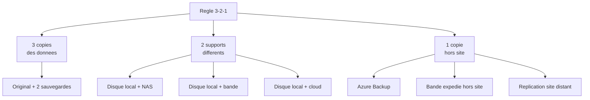
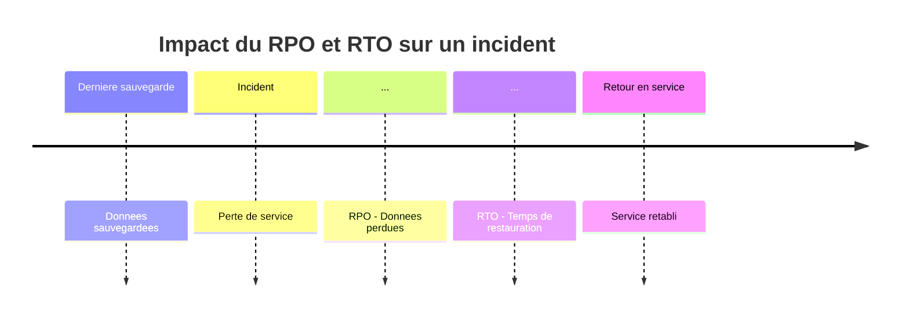

<!--
  Copyright 2026 Julien Bombled

  Licensed under the Apache License, Version 2.0 (the "License");
  you may not use this file except in compliance with the License.
  You may obtain a copy of the License at

      http://www.apache.org/licenses/LICENSE-2.0

  Unless required by applicable law or agreed to in writing, software
  distributed under the License is distributed on an "AS IS" BASIS,
  WITHOUT WARRANTIES OR CONDITIONS OF ANY KIND, either express or implied.
  See the License for the specific language governing permissions and
  limitations under the License.
-->

# Strategie de sauvegarde

<span class="level-advanced">Avance</span> · Temps estime : 35 minutes

## Introduction

Disposer d'un outil de sauvegarde ne suffit pas. Sans une **strategie** reflechie, les sauvegardes risquent d'etre incompletes, trop anciennes ou impossibles a restaurer dans les delais requis. Ce chapitre couvre les concepts fondamentaux pour definir une strategie de sauvegarde adaptee a un environnement Windows Server.

## La regle 3-2-1

!!! example "Analogie"

    La regle 3-2-1, c'est comme garder une copie de ses documents importants. On garde l'original chez soi, une photocopie chez un ami, et une troisieme dans un coffre a la banque. Si la maison brule, on a la copie chez l'ami. Si l'immeuble s'effondre, on a le coffre. C'est le meme principe pour les donnees de l'entreprise : aucun sinistre unique ne doit pouvoir detruire les trois copies en meme temps.

La regle **3-2-1** est le socle de toute strategie de sauvegarde fiable :



| Principe | Description | Exemple |
|---|---|---|
| **3 copies** | Les donnees doivent exister en au moins 3 exemplaires | Original + sauvegarde locale + sauvegarde cloud |
| **2 supports** | Utiliser au moins 2 types de media differents | Disque dur + Azure Blob Storage |
| **1 hors site** | Au moins une copie hors du site principal | Coffre Azure Recovery Services |

!!! danger "Un seul support ne suffit pas"

    Un disque dur peut tomber en panne. Un NAS dans la meme salle de serveur brule avec le reste. Sans copie hors site, un sinistre majeur (incendie, inondation) detruit toutes les sauvegardes.

## RPO et RTO

### RPO (Recovery Point Objective)

Le **RPO** represente la quantite maximale de donnees que l'on accepte de perdre en cas de sinistre. Il se mesure en temps.

- RPO de 24 heures = sauvegarde quotidienne (perte de 1 jour de donnees maximum)
- RPO de 1 heure = sauvegarde toutes les heures
- RPO de 0 = replication synchrone en temps reel

### RTO (Recovery Time Objective)

Le **RTO** represente le delai maximal acceptable pour restaurer le service apres un incident.

- RTO de 4 heures = le service doit etre retabli en 4 heures maximum
- RTO de 15 minutes = basculement automatique quasi immediat (cluster, replication)



### Matrice RPO/RTO par type de service

| Service | RPO recommande | RTO recommande | Solution |
|---|---|---|---|
| Active Directory | 24h | 1h | System state backup + BMR |
| Base de donnees SQL | 15 min - 1h | 30 min - 2h | SQL backup + log shipping |
| Serveur de fichiers | 4h - 24h | 2h - 8h | WSB + snapshots VSS |
| Serveur web (IIS) | 24h | 30 min | Configuration as code + BMR |
| Hyper-V (VMs) | 1h - 4h | 15 min - 1h | Hyper-V Replica + checkpoint |

!!! tip "Definir RPO et RTO avec les metiers"

    Les valeurs de RPO et RTO doivent etre definies avec les responsables metiers, pas uniquement par l'equipe IT. Le cout de la solution de sauvegarde augmente a mesure que RPO et RTO diminuent.

## Types de sauvegarde

### Sauvegarde complete (Full)

Copie l'integralite des donnees selectionnees a chaque execution.

- **Avantage** : restauration simple et rapide (un seul jeu de sauvegarde)
- **Inconvenient** : temps et espace de stockage importants

### Sauvegarde differentielle

Copie toutes les modifications depuis la **derniere sauvegarde complete**.

- **Avantage** : restauration avec 2 jeux (full + derniere differentielle)
- **Inconvenient** : taille croissante au fil des jours

### Sauvegarde incrementale

Copie uniquement les modifications depuis la **derniere sauvegarde** (complete ou incrementale).

- **Avantage** : la plus rapide et la plus economique en stockage
- **Inconvenient** : restauration plus complexe (full + toutes les incrementales)

### Comparaison visuelle


| Critere | Full | Differentielle | Incrementale |
|---|---|---|---|
| Temps de sauvegarde | Long | Moyen (croissant) | Court |
| Espace requis | Eleve | Moyen (croissant) | Faible |
| Temps de restauration | Rapide | Moyen | Long |
| Complexite restauration | 1 jeu | 2 jeux | N jeux |

## Schema de rotation

### GFS (Grandfather-Father-Son)

Le schema GFS est le standard pour la retention des sauvegardes :

| Niveau | Frequence | Retention | Type |
|---|---|---|---|
| **Son (quotidien)** | Tous les jours | 7 jours | Incrementale |
| **Father (hebdomadaire)** | Chaque dimanche | 4 semaines | Complete |
| **Grandfather (mensuel)** | 1er du mois | 12 mois | Complete |
| **Annuel** | 1er janvier | 3-7 ans | Complete |

```powershell
# Example: WSB scheduled backup with daily incremental
$policy = New-WBPolicy
Add-WBBareMetalRecovery -Policy $policy

$target = New-WBBackupTarget -Disk (Get-WBDisk | Where-Object { $_.DiskNumber -eq 1 })
Add-WBBackupTarget -Policy $policy -Target $target

# WSB automatically manages incremental and retention
Set-WBSchedule -Policy $policy -Schedule 22:00
Set-WBPolicy -Policy $policy
```

Resultat :

```text
(Set-WBPolicy ne produit pas de sortie en cas de succes — la politique est enregistree)

# Verifier la planification enregistree :
Get-WBPolicy

Schedule     : {22:00:00}
BackupTargets:
  DiskNumber : 1
  Label      : BackupDisk
BMR          : True
```

## Plan de test de restauration

!!! danger "Une sauvegarde non testee n'existe pas"

    La seule facon de valider une strategie de sauvegarde est de **tester la restauration regulierement**.

### Frequence de test recommandee

| Type de test | Frequence | Objectif |
|---|---|---|
| Restauration de fichiers | Mensuelle | Verifier l'integrite des donnees |
| Restauration system state | Trimestrielle | Valider la restauration AD |
| Bare metal recovery | Semestrielle | Valider la restauration complete |
| Test de PRA complet | Annuelle | Simuler un sinistre majeur |

### Documentation du test

Chaque test de restauration doit etre documente :

- Date et heure du test
- Type de restauration effectue
- Jeu de sauvegarde utilise (date de la sauvegarde)
- Temps reel de restauration (compare au RTO)
- Integrite des donnees restaurees
- Problemes rencontres et actions correctives

!!! example "Scenario pratique"

    **Contexte :** Laurent est administrateur systeme dans un cabinet juridique de 80 personnes. Il dispose d'un serveur de fichiers (`SRV-01`, Windows Server 2022) contenant tous les dossiers clients. Un associe lui demande de justifier que les donnees sont protegees et recuperables en moins de 4 heures (RTO=4h) avec une perte maximale d'une journee de travail (RPO=24h).

    **Probleme :** Laurent a bien une sauvegarde nocturne, mais elle ecrit sur un NAS situe dans la meme salle serveur. Il n'y a aucune copie hors site. En cas d'incendie ou de vol, toutes les donnees seraient perdues.

    **Solution :** Laurent met en place une strategie 3-2-1 complete :

    1. **Copie 1** : donnees originales sur `SRV-01` (disque C: et D:)
    2. **Copie 2** : sauvegarde WSB nocturne vers le NAS local (`\\NAS-01\Backups`)
    3. **Copie 3** : replication hebdomadaire vers Azure Backup

    Il documente les RPO/RTO negocies avec les associes :

    | Service | RPO | RTO | Solution |
    |---|---|---|---|
    | Dossiers clients | 24h | 4h | WSB + BMR |
    | Courriels Exchange | 4h | 2h | Exchange Online (cloud) |
    | Fichiers systeme | 24h | 2h | WSB system state |

    Pour valider la strategie, Laurent effectue un test de restauration trimestriel :

    ```powershell
    # List available backup versions
    wbadmin get versions -backupTarget:\\NAS-01\Backups
    ```

    ```text
    Backup time: 20/02/2026 22:00:00
    Backup target: Network Share labeled \\NAS-01\Backups
    Version identifier: 02/20/2026-22:00
    Can recover: Volume(s), File(s), Application(s), Bare Metal Recovery, System State
    ```

    ```powershell
    # Test file restoration (pick a file from last night's backup)
    wbadmin start recovery `
        -version:02/20/2026-22:00 `
        -backupTarget:\\NAS-01\Backups `
        -itemType:File `
        -items:"D:\Clients\DossierTest\rapport.docx" `
        -recoveryTarget:"C:\TestRestore" `
        -quiet
    ```

    ```text
    Retrieving volume information...
    Starting recovery of D:\Clients\DossierTest\rapport.docx to C:\TestRestore ...
    Successfully recovered D:\Clients\DossierTest\rapport.docx to C:\TestRestore.
    The recovery operation completed successfully.
    ```

    Laurent documente le resultat (temps de restauration : 3 minutes pour un fichier, RTO tenu) et le presente lors du prochain audit.

!!! danger "Erreurs courantes"

    **Sauvegarde et donnees sur le meme disque physique** — Sauvegarder sur une partition differente du meme disque ne protege pas contre une panne materielle. Le disque de sauvegarde doit etre physiquement distinct.

    **Ne jamais tester la restauration** — Une sauvegarde non testee peut etre corrompue, incomplete ou incompatible avec le nouveau materiel. Les tests de restauration doivent etre planifies et documentes, pas optionnels.

    **RPO et RTO definis sans consulter les metiers** — Un RPO de 24h pour une base de donnees de transactions financieres peut etre inacceptable pour le directeur financier. Impliquez les responsables metiers dans la definition de ces objectifs.

    **Schema GFS non respecte** — Sans rotation structuree (quotidien/hebdomadaire/mensuel), les sauvegardes les plus anciennes sont ecrasees trop tot. Une suppression accidentelle decouverte 45 jours apres ne peut pas etre recuperee si la rotation ne conserve que 7 jours.

    **Copie hors site oubliee** — Avoir deux disques dans la meme piece n'est pas une vraie redondance. Un incendie, une inondation ou un vol peut tout emporter. La copie hors site (cloud ou site distant) n'est pas optionnelle.

## Points cles a retenir

- La regle **3-2-1** (3 copies, 2 supports, 1 hors site) est le minimum acceptable
- Le **RPO** definit la perte de donnees maximale toleree ; le **RTO** definit le temps de restauration maximal
- Les sauvegardes **incrementales** optimisent le stockage mais complexifient la restauration
- Le schema **GFS** (quotidien/hebdomadaire/mensuel) organise la retention
- **Testez** vos restaurations regulierement ; une sauvegarde non testee est une fausse securite
- Impliquez les metiers dans la definition des RPO/RTO

## Pour aller plus loin

- Windows Server Backup : [Windows Server Backup](windows-server-backup.md)
- Restauration systeme : [Restauration systeme](restauration-systeme.md)
- Documentation Microsoft : Planning Backup and Recovery

