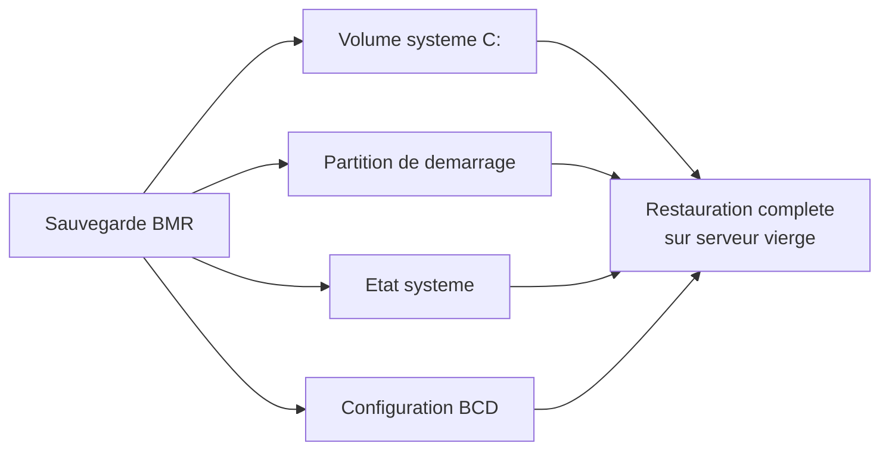

# Windows Server Backup

<span class="level-advanced">Avance</span> · Temps estime : 45 minutes

## Introduction

**Windows Server Backup** (WSB) est la fonctionnalite de sauvegarde integree a Windows Server. Bien qu'elle ne remplace pas les solutions de sauvegarde d'entreprise (Veeam, Commvault, etc.), WSB est un outil fiable pour les environnements de petite et moyenne taille et pour les sauvegardes de l'etat systeme.

WSB utilise la technologie **VSS** (Volume Shadow Copy Service) pour creer des instantanes coherents, meme lorsque les fichiers sont en cours d'utilisation.

## Installation

WSB n'est pas installe par defaut. Il doit etre ajoute comme fonctionnalite.

```powershell
# Install Windows Server Backup feature
Install-WindowsFeature -Name Windows-Server-Backup -IncludeManagementTools

# Verify installation
Get-WindowsFeature -Name Windows-Server-Backup
```

Apres l'installation, l'outil est accessible via :

- **GUI** : `wbadmin.msc` ou Server Manager > Tools > Windows Server Backup
- **CLI** : cmdlet `wbadmin` ou module PowerShell `WindowsServerBackup`

## Types de sauvegarde

| Type | Description | Espace requis | Temps |
|---|---|---|---|
| **Full (complete)** | Sauvegarde l'integralite des donnees selectionnees | Eleve | Long |
| **Incremental** | Sauvegarde uniquement les modifications depuis la derniere sauvegarde | Reduit | Court |
| **System State** | AD, registre, fichiers systeme, boot, SYSVOL | Moyen | Moyen |
| **Bare Metal Recovery** | Tout le necessaire pour restaurer sur un serveur vierge | Eleve | Long |

!!! tip "WSB et les incrementales"

    Windows Server Backup utilise par defaut des sauvegardes incrementales au niveau des blocs. Meme lorsque vous planifiez une sauvegarde "complete", WSB optimise le stockage en ne copiant que les blocs modifies.

## Sauvegarde via PowerShell

### Sauvegarde complete du serveur

```powershell
# Define the backup policy
$policy = New-WBPolicy

# Add all volumes (full server backup)
$volumes = Get-WBVolume -AllVolumes
Add-WBVolume -Policy $policy -Volume $volumes

# Include bare metal recovery
Add-WBBareMetalRecovery -Policy $policy

# Include system state
Add-WBSystemState -Policy $policy

# Set backup target (dedicated disk)
$targetDisk = Get-WBDisk | Where-Object { $_.DiskNumber -eq 1 }
$target = New-WBBackupTarget -Disk $targetDisk -Label "BackupDisk"
Add-WBBackupTarget -Policy $policy -Target $target

# Execute the backup
Start-WBBackup -Policy $policy
```

### Sauvegarde vers un partage reseau

```powershell
$policy = New-WBPolicy

# Add bare metal recovery
Add-WBBareMetalRecovery -Policy $policy
Add-WBSystemState -Policy $policy

# Configure network share as target
$cred = Get-Credential -Message "Credentials for backup share"
$target = New-WBBackupTarget -NetworkPath "\\YOURBACKUPSERVER\Backups" -Credential $cred
Add-WBBackupTarget -Policy $policy -Target $target

# Run backup
Start-WBBackup -Policy $policy
```

!!! warning "Sauvegarde reseau"

    Lors d'une sauvegarde vers un partage reseau, WSB ne conserve qu'**une seule version**. Chaque nouvelle sauvegarde ecrase la precedente. Pour conserver un historique, utilisez un disque local dedie.

### Sauvegarde de volumes specifiques

```powershell
$policy = New-WBPolicy

# Add only specific volumes
$volumeC = Get-WBVolume -VolumePath "C:"
$volumeD = Get-WBVolume -VolumePath "D:"
Add-WBVolume -Policy $policy -Volume $volumeC, $volumeD

# Target: dedicated backup disk
$target = New-WBBackupTarget -Disk (Get-WBDisk | Where-Object { $_.DiskNumber -eq 2 })
Add-WBBackupTarget -Policy $policy -Target $target

Start-WBBackup -Policy $policy
```

### Sauvegarde de l'etat systeme uniquement

```powershell
# Quick system state backup (AD, registry, boot files)
wbadmin start systemstatebackup -backupTarget:E: -quiet
```

## Sauvegarde via l'interface graphique

1. Ouvrir **Windows Server Backup** (`wbadmin.msc`)
2. Dans le panneau Actions, cliquer sur **Backup Once** ou **Backup Schedule**
3. Choisir les options :
    - **Full server** : tout le serveur (recommande)
    - **Custom** : selection de volumes, fichiers ou system state
4. Selectionner la destination de sauvegarde
5. Confirmer et demarrer

## Planification des sauvegardes

### Via PowerShell

```powershell
$policy = New-WBPolicy

# Add backup content
Add-WBBareMetalRecovery -Policy $policy
Add-WBSystemState -Policy $policy

# Configure backup target
$target = New-WBBackupTarget -Disk (Get-WBDisk | Where-Object { $_.DiskNumber -eq 1 })
Add-WBBackupTarget -Policy $policy -Target $target

# Schedule daily backup at 9:00 PM
Set-WBSchedule -Policy $policy -Schedule 21:00

# Apply the scheduled policy
Set-WBPolicy -Policy $policy

# Verify the scheduled policy
Get-WBPolicy
```

### Multiples horaires

```powershell
# Schedule backup twice daily
Set-WBSchedule -Policy $policy -Schedule 06:00, 18:00
```

### Verification de la planification

```powershell
# View current backup schedule
$currentPolicy = Get-WBPolicy
$currentPolicy | Format-List Schedule, BackupTargets

# View last backup status
Get-WBSummary

# View backup history
Get-WBBackupSet
```

## Bare Metal Recovery (BMR)

La sauvegarde BMR inclut tout le necessaire pour restaurer un serveur a partir de zero :

- Volumes critiques (volume systeme, volume de demarrage)
- Etat systeme (registre, Active Directory si DC, fichiers de boot)
- Configuration de demarrage

```powershell
# Verify BMR backup is included
$policy = Get-WBPolicy
$policy.BMR  # Should return True
```



!!! danger "Testez vos restaurations"

    Une sauvegarde non testee est une sauvegarde non fiable. Planifiez des tests de restauration BMR reguliers dans un environnement isole pour valider l'integrite de vos sauvegardes.

## Surveillance et diagnostic

```powershell
# View last backup summary
Get-WBSummary | Format-List LastSuccessfulBackupTime, LastBackupResultHR, LastBackupResultDetailedHR

# View detailed backup job status
Get-WBJob -Previous 5

# Check Windows Server Backup event logs
Get-WinEvent -LogName "Microsoft-Windows-Backup" -MaxEvents 20 | Format-Table TimeCreated, Message -Wrap
```

## Limitations de WSB

| Limitation | Alternative |
|---|---|
| Une seule version en sauvegarde reseau | Utiliser un disque local dedie |
| Pas de granularite fichier en planifie | Utiliser un logiciel tiers |
| Pas de deduplication native | Solutions tierces ou Azure Backup |
| Pas de sauvegarde sur bande | Solutions d'entreprise (Veeam, etc.) |
| Pas de chiffrement natif | BitLocker sur le volume de sauvegarde |

## Points cles a retenir

- WSB est un outil fiable pour les environnements de petite taille et les sauvegardes system state
- Toujours inclure **Bare Metal Recovery** dans les sauvegardes planifiees
- Les sauvegardes vers un partage reseau n'offrent qu'**une seule version**
- La planification se fait via `Set-WBSchedule` et `Set-WBPolicy`
- Testez regulierement vos restaurations dans un environnement de test
- Pour des besoins avances (deduplication, chiffrement, bandes), envisagez une solution tierce

## Pour aller plus loin

- Strategie de sauvegarde : [Strategie de sauvegarde](strategie-sauvegarde.md)
- Restauration systeme : [Restauration systeme](restauration-systeme.md)
- Documentation Microsoft : Windows Server Backup Feature Overview
