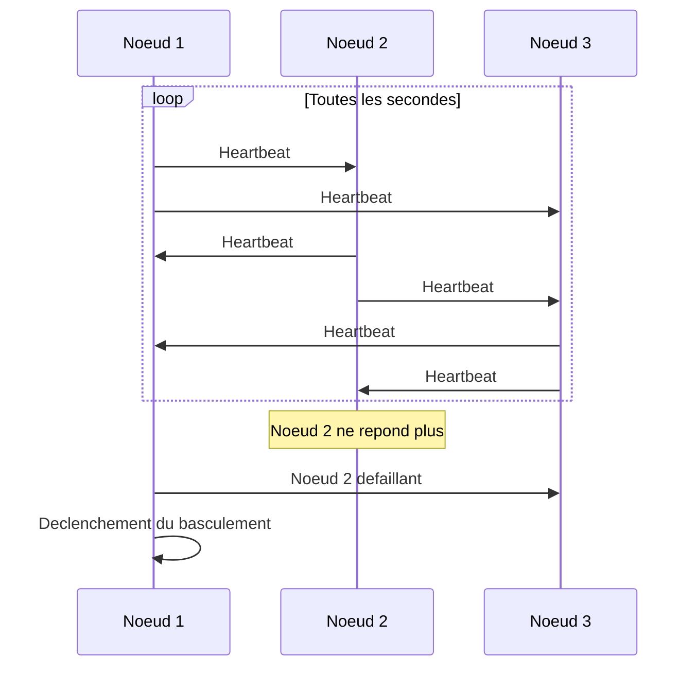
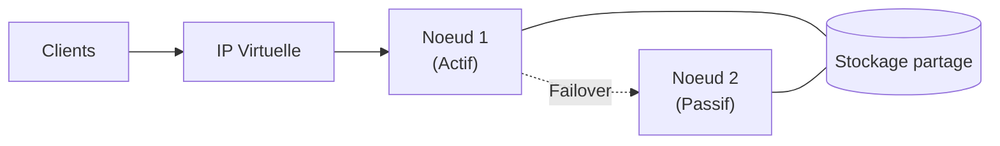
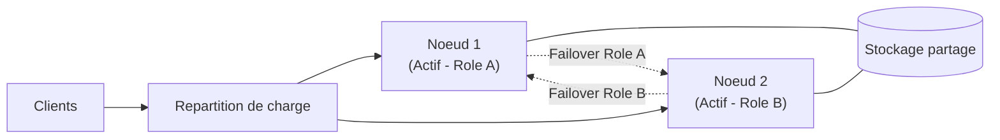

<!--
  Copyright 2026 Julien Bombled

  Licensed under the Apache License, Version 2.0 (the "License");
  you may not use this file except in compliance with the License.
  You may obtain a copy of the License at

      http://www.apache.org/licenses/LICENSE-2.0

  Unless required by applicable law or agreed to in writing, software
  distributed under the License is distributed on an "AS IS" BASIS,
  WITHOUT WARRANTIES OR CONDITIONS OF ANY KIND, either express or implied.
  See the License for the specific language governing permissions and
  limitations under the License.
-->
---
title: "Concepts du clustering avec basculement"
description: "Comprendre les fondamentaux du failover clustering sous Windows Server 2022 : noeuds, heartbeat, basculement, modes actif-passif et actif-actif."
tags:
  - haute-disponibilite
  - cluster
  - failover
  - windows-server
---

# Concepts du clustering avec basculement

<span class="level-advanced">Avance</span> · Temps estime : 45 minutes

## Introduction

Le **failover clustering** (clustering avec basculement) est la technologie de haute disponibilite native de Windows Server. Elle permet de regrouper plusieurs serveurs physiques ou virtuels en un **cluster** afin de garantir la continuite de service en cas de defaillance d'un noeud.

L'objectif principal est d'assurer qu'une application ou un service reste accessible meme lorsqu'un composant materiel ou logiciel tombe en panne.

## Architecture d'un cluster


!!! example "Analogie"

    Imaginez un hopital avec plusieurs medecins de garde. Si l'un d'eux tombe malade, un collegue prend immediatement le relais aupres des patients. Les patients (clients) ne changent pas de numero de telephone (IP virtuelle) : ils appellent toujours le meme standard, qui redirige vers le medecin disponible. C'est exactement le principe du clustering avec basculement.

### Les noeuds

Un **noeud** (node) est un serveur membre du cluster. Windows Server 2022 supporte jusqu'a **64 noeuds** par cluster.

Chaque noeud :

- Execute le service de cluster (`ClusSvc`)
- Partage un stockage commun (dans la plupart des configurations)
- Communique avec les autres noeuds via des reseaux dedies

```powershell
# List all nodes in an existing cluster
Get-ClusterNode -Cluster "YOURCLUSTER"
```

Resultat :

```text
Name       State  Type
----       -----  ----
SRV-01     Up     Node
SRV-02     Up     Node
DC-01      Up     Node
```

### Le heartbeat

Le **heartbeat** est le mecanisme de communication entre les noeuds. Chaque noeud envoie periodiquement un signal aux autres pour prouver qu'il est operationnel.



!!! tip "Reseau dedie pour le heartbeat"

    En production, il est fortement recommande de dedier un reseau (VLAN ou interface physique) au trafic intra-cluster. Cela evite que la congestion du reseau de production ne declenche de faux basculements.

### Le stockage partage

Le stockage partage est un espace disque accessible par tous les noeuds du cluster. Les technologies courantes incluent :

| Technologie | Description |
|---|---|
| **SAN (iSCSI / Fibre Channel)** | Stockage en reseau dedie, standard en entreprise |
| **Storage Spaces Direct (S2D)** | Stockage defini par logiciel avec disques locaux |
| **SMB 3.0 File Share** | Partage de fichiers comme stockage partage |
| **Azure Shared Disks** | Disques partages pour clusters dans le cloud Azure |

## Basculement et retour (failover / failback)

### Failover (basculement)

Le **failover** est le transfert automatique d'un role ou d'un service depuis un noeud defaillant vers un noeud sain. Ce processus se deroule en plusieurs etapes :

1. Detection de la defaillance (absence de heartbeat ou erreur de ressource)
2. Determination du noeud cible selon la politique de basculement
3. Mise en ligne des ressources sur le noeud cible
4. Mise a jour du DNS et de l'adresse IP virtuelle

!!! warning "Temps de basculement"

    Le basculement n'est jamais instantane. Selon la complexite du role, il faut compter de quelques secondes a plusieurs minutes. Les clients peuvent subir une breve interruption de service.

### Failback (retour)

Le **failback** est le retour d'un role vers son noeud d'origine une fois que celui-ci est de nouveau operationnel.

```powershell
# View failback settings for a cluster group
Get-ClusterGroup -Name "YOURGROUP" | Format-List Name, AutoFailbackType, FailbackWindowStart, FailbackWindowEnd
```

Resultat :

```text
Name             : FS-CLUSTER01
AutoFailbackType : 0
FailbackWindowStart : -1
FailbackWindowEnd   : -1
```

Options de configuration du failback :

- **Pas de failback automatique** : le role reste sur le noeud de basculement (recommande dans la plupart des cas)
- **Failback automatique immediat** : retour des que le noeud d'origine est disponible
- **Failback dans une fenetre horaire** : retour programme durant une plage de maintenance

!!! danger "Risque de ping-pong"

    Si un noeud est instable (redemarrages frequents), un failback automatique peut creer un effet de ping-pong entre les noeuds, aggravant l'indisponibilite. Privilegiez le failback manuel ou dans une fenetre de maintenance.

## Modes de fonctionnement

### Actif-passif

!!! example "Analogie"

    Le mode actif-passif fonctionne comme un pilote et un copilote dans un avion. Le copilote ne touche pas aux commandes en temps normal, mais il est pret a prendre les commandes instantanement si le pilote est indisponible.

Dans le mode **actif-passif**, un seul noeud execute la charge de travail a un instant donne. Le ou les autres noeuds sont en attente (standby).



**Avantages :**

- Simple a mettre en oeuvre et a administrer
- Pas de risque de conflit d'acces aux donnees

**Inconvenients :**

- Le noeud passif est sous-utilise (gaspillage de ressources)
- La capacite totale du cluster est limitee a un seul noeud

### Actif-actif

Dans le mode **actif-actif**, chaque noeud execute une partie de la charge de travail simultanement.



**Avantages :**

- Meilleure utilisation des ressources materielles
- Performance superieure en fonctionnement normal

**Inconvenients :**

- Configuration plus complexe
- En cas de basculement, un noeud unique supporte la totalite de la charge (prevoir le dimensionnement)

### Comparaison

| Critere | Actif-passif | Actif-actif |
|---|---|---|
| Utilisation des ressources | Faible | Elevee |
| Complexite | Faible | Elevee |
| Performances normales | Standard | Superieures |
| Impact du basculement | Minimal | Charge doublee sur le survivant |
| Cas d'usage typique | SQL Server, fichiers | Hyper-V, IIS |

## Terminologie complementaire

| Terme | Definition |
|---|---|
| **Cluster Shared Volume (CSV)** | Volume accessible en lecture/ecriture simultanement par tous les noeuds |
| **Cluster Name Object (CNO)** | Compte ordinateur Active Directory representant le cluster |
| **Virtual Computer Object (VCO)** | Compte AD cree pour chaque role en cluster |
| **Preferred Owner** | Noeud sur lequel un role devrait s'executer en priorite |
| **Possible Owner** | Liste des noeuds autorises a executer un role |

```powershell
# Display cluster-related objects in Active Directory
Get-ADComputer -Filter 'ServicePrincipalNames -like "*MSClusterVirtualServer*"'
```

Resultat :

```text
DistinguishedName : CN=CLUSTER01,OU=Clusters,DC=lab,DC=local
DNSHostName       : CLUSTER01.lab.local
Enabled           : True
Name              : CLUSTER01
ObjectClass       : computer
SamAccountName    : CLUSTER01$

DistinguishedName : CN=FS-CLUSTER01,OU=Clusters,DC=lab,DC=local
DNSHostName       : FS-CLUSTER01.lab.local
Enabled           : True
Name              : FS-CLUSTER01
ObjectClass       : computer
SamAccountName    : FS-CLUSTER01$
```

!!! example "Scenario pratique"

    **Contexte :** Sophie, administratrice systeme dans une PME, constate que le serveur de fichiers tombe en panne regulierement. La direction lui demande de garantir la continuite de service.

    **Probleme :** Le serveur de fichiers actuel est un point de defaillance unique (SPOF). Chaque panne entraine plusieurs heures d'interruption pour les 80 collaborateurs.

    **Diagnostic et solution :**

    1. Sophie identifie le besoin d'un cluster actif-passif a 2 noeuds :

        ```powershell
        # Verify current server configuration
        Get-ComputerInfo | Select-Object CsName, OsName, OsVersion
        ```

        Resultat :

        ```text
        CsName : SRV-01
        OsName : Microsoft Windows Server 2022 Datacenter
        OsVersion : 10.0.20348
        ```

    2. Elle installe la fonctionnalite Failover Clustering sur les deux noeuds :

        ```powershell
        Install-WindowsFeature -Name Failover-Clustering -IncludeManagementTools -ComputerName SRV-01
        Install-WindowsFeature -Name Failover-Clustering -IncludeManagementTools -ComputerName SRV-02
        ```

    3. Apres creation du cluster, elle verifie les noeuds :

        ```powershell
        Get-ClusterNode -Cluster "CLUSTER01"
        ```

        Resultat :

        ```text
        Name       State  Type
        ----       -----  ----
        SRV-01     Up     Node
        SRV-02     Up     Node
        ```

    **Resultat :** Le serveur de fichiers bascule automatiquement en moins de 30 secondes en cas de panne. Les utilisateurs ne perdent que la connexion active, sans perte de donnees.

!!! danger "Erreurs courantes"

    - **Pas de reseau dedie pour le heartbeat** : utiliser le meme reseau pour le trafic client et le heartbeat peut provoquer de faux basculements en cas de congestion. Prevoyez toujours un VLAN ou une interface physique separee.
    - **Confondre haute disponibilite et repartition de charge** : un cluster actif-passif ne double pas les performances ; il garantit la continuite de service. Pour la repartition de charge, utilisez le mode actif-actif ou NLB.
    - **Oublier le dimensionnement du noeud survivant** : en cas de basculement, un seul noeud doit supporter 100% de la charge. Si chaque noeud est dimensionne a 90% de capacite en fonctionnement normal, le basculement entrainera une saturation.
    - **Activer le failback automatique sans fenetre de maintenance** : un noeud instable qui redemarre en boucle provoquera un effet ping-pong des roles entre les noeuds, aggravant l'indisponibilite.
    - **Ne pas tester le basculement apres la creation** : un cluster non teste est un faux sentiment de securite. Simulez une panne (arret d'un noeud) pour valider le basculement.

## Points cles a retenir

- Un cluster de basculement fournit de la **haute disponibilite**, pas de la repartition de charge (sauf en actif-actif)
- Le heartbeat est le pilier de la detection de panne : il doit circuler sur un reseau fiable et dedie
- Le failback automatique est rarement recommande en production ; privilegier un retour controle
- Le dimensionnement doit prevoir qu'un noeud survivant puisse absorber la totalite de la charge
- Windows Server 2022 supporte jusqu'a 64 noeuds par cluster

## Pour aller plus loin

- Etude des prerequis et validation du cluster : [Prerequis et validation](prerequis-et-validation.md)
- Configuration du quorum : [Quorum](quorum.md)
- Documentation Microsoft : Failover Clustering Overview pour Windows Server 2022
