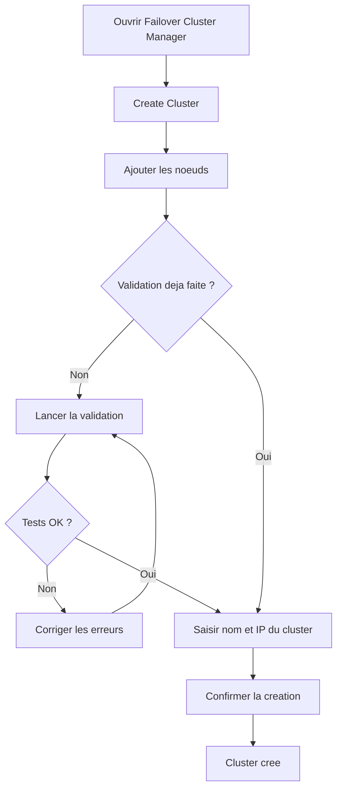

# Creation d'un cluster de basculement

<span class="level-advanced">Avance</span> · Temps estime : 45 minutes

## Introduction

Une fois les prerequis valides, la creation du cluster proprement dite est une operation relativement rapide. Cette page couvre les deux methodes (PowerShell et GUI) ainsi que les etapes de configuration post-creation essentielles.

!!! warning "Validation prealable"

    Ne creez jamais un cluster sans avoir execute et valide les tests de validation. Consultez la page [Prerequis et validation](prerequis-et-validation.md) avant de continuer.

!!! example "Analogie"

    Creer un cluster, c'est comme former une equipe de relais en athletisme. Chaque coureur (noeud) est deja entraine (prerequis valides). La creation du cluster officialise l'equipe, attribue un nom de dossard (nom du cluster) et un couloir (adresse IP virtuelle). Ensuite, on definit qui porte le temoin et dans quel ordre les relais se font.

## Creation via PowerShell

### Commande de base

```powershell
# Create a two-node failover cluster
New-Cluster -Name "YOURCLUSTER" `
    -Node "NODE1", "NODE2" `
    -StaticAddress "192.168.1.100" `
    -NoStorage
```

Resultat :

```text
Name
----
CLUSTER01

WARNING: No valid nodes were found to use for running the validation tests.
The tests were not run. For more information about the validation tests and
how they should be run, type Get-Help Test-Cluster.
```

| Parametre | Description |
|---|---|
| `-Name` | Nom NetBIOS du cluster (max 15 caracteres) |
| `-Node` | Liste des noeuds a inclure |
| `-StaticAddress` | Adresse IP du cluster (une par sous-reseau) |
| `-NoStorage` | Ne pas ajouter automatiquement le stockage partage |

!!! tip "Pourquoi `-NoStorage` ?"

    L'option `-NoStorage` evite que tous les disques partages soient ajoutes automatiquement. Il est preferable de les ajouter manuellement et de les configurer individuellement (CSV, temoin quorum, etc.).

### Creation avec stockage

```powershell
# Create cluster and automatically add all eligible shared storage
New-Cluster -Name "YOURCLUSTER" `
    -Node "NODE1", "NODE2" `
    -StaticAddress "192.168.1.100"
```

### Creation multi-sous-reseau

Pour un cluster reparti sur plusieurs sous-reseaux (site DR par exemple) :

```powershell
# Create a cluster spanning two subnets
New-Cluster -Name "YOURCLUSTER" `
    -Node "NODE1", "NODE2" `
    -StaticAddress "192.168.1.100", "10.0.2.100" `
    -NoStorage
```

## Creation via l'interface graphique

1. Ouvrir **Failover Cluster Manager** (`cluadmin.msc`)
2. Dans le panneau Actions, cliquer sur **Create Cluster**
3. Assistant de creation :
    - **Select Servers** : ajouter les noeuds par nom DNS
    - **Validation Warning** : l'assistant propose d'executer les tests de validation
    - **Access Point** : saisir le nom du cluster et l'adresse IP
    - **Confirmation** : verifier le resume avant de confirmer
4. Le rapport de creation s'affiche a la fin



## Configuration post-creation

### Ajouter le stockage partage

```powershell
# List available disks not yet in the cluster
Get-ClusterAvailableDisk -Cluster "YOURCLUSTER"

# Add a specific disk to the cluster
Get-ClusterAvailableDisk -Cluster "YOURCLUSTER" | Where-Object { $_.Name -like "*Disk 2*" } | Add-ClusterDisk

# List cluster disks
Get-ClusterResource -Cluster "YOURCLUSTER" | Where-Object { $_.ResourceType -eq "Physical Disk" }
```

Resultat :

```text
Name               State  OwnerGroup      ResourceType
----               -----  ----------      ------------
Cluster Disk 1     Online Available Storage Physical Disk
Cluster Disk 2     Online Available Storage Physical Disk
Cluster Disk 3     Online Available Storage Physical Disk
```

### Configurer les Cluster Shared Volumes (CSV)

Les CSV permettent a plusieurs noeuds d'acceder simultanement au meme volume, indispensable pour Hyper-V en cluster.

```powershell
# Convert a cluster disk to CSV
Add-ClusterSharedVolume -Name "Cluster Disk 1" -Cluster "YOURCLUSTER"

# List CSV volumes
Get-ClusterSharedVolume -Cluster "YOURCLUSTER"

# CSV are mounted under C:\ClusterStorage\ by default
Get-ChildItem -Path "C:\ClusterStorage"
```

Resultat :

```text
Name           State  Node
----           -----  ----
Cluster Disk 1 Online SRV-01

    Directory: C:\ClusterStorage

Mode                 LastWriteTime         Length Name
----                 -------------         ------ ----
d-----        01/15/2025   15:20                  Volume1
```

### Configurer le quorum

```powershell
# Configure a file share witness for quorum
Set-ClusterQuorum -Cluster "YOURCLUSTER" `
    -NodeAndFileShareMajority "\\YOURFILESERVER\ClusterWitness"

# Verify current quorum configuration
Get-ClusterQuorum -Cluster "YOURCLUSTER"
```

Resultat :

```text
Cluster          : CLUSTER01
QuorumResource   : File Share Witness (\\DC-01\ClusterWitness)
QuorumType       : NodeAndFileShareMajority
```

!!! info "Configuration detaillee du quorum"

    Pour une explication approfondie des modes de quorum et des types de temoins, consultez la page dediee : [Quorum](quorum.md).

### Configurer les reseaux du cluster

```powershell
# List cluster networks
Get-ClusterNetwork -Cluster "YOURCLUSTER"

# Rename cluster networks for clarity
(Get-ClusterNetwork -Cluster "YOURCLUSTER" | Where-Object { $_.Address -eq "192.168.1.0" }).Name = "Production"
(Get-ClusterNetwork -Cluster "YOURCLUSTER" | Where-Object { $_.Address -eq "10.10.10.0" }).Name = "Heartbeat"

# Set network role (0=none, 1=cluster only, 3=cluster and client)
(Get-ClusterNetwork -Cluster "YOURCLUSTER" -Name "Production").Role = 3
(Get-ClusterNetwork -Cluster "YOURCLUSTER" -Name "Heartbeat").Role = 1
```

Resultat :

```text
Name        State  Role            Address
----        -----  ----            -------
Production  Up     ClusterAndClient 10.0.0.0
Heartbeat   Up     ClusterOnly      10.10.10.0
```

| Valeur Role | Signification |
|---|---|
| `0` | Reseau non utilise par le cluster |
| `1` | Reseau cluster uniquement (heartbeat) |
| `3` | Reseau cluster et client (production) |

### Configurer les notifications

```powershell
# Enable cluster log for troubleshooting (default size: 300 MB)
Set-ClusterLog -Cluster "YOURCLUSTER" -Level 3 -Size 300
```

## Verification post-creation

```powershell
# Comprehensive cluster health check
Get-Cluster -Name "YOURCLUSTER" | Format-List *

# Verify all nodes are online
Get-ClusterNode -Cluster "YOURCLUSTER"

# Verify cluster networks
Get-ClusterNetwork -Cluster "YOURCLUSTER" | Format-Table Name, State, Role, Address

# Verify quorum configuration
Get-ClusterQuorum -Cluster "YOURCLUSTER"

# Test cluster connectivity
Test-Cluster -Node "NODE1", "NODE2" -Include "Network"
```

Resultat :

```text
Name                            : CLUSTER01
SharedVolumesRoot               : C:\ClusterStorage
QuorumType                      : NodeAndFileShareMajority
DynamicQuorum                   : 1

Name       State  Type
----       -----  ----
SRV-01     Up     Node
SRV-02     Up     Node

Name        State  Role              Address
----        -----  ----              -------
Production  Up     ClusterAndClient  10.0.0.0
Heartbeat   Up     ClusterOnly       10.10.10.0

Cluster          : CLUSTER01
QuorumResource   : File Share Witness (\\DC-01\ClusterWitness)
QuorumType       : NodeAndFileShareMajority
```

### Script de verification complet

```powershell
# Cluster post-creation health check script
param(
    [Parameter(Mandatory)]
    [string]$ClusterName
)

$checks = @()

# Check cluster state
$cluster = Get-Cluster -Name $ClusterName -ErrorAction SilentlyContinue
if ($cluster) {
    $checks += [PSCustomObject]@{ Check = "Cluster accessible"; Status = "OK" }
} else {
    $checks += [PSCustomObject]@{ Check = "Cluster accessible"; Status = "FAILED" }
    $checks | Format-Table -AutoSize
    return
}

# Check nodes
$nodes = Get-ClusterNode -Cluster $ClusterName
foreach ($node in $nodes) {
    $status = if ($node.State -eq "Up") { "OK" } else { "FAILED" }
    $checks += [PSCustomObject]@{ Check = "Node $($node.Name)"; Status = $status }
}

# Check networks
$networks = Get-ClusterNetwork -Cluster $ClusterName
foreach ($net in $networks) {
    $status = if ($net.State -eq "Up") { "OK" } else { "FAILED" }
    $checks += [PSCustomObject]@{ Check = "Network $($net.Name)"; Status = $status }
}

# Check quorum
$quorum = Get-ClusterQuorum -Cluster $ClusterName
$checks += [PSCustomObject]@{ Check = "Quorum ($($quorum.QuorumType))"; Status = "OK" }

$checks | Format-Table -AutoSize
```

## Ajouter ou supprimer un noeud

### Ajouter un noeud

```powershell
# Add a new node to an existing cluster
Add-ClusterNode -Cluster "YOURCLUSTER" -Name "NODE3"
```

Resultat :

```text
Name       State  Type
----       -----  ----
SRV-03     Up     Node
```

!!! warning "Validation avant ajout"

    Executez `Test-Cluster` en incluant le nouveau noeud avant de l'ajouter au cluster.

### Supprimer un noeud

```powershell
# Evict a node from the cluster (moves all roles first)
Remove-ClusterNode -Cluster "YOURCLUSTER" -Name "NODE3" -Force
```

!!! example "Scenario pratique"

    **Contexte :** Claire, administratrice dans une entreprise de logistique, doit mettre en place un cluster de basculement pour leur application de gestion d'entrepot. Elle dispose de deux serveurs Windows Server 2022 Datacenter (SRV-01 et SRV-02) et d'un SAN iSCSI.

    **Probleme :** Apres la creation du cluster, les disques partages ne sont pas visibles et les reseaux ne sont pas nommes correctement.

    **Diagnostic et solution :**

    1. Claire cree le cluster avec l'option `-NoStorage` :

        ```powershell
        New-Cluster -Name "CLUSTER01" -Node "SRV-01", "SRV-02" -StaticAddress 10.0.0.100 -NoStorage
        ```

    2. Elle verifie les disques disponibles :

        ```powershell
        Get-ClusterAvailableDisk -Cluster "CLUSTER01"
        ```

        Resultat :

        ```text
        (aucun disque affiche)
        ```

    3. Elle realise que les disques iSCSI sont encore en mode "Offline" sur SRV-02 :

        ```powershell
        Invoke-Command -ComputerName "SRV-02" -ScriptBlock {
            Get-Disk | Where-Object { $_.BusType -eq 'iSCSI' } | Select-Object Number, OperationalStatus
        }
        ```

        Resultat :

        ```text
        Number OperationalStatus
        ------ -----------------
        2      Offline
        3      Offline
        ```

    4. Elle met les disques en ligne et relance la detection :

        ```powershell
        Invoke-Command -ComputerName "SRV-02" -ScriptBlock {
            Get-Disk | Where-Object { $_.BusType -eq 'iSCSI' } | Set-Disk -IsOffline $false
        }
        Get-ClusterAvailableDisk -Cluster "CLUSTER01" | Add-ClusterDisk
        ```

    5. Elle renomme les reseaux et configure le quorum :

        ```powershell
        (Get-ClusterNetwork -Cluster "CLUSTER01" | Where-Object { $_.Address -eq "10.0.0.0" }).Name = "Production"
        (Get-ClusterNetwork -Cluster "CLUSTER01" | Where-Object { $_.Address -eq "10.10.10.0" }).Name = "Heartbeat"
        Set-ClusterQuorum -Cluster "CLUSTER01" -NodeAndFileShareMajority "\\DC-01\ClusterWitness"
        ```

    **Resultat :** Le cluster est operationnel avec les disques partages, les reseaux nommes et le quorum configure.

!!! danger "Erreurs courantes"

    - **Creer le cluster sans `-NoStorage`** : tous les disques partages detectes sont ajoutes automatiquement, y compris ceux destines au quorum ou a d'autres usages. Utilisez `-NoStorage` pour garder le controle.
    - **Oublier de configurer le quorum immediatement** : sans temoin de quorum, un cluster a 2 noeuds perd la majorite si un seul noeud tombe. Configurez le quorum juste apres la creation.
    - **Ne pas renommer les reseaux du cluster** : les noms par defaut ("Cluster Network 1", "Cluster Network 2") sont ambigus. Renommez-les en "Production" et "Heartbeat" pour la clarte.
    - **Oublier de valider apres l'ajout d'un noeud** : chaque ajout de noeud doit etre precede d'un `Test-Cluster` incluant le nouveau noeud.

## Points cles a retenir

- Utilisez `-NoStorage` lors de la creation pour garder le controle sur l'ajout des disques
- Configurez le quorum **immediatement** apres la creation du cluster
- Nommez clairement les reseaux du cluster (Production, Heartbeat) et definissez leur role
- Les CSV (Cluster Shared Volumes) sont necessaires pour Hyper-V et les charges de travail multi-noeud
- Executez un script de verification apres chaque modification du cluster

## Pour aller plus loin

- Configuration du quorum : [Quorum](quorum.md)
- Ajout de roles : [Roles du cluster](roles-cluster.md)
- Documentation Microsoft : Create a Failover Cluster
