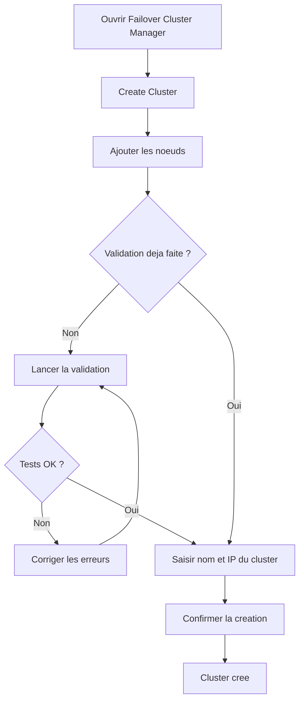

# Creation d'un cluster de basculement

!!! info "Niveau : avance | Temps estime : 45 minutes"

## Introduction

Une fois les prerequis valides, la creation du cluster proprement dite est une operation relativement rapide. Cette page couvre les deux methodes (PowerShell et GUI) ainsi que les etapes de configuration post-creation essentielles.

!!! warning "Validation prealable"

    Ne creez jamais un cluster sans avoir execute et valide les tests de validation. Consultez la page [Prerequis et validation](prerequis-et-validation.md) avant de continuer.

## Creation via PowerShell

### Commande de base

```powershell
# Create a two-node failover cluster
New-Cluster -Name "YOURCLUSTER" `
    -Node "NODE1", "NODE2" `
    -StaticAddress "192.168.1.100" `
    -NoStorage
```

| Parametre | Description |
|---|---|
| `-Name` | Nom NetBIOS du cluster (max 15 caracteres) |
| `-Node` | Liste des noeuds a inclure |
| `-StaticAddress` | Adresse IP du cluster (une par sous-reseau) |
| `-NoStorage` | Ne pas ajouter automatiquement le stockage partage |

!!! tip "Pourquoi `-NoStorage` ?"

    L'option `-NoStorage` evite que tous les disques partages soient ajoutes automatiquement. Il est preferable de les ajouter manuellement et de les configurer individuellement (CSV, temoin quorum, etc.).

### Creation avec stockage

```powershell
# Create cluster and automatically add all eligible shared storage
New-Cluster -Name "YOURCLUSTER" `
    -Node "NODE1", "NODE2" `
    -StaticAddress "192.168.1.100"
```

### Creation multi-sous-reseau

Pour un cluster reparti sur plusieurs sous-reseaux (site DR par exemple) :

```powershell
# Create a cluster spanning two subnets
New-Cluster -Name "YOURCLUSTER" `
    -Node "NODE1", "NODE2" `
    -StaticAddress "192.168.1.100", "10.0.2.100" `
    -NoStorage
```

## Creation via l'interface graphique

1. Ouvrir **Failover Cluster Manager** (`cluadmin.msc`)
2. Dans le panneau Actions, cliquer sur **Create Cluster**
3. Assistant de creation :
    - **Select Servers** : ajouter les noeuds par nom DNS
    - **Validation Warning** : l'assistant propose d'executer les tests de validation
    - **Access Point** : saisir le nom du cluster et l'adresse IP
    - **Confirmation** : verifier le resume avant de confirmer
4. Le rapport de creation s'affiche a la fin



## Configuration post-creation

### Ajouter le stockage partage

```powershell
# List available disks not yet in the cluster
Get-ClusterAvailableDisk -Cluster "YOURCLUSTER"

# Add a specific disk to the cluster
Get-ClusterAvailableDisk -Cluster "YOURCLUSTER" | Where-Object { $_.Name -like "*Disk 2*" } | Add-ClusterDisk

# List cluster disks
Get-ClusterResource -Cluster "YOURCLUSTER" | Where-Object { $_.ResourceType -eq "Physical Disk" }
```

### Configurer les Cluster Shared Volumes (CSV)

Les CSV permettent a plusieurs noeuds d'acceder simultanement au meme volume, indispensable pour Hyper-V en cluster.

```powershell
# Convert a cluster disk to CSV
Add-ClusterSharedVolume -Name "Cluster Disk 1" -Cluster "YOURCLUSTER"

# List CSV volumes
Get-ClusterSharedVolume -Cluster "YOURCLUSTER"

# CSV are mounted under C:\ClusterStorage\ by default
Get-ChildItem -Path "C:\ClusterStorage"
```

### Configurer le quorum

```powershell
# Configure a file share witness for quorum
Set-ClusterQuorum -Cluster "YOURCLUSTER" `
    -NodeAndFileShareMajority "\\YOURFILESERVER\ClusterWitness"

# Verify current quorum configuration
Get-ClusterQuorum -Cluster "YOURCLUSTER"
```

!!! info "Configuration detaillee du quorum"

    Pour une explication approfondie des modes de quorum et des types de temoins, consultez la page dediee : [Quorum](quorum.md).

### Configurer les reseaux du cluster

```powershell
# List cluster networks
Get-ClusterNetwork -Cluster "YOURCLUSTER"

# Rename cluster networks for clarity
(Get-ClusterNetwork -Cluster "YOURCLUSTER" | Where-Object { $_.Address -eq "192.168.1.0" }).Name = "Production"
(Get-ClusterNetwork -Cluster "YOURCLUSTER" | Where-Object { $_.Address -eq "10.10.10.0" }).Name = "Heartbeat"

# Set network role (0=none, 1=cluster only, 3=cluster and client)
(Get-ClusterNetwork -Cluster "YOURCLUSTER" -Name "Production").Role = 3
(Get-ClusterNetwork -Cluster "YOURCLUSTER" -Name "Heartbeat").Role = 1
```

| Valeur Role | Signification |
|---|---|
| `0` | Reseau non utilise par le cluster |
| `1` | Reseau cluster uniquement (heartbeat) |
| `3` | Reseau cluster et client (production) |

### Configurer les notifications

```powershell
# Enable cluster log for troubleshooting (default size: 300 MB)
Set-ClusterLog -Cluster "YOURCLUSTER" -Level 3 -Size 300
```

## Verification post-creation

```powershell
# Comprehensive cluster health check
Get-Cluster -Name "YOURCLUSTER" | Format-List *

# Verify all nodes are online
Get-ClusterNode -Cluster "YOURCLUSTER"

# Verify cluster networks
Get-ClusterNetwork -Cluster "YOURCLUSTER" | Format-Table Name, State, Role, Address

# Verify quorum configuration
Get-ClusterQuorum -Cluster "YOURCLUSTER"

# Test cluster connectivity
Test-Cluster -Node "NODE1", "NODE2" -Include "Network"
```

### Script de verification complet

```powershell
# Cluster post-creation health check script
param(
    [Parameter(Mandatory)]
    [string]$ClusterName
)

$checks = @()

# Check cluster state
$cluster = Get-Cluster -Name $ClusterName -ErrorAction SilentlyContinue
if ($cluster) {
    $checks += [PSCustomObject]@{ Check = "Cluster accessible"; Status = "OK" }
} else {
    $checks += [PSCustomObject]@{ Check = "Cluster accessible"; Status = "FAILED" }
    $checks | Format-Table -AutoSize
    return
}

# Check nodes
$nodes = Get-ClusterNode -Cluster $ClusterName
foreach ($node in $nodes) {
    $status = if ($node.State -eq "Up") { "OK" } else { "FAILED" }
    $checks += [PSCustomObject]@{ Check = "Node $($node.Name)"; Status = $status }
}

# Check networks
$networks = Get-ClusterNetwork -Cluster $ClusterName
foreach ($net in $networks) {
    $status = if ($net.State -eq "Up") { "OK" } else { "FAILED" }
    $checks += [PSCustomObject]@{ Check = "Network $($net.Name)"; Status = $status }
}

# Check quorum
$quorum = Get-ClusterQuorum -Cluster $ClusterName
$checks += [PSCustomObject]@{ Check = "Quorum ($($quorum.QuorumType))"; Status = "OK" }

$checks | Format-Table -AutoSize
```

## Ajouter ou supprimer un noeud

### Ajouter un noeud

```powershell
# Add a new node to an existing cluster
Add-ClusterNode -Cluster "YOURCLUSTER" -Name "NODE3"
```

!!! warning "Validation avant ajout"

    Executez `Test-Cluster` en incluant le nouveau noeud avant de l'ajouter au cluster.

### Supprimer un noeud

```powershell
# Evict a node from the cluster (moves all roles first)
Remove-ClusterNode -Cluster "YOURCLUSTER" -Name "NODE3" -Force
```

## Points cles a retenir

- Utilisez `-NoStorage` lors de la creation pour garder le controle sur l'ajout des disques
- Configurez le quorum **immediatement** apres la creation du cluster
- Nommez clairement les reseaux du cluster (Production, Heartbeat) et definissez leur role
- Les CSV (Cluster Shared Volumes) sont necessaires pour Hyper-V et les charges de travail multi-noeud
- Executez un script de verification apres chaque modification du cluster

## Pour aller plus loin

- Configuration du quorum : [Quorum](quorum.md)
- Ajout de roles : [Roles du cluster](roles-cluster.md)
- Documentation Microsoft : Create a Failover Cluster
