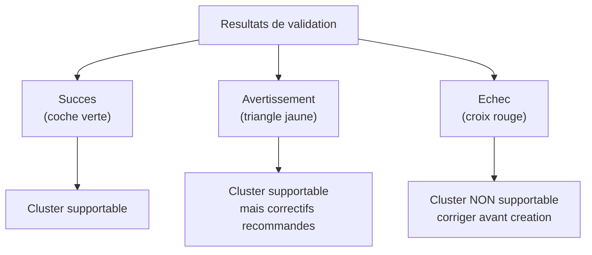

# Prerequis et validation du cluster

!!! info "Niveau : avance | Temps estime : 50 minutes"

## Introduction

Avant de creer un cluster de basculement, il est indispensable de valider que l'infrastructure repond a un ensemble strict de prerequis. Windows Server integre un assistant de **validation de cluster** qui verifie automatiquement la conformite de la configuration.

## Prerequis materiels et logiciels

### Systeme d'exploitation

- Tous les noeuds doivent executer la **meme edition** de Windows Server 2022 (Standard ou Datacenter)
- Tous les noeuds doivent etre au **meme niveau de mise a jour** (meme CU)
- La fonctionnalite **Failover Clustering** doit etre installee sur chaque noeud

```powershell
# Install Failover Clustering feature on all future nodes
Install-WindowsFeature -Name Failover-Clustering -IncludeManagementTools
```

### Reseau

Un cluster de basculement necessite au minimum **deux reseaux** :

| Reseau | Role | Configuration |
|---|---|---|
| **Production** | Communication clients | IP statiques, meme sous-reseau ou routage correct |
| **Cluster (heartbeat)** | Communication intra-cluster | Reseau dedie, isole du trafic client |

!!! tip "Bonnes pratiques reseau"

    - Utiliser des adresses IP **statiques** sur tous les noeuds (pas de DHCP)
    - Configurer le NIC teaming **avant** la creation du cluster
    - Verifier que les pare-feu autorisent le trafic cluster (ports TCP 135, 3343 et plages dynamiques RPC)
    - Le DNS doit fonctionner correctement entre tous les noeuds

```powershell
# Verify network connectivity between nodes
Test-Connection -ComputerName "NODE2" -Count 4

# Verify DNS resolution for all nodes
Resolve-DnsName -Name "NODE1.yourdomain.local"
Resolve-DnsName -Name "NODE2.yourdomain.local"
```

### Stockage partage

Le stockage partage doit etre accessible par **tous les noeuds** du cluster :

- **SAN iSCSI** : configurez l'initiateur iSCSI sur chaque noeud et connectez les LUNs
- **SAN Fibre Channel** : verifiez le zoning et les LUN masking
- **Storage Spaces Direct** : au minimum 2 noeuds avec disques locaux compatibles

```powershell
# Verify iSCSI connection on each node
Get-IscsiTarget
Get-IscsiConnection

# List available disks (should show shared disks)
Get-Disk | Where-Object { $_.BusType -eq 'iSCSI' }
```

!!! warning "Disques partages"

    Les disques partages doivent etre **initialises** mais **non formates** avant la creation du cluster. Le cluster gerera le formatage et l'attribution.

### Active Directory

Le cluster necessite des comptes et permissions specifiques dans Active Directory :

1. **Compte de creation** : l'administrateur qui cree le cluster doit avoir les droits de creer des objets ordinateur dans l'OU cible
2. **CNO (Cluster Name Object)** : un compte ordinateur sera cree automatiquement pour le nom du cluster
3. **VCO (Virtual Computer Object)** : chaque role clustered creera un objet ordinateur supplementaire

```powershell
# Verify that the cluster creation account has appropriate AD permissions
# Pre-stage the CNO (optional but recommended)
New-ADComputer -Name "YOURCLUSTER" -Path "OU=Clusters,DC=yourdomain,DC=local" -Enabled $false

# Grant the CNO full control (needed for VCO creation)
# This is typically done via ADUC GUI > Security tab
```

!!! tip "Pre-staging du CNO"

    Le pre-staging (creation prealable) du compte ordinateur du cluster dans AD est recommande en environnement securise. Cela permet de controler l'OU de destination et les permissions sans donner de droits eleves a l'administrateur de cluster.

## Checklist avant validation

Avant de lancer l'assistant de validation, verifiez :

- [ ] Meme edition et meme CU de Windows Server sur tous les noeuds
- [ ] Fonctionnalite Failover Clustering installee sur tous les noeuds
- [ ] Adresses IP statiques sur tous les noeuds
- [ ] Connectivite reseau entre tous les noeuds (ping, DNS)
- [ ] Stockage partage accessible depuis tous les noeuds
- [ ] Pare-feu configure pour autoriser le trafic cluster
- [ ] Noeuds membres du meme domaine Active Directory
- [ ] Droits AD suffisants pour la creation du cluster

## Tests de validation du cluster

### Lancer la validation

L'assistant de validation execute une batterie de tests pour verifier la compatibilite de la configuration.

```powershell
# Run all validation tests (recommended before cluster creation)
Test-Cluster -Node "NODE1", "NODE2" -Verbose

# Run specific test categories only
Test-Cluster -Node "NODE1", "NODE2" -Include "Storage", "Network"
```

Via l'interface graphique :

1. Ouvrir **Failover Cluster Manager**
2. Cliquer sur **Validate Configuration** dans le panneau Actions
3. Ajouter les noeuds a tester
4. Choisir entre executer tous les tests ou selectionner des categories

### Categories de tests

| Categorie | Verification effectuee |
|---|---|
| **Inventory** | Configuration materielle, pilotes, mises a jour |
| **Network** | Connectivite, latence, configuration IP, DNS |
| **Storage** | Acces aux disques partages, performance I/O |
| **System Configuration** | Coherence OS, services, fonctionnalites installees |
| **Hyper-V** | Configuration specifique si cluster Hyper-V |

### Interpreter les resultats

Les resultats sont classes en trois niveaux :



!!! danger "Tests obligatoires"

    Microsoft exige que **tous les tests de validation reussissent** (pas d'echec) pour que le cluster soit dans une configuration supportee. Les avertissements sont acceptables mais doivent etre analyses.

```powershell
# View the validation report (HTML file)
# The report path is displayed at the end of Test-Cluster
# Default location:
$reportPath = "$env:SystemRoot\Cluster\Reports"
Get-ChildItem -Path $reportPath -Filter "*.htm" | Sort-Object LastWriteTime -Descending | Select-Object -First 1
```

### Problemes courants et solutions

| Probleme | Cause probable | Solution |
|---|---|---|
| Echec test reseau | Pare-feu bloquant | Ouvrir les ports 135, 3343 et RPC dynamique |
| Echec test stockage | LUN non visible | Verifier iSCSI/FC, rescanner les disques |
| Avertissement pilotes | Versions differentes | Mettre a jour les pilotes sur tous les noeuds |
| Echec configuration | CU differentes | Appliquer les memes mises a jour partout |
| DNS non resolu | Enregistrement manquant | Verifier les zones DNS, forcer `ipconfig /registerdns` |

```powershell
# Force DNS registration on all nodes
Invoke-Command -ComputerName "NODE1", "NODE2" -ScriptBlock {
    Register-DnsClient
}

# Rescan disks on all nodes
Invoke-Command -ComputerName "NODE1", "NODE2" -ScriptBlock {
    Update-HostStorageCache
    Get-Disk | Where-Object { $_.OperationalStatus -eq 'Offline' } | Set-Disk -IsOffline $false
}
```

## Points cles a retenir

- La validation est une **etape obligatoire** avant la creation d'un cluster supporte par Microsoft
- Tous les noeuds doivent etre **identiques** en termes d'OS, de mises a jour et de fonctionnalites
- Deux reseaux minimum sont necessaires : production et heartbeat
- Le pre-staging du CNO dans Active Directory simplifie la gestion des permissions
- Les rapports de validation sont au format HTML et stockes dans `%SystemRoot%\Cluster\Reports`
- Un echec dans les tests de validation doit etre corrige **avant** de creer le cluster

## Pour aller plus loin

- Creation du cluster : [Creation du cluster](creation-cluster.md)
- Concepts du clustering : [Concepts Cluster](concepts-cluster.md)
- Documentation Microsoft : Validate Hardware for a Failover Cluster
