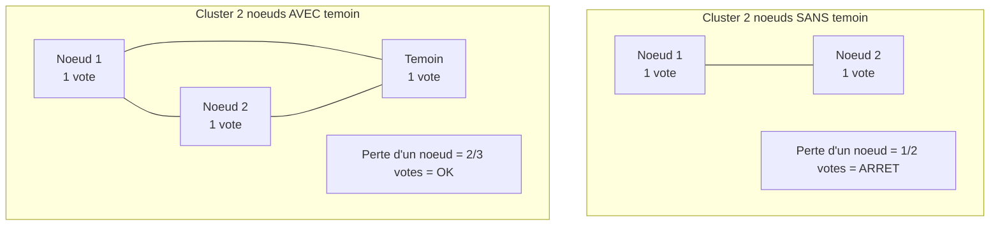
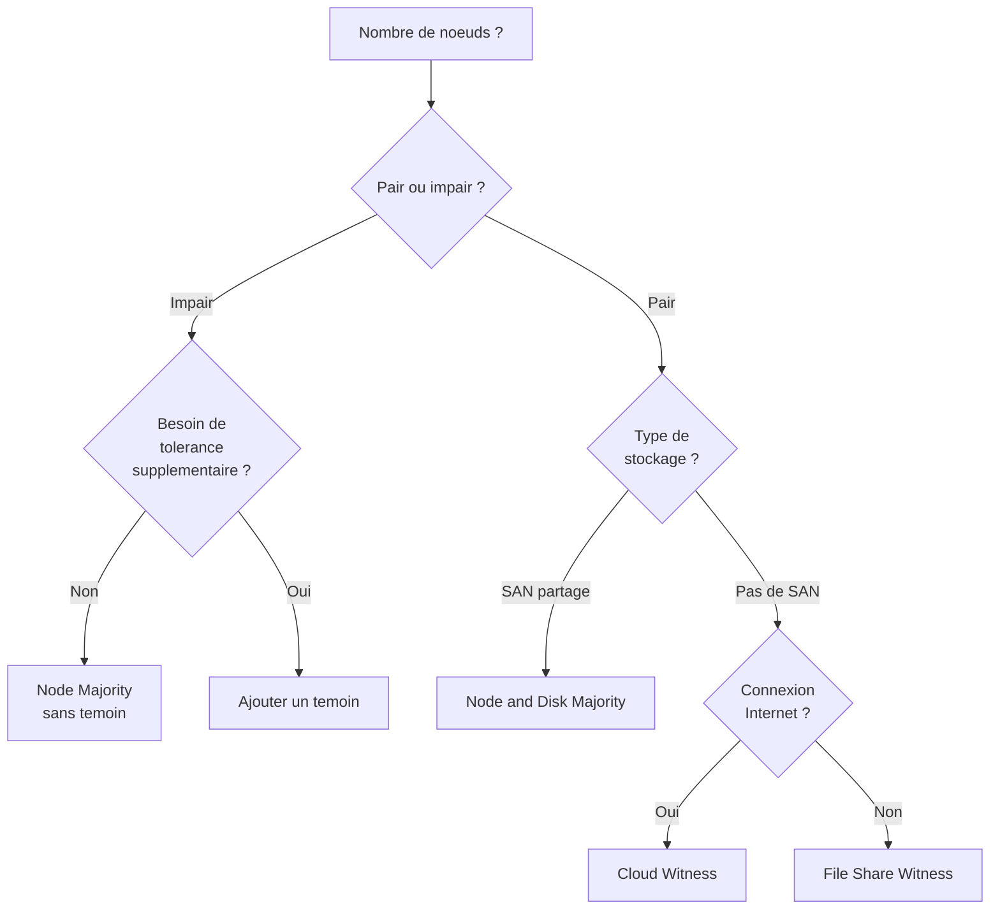

# Quorum et temoin de cluster

!!! info "Niveau : avance | Temps estime : 40 minutes"

## Introduction

Le **quorum** est le mecanisme qui permet a un cluster de determiner s'il peut continuer a fonctionner. Il garantit qu'une majorite de noeuds (ou de votes) est disponible pour eviter les situations de **split-brain**, ou deux groupes de noeuds fonctionneraient independamment en croyant chacun etre le cluster actif.

## Le concept de vote

Chaque element participant au quorum dispose d'un **vote**. Le cluster reste operationnel tant qu'il detient la **majorite des votes** (plus de la moitie).

### Exemple avec 3 noeuds

| Scenario | Votes actifs | Majorite (2/3) | Cluster operationnel |
|---|---|---|---|
| 3 noeuds en ligne | 3 | Oui | Oui |
| 2 noeuds en ligne | 2 | Oui | Oui |
| 1 noeud en ligne | 1 | Non | Non |

!!! warning "Nombre pair de noeuds"

    Avec un nombre pair de noeuds, un temoin est indispensable pour eviter une egalite de votes (split-brain). Avec 2 noeuds, sans temoin, la perte d'un seul noeud arrete le cluster.

### Pourquoi un temoin ?

Le **temoin** (witness) est un vote supplementaire qui permet de departager en cas d'egalite. Il est particulierement critique avec un nombre pair de noeuds.



## Types de temoins

Windows Server 2022 propose trois types de temoins :

### Temoin disque (Disk Witness)

Un petit LUN (minimum 512 Mo) sur le stockage partage dedie au quorum.

```powershell
# Configure a disk witness
Set-ClusterQuorum -Cluster "YOURCLUSTER" -NodeAndDiskMajority "Cluster Disk 3"
```

| Avantage | Inconvenient |
|---|---|
| Fiable et rapide | Necessite un stockage partage |
| Standard en datacenter | Point de defaillance unique si meme SAN |

### Temoin partage de fichiers (File Share Witness)

Un partage SMB heberge sur un serveur tiers (ni noeud du cluster, ni serveur de stockage).

```powershell
# Create the witness share on a file server
New-Item -Path "C:\ClusterWitness" -ItemType Directory
New-SmbShare -Name "ClusterWitness" -Path "C:\ClusterWitness" -FullAccess "YOURDOMAIN\YOURCLUSTER$"

# Configure the file share witness
Set-ClusterQuorum -Cluster "YOURCLUSTER" -NodeAndFileShareMajority "\\YOURFILESERVER\ClusterWitness"
```

| Avantage | Inconvenient |
|---|---|
| Pas de stockage partage necessaire | Depend d'un serveur tiers |
| Ideal pour les clusters multi-sites | Le serveur temoin doit etre disponible |

!!! tip "Emplacement du serveur temoin"

    Placez le serveur hebergeant le file share witness dans un **troisieme site** ou sur un segment reseau different des noeuds du cluster. En cas de perte de connectivite d'un site, le temoin permet de departager.

### Temoin cloud (Cloud Witness)

Introduit avec Windows Server 2016, le cloud witness utilise un compte **Azure Blob Storage** comme temoin. C'est la solution recommandee pour les clusters modernes.

```powershell
# Configure a cloud witness (requires Azure Storage Account)
Set-ClusterQuorum -Cluster "YOURCLUSTER" -CloudWitness `
    -AccountName "yourstorageaccount" `
    -AccessKey "YOURSTORAGEACCESSKEY" `
    -Endpoint "core.windows.net"
```

| Avantage | Inconvenient |
|---|---|
| Aucune infrastructure locale supplementaire | Necessite une connexion Internet |
| Ideal pour les clusters multi-sites | Depend d'Azure (cout minimal) |
| Haute disponibilite native (Azure) | Latence potentielle |

!!! tip "Cout du Cloud Witness"

    Un cloud witness consomme une quantite infime de stockage Azure (quelques Ko). Le cout est negligeable, de l'ordre de quelques centimes par mois.

## Modes de quorum

Windows Server 2022 propose quatre modes de quorum :

| Mode | Description | Quand l'utiliser |
|---|---|---|
| **Node Majority** | Majorite basee sur les noeuds uniquement | Nombre impair de noeuds |
| **Node and Disk Majority** | Noeuds + temoin disque | Nombre pair, stockage partage dispo |
| **Node and File Share Majority** | Noeuds + temoin partage fichiers | Nombre pair, pas de SAN commun |
| **No Majority** | Un seul noeud designe (pas de vote) | Test uniquement, jamais en production |

```powershell
# View current quorum configuration
Get-ClusterQuorum -Cluster "YOURCLUSTER" | Format-List *

# Configure node majority (odd number of nodes, no witness)
Set-ClusterQuorum -Cluster "YOURCLUSTER" -NodeMajority

# Let Windows decide the best quorum configuration
Set-ClusterQuorum -Cluster "YOURCLUSTER" -NoWitness
```

### Guide de selection



## Quorum dynamique

Le **quorum dynamique** est active par defaut depuis Windows Server 2012 R2. Il ajuste automatiquement le nombre de votes necessaires a mesure que des noeuds quittent ou rejoignent le cluster.

### Fonctionnement

Lorsqu'un noeud quitte le cluster de maniere controlee (arret planifie), son vote est **retire dynamiquement** du calcul de la majorite. Cela permet au cluster de survivre a des arrets sequentiels.

```powershell
# Check if dynamic quorum is enabled
(Get-Cluster -Name "YOURCLUSTER").DynamicQuorum

# Enable dynamic quorum (enabled by default)
(Get-Cluster -Name "YOURCLUSTER").DynamicQuorum = 1

# Disable dynamic quorum (not recommended)
(Get-Cluster -Name "YOURCLUSTER").DynamicQuorum = 0
```

### Exemple concret

Cluster de 5 noeuds avec quorum dynamique :

| Etape | Noeuds actifs | Votes necessaires | Cluster OK |
|---|---|---|---|
| Initial | 5 | 3 | Oui |
| Arret planifie noeud 5 | 4 | 3 | Oui |
| Arret planifie noeud 4 | 3 | 2 | Oui |
| Arret planifie noeud 3 | 2 | 2 | Oui |
| Arret planifie noeud 2 | 1 | 1 | Oui |

!!! danger "Panne vs arret planifie"

    Le quorum dynamique ne fonctionne que pour les departs **controles**. Si deux noeuds tombent brutalement en meme temps, le calcul classique de majorite s'applique.

## Gestion avancee du vote

### Retirer le vote d'un noeud

Dans certains cas (noeud DR distant), il peut etre utile de retirer le vote d'un noeud specifique.

```powershell
# Remove vote from a specific node
(Get-ClusterNode -Cluster "YOURCLUSTER" -Name "NODE-DR").NodeWeight = 0

# Restore vote
(Get-ClusterNode -Cluster "YOURCLUSTER" -Name "NODE-DR").NodeWeight = 1

# View vote status for all nodes
Get-ClusterNode -Cluster "YOURCLUSTER" | Format-Table Name, State, NodeWeight, DynamicWeight
```

## Diagnostic du quorum

```powershell
# Complete quorum status
Get-ClusterQuorum -Cluster "YOURCLUSTER" | Format-List *

# Check witness resource health
Get-ClusterResource -Cluster "YOURCLUSTER" | Where-Object { $_.ResourceType -like "*Witness*" }

# View cluster events related to quorum
Get-ClusterLog -Cluster "YOURCLUSTER" -TimeSpan 60 -Destination "C:\Temp\ClusterLogs"
```

## Points cles a retenir

- Le quorum empeche le **split-brain** en imposant une majorite de votes
- Un temoin est **indispensable** avec un nombre pair de noeuds
- Le **cloud witness** (Azure) est la solution recommandee pour les nouveaux deployements
- Le quorum dynamique (actif par defaut) ajuste les votes lors des arrets planifies
- Ne confondez pas arret planifie (vote retire dynamiquement) et panne brutale (vote perdu)
- Verifiez le quorum apres chaque modification du cluster (ajout/retrait de noeud)

## Pour aller plus loin

- Creation du cluster : [Creation du cluster](creation-cluster.md)
- Roles du cluster : [Roles du cluster](roles-cluster.md)
- Documentation Microsoft : Configure and Manage Quorum
