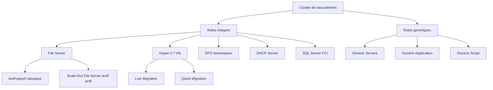

# Roles du cluster

<span class="level-advanced">Avance</span> · Temps estime : 50 minutes

## Introduction

Un cluster de basculement ne devient utile que lorsqu'il heberge des **roles** (ou services). Un role est une charge de travail configuree pour basculer automatiquement entre les noeuds du cluster en cas de defaillance. Windows Server 2022 propose des roles integres ainsi que la possibilite d'ajouter des applications personnalisees.

## Architecture des roles du cluster



## Vue d'ensemble des roles disponibles

```powershell
# List all available cluster role types
Get-ClusterResourceType -Cluster "YOURCLUSTER" | Sort-Object Name | Format-Table Name, DisplayName
```

Les principaux roles integres :

| Role | Usage | Mode recommande |
|---|---|---|
| **File Server** | Partage de fichiers haute disponibilite | Actif-passif ou SOFS |
| **Hyper-V Replica Broker** | Gestion de la replication Hyper-V | Actif-passif |
| **Virtual Machine** | Machines virtuelles Hyper-V | Actif-actif |
| **DFS Namespace Server** | Espaces de noms DFS | Actif-passif |
| **DHCP Server** | Service DHCP haute disponibilite | Actif-passif |
| **Generic Application** | Application quelconque (EXE) | Actif-passif |
| **Generic Service** | Service Windows quelconque | Actif-passif |
| **Generic Script** | Script de surveillance personnalise | Actif-passif |

## Serveur de fichiers en cluster

### File Server classique (actif-passif)

```powershell
# Add a clustered file server role
Add-ClusterFileServerRole -Cluster "YOURCLUSTER" `
    -Name "FS-YOURCLUSTER" `
    -StaticAddress "192.168.1.110" `
    -Storage "Cluster Disk 1"

# Create a share on the clustered file server
New-SmbShare -Name "SharedData" `
    -Path "E:\SharedData" `
    -CimSession "FS-YOURCLUSTER" `
    -FullAccess "YOURDOMAIN\Domain Admins" `
    -ChangeAccess "YOURDOMAIN\Domain Users"
```

### Scale-Out File Server (SOFS) - Actif-actif

Le SOFS est concu pour les charges de travail applicatives (Hyper-V, SQL Server) et permet un acces simultane depuis tous les noeuds.

```powershell
# Add a Scale-Out File Server role
Add-ClusterScaleOutFileServerRole -Cluster "YOURCLUSTER" `
    -Name "SOFS-YOURCLUSTER"

# CSV is required for SOFS
# Shares are created on CSV volumes
New-SmbShare -Name "HyperVStorage" `
    -Path "C:\ClusterStorage\Volume1\HyperV" `
    -CimSession "SOFS-YOURCLUSTER" `
    -FullAccess "YOURDOMAIN\Domain Admins"
```

| Critere | File Server classique | Scale-Out File Server |
|---|---|---|
| Mode | Actif-passif | Actif-actif |
| Stockage | Disque cluster dedie | CSV obligatoire |
| Usage | Partages utilisateurs | Stockage applicatif (Hyper-V, SQL) |
| Basculement | Interruption breve | Transparent (SMB Multichannel) |

## Hyper-V en cluster

### Configuration des machines virtuelles

```powershell
# Configure a VM for high availability (VM already exists on a CSV)
Add-ClusterVirtualMachineRole -Cluster "YOURCLUSTER" -VMName "VM-WEB01"

# List all clustered VMs
Get-ClusterGroup -Cluster "YOURCLUSTER" | Where-Object { $_.GroupType -eq "VirtualMachine" }

# Live migrate a VM to another node
Move-ClusterVirtualMachineRole -Cluster "YOURCLUSTER" `
    -Name "VM-WEB01" `
    -Node "NODE2" `
    -MigrationType Live
```

### Types de migration

| Type | Description | Interruption |
|---|---|---|
| **Live Migration** | Migration a chaud (memoire transferee) | Aucune (< 1 seconde) |
| **Quick Migration** | Sauvegarde puis restauration sur l'autre noeud | Quelques secondes |
| **Storage Migration** | Migration du stockage uniquement | Aucune |

```powershell
# Configure live migration settings
Set-VMHost -ComputerName "NODE1" `
    -MaximumVirtualMachineMigrations 2 `
    -VirtualMachineMigrationPerformanceOption SMB

# Enable live migration on all nodes
Get-ClusterNode -Cluster "YOURCLUSTER" | ForEach-Object {
    Set-VMHost -ComputerName $_.Name -VirtualMachineMigrationEnabled $true
}
```

!!! tip "Reseau dedie pour Live Migration"

    Configurez un reseau dedie pour la Live Migration afin de ne pas impacter le trafic de production. Utilisez SMB Multichannel pour de meilleures performances.

### Priorite de demarrage

```powershell
# Set VM start priority (0=No auto-start, 1000=Low, 2000=Medium, 3000=High)
$vmGroup = Get-ClusterGroup -Cluster "YOURCLUSTER" -Name "VM-WEB01"
$vmGroup.Priority = 3000

# Set startup delay to stagger VM boot order
$vmGroup.AutoFailbackType = 0
```

## SQL Server en cluster (FCI)

L'installation de SQL Server en cluster (Failover Cluster Instance) necessite une preparation specifique.

### Prerequis

- Cluster de basculement fonctionnel
- Stockage partage dedie a SQL Server
- MSDTC en cluster (si transactions distribuees)

```powershell
# Add MSDTC as a clustered role (prerequisite for SQL FCI)
Add-ClusterResource -Cluster "YOURCLUSTER" `
    -Name "MSDTC-YOURCLUSTER" `
    -ResourceType "Distributed Transaction Coordinator" `
    -Group "YOURGROUP"
```

!!! warning "Installation SQL Server"

    L'installation de SQL Server en mode cluster se fait via le setup SQL Server (pas via Failover Cluster Manager). Chaque noeud doit executer le setup : le premier en mode "New SQL Server failover cluster installation", les suivants en mode "Add node to a SQL Server failover cluster".

### Verification post-installation

```powershell
# Verify SQL Server cluster resource
Get-ClusterResource -Cluster "YOURCLUSTER" | Where-Object { $_.ResourceType -like "SQL*" }

# Check SQL Server cluster group status
Get-ClusterGroup -Cluster "YOURCLUSTER" -Name "SQL Server*"
```

## Service ou application generique

Pour les applications qui ne disposent pas d'un role cluster integre, Windows Server propose trois approches generiques.

### Generic Service

Pour rendre un service Windows hautement disponible :

```powershell
# Add a generic service to the cluster
Add-ClusterGenericServiceRole -Cluster "YOURCLUSTER" `
    -ServiceName "YourServiceName" `
    -Name "HA-YourService" `
    -StaticAddress "192.168.1.120" `
    -Storage "Cluster Disk 2" `
    -CheckpointKey "SOFTWARE\YourApp"
```

!!! info "Registry Checkpoint"

    Le parametre `-CheckpointKey` permet de repliquer des cles de registre entre les noeuds. Cela garantit que la configuration du service est identique apres un basculement.

### Generic Application

Pour rendre un executable (non-service) hautement disponible :

```powershell
# Add a generic application
Add-ClusterGenericApplicationRole -Cluster "YOURCLUSTER" `
    -CommandLine "D:\Apps\YourApp.exe --config cluster" `
    -Name "HA-YourApp" `
    -StaticAddress "192.168.1.121" `
    -Storage "Cluster Disk 2"
```

### Generic Script

Pour une surveillance personnalisee avec un script VBScript :

```powershell
# Add a generic script resource
Add-ClusterResource -Cluster "YOURCLUSTER" `
    -Name "CustomHealthCheck" `
    -ResourceType "Generic Script" `
    -Group "HA-YourApp"

# Set the script path
Get-ClusterResource -Cluster "YOURCLUSTER" -Name "CustomHealthCheck" | `
    Set-ClusterParameter -Name ScriptFilepath -Value "D:\Scripts\HealthCheck.vbs"
```

## Gestion des roles

### Deplacer un role

```powershell
# Move a role to a specific node
Move-ClusterGroup -Cluster "YOURCLUSTER" -Name "FS-YOURCLUSTER" -Node "NODE2"

# Move all roles from a node (before maintenance)
Get-ClusterNode -Cluster "YOURCLUSTER" -Name "NODE1" | Get-ClusterGroup | Move-ClusterGroup -Node "NODE2"

# Pause a node (prevents roles from failing back)
Suspend-ClusterNode -Cluster "YOURCLUSTER" -Name "NODE1" -Drain
```

### Configurer le proprietaire prefere

```powershell
# Set preferred owner for a role
Set-ClusterOwnerNode -Cluster "YOURCLUSTER" -Group "FS-YOURCLUSTER" -Owners "NODE1", "NODE2"

# Set possible owners (restrict which nodes can run the role)
$resource = Get-ClusterResource -Cluster "YOURCLUSTER" -Name "FS-YOURCLUSTER"
Set-ClusterOwnerNode -Resource $resource -Owners "NODE1", "NODE2"
```

### Configurer le basculement

```powershell
# Configure failover threshold and period
$group = Get-ClusterGroup -Cluster "YOURCLUSTER" -Name "FS-YOURCLUSTER"

# Maximum number of failovers in the period
$group.FailoverThreshold = 3

# Period in hours
$group.FailoverPeriod = 6

# Configure failback settings
$group.AutoFailbackType = 1  # 0=Manual, 1=Automatic
$group.FailbackWindowStart = 2  # 2:00 AM (hour 0-23, -1 = immediate)
$group.FailbackWindowEnd = 4    # 4:00 AM
```

## Surveillance et diagnostic

```powershell
# View status of all cluster groups (roles)
Get-ClusterGroup -Cluster "YOURCLUSTER" | Format-Table Name, State, OwnerNode, Priority

# View resources within a group
Get-ClusterGroup -Cluster "YOURCLUSTER" -Name "FS-YOURCLUSTER" | Get-ClusterResource | Format-Table Name, State, ResourceType

# Check cluster events for a specific role
Get-ClusterLog -Cluster "YOURCLUSTER" -TimeSpan 60 -Destination "C:\Temp"
```

## Points cles a retenir

- Un role est la charge de travail qui beneficie de la haute disponibilite du cluster
- Le **Scale-Out File Server** (SOFS) offre un acces actif-actif pour le stockage applicatif
- La **Live Migration** Hyper-V permet un basculement transparent pour les machines virtuelles
- Les roles generiques (service, application, script) permettent de mettre en cluster presque n'importe quelle application
- Configurez les proprietaires preferes et les seuils de basculement pour un comportement previsible
- Drainez toujours un noeud avec `Suspend-ClusterNode -Drain` avant une maintenance

## Pour aller plus loin

- Concepts du cluster : [Concepts Cluster](concepts-cluster.md)
- Configuration du quorum : [Quorum](quorum.md)
- Documentation Microsoft : Configure and Manage Cluster Roles
