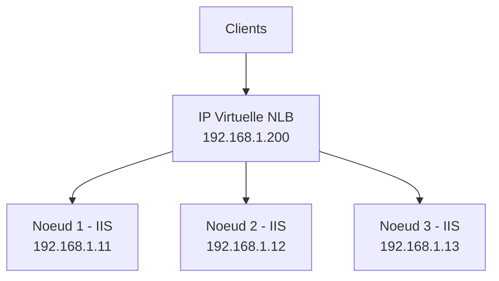
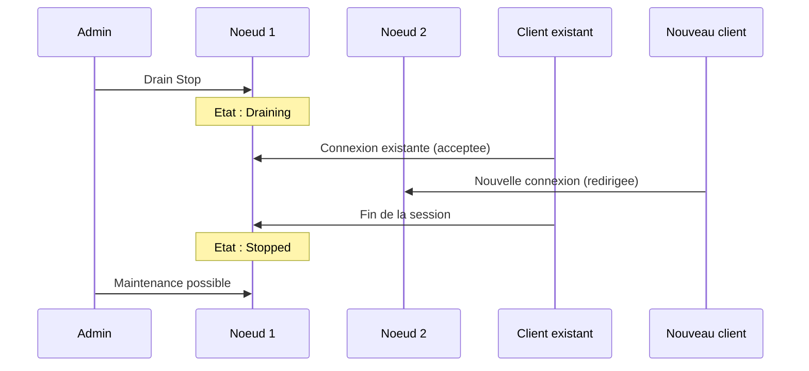

# Concepts du Network Load Balancing

!!! info "Niveau : avance | Temps estime : 35 minutes"

## Introduction

Le **Network Load Balancing** (NLB) est une fonctionnalite integree a Windows Server qui distribue le trafic reseau TCP/IP entre plusieurs serveurs. Contrairement au failover clustering qui offre de la haute disponibilite pour des services avec etat (stateful), NLB est optimise pour les services **sans etat** (stateless) comme les serveurs web IIS.

!!! warning "NLB vs solutions modernes"

    NLB reste disponible dans Windows Server 2022 mais est de plus en plus remplace par des solutions plus modernes : Azure Load Balancer, HAProxy, ou le role Windows Server Software Load Balancer (SLB). NLB reste pertinent pour les environnements on-premise sans infrastructure supplementaire.

## Architecture NLB



### Principes de fonctionnement

- Tous les noeuds NLB recoivent **chaque paquet** du trafic entrant
- Chaque noeud applique un algorithme de filtrage pour determiner s'il doit traiter le paquet
- Un seul noeud traite chaque connexion client (pas de duplication de reponse)
- Jusqu'a **32 noeuds** par cluster NLB

!!! info "Pas de routeur ou switch special"

    NLB fonctionne au niveau de la couche 2 (MAC) ou couche 3 (IP). Il ne necessite pas de materiel specifique, contrairement aux load balancers materiels (F5, Citrix NetScaler).

## Modes de fonctionnement

### Mode Unicast

En mode **unicast**, NLB remplace l'adresse MAC physique de la carte reseau par une adresse MAC virtuelle partagee par tous les noeuds.

| Avantage | Inconvenient |
|---|---|
| Simple a configurer | Communication entre noeuds impossible via l'interface NLB |
| Compatible avec tous les switchs | Necessite une 2e carte reseau pour la gestion |
| Aucune configuration switch requise | Peut provoquer du flooding sur le switch |

!!! warning "Flooding en mode unicast"

    En mode unicast, le switch ne peut pas apprendre l'adresse MAC virtuelle car elle est partagee. Il diffuse donc le trafic sur tous les ports (flooding), ce qui peut impacter les performances du reseau.

### Mode Multicast

En mode **multicast**, NLB ajoute une adresse MAC multicast sans remplacer l'adresse MAC physique. Les noeuds conservent leur adresse MAC d'origine.

| Avantage | Inconvenient |
|---|---|
| Communication entre noeuds possible | Necessite une entree ARP statique sur le routeur |
| Pas de flooding systematique | Configuration switch/routeur necessaire |
| Meilleure performance reseau | Pas supporte par tous les equipements reseau |

### Mode IGMP Multicast

Variante du mode multicast qui utilise **IGMP** (Internet Group Management Protocol) pour limiter la diffusion aux ports des noeuds NLB uniquement.

```powershell
# Set NLB cluster mode
# Unicast = 1, Multicast = 2, IGMP Multicast = 3
Set-NlbCluster -ClusterName "YOURNLB" -OperationMode Multicast
```

### Comparaison des modes

| Critere | Unicast | Multicast | IGMP Multicast |
|---|---|---|---|
| 2e carte reseau requise | Oui | Non | Non |
| Configuration switch | Non | Oui (ARP statique) | Oui (IGMP snooping) |
| Flooding | Oui | Limite | Non |
| Communication inter-noeuds | Non (via NLB NIC) | Oui | Oui |

## Affinite (Affinity)

L'**affinite** determine comment les connexions clientes sont distribuees entre les noeuds.

### Types d'affinite

| Mode | Description | Cas d'usage |
|---|---|---|
| **None** | Chaque connexion est repartie sans consideration de source | Services 100% stateless |
| **Single** | Toutes les connexions d'une meme IP client vont au meme noeud | Sessions applicatives (ASP.NET) |
| **Network (Class C)** | Toutes les connexions d'un meme sous-reseau /24 vont au meme noeud | Clients derriere un proxy |

```powershell
# Set affinity mode on a port rule
Set-NlbClusterPortRule -ClusterName "YOURNLB" `
    -Port 80 `
    -Affinity Single
```

!!! tip "Sessions et affinite"

    Si votre application web utilise des sessions en memoire (non distribuees), l'affinite **Single** est indispensable. Sinon, un utilisateur pourrait perdre sa session a chaque requete. La meilleure approche reste de stocker les sessions en base de donnees ou dans un cache distribue.

## Regles de port

Les **regles de port** (port rules) definissent comment le trafic est reparti pour chaque plage de ports.

### Types de regles

| Type | Description |
|---|---|
| **Multiple Hosts** | Trafic reparti entre tous les noeuds (mode standard) |
| **Single Host** | Tout le trafic va a un seul noeud (failover actif-passif) |
| **Disabled** | Le trafic sur ces ports est bloque |

```powershell
# Add a port rule for HTTP (80) and HTTPS (443) with load distribution
Add-NlbClusterPortRule -ClusterName "YOURNLB" `
    -StartPort 80 `
    -EndPort 80 `
    -Protocol TCP `
    -Mode Multiple `
    -Affinity Single

Add-NlbClusterPortRule -ClusterName "YOURNLB" `
    -StartPort 443 `
    -EndPort 443 `
    -Protocol TCP `
    -Mode Multiple `
    -Affinity Single
```

### Ponderation (Load Weight)

Chaque noeud peut avoir un poids de charge different pour repartir le trafic de maniere inegale.

```powershell
# Set load weight for a specific node (0-100)
# Higher weight = more traffic
Set-NlbClusterPortRule -ClusterName "YOURNLB" `
    -Port 80 `
    -HostID 1 `
    -LoadWeight 80

Set-NlbClusterPortRule -ClusterName "YOURNLB" `
    -Port 80 `
    -HostID 2 `
    -LoadWeight 20
```

## Drain Stop

Le **drain stop** est une fonctionnalite qui permet de retirer gracieusement un noeud du cluster NLB. Le noeud continue de traiter les connexions **existantes** mais n'accepte plus de **nouvelles** connexions.

```powershell
# Drain stop a node (finish existing connections, reject new ones)
Stop-NlbClusterNode -HostName "NODE1" -Drain

# Check drain status
Get-NlbClusterNode -HostName "NODE1" | Format-List Name, HostState

# Force stop (immediately drops all connections)
Stop-NlbClusterNode -HostName "NODE1"

# Resume a node
Start-NlbClusterNode -HostName "NODE1"
```



!!! tip "Maintenance sans interruption"

    Utilisez toujours le drain stop avant une maintenance planifiee. Cela evite de couper brutalement les sessions utilisateur en cours.

## Cas d'usage typiques

| Service | Configuration NLB recommandee |
|---|---|
| **Serveurs web IIS** | Multicast, affinite Single, ports 80/443 |
| **Remote Desktop Gateway** | Unicast, affinite Single, port 443 |
| **ADFS (federation)** | Multicast, affinite Single, port 443 |
| **Exchange CAS** | Deconseille (utiliser le load balancing L4/L7) |
| **VPN (SSTP)** | Unicast, affinite Single, port 443 |

## Limitations de NLB

| Limitation | Impact |
|---|---|
| Pas de health check applicatif | NLB ne detecte pas si le service (IIS) a plante, seulement si le noeud est injoignable |
| Pas de load balancing L7 | Pas d'inspection du contenu HTTP (URL, cookies) |
| Flooding en unicast | Impact reseau potentiel |
| 32 noeuds maximum | Suffisant pour la plupart des cas |
| Pas de support UDP fiable | Certaines applications UDP posent probleme |

## Points cles a retenir

- NLB distribue le trafic reseau entre plusieurs serveurs identiques pour les **services stateless**
- Le mode **unicast** est le plus simple mais provoque du flooding ; le **multicast** est preferable
- L'**affinite** garantit qu'un client est toujours dirige vers le meme noeud (essentiel pour les sessions)
- Le **drain stop** permet une maintenance sans interruption des sessions existantes
- NLB n'effectue pas de health check applicatif : combinez-le avec une surveillance externe
- Pour les charges modernes, envisagez Azure Load Balancer ou des solutions L7 (reverse proxy)

## Pour aller plus loin

- Configuration NLB : [Configuration](configuration.md)
- Documentation Microsoft : Network Load Balancing Overview
