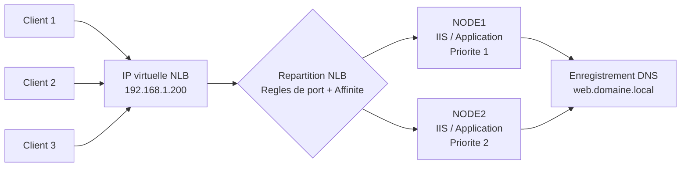

# Configuration du NLB

<span class="level-advanced">Avance</span> · Temps estime : 45 minutes

## Introduction

Ce chapitre couvre la mise en oeuvre pratique du Network Load Balancing sous Windows Server 2022. Nous allons configurer un cluster NLB pour des serveurs web IIS en utilisant PowerShell et l'interface graphique (NLB Manager).

## Architecture NLB



!!! example "Analogie"

    Configurer un cluster NLB, c'est comme installer plusieurs guichets dans une gare. D'abord, on forme les agents (installation de la fonctionnalite). Ensuite, on ouvre un premier guichet (creation du cluster), puis on ajoute les autres (ajout de noeuds). On definit les horaires et types de billets pour chaque guichet (regles de port). Enfin, on affiche un panneau unique "Guichets" (enregistrement DNS) pour que les voyageurs trouvent le bon endroit.

## Prerequis

### Installation de la fonctionnalite

La fonctionnalite NLB doit etre installee sur **chaque noeud** participant.

```powershell
# Install NLB feature on all nodes
$nodes = @("NODE1", "NODE2")
foreach ($node in $nodes) {
    Install-WindowsFeature -ComputerName $node -Name NLB -IncludeManagementTools
}

# Verify installation
Get-WindowsFeature -Name NLB -ComputerName "NODE1"
```

Resultat :

```text
Display Name                            Name     Install State
------------                            ----     -------------
[X] Network Load Balancing              NLB      Installed
[X] Network Load Balancing Tools        NLB-Tools Installed
```

### Prerequis reseau

- Chaque noeud doit avoir une adresse IP **statique**
- En mode unicast : **deux cartes reseau** par noeud (une pour NLB, une pour la gestion)
- En mode multicast : une seule carte reseau suffit
- Le pare-feu doit autoriser le trafic NLB

```powershell
# Verify static IP configuration on each node
Get-NetIPAddress -InterfaceAlias "Ethernet" -AddressFamily IPv4

# Verify multiple NICs (if using unicast mode)
Get-NetAdapter | Format-Table Name, InterfaceDescription, Status, LinkSpeed
```

### Prerequis applicatif

- L'application (IIS, ADFS, etc.) doit etre installee et **identiquement configuree** sur chaque noeud
- Le contenu applicatif doit etre synchronise entre les noeuds (DFS-R, deploiement, stockage partage)

## Creation du cluster NLB via PowerShell

### Etape 1 : Creer le cluster

```powershell
# Create a new NLB cluster on the first node
New-NlbCluster -HostName "NODE1" `
    -ClusterName "YOURNLB" `
    -InterfaceName "Ethernet" `
    -ClusterPrimaryIP "192.168.1.200" `
    -SubnetMask "255.255.255.0" `
    -OperationMode Multicast
```

| Parametre | Description |
|---|---|
| `-HostName` | Premier noeud du cluster |
| `-ClusterName` | Nom DNS complet ou court du cluster |
| `-InterfaceName` | Interface reseau utilisee pour NLB |
| `-ClusterPrimaryIP` | Adresse IP virtuelle du cluster |
| `-OperationMode` | Unicast, Multicast ou IgmpMulticast |

### Etape 2 : Ajouter des noeuds

```powershell
# Add a second node to the NLB cluster
Add-NlbClusterNode -HostName "NODE2" `
    -InterfaceName "Ethernet" `
    -NewNodeInterface "Ethernet" `
    -NewNodeName "NODE2"
```

### Etape 3 : Configurer les regles de port

```powershell
# Remove the default port rule (all ports)
Remove-NlbClusterPortRule -ClusterName "YOURNLB" -Port 0

# Add rule for HTTP
Add-NlbClusterPortRule -ClusterName "YOURNLB" `
    -StartPort 80 `
    -EndPort 80 `
    -Protocol TCP `
    -Mode Multiple `
    -Affinity Single

# Add rule for HTTPS
Add-NlbClusterPortRule -ClusterName "YOURNLB" `
    -StartPort 443 `
    -EndPort 443 `
    -Protocol TCP `
    -Mode Multiple `
    -Affinity Single
```

### Etape 4 : Configurer le DNS

```powershell
# Add DNS A record for the NLB cluster IP
Add-DnsServerResourceRecordA -ZoneName "yourdomain.local" `
    -Name "web" `
    -IPv4Address "192.168.1.200" `
    -ComputerName "YOURDNSSERVER"
```

## Creation via NLB Manager (GUI)

### Ouvrir NLB Manager

```powershell
# Launch NLB Manager
nlbmgr.exe
```

### Procedure

1. **Cluster** > **New** pour creer un nouveau cluster
2. **Host Parameters** :
    - Saisir le nom du premier noeud (NODE1)
    - Cliquer sur **Connect**
    - Selectionner l'interface reseau
    - Definir la priorite (identifiant unique du noeud, 1 pour le premier)
3. **Cluster IP Addresses** :
    - Ajouter l'adresse IP virtuelle du cluster (192.168.1.200)
4. **Cluster Parameters** :
    - Saisir le nom complet du cluster (FQDN)
    - Choisir le mode : Unicast ou Multicast
5. **Port Rules** :
    - Supprimer la regle par defaut
    - Ajouter les regles pour les ports 80 et 443
6. Valider la creation

### Ajouter un noeud via NLB Manager

1. Clic droit sur le cluster > **Add Host to Cluster**
2. Saisir le nom du noeud suivant (NODE2)
3. Cliquer sur **Connect**
4. Selectionner l'interface reseau
5. Definir la priorite (2 pour le deuxieme noeud)
6. Valider

## Configuration avancee

### Modifier le mode de fonctionnement

```powershell
# Switch to multicast mode
Set-NlbCluster -ClusterName "YOURNLB" -OperationMode Multicast

# Switch to IGMP multicast
Set-NlbCluster -ClusterName "YOURNLB" -OperationMode IgmpMulticast
```

### Configurer le timeout de convergence

La **convergence** est le processus par lequel les noeuds NLB se mettent d'accord sur la repartition du trafic apres un changement (ajout/retrait de noeud).

```powershell
# View current cluster parameters
Get-NlbCluster -ClusterName "YOURNLB" | Get-NlbClusterDriverInfo
```

### Configurer la ponderation par noeud

```powershell
# Set load weight per node (distribute 70% to NODE1, 30% to NODE2)
Set-NlbClusterPortRule -ClusterName "YOURNLB" `
    -Port 80 `
    -HostID 1 `
    -LoadWeight 70

Set-NlbClusterPortRule -ClusterName "YOURNLB" `
    -Port 80 `
    -HostID 2 `
    -LoadWeight 30
```

### Configurer le pare-feu

```powershell
# Allow NLB heartbeat traffic (run on each node)
New-NetFirewallRule -DisplayName "NLB Heartbeat" `
    -Direction Inbound `
    -Protocol UDP `
    -LocalPort 3343 `
    -Action Allow

# Allow HTTP and HTTPS
New-NetFirewallRule -DisplayName "HTTP Inbound" `
    -Direction Inbound `
    -Protocol TCP `
    -LocalPort 80 `
    -Action Allow

New-NetFirewallRule -DisplayName "HTTPS Inbound" `
    -Direction Inbound `
    -Protocol TCP `
    -LocalPort 443 `
    -Action Allow
```

## Operations courantes

### Gestion des noeuds

```powershell
# View cluster status
Get-NlbCluster -ClusterName "YOURNLB" | Get-NlbClusterNode | Format-Table Name, HostState, HostPriority

# Drain stop a node (graceful removal)
Stop-NlbClusterNode -HostName "NODE1" -Drain

# Force stop a node
Stop-NlbClusterNode -HostName "NODE1"

# Start a node
Start-NlbClusterNode -HostName "NODE1"

# Remove a node from the cluster
Remove-NlbClusterNode -HostName "NODE2" -Force
```

### Surveillance

```powershell
# View detailed cluster information
Get-NlbCluster -ClusterName "YOURNLB" | Format-List *

# View port rules
Get-NlbClusterPortRule -ClusterName "YOURNLB"

# View node status
Get-NlbClusterNode -ClusterName "YOURNLB" | Format-Table Name, HostState, StatusCode
```

## Tests de validation

### Test de connectivite

```powershell
# Test connectivity to the NLB virtual IP
Test-Connection -ComputerName "192.168.1.200" -Count 4

# Test HTTP response from the NLB cluster
Invoke-WebRequest -Uri "http://192.168.1.200" -UseBasicParsing | Select-Object StatusCode, StatusDescription
```

### Test de repartition de charge

```powershell
# Send multiple requests and check which node responds
# (requires the web app to identify the serving node)
$results = 1..20 | ForEach-Object {
    $response = Invoke-WebRequest -Uri "http://192.168.1.200/healthcheck" -UseBasicParsing
    [PSCustomObject]@{
        Request = $_
        Server = $response.Headers["X-Served-By"]
        StatusCode = $response.StatusCode
    }
}
$results | Group-Object -Property Server | Format-Table Name, Count
```

### Test de basculement

```powershell
# Step 1: Verify initial state
Get-NlbClusterNode -ClusterName "YOURNLB" | Format-Table Name, HostState

# Step 2: Stop one node
Stop-NlbClusterNode -HostName "NODE1" -Drain

# Step 3: Verify traffic still flows
Invoke-WebRequest -Uri "http://192.168.1.200" -UseBasicParsing | Select-Object StatusCode

# Step 4: Restart the node
Start-NlbClusterNode -HostName "NODE1"

# Step 5: Verify convergence
Get-NlbClusterNode -ClusterName "YOURNLB" | Format-Table Name, HostState
```

### Test de performance

```powershell
# Simple load test (sequential requests)
$stopwatch = [System.Diagnostics.Stopwatch]::StartNew()
$successCount = 0
$failCount = 0

1..100 | ForEach-Object {
    try {
        $null = Invoke-WebRequest -Uri "http://192.168.1.200" -UseBasicParsing -TimeoutSec 5
        $successCount++
    } catch {
        $failCount++
    }
}

$stopwatch.Stop()
Write-Output "Completed in $($stopwatch.Elapsed.TotalSeconds) seconds"
Write-Output "Success: $successCount | Failed: $failCount"
```

## Depannage

| Symptome | Cause probable | Solution |
|---|---|---|
| Le cluster ne converge pas | Pare-feu bloquant le port 3343 | Ouvrir le port UDP 3343 |
| Un noeud reste "Stopped" | Configuration reseau incorrecte | Verifier IP et interface |
| Performances degradees | Flooding unicast | Passer en multicast |
| Timeout des clients | Tous les noeuds sont down | Verifier l'etat des noeuds et du service |
| Sessions perdues | Affinite non configuree | Activer l'affinite Single |

```powershell
# View NLB event logs
Get-WinEvent -LogName "Microsoft-Windows-NLB/Operational" -MaxEvents 20 |
    Format-Table TimeCreated, LevelDisplayName, Message -Wrap

# Check NLB driver status
Get-NlbCluster -ClusterName "YOURNLB" | Get-NlbClusterDriverInfo
```

## Points cles a retenir

- Installez NLB sur **tous les noeuds** avant de creer le cluster
- Privilegiez le mode **multicast** pour eviter le flooding
- Supprimez la regle de port par defaut et creez des regles specifiques
- Utilisez le **drain stop** pour les maintenances planifiees
- Testez la repartition de charge et le basculement apres la configuration
- Configurez un enregistrement DNS pointant vers l'IP virtuelle du cluster NLB

## Pour aller plus loin

- Concepts NLB : [Concepts NLB](concepts-nlb.md)
- Documentation Microsoft : Network Load Balancing Deployment Guide
