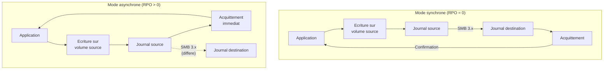
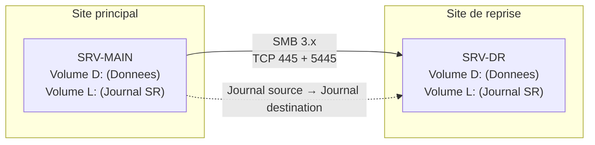

<!--
  Copyright 2026 Julien Bombled

  Licensed under the Apache License, Version 2.0 (the "License");
  you may not use this file except in compliance with the License.
  You may obtain a copy of the License at

      http://www.apache.org/licenses/LICENSE-2.0

  Unless required by applicable law or agreed to in writing, software
  distributed under the License is distributed on an "AS IS" BASIS,
  WITHOUT WARRANTIES OR CONDITIONS OF ANY KIND, either express or implied.
  See the License for the specific language governing permissions and
  limitations under the License.
-->

# Storage Replica

<span class="level-advanced">Avance</span> · Temps estime : 35 minutes

## Introduction

**Storage Replica** (SR) est une technologie de Windows Server qui fournit une replication de volumes **au niveau bloc**, independante du systeme de fichiers. Elle permet de repliquer des volumes entre des serveurs ou des clusters, en mode synchrone ou asynchrone, pour la reprise d'activite (Disaster Recovery) et la haute disponibilite.

!!! example "Analogie"

    Imaginez un **coffre-fort** contenant les documents les plus precieux de votre entreprise. Storage Replica, c'est comme installer un **miroir en temps reel de ce coffre-fort dans un autre batiment**. Chaque fois qu'un document est ajoute ou modifie dans le coffre-fort principal, la copie est instantanement (mode synchrone) ou tres rapidement (mode asynchrone) reproduite dans le coffre-fort distant. Si le batiment principal est sinistre, vous disposez d'une replique parfaite dans l'autre site, prete a prendre le relais.

## Concepts fondamentaux

### Replication au niveau bloc

Contrairement a DFS-R qui replique au niveau fichier, Storage Replica opere au **niveau bloc**. Chaque ecriture sur le volume source est capturee dans un journal (log) puis transmise au volume de destination. Cela garantit :

- La **coherence des donnees** a l'ecriture (write-order consistency)
- La compatibilite avec **tout systeme de fichiers** (NTFS, ReFS, CSV)
- Le support des **charges de travail sensibles** (SQL Server, Hyper-V)

### Synchrone vs asynchrone



| Critere | Synchrone | Asynchrone |
|---|---|---|
| **RPO** (Recovery Point Objective) | 0 (aucune perte de donnees) | > 0 (perte possible des dernieres secondes) |
| **Latence reseau maximale** | < 5 ms aller-retour | Aucune limite stricte |
| **Distance typique** | Meme campus / datacenter | Inter-sites distants |
| **Impact sur les performances** | Latence d'ecriture augmentee | Minimal |
| **Cas d'usage** | Haute disponibilite critique | Reprise d'activite inter-sites |

!!! tip "Choix du mode"

    Utilisez le mode **synchrone** lorsque les deux sites sont proches (< 5 ms RTT) et que la perte de donnees est inacceptable. Utilisez le mode **asynchrone** pour les sites distants ou la latence reseau depasse 5 ms.

### Scenarios de deploiement

| Scenario | Description |
|---|---|
| **Server-to-Server** | Replication entre deux serveurs autonomes. Le plus simple a deployer. |
| **Cluster-to-Cluster** | Replication entre deux clusters de basculement. Protege les charges de travail clusterisees. |
| **Stretch Cluster** | Un seul cluster etendu sur deux sites. Basculement automatique entre sites. |



## Prerequis

### Systeme d'exploitation

| Edition | Capacites |
|---|---|
| **Windows Server 2022 Datacenter** | Nombre illimite de volumes repliques |
| **Windows Server 2022 Standard** | Un seul partenariat, un seul volume, taille max 2 To |

!!! warning "Edition Standard"

    L'edition Standard est limitee a **un seul volume replique de 2 To maximum**. Pour les environnements de production avec plusieurs volumes, l'edition **Datacenter** est requise.

### Infrastructure reseau

- **SMB 3.x** : protocole de transport pour la replication
- **Ports requis** : TCP 445 (SMB), TCP 5445 (SMB SR transport), ICMPv4/v6
- **Bande passante** : au minimum 1 Gbps (10 Gbps recommande pour le mode synchrone)
- **Latence** : < 5 ms RTT pour le mode synchrone

### Volumes

- Les volumes source et destination doivent avoir la **meme taille**
- Un **volume de journal dedie** (log volume) est requis sur chaque serveur
- Le journal doit etre sur un stockage **rapide** (SSD recommande)
- Taille de journal recommandee : **8 Go minimum** (9 Go par defaut)
- Les volumes peuvent etre sur des types de stockage differents (SAS, SSD, NVMe)

### Configuration requise

```powershell
# Verify prerequisites on both servers
Test-SRTopology -SourceComputerName "SRV-MAIN" `
    -SourceVolumeName "D:" `
    -SourceLogVolumeName "L:" `
    -DestinationComputerName "SRV-DR" `
    -DestinationVolumeName "D:" `
    -DestinationLogVolumeName "L:" `
    -DurationInMinutes 30 `
    -ResultPath "C:\Temp\SR-Report.html"
```

!!! info "Test-SRTopology"

    Cette commande execute un test de performance pendant la duree specifiee et genere un rapport HTML detaille. Elle verifie la bande passante, la latence et la compatibilite des volumes. Executez-la **avant** toute configuration de production.

## Installation

### Installer la fonctionnalite

```powershell
# Install Storage Replica on both servers
Install-WindowsFeature Storage-Replica -IncludeManagementTools -Restart

# Alternatively, install on a remote server
Install-WindowsFeature Storage-Replica -IncludeManagementTools `
    -ComputerName "SRV-DR" -Restart
```

Resultat :

```text
Success Restart Needed Exit Code      Feature Result
------- -------------- ---------      --------------
True    Yes            SuccessRest... {Storage Replica}
```

### Verifier l'installation

```powershell
# Verify the feature on both servers
Get-WindowsFeature Storage-Replica | Format-Table Name, InstallState -AutoSize
```

Resultat :

```text
Name            InstallState
----            ------------
Storage-Replica Installed
```

## Configuration server-to-server

### Preparer les volumes

Chaque serveur a besoin de deux volumes : un volume de donnees et un volume de journal.

```powershell
# On SRV-MAIN: verify volumes
Get-Volume | Where-Object { $_.DriveLetter -in @('D','L') } |
    Format-Table DriveLetter, FileSystemLabel,
        @{N='SizeGB';E={[math]::Round($_.Size/1GB,2)}},
        @{N='FreeGB';E={[math]::Round($_.SizeRemaining/1GB,2)}} -AutoSize
```

Resultat :

```text
DriveLetter FileSystemLabel SizeGB FreeGB
----------- --------------- ------ ------
D           Data            500.00 320.00
L           SR-Log           10.00   9.80
```

### Creer le partenariat de replication

```powershell
# Create the SR partnership (synchronous mode)
New-SRPartnership -SourceComputerName "SRV-MAIN" `
    -SourceRGName "RG-Main" `
    -SourceVolumeName "D:" `
    -SourceLogVolumeName "L:" `
    -DestinationComputerName "SRV-DR" `
    -DestinationRGName "RG-DR" `
    -DestinationVolumeName "D:" `
    -DestinationLogVolumeName "L:" `
    -ReplicationMode Synchronous `
    -LogSizeInBytes 8GB
```

Pour le mode asynchrone :

```powershell
# Create an asynchronous partnership (for distant sites)
New-SRPartnership -SourceComputerName "SRV-MAIN" `
    -SourceRGName "RG-Main" `
    -SourceVolumeName "D:" `
    -SourceLogVolumeName "L:" `
    -DestinationComputerName "SRV-DR" `
    -DestinationRGName "RG-DR" `
    -DestinationVolumeName "D:" `
    -DestinationLogVolumeName "L:" `
    -ReplicationMode Asynchronous `
    -LogSizeInBytes 8GB `
    -AsyncRPO 300
```

!!! info "Parametre AsyncRPO"

    Le parametre `-AsyncRPO` definit le RPO en secondes. La valeur `300` signifie que le systeme alerte si la replication prend plus de 5 minutes de retard. Ce n'est pas une garantie de RPO mais un seuil d'alerte.

### Verifier la synchronisation initiale

```powershell
# Check replication status
Get-SRGroup | Format-Table Name, Replicas -AutoSize

# Detailed replication state
(Get-SRGroup).Replicas | Select-Object NumOfBytesRemaining,
    NumOfBytesRecovered, ReplicationStatus
```

Resultat pendant la synchronisation initiale :

```text
Name    Replicas
----    --------
RG-Main {D:}

NumOfBytesRemaining NumOfBytesRecovered ReplicationStatus
------------------- ------------------- -----------------
     125829120000          54975581184 InitialBlockCopy
```

Resultat apres synchronisation complete :

```text
NumOfBytesRemaining NumOfBytesRecovered ReplicationStatus
------------------- ------------------- -----------------
                  0         180925071360 ContinuouslyReplicating
```

## Basculement (failover)

### Basculer vers le site de reprise

En cas de sinistre sur le site principal, inversez la direction de la replication :

```powershell
# Reverse replication direction (run on SRV-DR)
Set-SRPartnership -NewSourceComputerName "SRV-DR" `
    -SourceRGName "RG-DR" `
    -DestinationComputerName "SRV-MAIN" `
    -DestinationRGName "RG-Main" `
    -Confirm:$false
```

!!! warning "Acces au volume"

    Apres le basculement, le volume D: sur SRV-DR devient accessible en lecture/ecriture. Le volume D: sur SRV-MAIN (s'il est encore en ligne) passe en lecture seule. Les applications doivent etre reconfigurees pour pointer vers SRV-DR.

### Retour au site principal (failback)

Une fois le site principal restaure :

```powershell
# Reverse back to original direction (run on SRV-MAIN)
Set-SRPartnership -NewSourceComputerName "SRV-MAIN" `
    -SourceRGName "RG-Main" `
    -DestinationComputerName "SRV-DR" `
    -DestinationRGName "RG-DR" `
    -Confirm:$false
```

## Supervision et monitoring

### Commandes de surveillance

```powershell
# View all SR groups
Get-SRGroup | Format-List Name, ReplicationMode, LogVolume, Replicas

# View all SR partnerships
Get-SRPartnership | Format-List SourceComputerName, SourceRGName,
    DestinationComputerName, DestinationRGName, ReplicationMode

# View detailed replication metrics
(Get-SRGroup).Replicas | Format-List DataVolume, ReplicationStatus,
    NumOfBytesRemaining, NumOfBytesRecovered,
    @{N='RemainingGB';E={[math]::Round($_.NumOfBytesRemaining/1GB,2)}}
```

### Journaux d'evenements

```powershell
# View Storage Replica events (last 50 entries)
Get-WinEvent -LogName "Microsoft-Windows-StorageReplica/Admin" -MaxEvents 50 |
    Format-Table TimeCreated, Id, Message -Wrap -AutoSize

# Filter for errors and warnings only
Get-WinEvent -LogName "Microsoft-Windows-StorageReplica/Admin" -MaxEvents 20 |
    Where-Object { $_.Level -le 3 } |
    Format-Table TimeCreated, LevelDisplayName, Message -Wrap
```

### Compteurs de performance

```powershell
# Monitor SR replication throughput
Get-Counter -Counter "\Storage Replica Statistics(*)\Total Bytes Sent" `
    -SampleInterval 5 -MaxSamples 12 |
    ForEach-Object {
        $_.CounterSamples | Format-Table InstanceName,
            @{N='ThroughputMBps';E={[math]::Round($_.CookedValue/1MB,2)}}
    }
```

## Points cles a retenir

- Storage Replica replique au **niveau bloc**, garantissant la coherence des donnees a l'ecriture
- Le mode **synchrone** (RPO = 0) requiert une latence < 5 ms ; le mode **asynchrone** tolere des distances plus grandes
- L'edition **Standard** est limitee a un seul volume de 2 To maximum
- Un **volume de journal dedie** (SSD recommande) est indispensable sur chaque serveur
- **Test-SRTopology** doit etre execute avant toute configuration de production
- Le basculement s'effectue avec `Set-SRPartnership` en inversant la direction

!!! example "Scenario pratique"

    **Contexte :** Thomas, administrateur dans une societe de logistique, doit mettre en place une replication entre le datacenter principal (Paris) et le site de reprise (Lyon), distants de 470 km. Le serveur principal (SRV-PARIS) heberge un volume de 500 Go de donnees critiques. Le lien WAN offre 100 Mbps avec une latence de 15 ms RTT.

    **Choix technique :** La latence de 15 ms exclut le mode synchrone (limite a 5 ms). Thomas choisit le mode **asynchrone** avec un RPO cible de 5 minutes.

    **Mise en oeuvre :**

    ```powershell
    # Install Storage Replica on both servers
    Install-WindowsFeature Storage-Replica -IncludeManagementTools `
        -ComputerName "SRV-PARIS" -Restart
    Install-WindowsFeature Storage-Replica -IncludeManagementTools `
        -ComputerName "SRV-LYON" -Restart

    # Validate the topology (run a 30-minute test)
    Test-SRTopology -SourceComputerName "SRV-PARIS" `
        -SourceVolumeName "D:" `
        -SourceLogVolumeName "L:" `
        -DestinationComputerName "SRV-LYON" `
        -DestinationVolumeName "D:" `
        -DestinationLogVolumeName "L:" `
        -DurationInMinutes 30 `
        -ResultPath "C:\Temp\SR-Validation.html"

    # Create the asynchronous partnership
    New-SRPartnership -SourceComputerName "SRV-PARIS" `
        -SourceRGName "RG-Paris" `
        -SourceVolumeName "D:" `
        -SourceLogVolumeName "L:" `
        -DestinationComputerName "SRV-LYON" `
        -DestinationRGName "RG-Lyon" `
        -DestinationVolumeName "D:" `
        -DestinationLogVolumeName "L:" `
        -ReplicationMode Asynchronous `
        -AsyncRPO 300 `
        -LogSizeInBytes 8GB
    ```

    **Verification :**

    ```powershell
    # Monitor initial synchronization progress
    (Get-SRGroup -Name "RG-Paris").Replicas |
        Select-Object DataVolume, ReplicationStatus,
            @{N='RemainingGB';E={[math]::Round($_.NumOfBytesRemaining/1GB,2)}}
    ```

??? success "Resultat attendu"

    ```text
    DataVolume       ReplicationStatus       RemainingGB
    ----------       -----------------       -----------
    D:               ContinuouslyReplicating        0.00
    ```

    Apres la synchronisation initiale (environ 11 heures pour 500 Go sur un lien 100 Mbps), la replication continue fonctionne en arriere-plan. Thomas verifie regulierement les journaux d'evenements et met en place un test de basculement trimestriel vers SRV-LYON pour valider le PRA.

## Erreurs courantes

!!! failure "Erreur 1 : Volume de journal trop petit"

    Un journal sous-dimensionne provoque des ralentissements de replication et des erreurs de type `The log is full`. La taille par defaut de 8 Go convient pour la plupart des charges legeres, mais les environnements a fort taux d'ecriture necessitent 16 Go ou plus. Surveillez les evenements du journal `Microsoft-Windows-StorageReplica/Admin` et augmentez la taille du journal si necessaire.

!!! failure "Erreur 2 : Latence elevee en mode synchrone"

    Utiliser le mode synchrone sur un lien WAN avec une latence > 5 ms RTT degrade considerablement les performances d'ecriture. Chaque ecriture doit attendre la confirmation du site distant. Mesurez la latence reelle avec `Test-SRTopology` et basculez en mode asynchrone si le RTT depasse 5 ms : `Set-SRPartnership -ReplicationMode Asynchronous -AsyncRPO 300`.

!!! failure "Erreur 3 : Port SMB bloque par le pare-feu"

    Storage Replica utilise SMB (TCP 445) et le transport SR (TCP 5445). Si ces ports sont bloques entre les deux serveurs, la replication echoue silencieusement. Verifiez la connectivite avec `Test-NetConnection -ComputerName "SRV-DR" -Port 445` et `Test-NetConnection -ComputerName "SRV-DR" -Port 5445`. Ouvrez les regles de pare-feu correspondantes sur les deux serveurs.

!!! failure "Erreur 4 : Volumes source et destination de tailles differentes"

    Storage Replica exige que les volumes de donnees source et destination aient **exactement la meme taille**. Une difference meme minime fait echouer `New-SRPartnership`. Verifiez les tailles avec `Get-Partition` sur les deux serveurs et redimensionnez si necessaire avant de creer le partenariat.

!!! failure "Erreur 5 : Limitation de l'edition Standard ignoree"

    Sur Windows Server 2022 Standard, Storage Replica est limite a **un seul partenariat avec un seul volume de 2 To maximum**. Tenter de creer un second partenariat ou de repliquer un volume plus grand echoue. Pour plusieurs volumes ou des volumes superieurs a 2 To, une licence **Datacenter** est requise.

## Pour aller plus loin

- [Concepts du clustering](../cluster/concepts-cluster.md)
- [Strategie de sauvegarde](../backup/strategie-sauvegarde.md)
- [Storage Spaces Direct](../../stockage/storage-spaces/storage-spaces-direct.md)
