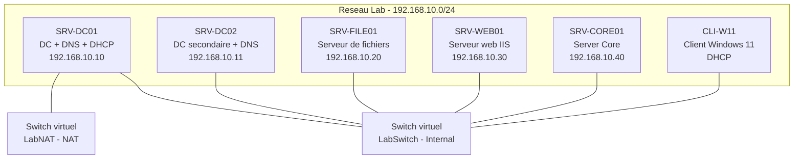

<!--
  Copyright 2026 Julien Bombled

  Licensed under the Apache License, Version 2.0 (the "License");
  you may not use this file except in compliance with the License.
  You may obtain a copy of the License at

      http://www.apache.org/licenses/LICENSE-2.0

  Unless required by applicable law or agreed to in writing, software
  distributed under the License is distributed on an "AS IS" BASIS,
  WITHOUT WARRANTIES OR CONDITIONS OF ANY KIND, either express or implied.
  See the License for the specific language governing permissions and
  limitations under the License.
-->

# Architecture du lab

<span class="level-beginner">Debutant</span> · Temps estime : 15 minutes

## Presentation

Ce lab simule l'infrastructure d'une PME avec un domaine Active Directory, des services reseau (DNS, DHCP), un serveur de fichiers, un serveur web et un poste client. L'ensemble est virtualise sous Hyper-V.

## Diagramme reseau




## Plan d'adressage IP

| Parametre | Valeur |
|-----------|--------|
| **Reseau** | 192.168.10.0/24 |
| **Masque** | 255.255.255.0 |
| **Passerelle** | 192.168.10.1 (hote Hyper-V via NAT) |
| **DNS primaire** | 192.168.10.10 (SRV-DC01) |
| **DNS secondaire** | 192.168.10.11 (SRV-DC02) |
| **Plage DHCP** | 192.168.10.100 - 192.168.10.200 |
| **Reservations** | 192.168.10.10 - 192.168.10.50 (serveurs) |

### Attribution des adresses statiques

| Serveur | Adresse IP | Masque | Passerelle | DNS |
|---------|-----------|--------|------------|-----|
| SRV-DC01 | 192.168.10.10 | /24 | 192.168.10.1 | 127.0.0.1, 192.168.10.11 |
| SRV-DC02 | 192.168.10.11 | /24 | 192.168.10.1 | 192.168.10.10, 127.0.0.1 |
| SRV-FILE01 | 192.168.10.20 | /24 | 192.168.10.1 | 192.168.10.10, 192.168.10.11 |
| SRV-WEB01 | 192.168.10.30 | /24 | 192.168.10.1 | 192.168.10.10, 192.168.10.11 |
| SRV-CORE01 | 192.168.10.40 | /24 | 192.168.10.1 | 192.168.10.10, 192.168.10.11 |
| CLI-W11 | DHCP | /24 | 192.168.10.1 | 192.168.10.10, 192.168.10.11 |

## Roles des serveurs

| Serveur | OS | Roles | Usage dans les labs |
|---------|-----|-------|-------------------|
| **SRV-DC01** | Server 2022 GUI | AD DS, DNS, DHCP, CA | Labs 02-04, 08, 10 |
| **SRV-DC02** | Server 2022 GUI | AD DS, DNS (secondaire) | Labs 02, 07 |
| **SRV-FILE01** | Server 2022 GUI | Serveur de fichiers, DFS | Lab 05 |
| **SRV-WEB01** | Server 2022 GUI | IIS, serveur web | Lab 09 |
| **SRV-CORE01** | Server 2022 Core | Roles divers, PowerShell | Labs 01, 06, 09 |
| **CLI-W11** | Windows 11 | Client, RSAT | Tests et validation |

## Convention de nommage

| Element | Convention | Exemple |
|---------|-----------|---------|
| **Domaine AD** | `<labo>.local` | `winopslab.local` |
| **NetBIOS** | `<LABO>` | `WINOPSLAB` |
| **Serveurs** | `SRV-<ROLE><NN>` | `SRV-DC01`, `SRV-FILE01` |
| **Clients** | `CLI-<OS>` | `CLI-W11` |
| **Utilisateurs** | `prenom.nom` | `jean.dupont` |
| **Groupes globaux** | `GG_<description>` | `GG_Comptabilite` |
| **Groupes locaux domaine** | `DL_<ressource>_<permission>` | `DL_Partage_Lecture` |
| **OU** | Nom descriptif | `Utilisateurs`, `Serveurs`, `Groupes` |
| **GPO** | `GPO_<cible>_<action>` | `GPO_Users_PasswordPolicy` |

## Domaine Active Directory

| Parametre | Valeur |
|-----------|--------|
| **Nom de domaine** | winopslab.local |
| **NetBIOS** | WINOPSLAB |
| **Niveau fonctionnel foret** | Windows Server 2016 |
| **Niveau fonctionnel domaine** | Windows Server 2016 |
| **Mode DSRM** | Mot de passe a definir lors de la promotion |

### Structure des OU

```
winopslab.local
|-- Utilisateurs
|   |-- Direction
|   |-- Comptabilite
|   |-- Informatique
|   |-- Commercial
|-- Groupes
|   |-- Globaux
|   |-- LocauxDomaine
|-- Serveurs
|-- Postes de travail
|-- Comptes de service
```

## Switches virtuels

| Switch | Type | Connectivite |
|--------|------|-------------|
| **LabSwitch** | Internal | Communication entre VMs (pas d'acces Internet) |
| **LabNAT** | NAT | Acces Internet via NAT (optionnel) |

```powershell
# Create internal switch for lab communication
New-VMSwitch -Name "LabSwitch" -SwitchType Internal

# Create NAT switch for Internet access (optional)
New-VMSwitch -Name "LabNAT" -SwitchType Internal
$ifIndex = (Get-NetAdapter | Where-Object { $_.Name -like "*LabNAT*" }).ifIndex
New-NetIPAddress -InterfaceIndex $ifIndex -IPAddress 192.168.10.1 -PrefixLength 24
New-NetNat -Name "LabNATNetwork" -InternalIPInterfaceAddressPrefix 192.168.10.0/24
```

## Comptes utilisateurs de test

| Utilisateur | Mot de passe lab | OU | Groupe |
|-------------|-----------------|-----|--------|
| `admin.lab` | `P@ssw0rd!Lab` | Informatique | Domain Admins |
| `jean.dupont` | `P@ssw0rd!` | Direction | GG_Direction |
| `marie.martin` | `P@ssw0rd!` | Comptabilite | GG_Comptabilite |
| `pierre.durand` | `P@ssw0rd!` | Informatique | GG_Informatique |
| `sophie.bernard` | `P@ssw0rd!` | Commercial | GG_Commercial |

!!! danger "Mots de passe"

    Ces mots de passe sont destines au lab uniquement. En production, utilisez toujours
    des mots de passe complexes et uniques. Jamais de mots de passe identiques entre les comptes.

## Points cles a retenir

- Le lab simule une infrastructure PME complete avec AD, DNS, DHCP, fichiers et web
- Le reseau 192.168.10.0/24 est isole via un switch virtuel interne
- Deux controleurs de domaine assurent la redondance AD et DNS
- La convention de nommage coherente facilite la gestion et la documentation
- Le switch NAT optionnel fournit un acces Internet aux VMs si necessaire
- La structure des OU prepare le terrain pour les GPO et les delegations

## Pour aller plus loin

- [Prerequis materiel](prerequis-materiel.md) pour verifier votre configuration
- [Creation des VMs](creation-vms.md) pour automatiser le deploiement
- [Lab 01 : Installation](../exercices/lab-01-installation.md) pour commencer les exercices

