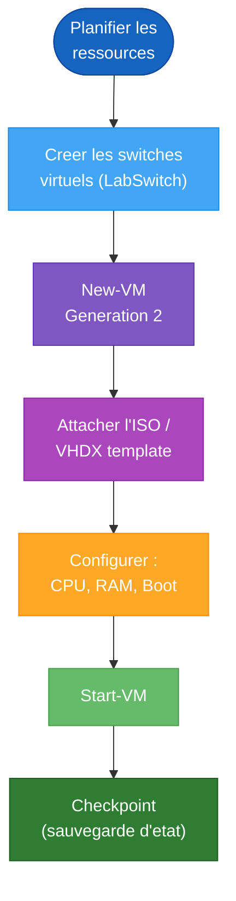

<!--
  Copyright 2026 Julien Bombled

  Licensed under the Apache License, Version 2.0 (the "License");
  you may not use this file except in compliance with the License.
  You may obtain a copy of the License at

      http://www.apache.org/licenses/LICENSE-2.0

  Unless required by applicable law or agreed to in writing, software
  distributed under the License is distributed on an "AS IS" BASIS,
  WITHOUT WARRANTIES OR CONDITIONS OF ANY KIND, either express or implied.
  See the License for the specific language governing permissions and
  limitations under the License.
-->

# Creation des machines virtuelles

<span class="level-intermediate">Intermediaire</span> · Temps estime : 30 minutes

## Presentation

Ce guide fournit les scripts PowerShell pour creer automatiquement toutes les machines virtuelles du lab. L'approche par script garantit la coherence et permet de reconstruire rapidement l'environnement.



## Prerequis

- Hyper-V active sur la machine hote
- ISO Windows Server 2022 Evaluation telechargee
- ISO Windows 11 Enterprise Evaluation telechargee
- Espace disque suffisant (voir [Prerequis materiel](prerequis-materiel.md))

## Variables de configuration

```powershell
# Lab configuration variables
$LabConfig = @{
    VMBasePath    = "G:\VMs"
    VHDBasePath   = "G:\VMs\VHDs"
    ISOServer     = "G:\ISOs\WindowsServer2022.iso"
    ISOClient     = "G:\ISOs\Windows11Enterprise.iso"
    SwitchName    = "LabSwitch"
    NATSwitchName = "LabNAT"
}

# VM definitions
$VMs = @(
    @{ Name="SRV-DC01";   CPU=2; RAM=4GB; Disk=60GB; ISO=$LabConfig.ISOServer }
    @{ Name="SRV-DC02";   CPU=2; RAM=4GB; Disk=60GB; ISO=$LabConfig.ISOServer }
    @{ Name="SRV-FILE01"; CPU=2; RAM=4GB; Disk=80GB; ISO=$LabConfig.ISOServer }
    @{ Name="SRV-WEB01";  CPU=2; RAM=4GB; Disk=60GB; ISO=$LabConfig.ISOServer }
    @{ Name="SRV-CORE01"; CPU=2; RAM=2GB; Disk=40GB; ISO=$LabConfig.ISOServer }
    @{ Name="CLI-W11";    CPU=2; RAM=4GB; Disk=60GB; ISO=$LabConfig.ISOClient }
)
```

## Creer les switches virtuels

```powershell
# Create internal switch for lab communication
if (-not (Get-VMSwitch -Name $LabConfig.SwitchName -ErrorAction SilentlyContinue)) {
    New-VMSwitch -Name $LabConfig.SwitchName -SwitchType Internal
    Write-Output "Switch '$($LabConfig.SwitchName)' created."
}

# Create NAT switch for Internet access (optional)
if (-not (Get-VMSwitch -Name $LabConfig.NATSwitchName -ErrorAction SilentlyContinue)) {
    New-VMSwitch -Name $LabConfig.NATSwitchName -SwitchType Internal

    # Configure NAT on the host
    $ifIndex = (Get-NetAdapter | Where-Object { $_.Name -like "*$($LabConfig.NATSwitchName)*" }).ifIndex
    New-NetIPAddress -InterfaceIndex $ifIndex -IPAddress 192.168.10.1 -PrefixLength 24 -ErrorAction SilentlyContinue
    New-NetNat -Name "LabNATNetwork" -InternalIPInterfaceAddressPrefix 192.168.10.0/24 -ErrorAction SilentlyContinue
    Write-Output "NAT switch '$($LabConfig.NATSwitchName)' created with NAT 192.168.10.0/24."
}
```

## Script de creation des VMs

```powershell
# Create directory structure
New-Item -Path $LabConfig.VMBasePath -ItemType Directory -Force | Out-Null
New-Item -Path $LabConfig.VHDBasePath -ItemType Directory -Force | Out-Null

foreach ($vm in $VMs) {
    $vmName = $vm.Name

    # Skip if VM already exists
    if (Get-VM -Name $vmName -ErrorAction SilentlyContinue) {
        Write-Output "VM '$vmName' already exists. Skipping."
        continue
    }

    Write-Output "Creating VM: $vmName..."

    # Create VM directory
    $vmPath = Join-Path $LabConfig.VMBasePath $vmName
    New-Item -Path $vmPath -ItemType Directory -Force | Out-Null

    # Create the VHDX
    $vhdPath = Join-Path $LabConfig.VHDBasePath "$vmName.vhdx"

    # Create Generation 2 VM
    New-VM -Name $vmName `
        -MemoryStartupBytes $vm.RAM `
        -NewVHDPath $vhdPath `
        -NewVHDSizeBytes $vm.Disk `
        -Generation 2 `
        -SwitchName $LabConfig.SwitchName `
        -Path $LabConfig.VMBasePath

    # Configure CPU
    Set-VM -Name $vmName -ProcessorCount $vm.CPU

    # Enable dynamic memory (optimize RAM usage)
    Set-VMMemory -VMName $vmName -DynamicMemoryEnabled $true `
        -MinimumBytes 512MB -StartupBytes $vm.RAM -MaximumBytes $vm.RAM

    # Mount ISO
    Add-VMDvdDrive -VMName $vmName -Path $vm.ISO

    # Set boot order: DVD first, then hard disk
    $dvd = Get-VMDvdDrive -VMName $vmName
    $hdd = Get-VMHardDiskDrive -VMName $vmName
    Set-VMFirmware -VMName $vmName -BootOrder $dvd, $hdd

    # Disable Secure Boot for evaluation ISOs (may be needed)
    Set-VMFirmware -VMName $vmName -EnableSecureBoot Off

    # Enable checkpoints (useful for lab snapshots)
    Set-VM -Name $vmName -CheckpointType Standard

    Write-Output "VM '$vmName' created successfully."
}

Write-Output "`nAll VMs created. Summary:"
Get-VM | Where-Object { $_.Name -in $VMs.Name } |
    Select-Object Name, State, ProcessorCount,
    @{N='RAM_GB';E={$_.MemoryStartup/1GB}},
    @{N='Generation';E={$_.Generation}} |
    Format-Table -AutoSize
```

## Approche par template (VHDX de reference)

Pour accelerer les deploiements, creez un VHDX de reference installe et configure (sysprep).

### Creer un template

```powershell
# Step 1: Create a reference VM
New-VM -Name "TEMPLATE-SRV2022" -MemoryStartupBytes 4GB `
    -NewVHDPath "G:\VMs\Templates\TEMPLATE-SRV2022.vhdx" `
    -NewVHDSizeBytes 60GB -Generation 2 -SwitchName $LabConfig.SwitchName

# Step 2: Install Windows Server 2022, apply updates, install common features

# Step 3: Run Sysprep inside the VM
# C:\Windows\System32\Sysprep\sysprep.exe /generalize /oobe /shutdown

# Step 4: The VHDX is now a reusable template
```

### Deployer depuis un template

```powershell
# Create a VM from the template (differencing disk - saves space)
function New-LabVMFromTemplate {
    param(
        [string]$VMName,
        [int]$CPU = 2,
        [int64]$RAM = 4GB,
        [string]$TemplatePath = "G:\VMs\Templates\TEMPLATE-SRV2022.vhdx",
        [string]$SwitchName = "LabSwitch"
    )

    $vhdPath = "G:\VMs\VHDs\$VMName.vhdx"

    # Create differencing disk (references the parent template)
    New-VHD -Path $vhdPath -ParentPath $TemplatePath -Differencing

    # Create the VM using the differencing disk
    New-VM -Name $VMName `
        -MemoryStartupBytes $RAM `
        -VHDPath $vhdPath `
        -Generation 2 `
        -SwitchName $SwitchName `
        -Path "G:\VMs"

    Set-VM -Name $VMName -ProcessorCount $CPU
    Set-VMMemory -VMName $VMName -DynamicMemoryEnabled $true `
        -MinimumBytes 512MB -StartupBytes $RAM -MaximumBytes $RAM

    Write-Output "VM '$VMName' created from template."
}

# Deploy all server VMs from template
New-LabVMFromTemplate -VMName "SRV-DC01" -CPU 2 -RAM 4GB
New-LabVMFromTemplate -VMName "SRV-DC02" -CPU 2 -RAM 4GB
New-LabVMFromTemplate -VMName "SRV-FILE01" -CPU 2 -RAM 4GB
New-LabVMFromTemplate -VMName "SRV-WEB01" -CPU 2 -RAM 4GB
New-LabVMFromTemplate -VMName "SRV-CORE01" -CPU 2 -RAM 2GB
```

!!! tip "Disques de differenciation"

    Les disques de differenciation ne stockent que les modifications par rapport au template parent.
    Cela economise enormement d'espace disque : au lieu de 6 x 60 Go, vous n'utilisez que
    60 Go (template) + les deltas de chaque VM.

## Gestion des VMs du lab

```powershell
# Start all lab VMs
$VMs.Name | ForEach-Object { Start-VM -Name $_ -ErrorAction SilentlyContinue }

# Stop all lab VMs gracefully
$VMs.Name | ForEach-Object { Stop-VM -Name $_ -Force -ErrorAction SilentlyContinue }

# Create a checkpoint for all VMs (save state before a lab)
$VMs.Name | ForEach-Object {
    Checkpoint-VM -Name $_ -SnapshotName "Before-Lab-$(Get-Date -Format 'yyyyMMdd')"
}

# Restore all VMs to a checkpoint
$VMs.Name | ForEach-Object {
    Restore-VMCheckpoint -VMName $_ -Name "Before-Lab-20260101" -Confirm:$false
}

# Remove all lab VMs (cleanup)
$VMs.Name | ForEach-Object {
    Stop-VM -Name $_ -Force -ErrorAction SilentlyContinue
    Remove-VM -Name $_ -Force -ErrorAction SilentlyContinue
}
# Remove VHDs separately
Get-ChildItem "G:\VMs\VHDs\*.vhdx" | Remove-Item -Force
```

## Points cles a retenir

- L'automatisation par script garantit la **reproductibilite** du lab
- Les **disques de differenciation** economisent l'espace disque en partageant un template parent
- Les **checkpoints** permettent de revenir a un etat propre avant chaque exercice
- Le switch **NAT** donne un acces Internet optionnel aux VMs sans exposer le reseau hote
- La **memoire dynamique** optimise l'utilisation de la RAM entre les VMs actives
- Gardez les ISOs et templates dans un dossier dedie pour les retrouver facilement

## Pour aller plus loin

- [Prerequis materiel](prerequis-materiel.md) pour verifier votre configuration
- [Architecture du lab](architecture-lab.md) pour le plan reseau et les roles
- [Lab 01 : Installation](../exercices/lab-01-installation.md) pour commencer les exercices

