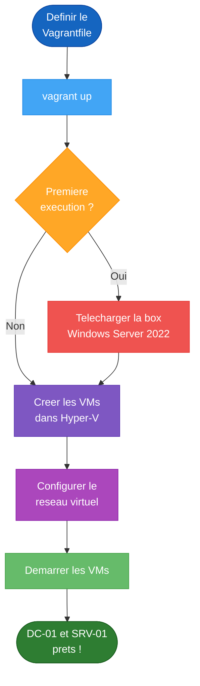

<!--
  Copyright 2026 Julien Bombled

  Licensed under the Apache License, Version 2.0 (the "License");
  you may not use this file except in compliance with the License.
  You may obtain a copy of the License at

      http://www.apache.org/licenses/LICENSE-2.0

  Unless required by applicable law or agreed to in writing, software
  distributed under the License is distributed on an "AS IS" BASIS,
  WITHOUT WARRANTIES OR CONDITIONS OF ANY KIND, either express or implied.
  See the License for the specific language governing permissions and
  limitations under the License.
-->
---
title: Lab Automatique (Vagrant)
description: Deploiement automatise de l'environnement de lab WinOpsLab avec Vagrant et Hyper-V.
tags:
  - lab
  - vagrant
  - iac
  - automatisation
---

# Lab Automatique avec Vagrant

<span class="level-intermediate">Intermediaire</span> · Temps estime : 15 minutes

!!! example "Analogie"

    Vagrant est comme un **plan de montage IKEA pour votre lab**. Au lieu de construire chaque meuble (VM) piece par piece en suivant 30 etapes manuelles, vous donnez le plan (Vagrantfile) a un robot (Vagrant) qui assemble tout automatiquement. Si vous voulez tout recommencer, une seule commande (`vagrant destroy`) demonte tout, et `vagrant up` reconstruit a l'identique.

Pour accelerer la mise en place de vos labs, nous fournissons une configuration **Vagrant**. Cela permet de deployer `DC-01` et `SRV-01` en une seule commande, plutot que de creer les VMs manuellement.



## Prerequis

1.  **Hyper-V** active sur votre machine Windows 10/11.
2.  **Vagrant** installe ([Telecharger](https://developer.hashicorp.com/vagrant/downloads)).
3.  Connexion Internet (pour telecharger l'image de base Windows Server 2022).

## Installation

1.  Creez un dossier pour votre lab (ex: `C:\VagrantLab`).
2.  Copiez le code ci-dessous dans un fichier nomme `Vagrantfile` (sans extension).

```ruby
# -*- mode: ruby -*-
# vi: set ft=ruby :

Vagrant.configure("2") do |config|
  config.vm.box = "gusztavvargadr/windows-server-2022-standard"
  config.vm.guest = :windows
  config.vm.communicator = "winrm"

  # DC-01 : Controleur de Domaine
  config.vm.define "DC-01" do |dc|
    dc.vm.hostname = "DC-01"
    dc.vm.network "private_network", ip: "10.0.0.10"
    dc.vm.provider "hyperv" do |hv|
      hv.vmname = "WinOps-DC-01"
      hv.memory = 4096
    end
  end

  # SRV-01 : Serveur Membre
  config.vm.define "SRV-01" do |srv|
    srv.vm.hostname = "SRV-01"
    srv.vm.network "private_network", ip: "10.0.0.20"
    srv.vm.provider "hyperv" do |hv|
      hv.vmname = "WinOps-SRV-01"
      hv.memory = 2048
    end
  end
end
```

## Lancement

Ouvrez une invite de commande (PowerShell en Admin) dans le dossier et lancez :

```powershell
vagrant up
```

Vagrant va :
1.  Telecharger l'ISO Windows Server 2022 (la premiere fois seulement).
2.  Creer les VMs dans Hyper-V.
3.  Configurer le reseau (Switch virtuel).
4.  Demarrer les VMs.

## Connexion

Une fois termine, connectez-vous aux VMs :

```powershell
# Entrer dans une VM en PowerShell
vagrant winrm DC-01

# Ou utilisez la console Hyper-V classique avec le mot de passe "vagrant"
```

Vous pouvez maintenant suivre les TPs du module **Active Directory** directement sur ces machines.

## Pour aller plus loin

- [Architecture du lab](architecture-lab.md) pour comprendre le plan reseau complet
- [Creation de VMs](creation-vms.md) pour la creation manuelle dans Hyper-V
- [Prerequis materiel](prerequis-materiel.md) pour verifier la compatibilite de votre machine
