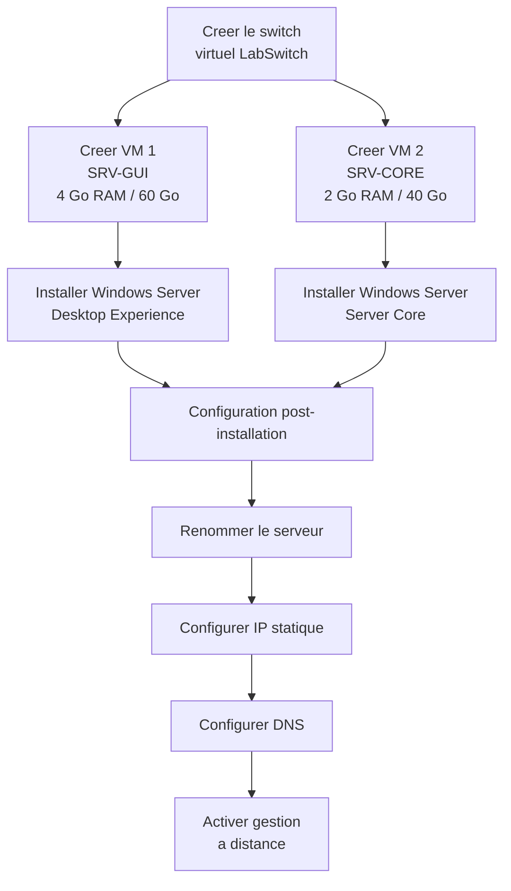

# Lab 01 : Installation de Windows Server

!!! abstract "Objectifs du lab"

    - [ ] Creer une machine virtuelle Hyper-V
    - [ ] Installer Windows Server 2022 (Desktop Experience)
    - [ ] Installer Windows Server 2022 (Server Core)
    - [ ] Effectuer la configuration post-installation

## Scenario

Vous etes administrateur systeme junior dans une PME. On vous demande de mettre en place
deux nouveaux serveurs : un serveur avec interface graphique pour la gestion quotidienne,
et un serveur Core pour les services reseau.

## Environnement requis

| Ressource | Specification |
|-----------|---------------|
| VM 1 (GUI) | 2 vCPU, 4 Go RAM, 60 Go disque |
| VM 2 (Core) | 2 vCPU, 2 Go RAM, 40 Go disque |
| Reseau | Switch virtuel interne |
| ISO | Windows Server 2022 Evaluation |



## Instructions

!!! example "Analogie"

    Installer un serveur, c'est comme amenager un appartement neuf : avant de meubler (les roles),
    il faut d'abord choisir le bon plan (GUI ou Core), poser les fondations (renommage, IP statique)
    et brancher les prises (DNS, gestion a distance). Un appartement mal configure au depart
    necessite des travaux couteux une fois les meubles en place.

### Partie 1 : Creer les machines virtuelles

1. Ouvrir le Gestionnaire Hyper-V
2. Creer un switch virtuel interne nomme `LabSwitch`
3. Creer la VM 1 (GUI) avec les specifications ci-dessus
4. Creer la VM 2 (Core) avec les specifications ci-dessus

```powershell
# Create the virtual switch
New-VMSwitch -Name "LabSwitch" -SwitchType Internal

# Create VM 1 - Desktop Experience
New-VM -Name "SRV-GUI" -MemoryStartupBytes 4GB -NewVHDPath "G:\VMs\SRV-GUI.vhdx" -NewVHDSizeBytes 60GB -Generation 2 -SwitchName "LabSwitch"
Set-VM -Name "SRV-GUI" -ProcessorCount 2

# Create VM 2 - Server Core
New-VM -Name "SRV-CORE" -MemoryStartupBytes 2GB -NewVHDPath "G:\VMs\SRV-CORE.vhdx" -NewVHDSizeBytes 40GB -Generation 2 -SwitchName "LabSwitch"
Set-VM -Name "SRV-CORE" -ProcessorCount 2
```

### Partie 2 : Installer Windows Server (Desktop Experience)

1. Monter l'ISO sur la VM `SRV-GUI`
2. Demarrer la VM et suivre l'assistant d'installation
3. Choisir **Windows Server 2022 Standard (Desktop Experience)**
4. Definir le mot de passe administrateur

### Partie 3 : Installer Windows Server (Server Core)

1. Monter l'ISO sur la VM `SRV-CORE`
2. Demarrer la VM et suivre l'assistant d'installation
3. Choisir **Windows Server 2022 Standard** (sans Desktop Experience)
4. Definir le mot de passe administrateur

### Partie 4 : Configuration post-installation

Sur chaque serveur, effectuer les taches suivantes :

??? success "Solution - SRV-GUI"

    ```powershell
    # Rename the server
    Rename-Computer -NewName "SRV-GUI" -Restart

    # After restart, configure static IP
    New-NetIPAddress -InterfaceAlias "Ethernet" -IPAddress 192.168.10.10 -PrefixLength 24 -DefaultGateway 192.168.10.1
    Set-DnsClientServerAddress -InterfaceAlias "Ethernet" -ServerAddresses 192.168.10.10

    # Disable the firewall for lab purposes (not in production!)
    # Set-NetFirewallProfile -Profile Domain,Public,Private -Enabled False

    # Enable Remote Desktop
    Set-ItemProperty -Path 'HKLM:\System\CurrentControlSet\Control\Terminal Server' -Name "fDenyTSConnections" -Value 0
    Enable-NetFirewallRule -DisplayGroup "Remote Desktop"
    ```

    Resultat attendu :

    ```text
    # Get-NetIPAddress -InterfaceAlias "Ethernet" -AddressFamily IPv4
    IPAddress         : 192.168.10.10
    InterfaceAlias    : Ethernet
    PrefixLength      : 24
    PrefixOrigin      : Manual
    SuffixOrigin      : Manual
    AddressState      : Preferred
    ```

??? success "Solution - SRV-CORE"

    ```powershell
    # Use sconfig for initial configuration
    sconfig

    # Or via PowerShell:
    Rename-Computer -NewName "SRV-CORE" -Restart

    # After restart
    New-NetIPAddress -InterfaceAlias "Ethernet" -IPAddress 192.168.10.11 -PrefixLength 24 -DefaultGateway 192.168.10.1
    Set-DnsClientServerAddress -InterfaceAlias "Ethernet" -ServerAddresses 192.168.10.10

    # Enable remote management
    Enable-PSRemoting -Force
    ```

## Verification

!!! question "Questions de validation"

    1. Quelle commande permet de verifier la version de Windows Server installee ?
    2. Quelle est la difference principale entre Desktop Experience et Server Core ?
    3. Quel outil en ligne de commande permet de configurer rapidement un Server Core ?
    4. Pourquoi est-il important de renommer le serveur avant de le joindre a un domaine ?

??? success "Reponses"

    1. `Get-ComputerInfo | Select-Object WindowsProductName, OsVersion` ou `winver`
    2. Desktop Experience inclut l'interface graphique complete (Explorateur, Server Manager, etc.).
       Server Core est une installation minimale sans GUI, plus legere et plus securisee.
    3. `sconfig` - un menu texte interactif pour les taches de configuration courantes.
    4. Le renommage apres jonction au domaine necessite des operations supplementaires sur le DC.
       Il est plus simple de renommer le serveur avant de le joindre.

!!! warning "Pieges frequents dans ce lab"

    1. **Mauvais ordre de configuration** : renommer le serveur AVANT de configurer l'IP statique
       et le DNS. Si vous faites le contraire apres la jonction au domaine, le renommage echoue
       silencieusement ou necessite des etapes supplementaires sur le DC.

    2. **Interface reseau mal identifiee** : sur une VM Hyper-V, l'alias de l'interface reseau
       n'est pas toujours "Ethernet". Verifier avec `Get-NetAdapter` avant d'executer
       `New-NetIPAddress` pour eviter une erreur "Interface not found".

    3. **Oublier de redemarrer apres Rename-Computer** : `Rename-Computer -Restart` redemarrage
       est inclus dans le parametre, mais si vous l'omettez et configurez l'IP avant le redemarrage,
       le nom d'hote dans les logs et l'AD sera incorrect.

    4. **Server Core sans sconfig** : tenter de tout configurer en PowerShell pure sans avoir
       verifie que WinRM est actif. Sur Server Core, `Enable-PSRemoting -Force` est indispensable
       avant toute gestion a distance, y compris depuis Server Manager sur SRV-GUI.

    5. **ISO non montee sur la bonne VM** : avec deux VMs creees simultanement, verifier dans
       Hyper-V Manager que l'ISO est bien montee sur la VM correcte avant le premier demarrage.
       Une installation de Desktop Experience sur SRV-CORE (ou inversement) implique de tout
       recommencer depuis l'etape de creation de VM.

## Nettoyage

Pour conserver les VMs pour les labs suivants, ne les supprimez pas.
Si vous souhaitez repartir de zero :

```powershell
# Stop and remove VMs
Stop-VM -Name "SRV-GUI", "SRV-CORE" -Force -ErrorAction SilentlyContinue
Remove-VM -Name "SRV-GUI", "SRV-CORE" -Force
Remove-Item "G:\VMs\SRV-GUI.vhdx", "G:\VMs\SRV-CORE.vhdx" -ErrorAction SilentlyContinue
```

## Prochaine etape

:material-arrow-right: [Lab 02 : Premier domaine AD DS](lab-02-ad-ds-premier-domaine.md)
