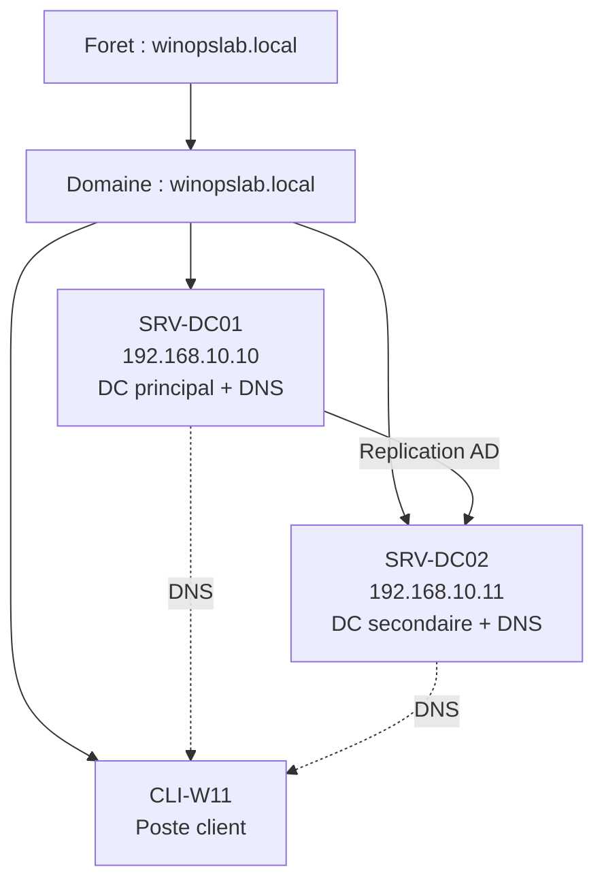

# Lab 02 : Premier domaine AD DS

!!! abstract "Objectifs du lab"

    - [ ] Installer le role AD DS sur SRV-DC01
    - [ ] Promouvoir SRV-DC01 en premier controleur de domaine
    - [ ] Creer le domaine winopslab.local
    - [ ] Verifier le fonctionnement du domaine (DNS, partages SYSVOL/NETLOGON)
    - [ ] Joindre SRV-DC02 et CLI-W11 au domaine

## Scenario

Votre responsable vous demande de mettre en place le domaine Active Directory de l'entreprise WinOpsLab. Vous devez creer une nouvelle foret, promouvoir le premier controleur de domaine, puis joindre les autres serveurs et un poste client au domaine.

## Environnement requis

| Ressource | Specification |
|-----------|---------------|
| SRV-DC01 | 2 vCPU, 4 Go RAM, IP 192.168.10.10 (configure au Lab 01) |
| SRV-DC02 | 2 vCPU, 4 Go RAM, IP 192.168.10.11 (configure au Lab 01) |
| CLI-W11 | 2 vCPU, 4 Go RAM, DHCP ou IP statique |
| Reseau | LabSwitch (switch interne) |

!!! warning "Prerequis"

    Le Lab 01 (installation et configuration initiale) doit etre termine.
    SRV-DC01 et SRV-DC02 doivent etre installes, renommes et configures avec des IP statiques.



## Instructions

### Partie 1 : Installer le role AD DS sur SRV-DC01

1. Se connecter a SRV-DC01
2. Installer le role Active Directory Domain Services
3. Ne pas encore lancer la promotion (etape suivante)

??? success "Solution"

    ```powershell
    # Install AD DS role with management tools
    Install-WindowsFeature -Name AD-Domain-Services -IncludeManagementTools

    # Verify installation
    Get-WindowsFeature AD-Domain-Services
    ```

### Partie 2 : Promouvoir SRV-DC01 en controleur de domaine

1. Creer une nouvelle foret avec le domaine `winopslab.local`
2. Niveau fonctionnel foret et domaine : Windows Server 2016
3. Installer le DNS integre a AD
4. Definir le mot de passe DSRM

??? success "Solution"

    ```powershell
    # Promote to first domain controller in a new forest
    Install-ADDSForest `
        -DomainName "winopslab.local" `
        -DomainNetBIOSName "WINOPSLAB" `
        -ForestMode "WinThreshold" `
        -DomainMode "WinThreshold" `
        -InstallDns:$true `
        -DatabasePath "C:\Windows\NTDS" `
        -LogPath "C:\Windows\NTDS" `
        -SysvolPath "C:\Windows\SYSVOL" `
        -SafeModeAdministratorPassword (ConvertTo-SecureString "Dsrm-P@ss2026!" -AsPlainText -Force) `
        -NoRebootOnCompletion:$false `
        -Force:$true

    # The server will restart automatically
    ```

### Partie 3 : Verifier le domaine

Apres le redemarrage, verifier que le domaine est fonctionnel.

??? success "Solution"

    ```powershell
    # Verify domain controller status
    Get-ADDomainController | Select-Object Name, Domain, Forest, Site,
        IPv4Address, OperatingSystem

    # Verify domain
    Get-ADDomain | Select-Object DNSRoot, NetBIOSName, DomainMode,
        PDCEmulator, InfrastructureMaster, RIDMaster

    # Verify forest
    Get-ADForest | Select-Object Name, ForestMode, SchemaMaster, DomainNamingMaster

    # Verify DNS zones
    Get-DnsServerZone | Select-Object ZoneName, ZoneType, IsDsIntegrated

    # Verify SYSVOL and NETLOGON shares
    Get-SmbShare | Where-Object { $_.Name -in "SYSVOL", "NETLOGON" }

    # Verify SRV records for DC location
    Resolve-DnsName -Name "_ldap._tcp.dc._msdcs.winopslab.local" -Type SRV
    ```

### Partie 4 : Joindre SRV-DC02 au domaine et promouvoir en DC

1. Configurer le DNS de SRV-DC02 pour pointer vers SRV-DC01 (192.168.10.10)
2. Joindre SRV-DC02 au domaine winopslab.local
3. Installer AD DS et promouvoir en DC supplementaire

??? success "Solution"

    ```powershell
    # On SRV-DC02: Set DNS to point to SRV-DC01
    Set-DnsClientServerAddress -InterfaceAlias "Ethernet" `
        -ServerAddresses 192.168.10.10

    # Join the domain
    Add-Computer -DomainName "winopslab.local" `
        -Credential (Get-Credential WINOPSLAB\Administrateur) -Restart

    # After restart, install AD DS
    Install-WindowsFeature -Name AD-Domain-Services -IncludeManagementTools

    # Promote as additional domain controller
    Install-ADDSDomainController `
        -DomainName "winopslab.local" `
        -InstallDns:$true `
        -Credential (Get-Credential WINOPSLAB\Administrateur) `
        -DatabasePath "C:\Windows\NTDS" `
        -LogPath "C:\Windows\NTDS" `
        -SysvolPath "C:\Windows\SYSVOL" `
        -SafeModeAdministratorPassword (ConvertTo-SecureString "Dsrm-P@ss2026!" -AsPlainText -Force) `
        -NoRebootOnCompletion:$false `
        -Force:$true
    ```

### Partie 5 : Joindre CLI-W11 au domaine

1. Configurer le DNS du client pour pointer vers SRV-DC01
2. Joindre le poste au domaine winopslab.local

??? success "Solution"

    ```powershell
    # On CLI-W11: Set DNS
    Set-DnsClientServerAddress -InterfaceAlias "Ethernet" `
        -ServerAddresses 192.168.10.10, 192.168.10.11

    # Join the domain
    Add-Computer -DomainName "winopslab.local" `
        -Credential (Get-Credential WINOPSLAB\Administrateur) -Restart
    ```

## Verification

!!! question "Questions de validation"

    1. Quelle commande permet de lister tous les controleurs de domaine ?
    2. Quels sont les 5 roles FSMO et sur quel serveur sont-ils ?
    3. Pourquoi le DNS de SRV-DC01 doit-il pointer vers 127.0.0.1 en premier ?
    4. Que contient le partage SYSVOL ?

??? success "Reponses"

    1. `Get-ADDomainController -Filter * | Select-Object Name, IPv4Address, Site`
    2. Les 5 roles FSMO sont : Schema Master, Domain Naming Master, PDC Emulator,
       RID Master, Infrastructure Master. Tous sont sur SRV-DC01 (premier DC).
       Verification : `netdom query fsmo`
    3. Le premier DC est son propre serveur DNS. Il doit pointer vers lui-meme en premier
       pour resoudre les enregistrements SRV necessaires au fonctionnement d'AD DS.
    4. SYSVOL contient les scripts de connexion et les fichiers de strategies de groupe (GPO).
       Il est replique entre tous les controleurs de domaine.

## Nettoyage

Conservez l'environnement pour les labs suivants. Si vous devez recommencer :

```powershell
# On SRV-DC02: Demote the domain controller
Uninstall-ADDSDomainController -DemoteOperationMasterRole -Force

# On SRV-DC01: Remove the forest (destructive!)
Uninstall-ADDSDomainController -LastDomainControllerInDomain `
    -RemoveApplicationPartitions -Force
```

## Prochaine etape

:material-arrow-right: [Lab 03 : DNS et DHCP](lab-03-dns-dhcp.md)
