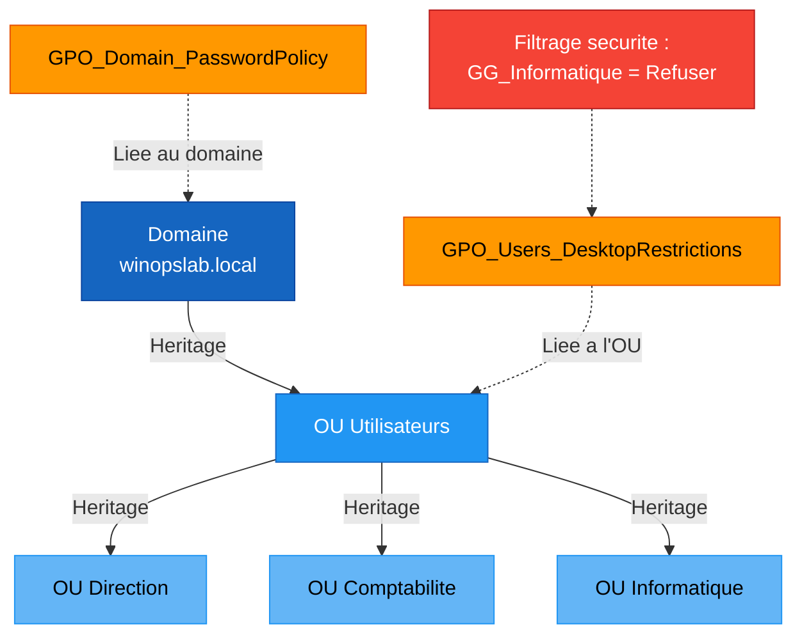

<!--
  Copyright 2026 Julien Bombled

  Licensed under the Apache License, Version 2.0 (the "License");
  you may not use this file except in compliance with the License.
  You may obtain a copy of the License at

      http://www.apache.org/licenses/LICENSE-2.0

  Unless required by applicable law or agreed to in writing, software
  distributed under the License is distributed on an "AS IS" BASIS,
  WITHOUT WARRANTIES OR CONDITIONS OF ANY KIND, either express or implied.
  See the License for the specific language governing permissions and
  limitations under the License.
-->

# Lab 04 : Strategies de groupe (GPO)

<span class="level-intermediate">Intermediaire</span> · Temps estime : 45 minutes

---

!!! abstract "Objectifs du lab"

    - [ ] Creer une GPO de politique de mot de passe
    - [ ] Creer une GPO de restrictions de bureau utilisateur
    - [ ] Lier les GPO aux OU appropriees
    - [ ] Tester l'application avec gpresult
    - [ ] Comprendre l'heritage et le filtrage



## Scenario

Le responsable securite demande de mettre en place des politiques de mot de passe renforcees et de restreindre certaines fonctionnalites du bureau pour les utilisateurs standards.

## Environnement requis

| Ressource | Specification |
|-----------|---------------|
| SRV-DC01 | DC + DNS + DHCP (Labs 02-03 termines) |
| CLI-W11 | Client joint au domaine |
| Utilisateurs | Creer des utilisateurs de test |

## Instructions

!!! example "Analogie"

    Les GPO ressemblent au reglement interieur d'une entreprise : une note de service collee
    a l'entree du batiment (domaine) s'applique a tout le monde, celle affichee dans la salle
    de reunion comptabilite (OU) ne concerne que les comptables. Le filtrage de securite,
    c'est la mention "ne s'applique pas au personnel IT" au bas du document — certains sont
    expressement exemptes du reglement general.

### Partie 1 : Preparer la structure OU et les utilisateurs

??? success "Solution"

    ```powershell
    # Create OU structure
    New-ADOrganizationalUnit -Name "Utilisateurs" -Path "DC=winopslab,DC=local"
    New-ADOrganizationalUnit -Name "Direction" -Path "OU=Utilisateurs,DC=winopslab,DC=local"
    New-ADOrganizationalUnit -Name "Comptabilite" -Path "OU=Utilisateurs,DC=winopslab,DC=local"
    New-ADOrganizationalUnit -Name "Informatique" -Path "OU=Utilisateurs,DC=winopslab,DC=local"
    New-ADOrganizationalUnit -Name "Groupes" -Path "DC=winopslab,DC=local"

    # Create test users
    $password = ConvertTo-SecureString "P@ssw0rd!" -AsPlainText -Force

    New-ADUser -Name "Jean Dupont" -SamAccountName "jean.dupont" `
        -UserPrincipalName "jean.dupont@winopslab.local" `
        -Path "OU=Direction,OU=Utilisateurs,DC=winopslab,DC=local" `
        -AccountPassword $password -Enabled $true

    New-ADUser -Name "Marie Martin" -SamAccountName "marie.martin" `
        -UserPrincipalName "marie.martin@winopslab.local" `
        -Path "OU=Comptabilite,OU=Utilisateurs,DC=winopslab,DC=local" `
        -AccountPassword $password -Enabled $true

    New-ADUser -Name "Pierre Durand" -SamAccountName "pierre.durand" `
        -UserPrincipalName "pierre.durand@winopslab.local" `
        -Path "OU=Informatique,OU=Utilisateurs,DC=winopslab,DC=local" `
        -AccountPassword $password -Enabled $true
    ```

### Partie 2 : GPO de politique de mot de passe

1. Creer une GPO nommee `GPO_Domain_PasswordPolicy`
2. Configurer : longueur minimale 12 caracteres, complexite activee, historique 10 mots de passe
3. Lier a la racine du domaine

??? success "Solution"

    ```powershell
    # Create the GPO
    New-GPO -Name "GPO_Domain_PasswordPolicy" -Comment "Domain password policy"

    # Configure password policy settings
    # Note: Password policies must be linked at the domain level
    Set-GPRegistryValue -Name "GPO_Domain_PasswordPolicy" `
        -Key "HKLM\SYSTEM\CurrentControlSet\Services\Netlogon\Parameters" `
        -ValueName "MaximumPasswordAge" -Type DWord -Value 90

    # Link to domain root
    New-GPLink -Name "GPO_Domain_PasswordPolicy" `
        -Target "DC=winopslab,DC=local" -LinkEnabled Yes

    # Configure via GPMC (more complete):
    # Computer Configuration > Policies > Windows Settings >
    # Security Settings > Account Policies > Password Policy
    #   - Minimum password length: 12
    #   - Password must meet complexity requirements: Enabled
    #   - Enforce password history: 10 passwords
    #   - Maximum password age: 90 days
    #   - Minimum password age: 1 day

    # Verify
    Get-GPO -Name "GPO_Domain_PasswordPolicy" | Select-Object DisplayName, GpoStatus
    ```

!!! warning "Important"

    Les politiques de mot de passe du domaine ne fonctionnent que lorsqu'elles sont liees
    au **niveau du domaine** (racine). Une politique de mot de passe liee a une OU n'aura
    aucun effet sur les comptes du domaine.

### Partie 3 : GPO de restrictions de bureau

1. Creer une GPO nommee `GPO_Users_DesktopRestrictions`
2. Configurer : masquer l'acces au Panneau de configuration, desactiver l'invite de commandes
3. Lier a l'OU Utilisateurs

??? success "Solution"

    ```powershell
    # Create the GPO
    New-GPO -Name "GPO_Users_DesktopRestrictions" `
        -Comment "Desktop restrictions for standard users"

    # Prohibit access to Control Panel and PC settings
    Set-GPRegistryValue -Name "GPO_Users_DesktopRestrictions" `
        -Key "HKCU\Software\Microsoft\Windows\CurrentVersion\Policies\Explorer" `
        -ValueName "NoControlPanel" -Type DWord -Value 1

    # Disable Command Prompt
    Set-GPRegistryValue -Name "GPO_Users_DesktopRestrictions" `
        -Key "HKCU\Software\Policies\Microsoft\Windows\System" `
        -ValueName "DisableCMD" -Type DWord -Value 1

    # Prevent access to registry editing tools
    Set-GPRegistryValue -Name "GPO_Users_DesktopRestrictions" `
        -Key "HKCU\Software\Microsoft\Windows\CurrentVersion\Policies\System" `
        -ValueName "DisableRegistryTools" -Type DWord -Value 1

    # Link to OU Utilisateurs
    New-GPLink -Name "GPO_Users_DesktopRestrictions" `
        -Target "OU=Utilisateurs,DC=winopslab,DC=local" -LinkEnabled Yes
    ```

### Partie 4 : Exclure le service informatique des restrictions

1. Creer un groupe `GG_Informatique`
2. Ajouter Pierre Durand au groupe
3. Filtrer la GPO de restrictions pour exclure `GG_Informatique`

??? success "Solution"

    ```powershell
    # Create the group
    New-ADGroup -Name "GG_Informatique" -GroupScope Global `
        -Path "OU=Groupes,DC=winopslab,DC=local"

    # Add Pierre to the group
    Add-ADGroupMember -Identity "GG_Informatique" -Members "pierre.durand"

    # Remove "Authenticated Users" from GPO security filtering
    Set-GPPermission -Name "GPO_Users_DesktopRestrictions" `
        -PermissionLevel None -TargetName "Authenticated Users" -TargetType Group -Replace

    # Add "Domain Users" to apply the GPO
    Set-GPPermission -Name "GPO_Users_DesktopRestrictions" `
        -PermissionLevel GpoApply -TargetName "Domain Users" -TargetType Group

    # Deny Apply for GG_Informatique
    Set-GPPermission -Name "GPO_Users_DesktopRestrictions" `
        -PermissionLevel GpoDeny -TargetName "GG_Informatique" -TargetType Group
    ```

### Partie 5 : Tester l'application

??? success "Solution"

    ```powershell
    # On CLI-W11: Force GPO update
    gpupdate /force

    # Check applied GPOs for the current user
    gpresult /r

    # Detailed HTML report
    gpresult /h "C:\Temp\gpresult.html"
    Start-Process "C:\Temp\gpresult.html"

    # Test as marie.martin (should have restrictions)
    # Log off and log in as marie.martin
    # Verify: Control Panel should be blocked

    # Test as pierre.durand (should NOT have restrictions)
    # Log off and log in as pierre.durand
    # Verify: Control Panel should be accessible
    ```

    Resultat attendu de `gpresult /r` pour marie.martin :

    ```text
    USER SETTINGS
    -------------
        CN=Marie Martin,OU=Comptabilite,OU=Utilisateurs,DC=winopslab,DC=local
        Last time Group Policy was applied: ...
        Group Policy was applied from:      SRV-DC01.winopslab.local

        Applied Group Policy Objects
        ----------------------------
        GPO_Users_DesktopRestrictions
        GPO_Domain_PasswordPolicy
        Default Domain Policy
    ```

## Verification

!!! question "Questions de validation"

    1. Dans quel ordre les GPO sont-elles appliquees (LSDOU) ?
    2. Pourquoi une politique de mot de passe ne fonctionne-t-elle pas si elle est liee a une OU ?
    3. Comment fonctionne le filtrage de securite des GPO ?
    4. Quelle commande permet de simuler l'application d'une GPO sans la lier ?

??? success "Reponses"

    1. L'ordre d'application est **LSDOU** : Local > Site > Domaine > OU. La derniere
       GPO appliquee l'emporte (l'OU a la priorite sur le domaine).
    2. Les politiques de mot de passe de domaine sont evaluees uniquement au niveau du
       domaine. Pour des politiques de mot de passe differentes par groupe, il faut
       utiliser les **Fine-Grained Password Policies** (PSO).
    3. Le filtrage de securite controle a quels utilisateurs/ordinateurs la GPO s'applique.
       Par defaut, elle s'applique a "Authenticated Users". On peut restreindre ou exclure
       des groupes specifiques.
    4. `gpresult /r /scope:user /user:WINOPSLAB\marie.martin` pour simuler, ou utiliser
       l'outil **Group Policy Modeling** dans la GPMC.

!!! warning "Pieges frequents dans ce lab"

    1. **Politique de mot de passe liee a une OU** : c'est le piege classique. Une GPO
       `GPO_Domain_PasswordPolicy` liee a `OU=Utilisateurs` n'a aucun effet sur les mots de
       passe des comptes du domaine. La politique de compte doit imperativement etre liee
       a la racine du domaine (`DC=winopslab,DC=local`).

    2. **GPO pas encore appliquee sur le client** : apres la creation et la liaison d'une GPO,
       attendre le cycle de rafraichissement (90 min par defaut) ou forcer avec `gpupdate /force`
       sur le client. Se connecter immediatement apres la creation sans forcer le rafraichissement
       donne l'impression que la GPO ne fonctionne pas.

    3. **Filtrage de securite casse** : retirer "Authenticated Users" sans ajouter "Domain Users"
       rend la GPO inapplicable a tous. La sequence correcte est : retirer "Authenticated Users",
       puis ajouter "Domain Users" avec permission "Apply", PUIS refuser "GG_Informatique".

    4. **Tester avec un compte administrateur** : les administrateurs du domaine sont souvent
       immunises contre certaines restrictions de bureau. Toujours tester avec un compte
       utilisateur standard (marie.martin) et non avec Administrateur ou un membre de
       Domain Admins.

    5. **Oublier de creer les OU avant de creer les utilisateurs** : `New-ADUser` avec un
       `-Path` vers une OU inexistante echoue avec une erreur "The specified path is not valid".
       Creer toujours la structure OU en premier.

## Nettoyage

Conservez l'environnement pour les labs suivants.

## Prochaine etape

:material-arrow-right: [Lab 05 : Partage de fichiers](lab-05-partage-fichiers.md)

