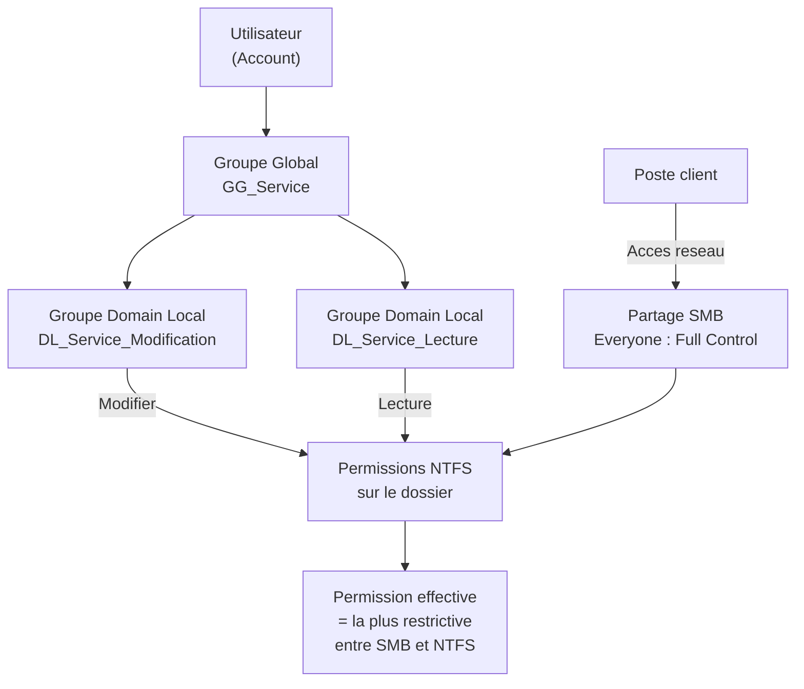

<!--
  Copyright 2026 Julien Bombled

  Licensed under the Apache License, Version 2.0 (the "License");
  you may not use this file except in compliance with the License.
  You may obtain a copy of the License at

      http://www.apache.org/licenses/LICENSE-2.0

  Unless required by applicable law or agreed to in writing, software
  distributed under the License is distributed on an "AS IS" BASIS,
  WITHOUT WARRANTIES OR CONDITIONS OF ANY KIND, either express or implied.
  See the License for the specific language governing permissions and
  limitations under the License.
-->

# Lab 05 : Partage de fichiers

<span class="level-intermediate">Intermediaire</span> · Temps estime : 45 minutes

---

!!! abstract "Objectifs du lab"

    - [ ] Creer une structure de dossiers pour les services de l'entreprise
    - [ ] Configurer les permissions NTFS selon le modele AGDLP
    - [ ] Creer des partages SMB avec les permissions appropriees
    - [ ] Tester l'acces depuis le poste client avec differents utilisateurs

## Scenario

L'entreprise a besoin d'un serveur de fichiers structure par service. Chaque service doit avoir son propre dossier avec des permissions appropriees. Le modele AGDLP (Account > Global Group > Domain Local Group > Permission) est utilise.

## Environnement requis

| Ressource | Specification |
|-----------|---------------|
| SRV-FILE01 | Serveur de fichiers, joint au domaine |
| SRV-DC01 | DC avec utilisateurs et groupes (Labs precedents) |
| CLI-W11 | Client pour tester les acces |



## Instructions

!!! example "Analogie"

    Le modele AGDLP fonctionne comme le systeme de badges dans un immeuble de bureaux :
    les employes (Accounts) ont un badge de service (Global Group), chaque badge de service
    est programme pour ouvrir certaines portes specifiques (Domain Local Group), et les portes
    definissent ce qu'on peut faire dans la piece (Permission NTFS). Si un employe change de
    service, on change juste son badge — toutes les portes s'adaptent automatiquement.

### Partie 1 : Preparer les groupes AD (modele AGDLP)

Creer les groupes globaux (GG) et locaux de domaine (DL) pour chaque service.

??? success "Solution"

    ```powershell
    # On SRV-DC01: Create global groups (GG = users by department)
    $departments = @("Direction", "Comptabilite", "Informatique", "Commercial")
    foreach ($dept in $departments) {
        New-ADGroup -Name "GG_$dept" -GroupScope Global `
            -Path "OU=Groupes,DC=winopslab,DC=local" `
            -Description "Members of $dept department"
    }

    # Create domain local groups (DL = permissions on resources)
    foreach ($dept in $departments) {
        New-ADGroup -Name "DL_${dept}_Lecture" -GroupScope DomainLocal `
            -Path "OU=Groupes,DC=winopslab,DC=local" `
            -Description "Read access to $dept share"
        New-ADGroup -Name "DL_${dept}_Modification" -GroupScope DomainLocal `
            -Path "OU=Groupes,DC=winopslab,DC=local" `
            -Description "Modify access to $dept share"
    }

    # Nest global groups into domain local groups (AGDLP)
    foreach ($dept in $departments) {
        Add-ADGroupMember -Identity "DL_${dept}_Modification" -Members "GG_$dept"
    }
    # IT has read access to all departments
    foreach ($dept in $departments) {
        Add-ADGroupMember -Identity "DL_${dept}_Lecture" -Members "GG_Informatique"
    }

    # Add users to their global groups
    Add-ADGroupMember -Identity "GG_Direction" -Members "jean.dupont"
    Add-ADGroupMember -Identity "GG_Comptabilite" -Members "marie.martin"
    Add-ADGroupMember -Identity "GG_Informatique" -Members "pierre.durand"
    ```

### Partie 2 : Creer la structure de dossiers

??? success "Solution"

    ```powershell
    # On SRV-FILE01: Create folder structure
    $basePath = "D:\Partages"
    New-Item -Path $basePath -ItemType Directory -Force

    foreach ($dept in @("Direction", "Comptabilite", "Informatique", "Commercial")) {
        New-Item -Path "$basePath\$dept" -ItemType Directory -Force
    }
    New-Item -Path "$basePath\Commun" -ItemType Directory -Force
    ```

### Partie 3 : Configurer les permissions NTFS

??? success "Solution"

    ```powershell
    # Remove inheritance and clean existing permissions
    foreach ($dept in @("Direction", "Comptabilite", "Informatique", "Commercial")) {
        $path = "$basePath\$dept"
        $acl = Get-Acl $path

        # Disable inheritance, convert inherited rules to explicit
        $acl.SetAccessRuleProtection($true, $false)

        # Clear all existing rules
        $acl.Access | ForEach-Object { $acl.RemoveAccessRule($_) } | Out-Null

        # Add Administrators - Full Control
        $rule = New-Object System.Security.AccessControl.FileSystemAccessRule(
            "BUILTIN\Administrateurs", "FullControl", "ContainerInherit,ObjectInherit", "None", "Allow")
        $acl.AddAccessRule($rule)

        # Add SYSTEM - Full Control
        $rule = New-Object System.Security.AccessControl.FileSystemAccessRule(
            "NT AUTHORITY\SYSTEM", "FullControl", "ContainerInherit,ObjectInherit", "None", "Allow")
        $acl.AddAccessRule($rule)

        # Add DL_<dept>_Modification - Modify
        $rule = New-Object System.Security.AccessControl.FileSystemAccessRule(
            "WINOPSLAB\DL_${dept}_Modification", "Modify", "ContainerInherit,ObjectInherit", "None", "Allow")
        $acl.AddAccessRule($rule)

        # Add DL_<dept>_Lecture - Read & Execute
        $rule = New-Object System.Security.AccessControl.FileSystemAccessRule(
            "WINOPSLAB\DL_${dept}_Lecture", "ReadAndExecute", "ContainerInherit,ObjectInherit", "None", "Allow")
        $acl.AddAccessRule($rule)

        Set-Acl $path $acl
        Write-Output "NTFS permissions set for: $dept"
    }
    ```

### Partie 4 : Creer les partages SMB

??? success "Solution"

    ```powershell
    # Create SMB shares with Everyone - Full Control (NTFS handles actual permissions)
    foreach ($dept in @("Direction", "Comptabilite", "Informatique", "Commercial")) {
        New-SmbShare -Name $dept -Path "$basePath\$dept" `
            -FullAccess "Everyone" `
            -Description "Partage $dept"
    }

    # Create a common share with domain users read access
    New-SmbShare -Name "Commun" -Path "$basePath\Commun" `
        -FullAccess "WINOPSLAB\Domain Users" `
        -Description "Partage commun"

    # Verify shares
    Get-SmbShare | Where-Object { $_.Path -like "D:\Partages\*" } |
        Select-Object Name, Path, Description
    ```

### Partie 5 : Tester les acces

??? success "Solution"

    ```powershell
    # On CLI-W11: Map network drives and test access

    # As jean.dupont (Direction)
    # Should have: Modify on Direction, Read on nothing else specific
    net use Z: \\SRV-FILE01\Direction
    # Test: create a file (should succeed)
    New-Item "Z:\test-direction.txt" -Value "Test"

    # Disconnect
    net use Z: /delete

    # As marie.martin (Comptabilite)
    net use Z: \\SRV-FILE01\Comptabilite
    # Test: create a file (should succeed)
    New-Item "Z:\test-compta.txt" -Value "Test"

    # Try accessing Direction (should fail or read-only)
    net use Y: \\SRV-FILE01\Direction
    # Test: create a file (should be denied)

    # As pierre.durand (Informatique - read access to all)
    net use Z: \\SRV-FILE01\Direction
    # Test: read (should succeed), write (should be denied)
    ```

    Resultat attendu de `Get-SmbShare | Where-Object { $_.Path -like "D:\Partages\*" }` :

    ```text
    Name          ScopeName  Path                    Description
    ----          ---------  ----                    -----------
    Commun        *          D:\Partages\Commun      Partage commun
    Commercial    *          D:\Partages\Commercial  Partage Commercial
    Comptabilite  *          D:\Partages\Comptabilite Partage Comptabilite
    Direction     *          D:\Partages\Direction   Partage Direction
    Informatique  *          D:\Partages\Informatique Partage Informatique
    ```

## Verification

!!! question "Questions de validation"

    1. Que signifie AGDLP et pourquoi utiliser ce modele ?
    2. Pourquoi mettre "Everyone - Full Control" sur les permissions de partage ?
    3. Quelle est la permission effective lorsque NTFS donne "Lecture" et le partage donne "Controle total" ?
    4. Comment verifier les permissions effectives d'un utilisateur sur un dossier ?

??? success "Reponses"

    1. **A**ccount > **G**lobal Group > **D**omain **L**ocal Group > **P**ermission.
       Ce modele separe l'appartenance organisationnelle (GG) de l'acces aux ressources (DL),
       ce qui simplifie la gestion a grande echelle.
    2. En mettant "Everyone - Full Control" au niveau du partage, on delegue tout le controle
       d'acces aux permissions NTFS qui sont plus granulaires. Cela evite la confusion entre
       deux niveaux de permissions.
    3. La permission effective est la plus restrictive des deux : **Lecture**.
       Les permissions de partage et NTFS s'additionnent au sein de chaque niveau,
       mais le resultat final est le minimum des deux.
    4. Clic droit > Proprietes > Securite > Avance > **Acces effectif**. Ou en PowerShell :
       `Get-Acl "D:\Partages\Direction" | Format-List`

!!! warning "Pieges frequents dans ce lab"

    1. **Imbrication AGDLP dans le mauvais sens** : l'utilisateur doit etre dans GG, et GG
       dans DL — pas l'inverse. Mettre directement l'utilisateur dans DL fonctionne en apparence
       mais casse le modele AGDLP et complique la gestion future. Verifier avec
       `Get-ADGroupMember "DL_Direction_Modification"` que le membre est un groupe global, pas
       un utilisateur direct.

    2. **Heritage NTFS non desactive** : si on n'appelle pas `SetAccessRuleProtection($true, $false)`
       avant de definir les permissions, les ACL heritees du dossier parent (`D:\Partages`) se
       combinent avec les nouvelles regles et donnent acces a des utilisateurs inattendus.

    3. **Tester avec un compte ayant des jetons de securite expires** : apres avoir ajoute
       un utilisateur a un groupe AD, il faut que l'utilisateur se deconnecte et se reconnecte
       pour que le nouveau jeton Kerberos contenant le nouveau groupe soit emis. `gpupdate /force`
       ne suffit pas pour les changements de groupes.

    4. **Partage SMB cree avec des permissions restrictives** : si vous mettez autre chose que
       "Everyone - Full Control" au niveau SMB, la permission effective sera la plus restrictive
       des deux niveaux (SMB et NTFS), ce qui peut bloquer des acces attendus et creer une
       confusion dans le diagnostic.

    5. **SRV-FILE01 pas joint au domaine** : les permissions NTFS avec des noms de groupes
       de domaine (WINOPSLAB\DL_Direction_Modification) echouent avec "account not found"
       si le serveur de fichiers n'est pas joint au domaine winopslab.local.

## Nettoyage

Conservez l'environnement pour les labs suivants.

## Prochaine etape

:material-arrow-right: [Lab 06 : Hyper-V](lab-06-hyper-v.md)

