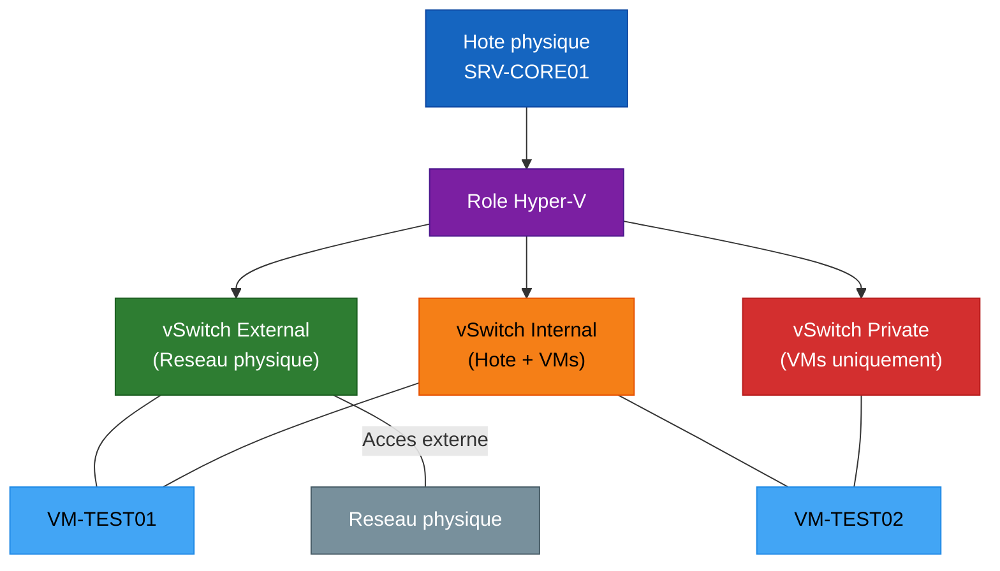

<!--
  Copyright 2026 Julien Bombled

  Licensed under the Apache License, Version 2.0 (the "License");
  you may not use this file except in compliance with the License.
  You may obtain a copy of the License at

      http://www.apache.org/licenses/LICENSE-2.0

  Unless required by applicable law or agreed to in writing, software
  distributed under the License is distributed on an "AS IS" BASIS,
  WITHOUT WARRANTIES OR CONDITIONS OF ANY KIND, either express or implied.
  See the License for the specific language governing permissions and
  limitations under the License.
-->
---
title: "Lab 06 : Hyper-V"
description: Exercice pratique - creer des machines virtuelles imbriquees, des commutateurs virtuels et gerer les checkpoints.
tags:
  - lab
  - hyper-v
  - virtualisation
  - intermediaire
---

# Lab 06 : Hyper-V

<span class="level-intermediate">Intermediaire</span> · Temps estime : 60 minutes

---

!!! abstract "Objectifs du lab"

    - [ ] Installer le role Hyper-V sur un serveur du lab
    - [ ] Creer des commutateurs virtuels (External, Internal, Private)
    - [ ] Creer et configurer une machine virtuelle
    - [ ] Utiliser les checkpoints pour sauvegarder et restaurer un etat
    - [ ] Gerer les VMs en PowerShell



## Scenario

L'equipe de developpement a besoin d'un environnement de test virtualise. Vous devez installer Hyper-V sur un serveur existant, creer les commutateurs reseau et deployer une VM de test.

## Environnement requis

| Ressource | Specification |
|-----------|---------------|
| SRV-CORE01 | Server Core, joint au domaine, virtualisation imbriquee activee |
| Hote Hyper-V | Virtualisation imbriquee activee sur SRV-CORE01 |

!!! warning "Virtualisation imbriquee"

    Pour ce lab, la virtualisation imbriquee doit etre activee sur SRV-CORE01 depuis l'hote physique :
    `Set-VMProcessor -VMName "SRV-CORE01" -ExposeVirtualizationExtensions $true`

## Instructions

!!! example "Analogie"

    Hyper-V transforme un serveur physique en immeuble d'appartements : l'hote est le
    proprietaire de l'immeuble, chaque VM est un locataire avec ses propres ressources
    (CPU, RAM, disque). Les commutateurs virtuels sont les couloirs et issues de l'immeuble :
    External ouvre sur la rue (reseau physique), Internal permet de circuler entre appartements
    et de sonner chez le proprietaire, Private isole completement les locataires entre eux.
    Un checkpoint, c'est la photo d'un appartement avant des travaux — on peut y revenir
    si les travaux tournent mal.

### Partie 1 : Installer Hyper-V

??? success "Solution"

    ```powershell
    # On SRV-CORE01: Install Hyper-V role
    Install-WindowsFeature -Name Hyper-V -IncludeManagementTools -Restart

    # After restart, verify installation
    Get-WindowsFeature Hyper-V
    ```

### Partie 2 : Creer les commutateurs virtuels

??? success "Solution"

    ```powershell
    # Create an internal switch (VM-to-VM and VM-to-Host)
    New-VMSwitch -Name "vSwitch-Internal" -SwitchType Internal

    # Create a private switch (VM-to-VM only)
    New-VMSwitch -Name "vSwitch-Private" -SwitchType Private

    # Verify switches
    Get-VMSwitch | Select-Object Name, SwitchType, NetAdapterInterfaceDescription
    ```

### Partie 3 : Creer une machine virtuelle

??? success "Solution"

    ```powershell
    # Create a VM directory
    New-Item -Path "C:\VMs" -ItemType Directory -Force

    # Create a Generation 2 VM
    New-VM -Name "VM-TEST01" `
        -MemoryStartupBytes 1GB `
        -NewVHDPath "C:\VMs\VM-TEST01.vhdx" `
        -NewVHDSizeBytes 20GB `
        -Generation 2 `
        -SwitchName "vSwitch-Internal"

    # Configure CPU
    Set-VM -Name "VM-TEST01" -ProcessorCount 2

    # Enable dynamic memory
    Set-VMMemory -VMName "VM-TEST01" -DynamicMemoryEnabled $true `
        -MinimumBytes 512MB -StartupBytes 1GB -MaximumBytes 2GB

    # Add a second network adapter
    Add-VMNetworkAdapter -VMName "VM-TEST01" -SwitchName "vSwitch-Private" -Name "Private-NIC"

    # Verify configuration
    Get-VM -Name "VM-TEST01" | Select-Object Name, State, ProcessorCount, MemoryStartup
    Get-VMNetworkAdapter -VMName "VM-TEST01" | Select-Object VMName, Name, SwitchName
    ```

    Resultat attendu de `Get-VMNetworkAdapter -VMName "VM-TEST01"` :

    ```text
    VMName     Name        SwitchName       MacAddress     Status
    ------     ----        ----------       ----------     ------
    VM-TEST01  Network...  vSwitch-Internal 00155D...      {Ok}
    VM-TEST01  Private-NIC vSwitch-Private  00155D...      {Ok}
    ```

### Partie 4 : Gerer les checkpoints

??? success "Solution"

    ```powershell
    # Start the VM
    Start-VM -Name "VM-TEST01"

    # Create a checkpoint (snapshot)
    Checkpoint-VM -Name "VM-TEST01" -SnapshotName "Initial-State"

    # List checkpoints
    Get-VMCheckpoint -VMName "VM-TEST01" | Select-Object Name, CreationTime

    # Make changes to the VM (e.g., modify configuration)
    Set-VM -Name "VM-TEST01" -Notes "Modified after first checkpoint"

    # Create another checkpoint
    Checkpoint-VM -Name "VM-TEST01" -SnapshotName "After-Modifications"

    # Restore to the first checkpoint
    Restore-VMCheckpoint -VMName "VM-TEST01" -Name "Initial-State" -Confirm:$false

    # Verify the VM was restored
    Get-VM -Name "VM-TEST01" | Select-Object Name, Notes

    # Remove a specific checkpoint
    Remove-VMCheckpoint -VMName "VM-TEST01" -Name "After-Modifications"
    ```

### Partie 5 : Operations courantes en PowerShell

??? success "Solution"

    ```powershell
    # Stop a VM gracefully
    Stop-VM -Name "VM-TEST01"

    # Force stop a VM
    Stop-VM -Name "VM-TEST01" -Force

    # Export a VM (backup)
    Export-VM -Name "VM-TEST01" -Path "C:\VMs\Exports"

    # Get VM resource usage
    Get-VM -Name "VM-TEST01" | Select-Object Name, State, CPUUsage,
        MemoryAssigned, MemoryDemand, Uptime

    # Modify VHDX (resize disk)
    Resize-VHD -Path "C:\VMs\VM-TEST01.vhdx" -SizeBytes 30GB

    # List all VMs with their status
    Get-VM | Select-Object Name, State, ProcessorCount,
        @{N='RAM_MB';E={$_.MemoryAssigned/1MB}},
        @{N='Uptime';E={$_.Uptime}} | Format-Table -AutoSize
    ```

## Verification

!!! question "Questions de validation"

    1. Quelle est la difference entre les switches External, Internal et Private ?
    2. Quelle est la difference entre Generation 1 et Generation 2 ?
    3. Quels sont les deux types de checkpoints disponibles ?
    4. Quelle commande permet de deplacer une VM en cours d'execution vers un autre hote ?

??? success "Reponses"

    1. **External** : les VMs communiquent avec le reseau physique via une carte reseau de l'hote.
       **Internal** : communication VM-VM et VM-hote. **Private** : communication VM-VM uniquement.
    2. **Gen 1** : BIOS, disques IDE/SCSI, compatible avec les anciens OS.
       **Gen 2** : UEFI, Secure Boot, boot PXE, disques SCSI uniquement, meilleure performance.
       Gen 2 est recommandee pour tous les OS modernes.
    3. **Standard** : sauvegarde l'etat complet (RAM incluse). **Production** (defaut) :
       utilise VSS dans le guest pour un checkpoint coherent au niveau application.
    4. `Move-VM -Name "VM-TEST01" -DestinationHost "SRV-HV02"` (Live Migration).
       Necessite un cluster ou une configuration de delegation Kerberos.

!!! warning "Pieges frequents dans ce lab"

    1. **Virtualisation imbriquee non activee sur SRV-CORE01** : si la commande
       `Set-VMProcessor -VMName "SRV-CORE01" -ExposeVirtualizationExtensions $true`
       n'a pas ete executee sur l'hote Hyper-V physique AVANT de demarrer SRV-CORE01,
       l'installation du role Hyper-V reussira mais les VMs ne demarreront pas (erreur
       "The virtual machine could not be started because the hypervisor is not running").

    2. **Creer un switch External sur une VM** : un switch de type External necessite
       une carte reseau physique de l'hote. Sur SRV-CORE01 (VM elle-meme), il n'y a pas
       de vraie carte reseau physique exposee. Utiliser Internal ou Private pour ce lab.

    3. **Checkpoint Standard vs Production** : le type par defaut dans les labs recents
       est "Production". Ce type necessite que les services VSS soient actifs dans la VM.
       Sur une VM sans OS installe, utiliser le type "Standard" explicitement avec
       `-SnapshotType Standard` ou la restauration peut echouer.

    4. **VHDX partage entre plusieurs VMs** : un fichier VHDX standard ne peut pas etre
       ouvert par deux VMs simultanement. Pour le partage, utiliser `New-VHD -Fixed` et
       l'option `-SupportPersistentReservations` (VHDX partage, necessite le format GPT).
       Tenter de partager un VHDX classique corrompt generalement le disque.

    5. **Redimensionner un VHDX monte** : `Resize-VHD` doit etre execute sur un disque
       DECONNECTE de la VM (VM arretee ou disque detache). Tenter un redimensionnement
       a chaud echoue avec "The virtual hard disk is in use".

## Nettoyage

```powershell
# Remove the test VM
Stop-VM -Name "VM-TEST01" -Force -ErrorAction SilentlyContinue
Remove-VM -Name "VM-TEST01" -Force
Remove-Item "C:\VMs\VM-TEST01.vhdx" -Force

# Remove switches
Remove-VMSwitch -Name "vSwitch-Internal" -Force
Remove-VMSwitch -Name "vSwitch-Private" -Force
```

## Prochaine etape

:material-arrow-right: [Lab 07 : Cluster de basculement](lab-07-cluster.md)

