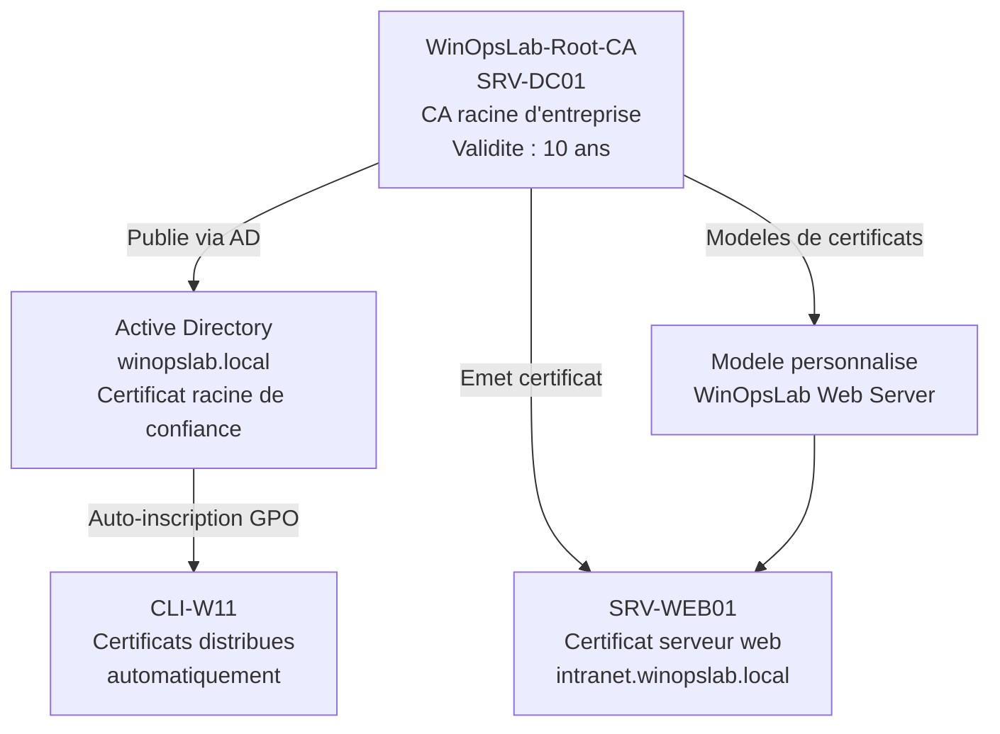

<!--
  Copyright 2026 Julien Bombled

  Licensed under the Apache License, Version 2.0 (the "License");
  you may not use this file except in compliance with the License.
  You may obtain a copy of the License at

      http://www.apache.org/licenses/LICENSE-2.0

  Unless required by applicable law or agreed to in writing, software
  distributed under the License is distributed on an "AS IS" BASIS,
  WITHOUT WARRANTIES OR CONDITIONS OF ANY KIND, either express or implied.
  See the License for the specific language governing permissions and
  limitations under the License.
-->
---
title: "Lab 08 : Infrastructure PKI"
description: Exercice pratique - deployer une autorite de certification d'entreprise et emettre des certificats.
tags:
  - lab
  - pki
  - securite
  - avance
---

# Lab 08 : Infrastructure PKI

<span class="level-advanced">Avance</span> · Temps estime : 90 minutes

---

!!! abstract "Objectifs du lab"

    - [ ] Installer le role AD CS (Active Directory Certificate Services)
    - [ ] Configurer une autorite de certification d'entreprise
    - [ ] Creer un modele de certificat personnalise
    - [ ] Emettre un certificat pour un serveur web
    - [ ] Configurer l'inscription automatique

## Scenario

L'equipe securite a demande le deploiement d'une PKI interne pour securiser les communications (HTTPS intranet, LDAPS, etc.). Vous devez mettre en place une CA d'entreprise integree a Active Directory.

## Environnement requis

| Ressource | Specification |
|-----------|---------------|
| SRV-DC01 | DC + DNS (serveur qui hebergera la CA) |
| SRV-WEB01 | Serveur IIS (destinataire du certificat) |
| CLI-W11 | Client pour tester l'inscription |



## Instructions

!!! example "Analogie"

    Une PKI d'entreprise fonctionne comme une prefecture qui delivre des cartes d'identite :
    la CA racine est le ministere de l'interieur (autorite ultime, rarement sollicitee directement),
    les modeles de certificats sont les formulaires standardises, et les certificats emis sont
    les cartes delivrees aux individus (serveurs). Quand un navigateur visite un site HTTPS
    interne, il verifie la carte d'identite du serveur aupres du ministere de confiance —
    si la CA n'est pas dans son registre de confiance, il affiche une alerte de securite.

### Partie 1 : Installer AD CS

??? success "Solution"

    ```powershell
    # On SRV-DC01: Install AD CS role
    Install-WindowsFeature -Name AD-Certificate -IncludeManagementTools

    # Install the Certification Authority role service
    Install-AdcsCertificationAuthority `
        -CAType EnterpriseRootCA `
        -CryptoProviderName "RSA#Microsoft Software Key Storage Provider" `
        -KeyLength 2048 `
        -HashAlgorithmName SHA256 `
        -CACommonName "WinOpsLab-Root-CA" `
        -CADistinguishedNameSuffix "DC=winopslab,DC=local" `
        -ValidityPeriod Years `
        -ValidityPeriodUnits 10 `
        -Force

    # Install the Web Enrollment role service (optional, for web-based requests)
    Install-WindowsFeature -Name ADCS-Web-Enrollment
    Install-AdcsWebEnrollment -Force

    # Verify the CA
    certutil -ca
    ```

### Partie 2 : Verifier la CA

??? success "Solution"

    ```powershell
    # Check CA status
    certutil -ca | Select-String "Name", "Status"

    # List certificate templates available
    certutil -CATemplates

    # Verify the CA certificate was distributed via AD
    certutil -dsPublish -f "C:\Windows\System32\CertSrv\CertEnroll\*.crt" NTAuth

    # On CLI-W11: verify the root CA is trusted
    certutil -store -enterprise Root
    ```

    Resultat attendu de `certutil -ca` apres installation :

    ```text
    Entry 0: (Local)
      Name:                         "WinOpsLab-Root-CA"
      Organizational Unit:          ""
      Organization:                 ""
      Locality:                     ""
      State:                        ""
      Country:                      ""
      Config:                       "SRV-DC01.winopslab.local\WinOpsLab-Root-CA"
      ExchangeCertificate:          ""
      SignatureCertificate:         "SRV-DC01.winopslab.local_WinOpsLab-Root-CA.crt"
      Description:                  ""
      Active server:                "SRV-DC01.winopslab.local"
      Authority Type:               Root
    ```

### Partie 3 : Creer un modele de certificat personnalise

??? success "Solution"

    ```powershell
    # Duplicate the "Web Server" template using the Certificate Templates MMC
    # Run: certtmpl.msc

    # Steps:
    # 1. Right-click "Web Server" > "Duplicate Template"
    # 2. General tab:
    #    - Template display name: "WinOpsLab Web Server"
    #    - Validity period: 2 years
    # 3. Subject Name tab:
    #    - "Supply in the request" (allows requestor to specify the subject)
    # 4. Security tab:
    #    - Add "Domain Computers" with "Enroll" permission
    #    - Add "Domain Admins" with "Enroll" permission
    # 5. Click OK

    # Publish the template on the CA
    # In certsrv.msc:
    # 1. Expand the CA > Certificate Templates
    # 2. Right-click > New > Certificate Template to Issue
    # 3. Select "WinOpsLab Web Server"

    # Via PowerShell (add template to CA):
    Add-CATemplate -Name "WinOpsLabWebServer" -Force
    ```

### Partie 4 : Emettre un certificat pour SRV-WEB01

??? success "Solution"

    ```powershell
    # On SRV-WEB01: Request a certificate from the enterprise CA
    $cert = Get-Certificate `
        -Template "WinOpsLabWebServer" `
        -DnsName "intranet.winopslab.local", "www.winopslab.local", "SRV-WEB01.winopslab.local" `
        -SubjectName "CN=intranet.winopslab.local" `
        -CertStoreLocation "Cert:\LocalMachine\My"

    # Verify the certificate
    $cert.Certificate | Select-Object Subject, Issuer, NotAfter, Thumbprint

    # List certificates in the personal store
    Get-ChildItem Cert:\LocalMachine\My | Select-Object Subject, Issuer, NotAfter, Thumbprint

    # Bind the certificate to IIS (if IIS is installed)
    Import-Module WebAdministration
    New-WebBinding -Name "Default Web Site" -Protocol "https" -Port 443
    $binding = Get-WebBinding -Name "Default Web Site" -Protocol "https"
    $binding.AddSslCertificate($cert.Certificate.Thumbprint, "My")
    ```

### Partie 5 : Configurer l'inscription automatique

??? success "Solution"

    ```powershell
    # Create a GPO for auto-enrollment
    New-GPO -Name "GPO_PKI_AutoEnrollment" `
        -Comment "Enable certificate auto-enrollment"

    # Configure auto-enrollment settings
    # Computer Configuration > Policies > Windows Settings >
    # Security Settings > Public Key Policies >
    # Certificate Services Client - Auto-Enrollment
    #   - Configuration Model: Enabled
    #   - Check: Renew expired certificates, update pending certificates
    #   - Check: Update certificates that use certificate templates

    Set-GPRegistryValue -Name "GPO_PKI_AutoEnrollment" `
        -Key "HKLM\SOFTWARE\Policies\Microsoft\Cryptography\AutoEnrollment" `
        -ValueName "AEPolicy" -Type DWord -Value 7

    # Link to the domain root
    New-GPLink -Name "GPO_PKI_AutoEnrollment" `
        -Target "DC=winopslab,DC=local" -LinkEnabled Yes

    # Force GPO update on target machines
    Invoke-GPUpdate -Computer "SRV-WEB01" -Force
    ```

## Verification

!!! question "Questions de validation"

    1. Quelle est la difference entre une CA racine et une CA subordonnee ?
    2. Pourquoi une CA d'entreprise doit-elle etre integree a AD ?
    3. Que se passe-t-il si le certificat de la CA racine expire ?
    4. Comment revoquer un certificat emis ?

??? success "Reponses"

    1. La **CA racine** est au sommet de la hierarchie PKI, elle signe son propre certificat.
       La **CA subordonnee** est signee par la CA racine et delivre les certificats aux utilisateurs
       finaux. En production, la CA racine est souvent hors ligne pour la securite.
    2. L'integration AD permet la publication automatique des certificats CA dans l'AD
       (tous les membres du domaine font confiance a la CA), la gestion des modeles
       de certificats et l'inscription automatique via GPO.
    3. Tous les certificats emis par la CA deviennent invalides. C'est pourquoi la validite
       de la CA racine est generalement de **10 a 20 ans**.
    4. Via `certsrv.msc` : Certificats emis > clic droit sur le certificat > Revoquer.
       Ou en PowerShell : `Revoke-Certificate -SerialNumber "<serial>"`.
       Publier ensuite la CRL : `certutil -CRL`.

!!! warning "Pieges frequents dans ce lab"

    1. **CA installee sur un serveur sans IP statique** : la CA publie son URL de distribution
       de CRL dans chaque certificat emis. Si l'adresse IP du serveur change (DHCP), les clients
       ne peuvent plus verifier la validite des certificats. Toujours installer AD CS sur un
       serveur avec une IP statique configuree.

    2. **Modele de certificat publie mais non visible** : apres avoir duplique le modele dans
       `certtmpl.msc`, ne pas oublier de le publier dans `certsrv.msc` (Modeles de certificats
       > Nouveau > Modele de certificat a emettre). Sans cette etape, `Get-Certificate` avec
       `-Template "WinOpsLabWebServer"` echoue avec "The requested template is not supported".

    3. **Permissions insuffisantes sur le modele** : si "Domain Computers" ou "SRV-WEB01" n'a
       pas l'autorisation "Enroll" sur le modele personnalise, la demande de certificat echoue
       avec "Access Denied". Verifier l'onglet Securite du modele dans `certtmpl.msc`.

    4. **CA d'entreprise installee sans jonction au domaine** : une CA de type `EnterpriseRootCA`
       necessite que le serveur soit membre du domaine Active Directory. Une installation sur un
       serveur standalone produit une erreur "The Active Directory is unavailable".

    5. **Oublier la GPO d'auto-inscription** : les certificats ne se distribuent pas
       automatiquement aux clients sans la GPO `GPO_PKI_AutoEnrollment` avec `AEPolicy = 7`.
       Verifier que la GPO est liee et appliquee avant de conclure que l'auto-inscription
       ne fonctionne pas.

## Nettoyage

```powershell
# Remove the CA role (caution: destroys all issued certificates)
Uninstall-AdcsCertificationAuthority -Force
Uninstall-WindowsFeature -Name AD-Certificate
```

## Prochaine etape

:material-arrow-right: [Lab 09 : Automatisation PowerShell](lab-09-automatisation.md)

