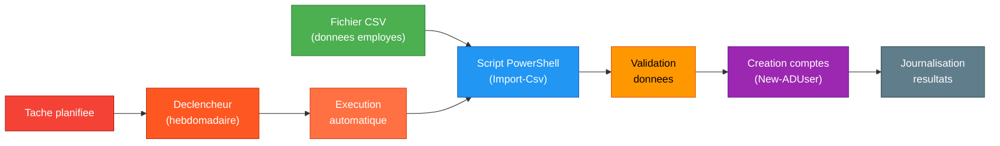

<!--
  Copyright 2026 Julien Bombled

  Licensed under the Apache License, Version 2.0 (the "License");
  you may not use this file except in compliance with the License.
  You may obtain a copy of the License at

      http://www.apache.org/licenses/LICENSE-2.0

  Unless required by applicable law or agreed to in writing, software
  distributed under the License is distributed on an "AS IS" BASIS,
  WITHOUT WARRANTIES OR CONDITIONS OF ANY KIND, either express or implied.
  See the License for the specific language governing permissions and
  limitations under the License.
-->

# Lab 09 : Automatisation PowerShell

<span class="level-intermediate">Intermediaire</span> · Temps estime : 60 minutes

---

!!! abstract "Objectifs du lab"

    - [ ] Ecrire un script de creation d'utilisateurs en masse depuis un CSV
    - [ ] Creer un script de rapport d'inventaire systeme
    - [ ] Mettre en place une tache planifiee pour l'automatisation
    - [ ] Creer un script de surveillance avec alertes email



## Scenario

L'equipe RH fournit regulierement des listes de nouveaux employes. Le service informatique a besoin d'automatiser la creation des comptes AD et de generer des rapports d'inventaire hebdomadaires.

## Environnement requis

| Ressource | Specification |
|-----------|---------------|
| SRV-DC01 | DC avec la structure OU (Labs precedents) |
| SRV-FILE01 | Serveur pour stocker les scripts et rapports |
| CLI-W11 | Poste pour developper et tester les scripts |

## Instructions

!!! example "Analogie"

    Ecrire un script PowerShell pour creer des utilisateurs, c'est comme programmer un robot
    en cuisine : la premiere fois, cela prend plus de temps que de le faire a la main, mais
    la dixieme iteration, c'est instantane et sans erreur. Un script mal ecrit sans gestion
    d'erreurs, c'est un robot qui continue de travailler meme quand le bol est casse —
    d'ou l'importance du `try/catch`. La tache planifiee est le chef qui donne le signal
    au robot chaque lundi matin sans avoir a y penser.

### Partie 1 : Creation d'utilisateurs en masse

1. Creer un fichier CSV avec les donnees des employes
2. Ecrire un script qui lit le CSV et cree les comptes AD

??? success "Solution"

    Fichier CSV (`C:\Scripts\new-users.csv`) :

    ```csv
    Prenom,Nom,Service,Titre
    Alice,Moreau,Comptabilite,Comptable
    Bruno,Petit,Commercial,Commercial
    Claire,Robert,Direction,Assistante
    David,Simon,Informatique,Technicien
    ```

    Script de creation :

    ```powershell
    # Import-NewUsers.ps1
    # Creates AD users from a CSV file

    param(
        [Parameter(Mandatory)]
        [string]$CsvPath,

        [string]$DefaultPassword = "Welcome2026!",
        [string]$DomainSuffix = "winopslab.local"
    )

    # Import the CSV
    $users = Import-Csv -Path $CsvPath -Delimiter ","

    # Convert password to secure string
    $securePassword = ConvertTo-SecureString $DefaultPassword -AsPlainText -Force

    foreach ($user in $users) {
        $samAccountName = "$($user.Prenom.ToLower()).$($user.Nom.ToLower())"
        $upn = "$samAccountName@$DomainSuffix"
        $displayName = "$($user.Prenom) $($user.Nom)"
        $ouPath = "OU=$($user.Service),OU=Utilisateurs,DC=winopslab,DC=local"

        # Check if user already exists
        if (Get-ADUser -Filter "SamAccountName -eq '$samAccountName'" -ErrorAction SilentlyContinue) {
            Write-Warning "User '$samAccountName' already exists. Skipping."
            continue
        }

        # Check if the OU exists
        try {
            Get-ADOrganizationalUnit -Identity $ouPath -ErrorAction Stop | Out-Null
        }
        catch {
            Write-Warning "OU '$ouPath' does not exist. Creating it."
            New-ADOrganizationalUnit -Name $user.Service `
                -Path "OU=Utilisateurs,DC=winopslab,DC=local"
        }

        # Create the user
        New-ADUser -Name $displayName `
            -GivenName $user.Prenom `
            -Surname $user.Nom `
            -SamAccountName $samAccountName `
            -UserPrincipalName $upn `
            -DisplayName $displayName `
            -Title $user.Titre `
            -Department $user.Service `
            -Path $ouPath `
            -AccountPassword $securePassword `
            -ChangePasswordAtLogon $true `
            -Enabled $true

        # Add to the department global group
        $groupName = "GG_$($user.Service)"
        if (Get-ADGroup -Filter "Name -eq '$groupName'" -ErrorAction SilentlyContinue) {
            Add-ADGroupMember -Identity $groupName -Members $samAccountName
        }

        Write-Output "Created user: $displayName ($samAccountName) in $($user.Service)"
    }

    Write-Output "`nUser creation complete."
    ```

    Execution :

    ```powershell
    .\Import-NewUsers.ps1 -CsvPath "C:\Scripts\new-users.csv"
    ```

    Resultat attendu lors de l'execution du script :

    ```text
    Created user: Alice Moreau (alice.moreau) in Comptabilite
    Created user: Bruno Petit (bruno.petit) in Commercial
    Created user: Claire Robert (claire.robert) in Direction
    Created user: David Simon (david.simon) in Informatique

    User creation complete.
    ```

### Partie 2 : Rapport d'inventaire systeme

??? success "Solution"

    ```powershell
    # Get-ServerInventory.ps1
    # Generates an HTML inventory report for all domain servers

    param(
        [string]$OutputPath = "C:\Reports\ServerInventory-$(Get-Date -Format 'yyyyMMdd').html"
    )

    $servers = Get-ADComputer -Filter { OperatingSystem -like "*Server*" } -Properties OperatingSystem |
        Select-Object -ExpandProperty Name

    $inventory = foreach ($server in $servers) {
        try {
            $os = Get-CimInstance Win32_OperatingSystem -ComputerName $server -ErrorAction Stop
            $cpu = Get-CimInstance Win32_Processor -ComputerName $server -ErrorAction Stop
            $disk = Get-CimInstance Win32_LogicalDisk -ComputerName $server -Filter "DriveType=3" -ErrorAction Stop

            [PSCustomObject]@{
                Server       = $server
                OS           = $os.Caption
                Uptime       = ((Get-Date) - $os.LastBootUpTime).ToString("dd\.hh\:mm")
                CPU          = $cpu.Name
                Cores        = $cpu.NumberOfCores
                TotalRAM_GB  = [math]::Round($os.TotalVisibleMemorySize / 1MB, 1)
                FreeRAM_GB   = [math]::Round($os.FreePhysicalMemory / 1MB, 1)
                DiskFree_GB  = ($disk | ForEach-Object {
                    "$($_.DeviceID) $([math]::Round($_.FreeSpace/1GB,1))GB"
                }) -join " | "
                Status       = "Online"
            }
        }
        catch {
            [PSCustomObject]@{
                Server = $server; OS = "N/A"; Uptime = "N/A"
                CPU = "N/A"; Cores = "N/A"; TotalRAM_GB = "N/A"
                FreeRAM_GB = "N/A"; DiskFree_GB = "N/A"; Status = "Offline"
            }
        }
    }

    # Generate HTML report
    $html = $inventory | ConvertTo-Html -Title "Server Inventory - $(Get-Date -Format 'yyyy-MM-dd')" `
        -PreContent "<h1>Server Inventory Report</h1><p>Generated: $(Get-Date)</p>"

    $html | Out-File -FilePath $OutputPath -Encoding UTF8
    Write-Output "Report saved to: $OutputPath"
    ```

### Partie 3 : Tache planifiee

??? success "Solution"

    ```powershell
    # Create a scheduled task to run the inventory report weekly
    $action = New-ScheduledTaskAction `
        -Execute "PowerShell.exe" `
        -Argument '-NoProfile -ExecutionPolicy Bypass -File "C:\Scripts\Get-ServerInventory.ps1"'

    $trigger = New-ScheduledTaskTrigger -Weekly -DaysOfWeek Monday -At "07:00"

    $principal = New-ScheduledTaskPrincipal -UserId "WINOPSLAB\admin.lab" `
        -LogonType Password -RunLevel Highest

    Register-ScheduledTask -TaskName "Weekly-ServerInventory" `
        -Action $action -Trigger $trigger -Principal $principal `
        -Description "Generate weekly server inventory report"

    # Verify the task
    Get-ScheduledTask -TaskName "Weekly-ServerInventory"

    # Run the task immediately to test
    Start-ScheduledTask -TaskName "Weekly-ServerInventory"
    ```

### Partie 4 : Script de surveillance avec alertes

??? success "Solution"

    ```powershell
    # Watch-ServerHealth.ps1
    # Monitors server health and logs warnings

    param(
        [int]$CpuThreshold = 90,
        [int]$DiskThresholdPercent = 15,
        [int]$MemoryThresholdMB = 500
    )

    $servers = @("SRV-DC01", "SRV-FILE01", "SRV-WEB01")
    $alerts = @()

    foreach ($server in $servers) {
        try {
            # Check CPU
            $cpu = (Get-Counter "\\$server\Processor(_Total)\% Processor Time" `
                -ErrorAction Stop).CounterSamples[0].CookedValue
            if ($cpu -gt $CpuThreshold) {
                $alerts += "$server - CPU at $([math]::Round($cpu,1))% (threshold: $CpuThreshold%)"
            }

            # Check memory
            $mem = (Get-Counter "\\$server\Memory\Available MBytes" `
                -ErrorAction Stop).CounterSamples[0].CookedValue
            if ($mem -lt $MemoryThresholdMB) {
                $alerts += "$server - Available RAM: ${mem}MB (threshold: ${MemoryThresholdMB}MB)"
            }

            # Check disk space
            $disks = Get-CimInstance Win32_LogicalDisk -ComputerName $server `
                -Filter "DriveType=3" -ErrorAction Stop
            foreach ($disk in $disks) {
                $freePercent = [math]::Round(($disk.FreeSpace / $disk.Size) * 100, 1)
                if ($freePercent -lt $DiskThresholdPercent) {
                    $alerts += "$server - Disk $($disk.DeviceID) at ${freePercent}% free (threshold: $DiskThresholdPercent%)"
                }
            }
        }
        catch {
            $alerts += "$server - UNREACHABLE: $($_.Exception.Message)"
        }
    }

    # Output alerts
    if ($alerts.Count -gt 0) {
        Write-Warning "=== HEALTH ALERTS ==="
        $alerts | ForEach-Object { Write-Warning $_ }

        # Log to Event Log
        foreach ($alert in $alerts) {
            Write-EventLog -LogName Application -Source "ServerHealth" `
                -EventId 9001 -EntryType Warning -Message $alert
        }
    }
    else {
        Write-Output "All servers healthy."
    }
    ```

## Verification

!!! question "Questions de validation"

    1. Pourquoi utiliser `-ChangePasswordAtLogon $true` lors de la creation d'utilisateurs ?
    2. Quelle est la difference entre une tache planifiee executee en tant que SYSTEM et en tant qu'utilisateur ?
    3. Comment gerer les erreurs dans un script qui interroge des serveurs distants ?
    4. Pourquoi est-il important de valider les donnees d'entree (CSV) avant de creer des comptes ?

??? success "Reponses"

    1. Cela oblige l'utilisateur a changer son mot de passe initial lors de la premiere connexion,
       garantissant que seul l'utilisateur connait son mot de passe final.
    2. **SYSTEM** : s'execute meme si personne n'est connecte, avec les droits de la machine.
       **Utilisateur** : s'execute avec les droits du compte specifie, peut necesiter que l'utilisateur
       soit connecte (sauf si "Run whether user is logged on or not" est active).
    3. Utiliser `try/catch` avec `-ErrorAction Stop` pour capturer les erreurs et continuer
       le traitement des autres serveurs. Ne jamais laisser une erreur bloquer tout le script.
    4. Un CSV malformee (caracteres speciaux, champs manquants, doublons) peut creer des
       comptes invalides ou provoquer des erreurs. La validation en amont evite ces problemes.

!!! warning "Pieges frequents dans ce lab"

    1. **Encodage du fichier CSV** : un CSV contenant des caracteres accentues (Prenom, Titre)
       genere sous Windows avec Notepad peut etre en ANSI. `Import-Csv` sans `-Encoding`
       produit des noms corrompus ("AliceÃ" au lieu de "Alice"). Toujours sauvegarder le CSV
       en UTF-8 et utiliser `Import-Csv -Encoding UTF8`.

    2. **SamAccountName trop long** : Active Directory limite le `SamAccountName` a 20 caracteres.
       Pour un nom compose comme "Jean-Baptiste Deschampsleroy", le script genere un identifiant
       qui depasse la limite et echoue silencieusement. Ajouter une troncature explicite :
       `$samAccountName = $samAccountName.Substring(0, [Math]::Min(20, $samAccountName.Length))`.

    3. **Tache planifiee qui ne s'execute pas** : si la tache est creee avec un compte de service
       (`WINOPSLAB\admin.lab`) mais que le mot de passe n'est pas specifie lors de
       `Register-ScheduledTask`, la tache s'enregistre mais echoue a l'execution avec
       "The task's password must be supplied". Utiliser `-Password` ou croire l'interface
       graphique (Planificateur de taches > Proprietes > Executer avec les droits maximaux).

    4. **Script de surveillance avec source d'evenements inexistante** : `Write-EventLog`
       avec `-Source "ServerHealth"` echoue si la source n'a pas ete prealablement enregistree
       avec `New-EventLog -LogName Application -Source "ServerHealth"`. Sans cette initialisation,
       le script plante a la premiere alerte.

    5. **Chemins de scripts en dur avec des espaces** : si le script est place dans
       `C:\Scripts PowerShell\`, le parametre `-Argument` de la tache planifiee doit encadrer
       le chemin de guillemets doubles echappes. Un espace dans le chemin sans guillemets fait
       que PowerShell interprete le chemin comme deux arguments distincts et echoue a trouver
       le fichier.

## Nettoyage

```powershell
# Remove the scheduled task
Unregister-ScheduledTask -TaskName "Weekly-ServerInventory" -Confirm:$false

# Remove test users created from CSV
Import-Csv "C:\Scripts\new-users.csv" | ForEach-Object {
    $sam = "$($_.Prenom.ToLower()).$($_.Nom.ToLower())"
    Remove-ADUser -Identity $sam -Confirm:$false -ErrorAction SilentlyContinue
}
```

## Prochaine etape

:material-arrow-right: [Lab 10 : Supervision](lab-10-supervision.md)

