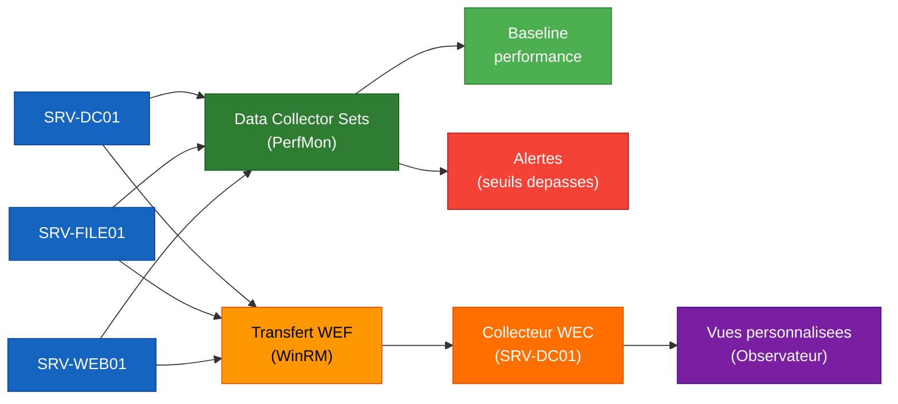

<!--
  Copyright 2026 Julien Bombled

  Licensed under the Apache License, Version 2.0 (the "License");
  you may not use this file except in compliance with the License.
  You may obtain a copy of the License at

      http://www.apache.org/licenses/LICENSE-2.0

  Unless required by applicable law or agreed to in writing, software
  distributed under the License is distributed on an "AS IS" BASIS,
  WITHOUT WARRANTIES OR CONDITIONS OF ANY KIND, either express or implied.
  See the License for the specific language governing permissions and
  limitations under the License.
-->
---
title: "Lab 10 : Supervision"
description: Exercice pratique - mettre en place la supervision avec perfmon, collecteurs de donnees et transfert d'evenements.
tags:
  - lab
  - supervision
  - avance
---

# Lab 10 : Supervision

<span class="level-advanced">Avance</span> · Temps estime : 60 minutes

---

!!! abstract "Objectifs du lab"

    - [ ] Creer un ensemble de collecteurs de donnees pour la baseline
    - [ ] Configurer des alertes de performance
    - [ ] Mettre en place le transfert d'evenements (WEF)
    - [ ] Creer des vues personnalisees dans l'Observateur d'evenements
    - [ ] Generer un rapport de diagnostic systeme



## Scenario

Avant la mise en production de l'infrastructure, le responsable demande de mettre en place une supervision de base : collecte des metriques de performance, alertes automatiques et centralisation des journaux d'evenements.

## Environnement requis

| Ressource | Specification |
|-----------|---------------|
| SRV-DC01 | DC + DNS + collecteur d'evenements (WEC) |
| SRV-FILE01 | Source d'evenements |
| SRV-WEB01 | Source d'evenements |
| CLI-W11 | Consultation des rapports |

## Instructions

!!! example "Analogie"

    Superviser un serveur, c'est comme le tableau de bord d'une voiture : les collecteurs
    de donnees sont les capteurs (temperature, vitesse, pression) qui enregistrent en continu,
    les alertes sont les voyants lumineux qui s'allument quand un seuil est depasse, et le
    transfert d'evenements (WEF) est le boitier noir qui centralise les journaux de toute la
    flotte dans un seul endroit. Sans tableau de bord, on ne decouvre les problemes qu'au moment
    de la panne — toujours trop tard.

### Partie 1 : Creer un ensemble de collecteurs de donnees

1. Creer un collecteur avec les compteurs CPU, memoire, disque et reseau
2. Configurer un echantillonnage toutes les 15 secondes
3. Demarrer la collecte pendant 10 minutes

??? success "Solution"

    ```powershell
    # On SRV-DC01: Create a data collector set
    $counters = @(
        "\Processor(_Total)\% Processor Time"
        "\System\Processor Queue Length"
        "\Memory\Available MBytes"
        "\Memory\Pages/sec"
        "\PhysicalDisk(_Total)\Avg. Disk Queue Length"
        "\PhysicalDisk(_Total)\% Disk Time"
        "\Network Interface(*)\Bytes Total/sec"
        "\LogicalDisk(*)\% Free Space"
    )

    logman create counter "Lab-Baseline" `
        -c $counters `
        -si 15 `
        -o "C:\PerfLogs\Lab-Baseline" `
        -f bin `
        -v mmddhhmm

    # Start the collector
    logman start "Lab-Baseline"

    # Wait 10 minutes (or let it run)
    Start-Sleep -Seconds 600

    # Stop the collector
    logman stop "Lab-Baseline"

    # Verify the data file was created
    Get-ChildItem "C:\PerfLogs\Lab-Baseline"
    ```

    Resultat attendu de `Get-ChildItem "C:\PerfLogs\Lab-Baseline"` :

    ```text
    Mode         LastWriteTime      Length Name
    ----         -------------      ------ ----
    -a----  20/02/2026  08:15        92160 Lab-Baseline_02201515.blg
    ```

### Partie 2 : Analyser les donnees collectees

??? success "Solution"

    ```powershell
    # Import and analyze the collected data
    $blgFile = (Get-ChildItem "C:\PerfLogs\Lab-Baseline\*.blg" |
        Sort-Object LastWriteTime -Descending | Select-Object -First 1).FullName

    $data = Import-Counter -Path $blgFile

    # CPU statistics
    $cpuSamples = $data | ForEach-Object {
        $_.CounterSamples | Where-Object { $_.Path -like "*% Processor Time*" -and $_.InstanceName -eq "_total" }
    }
    $cpuStats = $cpuSamples | Measure-Object -Property CookedValue -Average -Maximum -Minimum
    Write-Output "CPU - Min: $([math]::Round($cpuStats.Minimum,2))% | Avg: $([math]::Round($cpuStats.Average,2))% | Max: $([math]::Round($cpuStats.Maximum,2))%"

    # Memory statistics
    $memSamples = $data | ForEach-Object {
        $_.CounterSamples | Where-Object { $_.Path -like "*Available MBytes*" }
    }
    $memStats = $memSamples | Measure-Object -Property CookedValue -Average -Minimum
    Write-Output "RAM Available - Min: $([math]::Round($memStats.Minimum,0)) MB | Avg: $([math]::Round($memStats.Average,0)) MB"

    # Open in Performance Monitor for graphical analysis
    perfmon /openlog $blgFile
    ```

### Partie 3 : Configurer le transfert d'evenements (WEF)

1. Configurer SRV-DC01 comme collecteur (WEC)
2. Configurer SRV-FILE01 et SRV-WEB01 comme sources
3. Creer un abonnement pour les evenements critiques et d'erreur

??? success "Solution"

    ```powershell
    # On SRV-DC01 (Collector): Enable WEC service
    wecutil qc /q

    # Increase ForwardedEvents log size
    wevtutil sl ForwardedEvents /ms:1073741824

    # On source servers (SRV-FILE01, SRV-WEB01): Enable WinRM
    Invoke-Command -ComputerName SRV-FILE01, SRV-WEB01 -ScriptBlock {
        winrm quickconfig /q
    }

    # Create a subscription XML file
    $subscriptionXml = @"
    <Subscription xmlns="http://schemas.microsoft.com/2006/03/windows/events/subscription">
        <SubscriptionId>Lab-CriticalEvents</SubscriptionId>
        <SubscriptionType>CollectorInitiated</SubscriptionType>
        <Description>Collect critical and error events from lab servers</Description>
        <Enabled>true</Enabled>
        <Uri>http://schemas.microsoft.com/wbem/wsman/1/windows/EventLog</Uri>
        <ConfigurationMode>Normal</ConfigurationMode>
        <Delivery Mode="Push">
            <Batching>
                <MaxLatencyTime>60000</MaxLatencyTime>
            </Batching>
        </Delivery>
        <Query>
            <![CDATA[
                <QueryList>
                    <Query Id="0">
                        <Select Path="System">*[System[(Level=1 or Level=2)]]</Select>
                        <Select Path="Application">*[System[(Level=1 or Level=2)]]</Select>
                        <Select Path="Security">*[System[(EventID=4625 or EventID=4720 or EventID=4726)]]</Select>
                    </Query>
                </QueryList>
            ]]>
        </Query>
        <ReadExistingEvents>false</ReadExistingEvents>
        <TransportName>HTTP</TransportName>
        <EventSources>
            <EventSource Enabled="true">
                <Address>SRV-FILE01.winopslab.local</Address>
            </EventSource>
            <EventSource Enabled="true">
                <Address>SRV-WEB01.winopslab.local</Address>
            </EventSource>
        </EventSources>
    </Subscription>
    "@
    $subscriptionXml | Out-File -FilePath "C:\Temp\Lab-Subscription.xml" -Encoding UTF8

    # Create the subscription
    wecutil cs "C:\Temp\Lab-Subscription.xml"

    # Verify
    wecutil gs "Lab-CriticalEvents"
    wecutil gr "Lab-CriticalEvents"
    ```

### Partie 4 : Creer des vues personnalisees

??? success "Solution"

    ```powershell
    # Query forwarded events
    Get-WinEvent -LogName "ForwardedEvents" -MaxEvents 20 -ErrorAction SilentlyContinue |
        Select-Object TimeCreated, MachineName, Id, LevelDisplayName, Message

    # Create a custom view for failed logons across all servers
    Get-WinEvent -FilterHashtable @{
        LogName = 'Security', 'ForwardedEvents'
        Id = 4625
        StartTime = (Get-Date).AddDays(-1)
    } -ErrorAction SilentlyContinue |
        Select-Object TimeCreated, MachineName, Message |
        Format-Table -AutoSize

    # Run System Diagnostics report
    logman start "System Diagnostics" -s SRV-DC01
    # Wait for completion (about 60 seconds)
    Start-Sleep -Seconds 90
    # The report is available in perfmon > Reports > System > System Diagnostics
    ```

### Partie 5 : Rapport de diagnostic systeme

??? success "Solution"

    ```powershell
    # Generate a comprehensive health report
    $report = @()
    $servers = @("SRV-DC01", "SRV-FILE01", "SRV-WEB01")

    foreach ($server in $servers) {
        try {
            $cpu = (Get-Counter "\\$server\Processor(_Total)\% Processor Time" -ErrorAction Stop).CounterSamples[0].CookedValue
            $mem = (Get-Counter "\\$server\Memory\Available MBytes" -ErrorAction Stop).CounterSamples[0].CookedValue
            $errors = (Get-WinEvent -ComputerName $server -FilterHashtable @{
                LogName='System'; Level=1,2; StartTime=(Get-Date).AddDays(-1)
            } -ErrorAction SilentlyContinue | Measure-Object).Count

            $report += [PSCustomObject]@{
                Server      = $server
                CPU_Percent = [math]::Round($cpu, 1)
                FreeRAM_MB  = [math]::Round($mem, 0)
                Errors_24h  = $errors
                Status      = "Online"
            }
        }
        catch {
            $report += [PSCustomObject]@{
                Server = $server; CPU_Percent = "N/A"
                FreeRAM_MB = "N/A"; Errors_24h = "N/A"; Status = "Offline"
            }
        }
    }

    $report | Format-Table -AutoSize
    $report | Export-Csv "C:\Reports\HealthReport-$(Get-Date -Format 'yyyyMMdd').csv" -NoTypeInformation
    ```

    Resultat attendu de `$report | Format-Table -AutoSize` :

    ```text
    Server     CPU_Percent  FreeRAM_MB  Errors_24h  Status
    ------     -----------  ----------  ----------  ------
    SRV-DC01       3.2          1842           0   Online
    SRV-FILE01     1.1          2014           0   Online
    SRV-WEB01      0.8          1976           0   Online
    ```

## Verification

!!! question "Questions de validation"

    1. Quelle est la difference entre un collecteur de donnees et une alerte ?
    2. Quel protocole WEF utilise-t-il pour le transfert des evenements ?
    3. Combien de temps devrait durer une baseline representative ?
    4. Comment savoir si un abonnement WEF fonctionne correctement ?

??? success "Reponses"

    1. Un **collecteur de donnees** enregistre periodiquement des valeurs de compteurs dans un fichier.
       Une **alerte** surveille un compteur en temps reel et declenche une action quand un seuil est depasse.
    2. WEF utilise **WinRM** (Windows Remote Management) sur le port **TCP 5985** (HTTP)
       ou **5986** (HTTPS).
    3. Une baseline devrait couvrir au minimum **une semaine complete** incluant les heures de pointe
       et les heures creuses, idealement un mois complet.
    4. `wecutil gr "NomAbonnement"` affiche l'etat de chaque source. Un etat "Active" avec
       un "Last Error" vide indique un fonctionnement correct.

!!! warning "Pieges frequents dans ce lab"

    1. **Service WEC non demarre sur le collecteur** : `wecutil qc /q` configure ET demarre
       le service "Windows Event Collector". Si cette commande n'a pas ete executee sur SRV-DC01,
       les abonnements sont crees mais aucun evenement n'arrive jamais. Verifier avec
       `Get-Service wecsvc | Select-Object Status`.

    2. **WinRM non configure sur les sources** : `winrm quickconfig /q` est requis sur chaque
       serveur source (SRV-FILE01, SRV-WEB01). Sans cela, l'abonnement reste a l'etat "Connecting"
       indefiniment. Verifier avec `wecutil gr "Lab-CriticalEvents"` que le statut est "Active".

    3. **Fichier BLG non trouve lors de l'analyse** : `Import-Counter` necessite le chemin
       complet du fichier `.blg`. Le nom du fichier inclut un horodatage (`_02201515.blg`).
       Utiliser `Get-ChildItem "C:\PerfLogs\Lab-Baseline\*.blg"` pour trouver le bon nom
       avant d'appeler `Import-Counter`.

    4. **Collecteur de donnees deja existant** : si `logman create counter "Lab-Baseline"` est
       execute deux fois, la deuxieme execution echoue avec "Data Collector Set already exists".
       Supprimer d'abord l'existant avec `logman delete "Lab-Baseline"` avant de recreer.

    5. **Compteurs de performance avec des noms localises** : sur un Windows Server en francais,
       les noms des compteurs (ex: `\Processeur(_Total)\% Temps Processeur`) different des noms
       anglais utilises dans les scripts. Utiliser les noms anglais ou verifier les noms locaux
       avec `Get-Counter -ListSet *` pour eviter les erreurs "Counter path is not valid".

## Nettoyage

```powershell
# Remove the data collector set
logman delete "Lab-Baseline"

# Remove the WEF subscription
wecutil ds "Lab-CriticalEvents"
```

## Prochaine etape

:material-arrow-right: [Projet de synthese : Infrastructure PME complete](../projets/projet-pme-complete.md)

