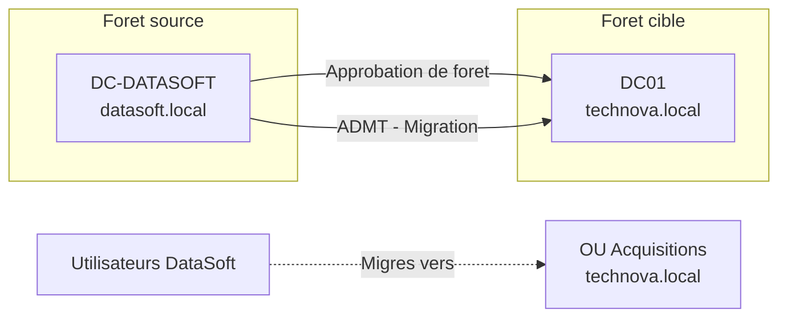

<!--
  Copyright 2026 Julien Bombled

  Licensed under the Apache License, Version 2.0 (the "License");
  you may not use this file except in compliance with the License.
  You may obtain a copy of the License at

      http://www.apache.org/licenses/LICENSE-2.0

  Unless required by applicable law or agreed to in writing, software
  distributed under the License is distributed on an "AS IS" BASIS,
  WITHOUT WARRANTIES OR CONDITIONS OF ANY KIND, either express or implied.
  See the License for the specific language governing permissions and
  limitations under the License.
-->

# Projet : Migration Active Directory

<span class="level-advanced">Avance</span> · Temps estime : 180 minutes

---

!!! abstract "Objectifs du projet"

    - [ ] Comprendre les scenarios de migration AD
    - [ ] Configurer une approbation de foret entre deux domaines
    - [ ] Planifier la migration avec ADMT
    - [ ] Migrer des comptes utilisateurs et groupes
    - [ ] Verifier et valider la migration

<span class="level-advanced">Avance</span>

!!! example "Analogie"

    Migrer un domaine Active Directory, c'est comme fusionner deux entreprises avec chacune
    leur badge d'acces (SID) : on ne peut pas annuler les anciens badges du premier jour,
    car les employes de DataSoft ont encore des fichiers et des acces sur leurs anciens
    serveurs. L'approbation de foret est le protocole d'accord entre les deux DRH. ADMT avec
    le SID History, c'est le systeme qui permet aux ex-employes DataSoft de garder leur ancien
    badge valide en parallele du nouveau — jusqu'a ce que tous les acces aient ete migres.

## Contexte

L'entreprise **TechNova** (domaine `technova.local`) a rachete la societe **DataSoft** (domaine `datasoft.local`). Vous devez migrer les utilisateurs, groupes et ressources de DataSoft vers le domaine TechNova.

## Architecture de migration



## Plan de migration

### Phase 1 : Preparation (Semaine 1)

| Tache | Description |
|-------|-------------|
| Inventaire source | Lister les utilisateurs, groupes, postes, serveurs de datasoft.local |
| Audit des permissions | Documenter les permissions NTFS et partage existantes |
| Plan de nommage | Definir les conventions pour les comptes migres |
| Communication | Informer les utilisateurs de la migration |

??? success "Solution - Inventaire"

    ```powershell
    # On DC-DATASOFT: Export user inventory
    Get-ADUser -Filter * -Properties Department, Title, MemberOf |
        Select-Object SamAccountName, Name, Department, Title,
        @{N='Groups';E={($_.MemberOf | ForEach-Object { ($_ -split ',')[0] -replace 'CN=' }) -join '; '}} |
        Export-Csv "C:\Migration\UserInventory-DataSoft.csv" -NoTypeInformation -Encoding UTF8

    # Export group inventory
    Get-ADGroup -Filter * -Properties Members, Description |
        Select-Object Name, GroupScope, GroupCategory, Description,
        @{N='MemberCount';E={$_.Members.Count}} |
        Export-Csv "C:\Migration\GroupInventory-DataSoft.csv" -NoTypeInformation -Encoding UTF8

    # Export computer inventory
    Get-ADComputer -Filter * -Properties OperatingSystem, LastLogonTimestamp |
        Select-Object Name, OperatingSystem, Enabled,
        @{N='LastLogon';E={[DateTime]::FromFileTime($_.LastLogonTimestamp)}} |
        Export-Csv "C:\Migration\ComputerInventory-DataSoft.csv" -NoTypeInformation -Encoding UTF8
    ```

### Phase 2 : Configuration de l'approbation (Semaine 2)

| Tache | Description |
|-------|-------------|
| DNS conditionnel | Configurer la resolution DNS entre les deux forets |
| Approbation de foret | Creer une approbation bidirectionnelle |
| Validation | Tester la resolution de noms et l'authentification |

??? success "Solution - Approbation"

    ```powershell
    # On DC01 (technova.local): Create conditional forwarder for datasoft.local
    Add-DnsServerConditionalForwarderZone -Name "datasoft.local" `
        -MasterServers 10.10.20.10

    # On DC-DATASOFT (datasoft.local): Create conditional forwarder for technova.local
    Add-DnsServerConditionalForwarderZone -Name "technova.local" `
        -MasterServers 10.10.10.10

    # Verify DNS resolution between forests
    Resolve-DnsName dc-datasoft.datasoft.local  # From technova.local
    Resolve-DnsName dc01.technova.local         # From datasoft.local

    # Create forest trust (from technova.local)
    # Via Active Directory Domains and Trusts (domain.msc):
    # 1. Right-click technova.local > Properties > Trusts tab
    # 2. New Trust > Forest trust > Bidirectional > Forest-wide authentication
    # 3. Enter admin credentials for datasoft.local

    # Verify the trust
    Get-ADTrust -Filter * | Select-Object Name, Direction, TrustType, IntraForest
    ```

### Phase 3 : Migration avec ADMT (Semaine 3-4)

!!! tip "ADMT"

    Active Directory Migration Tool (ADMT) est l'outil Microsoft officiel pour migrer
    des objets entre domaines AD. Il conserve les SID d'origine (SID History) pour
    maintenir l'acces aux ressources pendant la transition.

| Etape | Ordre | Description |
|-------|-------|-------------|
| Migration des groupes | 1 | Migrer les groupes globaux et universels |
| Migration des comptes de service | 2 | Migrer les comptes de service en premier |
| Migration des utilisateurs (pilote) | 3 | Migrer un petit groupe test |
| Validation du pilote | 4 | Verifier les acces et les permissions |
| Migration des utilisateurs (masse) | 5 | Migrer tous les utilisateurs restants |
| Migration des postes | 6 | Migrer les comptes ordinateurs |
| Nettoyage | 7 | Supprimer l'approbation et decommissionner l'ancien domaine |

??? success "Solution - Migration"

    ```powershell
    # Prepare target OU in technova.local
    New-ADOrganizationalUnit -Name "Acquisitions" -Path "DC=technova,DC=local"
    New-ADOrganizationalUnit -Name "DataSoft" -Path "OU=Acquisitions,DC=technova,DC=local"
    New-ADOrganizationalUnit -Name "Utilisateurs" -Path "OU=DataSoft,OU=Acquisitions,DC=technova,DC=local"
    New-ADOrganizationalUnit -Name "Groupes" -Path "OU=DataSoft,OU=Acquisitions,DC=technova,DC=local"

    # ADMT migration via command line (after ADMT installation)
    # Step 1: Migrate groups
    admt group /N "GG_Dev" "GG_Support" `
        /SD:"datasoft.local" /TD:"technova.local" `
        /TO:"OU=Groupes,OU=DataSoft,OU=Acquisitions,DC=technova,DC=local" `
        /MSS:YES  # Migrate SID

    # Step 2: Migrate users with SID history
    admt user /N "user1" "user2" `
        /SD:"datasoft.local" /TD:"technova.local" `
        /TO:"OU=Utilisateurs,OU=DataSoft,OU=Acquisitions,DC=technova,DC=local" `
        /MSS:YES `
        /TRP:YES  # Translate Roaming Profiles
        /MigrateGroups:YES

    # Alternative: PowerShell-based migration for simple scenarios
    # Export users from source
    $sourceUsers = Get-ADUser -Server "datasoft.local" -Filter * `
        -Properties Department, Title, MemberOf

    # Create users in target
    foreach ($user in $sourceUsers) {
        $password = ConvertTo-SecureString "Migr@tion2026!" -AsPlainText -Force
        New-ADUser -Name $user.Name `
            -SamAccountName $user.SamAccountName `
            -UserPrincipalName "$($user.SamAccountName)@technova.local" `
            -GivenName $user.GivenName `
            -Surname $user.Surname `
            -Department $user.Department `
            -Title $user.Title `
            -Path "OU=Utilisateurs,OU=DataSoft,OU=Acquisitions,DC=technova,DC=local" `
            -AccountPassword $password `
            -ChangePasswordAtLogon $true `
            -Enabled $true
    }
    ```

### Phase 4 : Validation et nettoyage

??? success "Solution - Validation"

    ```powershell
    # Verify migrated users can authenticate
    Test-ComputerSecureChannel -Server dc01.technova.local

    # Verify group memberships were preserved
    Get-ADUser -Filter * -SearchBase "OU=DataSoft,OU=Acquisitions,DC=technova,DC=local" |
        ForEach-Object {
            [PSCustomObject]@{
                User = $_.SamAccountName
                Groups = (Get-ADPrincipalGroupMembership $_.SamAccountName |
                    Select-Object -ExpandProperty Name) -join ', '
            }
        }

    # Count migrated objects
    $migratedUsers = (Get-ADUser -Filter * `
        -SearchBase "OU=DataSoft,OU=Acquisitions,DC=technova,DC=local").Count
    Write-Output "Migrated users: $migratedUsers"

    # After successful validation: remove the trust
    # Remove-ADTrust -Identity "datasoft.local" -Confirm:$false
    ```

    Resultat attendu apres validation de l'approbation :

    ```text
    # Get-ADTrust -Filter * | Select-Object Name, Direction, TrustType
    Name            Direction  TrustType
    ----            ---------  ---------
    datasoft.local  BiDirectional  Forest

    # Write-Output "Migrated users: $migratedUsers"
    Migrated users: 42
    ```

## Risques et mitigations

| Risque | Mitigation |
|--------|-----------|
| Perte d'acces aux ressources | SID History preserve les anciens SID |
| Duplication de noms (conflits) | Convention de nommage avec prefixe |
| Erreurs de migration | Phase pilote avant migration masse |
| Indisponibilite pendant la migration | Migration en dehors des heures de travail |

## Points cles a retenir

- La migration AD necessite une planification rigoureuse et un inventaire complet
- L'**approbation de foret** permet la coexistence temporaire des deux domaines
- **ADMT** avec le **SID History** garantit la continuite d'acces aux ressources
- Une **phase pilote** est indispensable avant la migration en masse
- La documentation et la communication avec les utilisateurs sont essentielles

!!! warning "Pieges frequents dans ce projet"

    1. **DNS conditionnel non configure avant l'approbation** : sans redirecteur conditionnel
       mutuel, la creation de l'approbation de foret echoue avec "The domain name datasoft.local
       cannot be resolved". Configurer les redirecteurs DNS dans les DEUX sens (technova vers
       datasoft ET datasoft vers technova) et valider avec `Resolve-DnsName` avant de tenter
       l'approbation.

    2. **Migration des utilisateurs avant les groupes** : ADMT migre les membres de groupe
       en meme temps que les utilisateurs, mais si les groupes cibles n'existent pas encore
       dans technova.local, les appartenances sont perdues. Toujours migrer les groupes globaux
       en premier (Etape 1 du tableau de migration).

    3. **Conflits de SamAccountName** : si un utilisateur "jean.dupont" existe deja dans
       technova.local, ADMT echoue sur cet objet. Preparer une convention de nommage pour les
       conflits (ex: prefixe "ds-" pour les comptes DataSoft migres : "ds-jean.dupont") et
       documenter les cas de doublon dans la phase pilote.

    4. **SID History non active sur le domaine cible** : pour qu'ADMT puisse copier les SID
       source, `SIDHistory` doit etre autorise sur technova.local. Verifier avec
       `Get-ADDomain | Select-Object AllowedDNSSuffixes` et activer si necessaire avec
       `netdom trust technova.local /domain:datasoft.local /enablesidhistory:yes`.

    5. **Phase pilote ignoree** : sauter directement a la migration en masse apres avoir
       verifie uniquement la connexion reseau est le risque majeur de ce projet. La phase
       pilote sur 5 a 10 utilisateurs representatifs (avec acces aux partages, boites mail,
       applications) est la seule garantie reelle que la migration fonctionnera correctement
       a grande echelle.

## Pour aller plus loin

- [Projet : Infrastructure PME complete](projet-pme-complete.md)
- [Projet : Plan de reprise d'activite](projet-plan-reprise.md)

