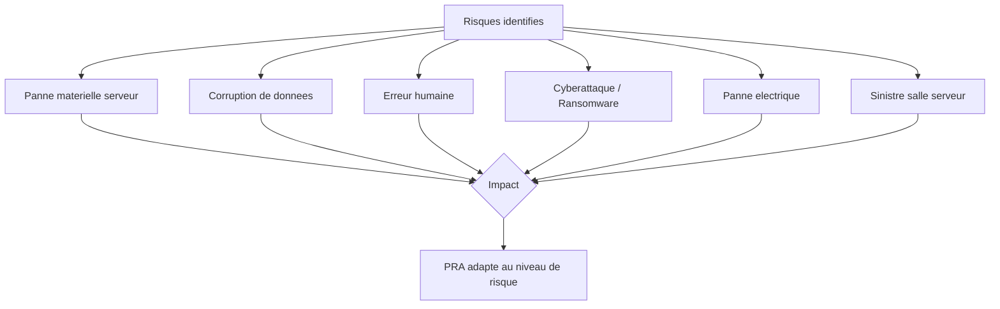

# Projet : Plan de reprise d'activite (PRA)

!!! abstract "Objectifs du projet"

    - [ ] Evaluer les risques et definir les objectifs de reprise (RTO/RPO)
    - [ ] Concevoir une strategie de sauvegarde multi-niveaux
    - [ ] Mettre en place les mecanismes de basculement
    - [ ] Rediger la documentation du PRA
    - [ ] Tester le plan de reprise

<span class="level-advanced">Avance</span>

## Contexte

La direction de TechNova exige un plan de reprise d'activite formalise. Vous devez identifier les services critiques, definir les objectifs de reprise et mettre en place les mecanismes de sauvegarde et de basculement.

## Analyse des risques

### Services critiques

| Service | Criticite | Impact de l'arret | RTO | RPO |
|---------|-----------|-------------------|-----|-----|
| Active Directory | Critique | Aucune authentification possible | 1h | 0h |
| DNS | Critique | Aucune resolution de noms | 1h | 0h |
| DHCP | Haute | Plus d'attribution d'adresses (baux existants OK) | 4h | 4h |
| Serveur de fichiers | Haute | Perte d'acces aux documents | 2h | 1h |
| Serveur web (intranet) | Moyenne | Intranet indisponible | 8h | 24h |
| Messagerie | Haute | Plus d'emails | 2h | 1h |

!!! info "Definitions"

    - **RTO** (Recovery Time Objective) : duree maximale d'indisponibilite acceptable
    - **RPO** (Recovery Point Objective) : perte de donnees maximale acceptable (en temps)

### Matrice des risques



## Strategie de sauvegarde

### Regle 3-2-1

| Principe | Implementation |
|----------|---------------|
| **3 copies** des donnees | Originale + sauvegarde locale + sauvegarde distante |
| **2 supports** differents | Disque local + stockage cloud (ou bande) |
| **1 copie** hors site | Azure Backup ou rotation de disques externes |

### Planification des sauvegardes

| Type | Frequence | Retention | Contenu |
|------|-----------|-----------|---------|
| **Complete** | Dimanche 02:00 | 4 semaines | Tout le systeme |
| **Differentielle** | Lundi-Samedi 02:00 | 1 semaine | Modifications depuis la derniere complete |
| **Etat systeme DC** | Quotidien 03:00 | 14 jours | AD DS, DNS, SYSVOL, registre |
| **Fichiers critiques** | Toutes les 4h | 7 jours | Partages de fichiers |

### Implementation

??? success "Solution - Windows Server Backup"

    ```powershell
    # Install Windows Server Backup on all servers
    Install-WindowsFeature -Name Windows-Server-Backup

    # On SRV-DC01: Configure system state backup
    $policy = New-WBPolicy
    Add-WBSystemState -Policy $policy

    # Set backup target (local disk D:)
    $target = New-WBBackupTarget -VolumePath "D:"
    Add-WBBackupTarget -Policy $policy -Target $target

    # Set schedule (daily at 03:00)
    Set-WBSchedule -Policy $policy -Schedule 03:00

    # Apply the policy
    Set-WBPolicy -Policy $policy -Force

    # On SRV-FILE01: Configure file backup
    $filePolicy = New-WBPolicy
    $fileSpec = New-WBFileSpec -FileSpec "D:\Partages"
    Add-WBFileSpec -Policy $filePolicy -FileSpec $fileSpec

    $fileTarget = New-WBBackupTarget -VolumePath "E:"
    Add-WBBackupTarget -Policy $filePolicy -Target $fileTarget

    Set-WBSchedule -Policy $filePolicy -Schedule 02:00,06:00,10:00,14:00,18:00,22:00
    Set-WBPolicy -Policy $filePolicy -Force

    # Verify backup configuration
    Get-WBPolicy | Format-List
    Get-WBSummary
    ```

??? success "Solution - Script de verification des sauvegardes"

    ```powershell
    # Check-BackupStatus.ps1
    # Verify backup status on all servers

    $servers = @("SRV-DC01", "SRV-DC02", "SRV-FILE01", "SRV-WEB01")
    $backupReport = @()

    foreach ($server in $servers) {
        try {
            $status = Invoke-Command -ComputerName $server -ScriptBlock {
                $summary = Get-WBSummary
                [PSCustomObject]@{
                    LastBackup   = $summary.LastBackupTime
                    LastResult   = $summary.LastBackupResultHR
                    NextBackup   = $summary.NextBackupTime
                    BackupTarget = (Get-WBBackupTarget (Get-WBPolicy)).Label
                }
            } -ErrorAction Stop

            $backupReport += [PSCustomObject]@{
                Server     = $server
                LastBackup = $status.LastBackup
                Result     = if ($status.LastResult -eq 0) { "Success" } else { "FAILED" }
                NextBackup = $status.NextBackup
                Status     = "Online"
            }
        }
        catch {
            $backupReport += [PSCustomObject]@{
                Server = $server; LastBackup = "N/A"
                Result = "N/A"; NextBackup = "N/A"; Status = "Offline"
            }
        }
    }

    $backupReport | Format-Table -AutoSize
    ```

## Mecanismes de basculement

### Active Directory

La redondance AD est assuree par le second controleur de domaine (SRV-DC02).

??? success "Solution - Test de basculement AD"

    ```powershell
    # Verify both DCs are operational
    Get-ADDomainController -Filter * | Select-Object Name, IPv4Address, IsGlobalCatalog

    # Verify FSMO roles
    netdom query fsmo

    # Transfer FSMO roles to DC02 (planned failover)
    Move-ADDirectoryServerOperationMasterRole -Identity "SRV-DC02" `
        -OperationMasterRole PDCEmulator, RIDMaster, InfrastructureMaster

    # Verify FSMO transfer
    netdom query fsmo

    # Simulate DC01 failure: stop the VM
    # From Hyper-V host:
    Stop-VM -Name "SRV-DC01" -Force

    # Verify authentication still works from CLI-W11
    # DNS should failover to SRV-DC02 (secondary DNS)

    # Seize remaining FSMO roles if DC01 is permanently lost
    # Move-ADDirectoryServerOperationMasterRole -Identity "SRV-DC02" `
    #     -OperationMasterRole SchemaMaster, DomainNamingMaster -Force

    # Restart DC01
    Start-VM -Name "SRV-DC01"

    # Transfer roles back to DC01
    Move-ADDirectoryServerOperationMasterRole -Identity "SRV-DC01" `
        -OperationMasterRole PDCEmulator, RIDMaster, InfrastructureMaster
    ```

### Restauration d'urgence

??? success "Solution - Procedure de restauration"

    ```powershell
    # Restore system state on a DC (requires DSRM boot)
    # 1. Restart the server in DSRM mode:
    bcdedit /set safeboot dsrepair
    Restart-Computer

    # 2. In DSRM, log in with the DSRM password

    # 3. Restore system state
    wbadmin start systemstaterecovery -version:01/15/2026-03:00 -authsysvol

    # 4. Remove DSRM boot option and restart normally
    bcdedit /deletevalue safeboot
    Restart-Computer
    ```

## Documentation du PRA

### Contenu du document

Le document PRA doit contenir :

| Section | Contenu |
|---------|---------|
| **1. Introduction** | Objectifs, perimetre, responsabilites |
| **2. Inventaire** | Serveurs, services, dependances |
| **3. Analyse de risques** | Risques, probabilites, impacts, RTO/RPO |
| **4. Strategie de sauvegarde** | Planification, retention, stockage |
| **5. Procedures de reprise** | Pas a pas pour chaque scenario de panne |
| **6. Contacts** | Liste des contacts d'urgence (IT, direction, prestataires) |
| **7. Tests** | Calendrier et resultats des tests de reprise |
| **8. Annexes** | Schemas reseau, inventaire detaille, mots de passe DSRM |

### Test du PRA

| Test | Frequence | Description |
|------|-----------|-------------|
| Verification des sauvegardes | Hebdomadaire | Script automatise de verification |
| Restauration de fichiers | Mensuelle | Restaurer des fichiers aleatoires |
| Restauration d'etat systeme | Trimestrielle | Restaurer un DC dans un lab isole |
| Basculement complet | Semestrielle | Simuler la perte du DC principal |
| Test complet du PRA | Annuelle | Simuler un sinistre complet |

## Criteres d'evaluation

| Critere | Points |
|---------|--------|
| Analyse de risques complete (RTO/RPO) | 20 |
| Strategie de sauvegarde (regle 3-2-1) | 25 |
| Procedures de reprise documentees | 25 |
| Scripts d'automatisation et de verification | 15 |
| Tests de reprise effectues et documentes | 15 |

## Points cles a retenir

- Un PRA n'a de valeur que s'il est **teste regulierement**
- La regle **3-2-1** est le minimum pour une strategie de sauvegarde fiable
- Les **RTO et RPO** doivent etre valides par la direction (impact business)
- La restauration de l'etat systeme d'un DC necessite le mode **DSRM**
- La documentation doit etre accessible **hors du systeme d'information** (impression, cloud)
- Chaque test de reprise doit etre documente avec les resultats et les axes d'amelioration

## Pour aller plus loin

- [Projet : Infrastructure PME complete](projet-pme-complete.md)
- [Projet : Migration AD](projet-migration-ad.md)
- [Strategie de sauvegarde](../../haute-disponibilite/backup/strategie-sauvegarde.md)
