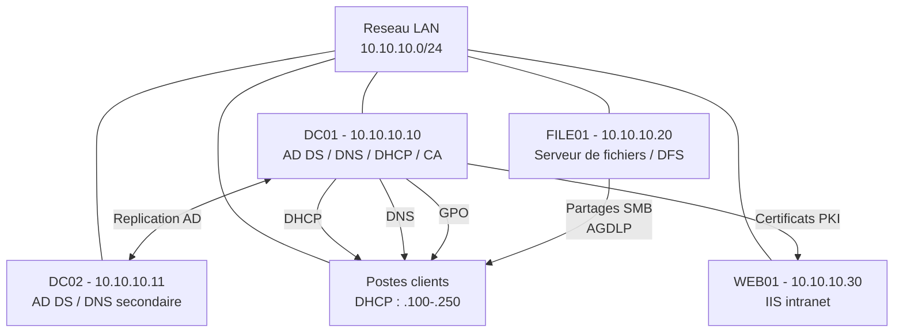

<!--
  Copyright 2026 Julien Bombled

  Licensed under the Apache License, Version 2.0 (the "License");
  you may not use this file except in compliance with the License.
  You may obtain a copy of the License at

      http://www.apache.org/licenses/LICENSE-2.0

  Unless required by applicable law or agreed to in writing, software
  distributed under the License is distributed on an "AS IS" BASIS,
  WITHOUT WARRANTIES OR CONDITIONS OF ANY KIND, either express or implied.
  See the License for the specific language governing permissions and
  limitations under the License.
-->

# Projet : Infrastructure PME complete

<span class="level-advanced">Avance</span> · Temps estime : 240 minutes

---

!!! abstract "Objectifs du projet"

    - [ ] Deployer une infrastructure Active Directory complete
    - [ ] Configurer DNS, DHCP et un serveur de fichiers
    - [ ] Mettre en place des GPO de securite et de gestion
    - [ ] Configurer la supervision de base
    - [ ] Documenter l'infrastructure deployee

<span class="level-advanced">Avance</span>

!!! example "Analogie"

    Deployer une infrastructure IT complete pour une PME, c'est comme construire et amenager
    un nouveau siege social : l'Active Directory est le registre du personnel et les badges
    d'acces, le serveur de fichiers est l'armoire commune avec des tiroirs par service, les GPO
    sont le reglement interieur affiche dans chaque bureau, et la PKI est le service de
    reprographie qui certifie l'authenticite des documents. Chaque element doit etre en place
    avant le suivant — on ne pose pas les meubles avant les murs.

## Contexte

La PME **TechNova** (50 employes, 3 sites) vous mandate pour deployer son infrastructure IT. Vous devez concevoir et mettre en place l'ensemble des services necessaires au fonctionnement de l'entreprise.

## Cahier des charges

### Organisation

| Parametre | Valeur |
|-----------|--------|
| Nom de l'entreprise | TechNova |
| Nombre d'employes | 50 |
| Services | Direction (5), Comptabilite (8), Commercial (15), Technique (12), RH (5), IT (5) |
| Serveurs | 4 serveurs Windows Server 2022 |
| Postes clients | Windows 11 (simule avec 1 VM) |

### Domaine Active Directory

| Parametre | Valeur |
|-----------|--------|
| Domaine | technova.local |
| NetBIOS | TECHNOVA |
| Niveau fonctionnel | Windows Server 2016 |
| Nombre de DC | 2 (redondance) |

### Plan reseau

| Reseau | Usage | Plage |
|--------|-------|-------|
| 10.10.10.0/24 | LAN principal | Serveurs : .10-.50 / DHCP : .100-.250 |

### Serveurs

| Serveur | IP | Roles |
|---------|-----|-------|
| DC01 | 10.10.10.10 | AD DS, DNS, DHCP, CA |
| DC02 | 10.10.10.11 | AD DS, DNS (secondaire) |
| FILE01 | 10.10.10.20 | Serveur de fichiers, DFS |
| WEB01 | 10.10.10.30 | IIS (intranet) |



## Livrables attendus

### Phase 1 : Infrastructure de base

- [ ] Deploiement de 4 VMs avec Windows Server 2022
- [ ] Configuration reseau (IP statiques, DNS, passerelle)
- [ ] Installation du domaine AD DS `technova.local`
- [ ] Promotion du DC secondaire
- [ ] Configuration DNS (zones, enregistrements, recherche inversee)
- [ ] Configuration DHCP (etendue, options, reservations)

### Phase 2 : Gestion des identites

- [ ] Structure OU refletant l'organigramme
- [ ] Creation de tous les comptes utilisateurs (via script CSV)
- [ ] Groupes globaux par service (GG_Direction, GG_Comptabilite, etc.)
- [ ] Groupes locaux de domaine pour les ressources (DL_Partage_*)
- [ ] Convention de nommage documentee

### Phase 3 : Partages de fichiers

- [ ] Structure de dossiers par service sur FILE01
- [ ] Permissions NTFS selon le modele AGDLP
- [ ] Partages SMB configures
- [ ] Dossier commun accessible a tous les employes
- [ ] Dossier direction en acces restreint

### Phase 4 : Strategies de groupe

- [ ] GPO de politique de mot de passe (12 caracteres, complexite, historique)
- [ ] GPO de verrouillage de compte (5 tentatives, 30 minutes)
- [ ] GPO de mappage des lecteurs reseau par service
- [ ] GPO de restrictions du bureau pour les utilisateurs standards
- [ ] GPO d'exclusion pour le service IT

### Phase 5 : Securite et supervision

- [ ] Installation d'une CA d'entreprise
- [ ] Configuration d'un collecteur de donnees de performance
- [ ] Mise en place du transfert d'evenements (WEF) vers DC01
- [ ] Documentation de l'infrastructure (schema reseau, plan IP, procedures)

## Criteres d'evaluation

| Critere | Points |
|---------|--------|
| Infrastructure fonctionnelle (AD, DNS, DHCP) | 25 |
| Gestion des identites (OU, utilisateurs, groupes) | 20 |
| Permissions de fichiers (AGDLP) | 15 |
| GPO fonctionnelles | 15 |
| Securite (PKI, audit) | 10 |
| Documentation et nommage coherent | 10 |
| Automatisation (scripts PowerShell) | 5 |

## Validation finale

??? success "Checklist de validation"

    ```powershell
    # 1. Verify domain controllers
    Get-ADDomainController -Filter * | Select-Object Name, IPv4Address, Site

    # 2. Verify DNS resolution
    Resolve-DnsName dc01.technova.local
    Resolve-DnsName _ldap._tcp.dc._msdcs.technova.local -Type SRV

    # 3. Verify DHCP scope
    Get-DhcpServerv4Scope | Select-Object ScopeId, Name, State

    # 4. Verify OU structure
    Get-ADOrganizationalUnit -Filter * | Select-Object Name, DistinguishedName

    # 5. Verify user count
    (Get-ADUser -Filter *).Count

    # 6. Verify file shares
    Get-SmbShare -CimSession FILE01 | Where-Object { $_.Special -eq $false }

    # 7. Verify GPOs
    Get-GPO -All | Select-Object DisplayName, GpoStatus

    # 8. Verify CA
    certutil -ca

    # 9. Test client connectivity
    Test-NetConnection dc01.technova.local -Port 389
    ```

    Resultat attendu de la validation finale (exemple) :

    ```text
    # Get-ADDomainController -Filter * | Select-Object Name, IPv4Address
    Name   IPv4Address
    ----   -----------
    DC01   10.10.10.10
    DC02   10.10.10.11

    # (Get-ADUser -Filter *).Count
    55

    # Get-DhcpServerv4Scope | Select-Object ScopeId, Name, State
    ScopeId      Name     State
    --------     ----     -----
    10.10.10.0   LAN-PME  Active
    ```

!!! warning "Pieges frequents dans ce projet"

    1. **Nommage incoerent entre les phases** : utiliser "DC01" dans le plan reseau mais
       "SRV-DC01" dans les scripts PowerShell cree des echecs de resolution DNS et de jonction
       au domaine. Choisir une convention de nommage (ici DC01, DC02, FILE01, WEB01) et s'y tenir
       rigoureusement dans tous les scripts, la documentation et les enregistrements DNS.

    2. **DHCP autorise avant la configuration de la CA** : si la CA est installee apres que le
       DHCP distribue des baux, les enregistrements DNS crees par le DHCP (updates dynamiques)
       peuvent ne pas etre signes par DNSSEC. Pour ce projet, installer AD DS et DNS en premier,
       puis DHCP, puis PKI.

    3. **Comptes de service crees comme utilisateurs standards** : les comptes de service (pour
       les taches planifiees, IIS, etc.) ne doivent pas etre dans l'OU Utilisateurs avec les
       comptes humains. Creer une OU "Service-Accounts" separee et appliquer une PSO (Fine-Grained
       Password Policy) avec un mot de passe non expirable.

    4. **GPO de mappage de lecteurs avant la creation des partages** : une GPO qui mappe
       `\\FILE01\Comptabilite` echoue silencieusement si le partage SMB n'existe pas encore.
       Verifier l'ordre de deploiement : partages avant GPO, DC avant clients.

    5. **Documentation non a jour apres les modifications** : dans ce projet d'evaluation,
       la documentation (schema reseau, plan IP, conventions de nommage) doit refleter l'etat
       final reel de l'infrastructure. Une adresse IP changee en cours de projet qui ne se
       retrouve pas dans la documentation est penalisante au meme titre qu'un service manquant.

## Pour aller plus loin

- [Projet : Migration AD](projet-migration-ad.md) pour un scenario de migration
- [Projet : Plan de reprise d'activite](projet-plan-reprise.md) pour la continuite

