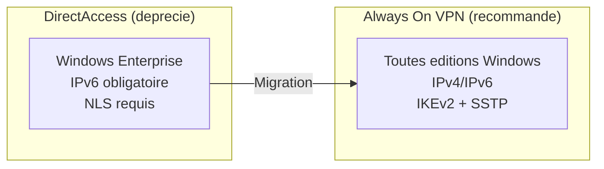
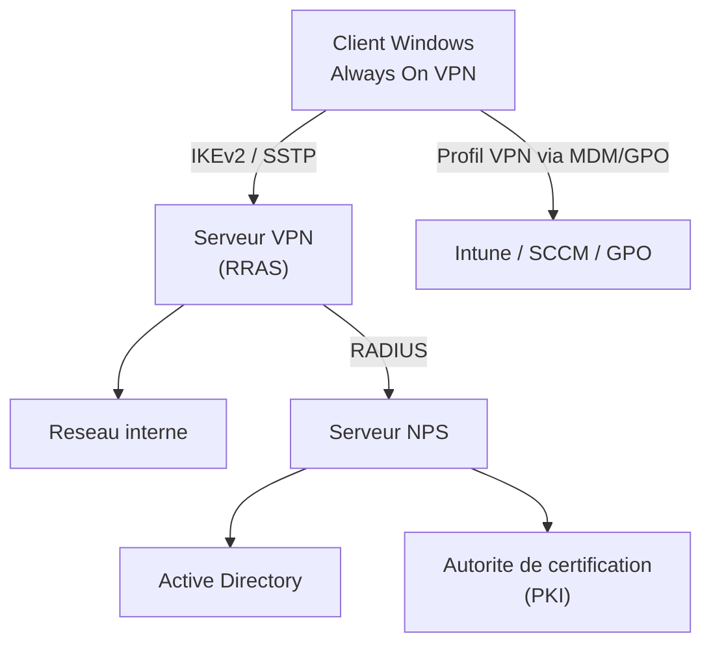
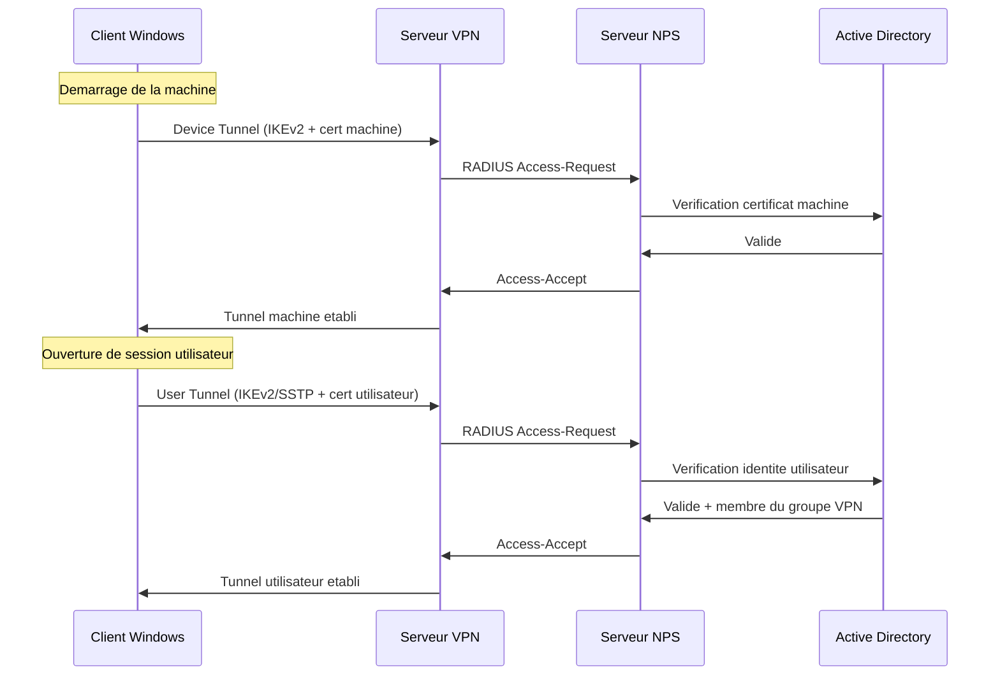
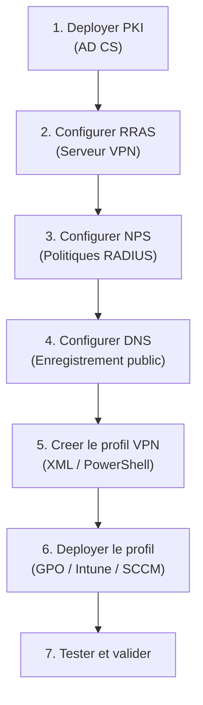

# Always On VPN

## Introduction

**Always On VPN** est la solution d'acces distant recommandee par Microsoft pour remplacer DirectAccess. Introduite avec Windows 10 version 1607 et pleinement supportee sous Windows Server 2022, Always On VPN combine les avantages du VPN traditionnel (flexibilite, compatibilite) avec ceux de DirectAccess (connexion automatique et transparente).

!!! info "Remplacement officiel de DirectAccess"

    Microsoft recommande Always On VPN pour tous les nouveaux deployements d'acces distant. Contrairement a DirectAccess, Always On VPN fonctionne avec **toutes les editions de Windows** (y compris Pro) et ne necessite pas IPv6.

---

## Comparaison avec DirectAccess

| Critere                    | DirectAccess              | Always On VPN              |
|----------------------------|---------------------------|----------------------------|
| Editions Windows client    | Enterprise uniquement     | Toutes (Pro, Enterprise)   |
| Dependance IPv6            | Obligatoire               | Non requise                |
| Protocoles VPN             | IPsec uniquement          | IKEv2, SSTP, L2TP         |
| Tunnel machine             | Oui (natif)               | Oui (IKEv2 + certificat)  |
| Tunnel utilisateur         | Oui                       | Oui                        |
| Gestion                    | GPO uniquement            | GPO, MDM, Intune, SCCM    |
| Azure AD                   | Non supporte              | Supporte (acces conditionnel) |
| Complexite infrastructure  | Elevee (IPv6, NLS, PKI)   | Moderee (RRAS, NPS, PKI)  |
| Statut                     | Maintenance               | Actif, en evolution        |



---

## Architecture

### Vue d'ensemble



### Composants de l'infrastructure

| Composant               | Role                                                       |
|-------------------------|-------------------------------------------------------------|
| **Serveur VPN (RRAS)**  | Point de terminaison VPN, accepte les connexions clients    |
| **Serveur NPS**         | Authentification RADIUS et politiques d'acces               |
| **Active Directory**    | Annuaire des comptes utilisateur et machine                 |
| **PKI (AD CS)**         | Emission des certificats machine et utilisateur             |
| **DNS**                 | Resolution du nom public du serveur VPN                     |
| **MDM / GPO**           | Distribution du profil VPN aux clients                      |

---

## Device Tunnel vs User Tunnel

Always On VPN distingue deux types de tunnels, similaires aux tunnels infrastructure et utilisateur de DirectAccess :

### Device Tunnel (tunnel machine)

| Propriete                | Detail                                                  |
|--------------------------|---------------------------------------------------------|
| Moment de creation       | Avant l'ouverture de session (au demarrage)             |
| Authentification         | Certificat machine (EAP-TLS)                            |
| Protocole                | IKEv2 uniquement                                        |
| Edition Windows          | Enterprise ou Education uniquement                      |
| Utilisation              | GPO machine, scripts de demarrage, gestion a distance   |
| Contexte                 | Compte SYSTEM                                           |

```powershell
# Example: Device tunnel VPN profile (deployed via GPO or script)
# The profile XML configures an IKEv2 tunnel with machine certificate authentication
# running in the SYSTEM context (before user logon)
```

!!! warning "Device Tunnel et editions Windows"

    Le Device Tunnel (tunnel machine) necessite Windows **Enterprise** ou **Education**. C'est la seule fonctionnalite d'Always On VPN qui impose cette restriction. Le User Tunnel fonctionne sur toutes les editions.

### User Tunnel (tunnel utilisateur)

| Propriete                | Detail                                                  |
|--------------------------|---------------------------------------------------------|
| Moment de creation       | Apres l'ouverture de session de l'utilisateur           |
| Authentification         | Certificat utilisateur (EAP-TLS) ou PEAP-MSCHAPv2      |
| Protocole                | IKEv2, SSTP, ou automatique                             |
| Edition Windows          | Toutes (y compris Pro)                                  |
| Utilisation              | Acces aux ressources reseau par l'utilisateur           |
| Contexte                 | Compte utilisateur connecte                             |



---

## Profil VPN (VPNv2 CSP)

Always On VPN utilise le **VPNv2 CSP** (Configuration Service Provider) pour configurer les parametres VPN cote client. Le profil peut etre deploye via :

- **Microsoft Intune** (MDM)
- **SCCM** (System Center Configuration Manager)
- **GPO** (script PowerShell)
- **Package de provisioning** (PPKG)

### Structure du profil XML

```xml
<!-- Always On VPN Profile (simplified example) -->
<VPNProfile>
    <NativeProfile>
        <Servers>vpn.contoso.com</Servers>
        <NativeProtocolType>IKEv2</NativeProtocolType>
        <Authentication>
            <UserMethod>Eap</UserMethod>
            <Eap>
                <!-- EAP-TLS configuration -->
            </Eap>
            <MachineMethod>Certificate</MachineMethod>
        </Authentication>
        <RoutingPolicyType>SplitTunnel</RoutingPolicyType>
    </NativeProfile>
    <AlwaysOn>true</AlwaysOn>
    <DeviceTunnel>false</DeviceTunnel>
    <RegisterDNS>true</RegisterDNS>
    <DnsSuffix>contoso.local</DnsSuffix>
    <Route>
        <Address>10.0.0.0</Address>
        <PrefixSize>8</PrefixSize>
    </Route>
    <TrafficFilter>
        <Protocol>6</Protocol>
        <LocalPortRanges>1-65535</LocalPortRanges>
        <RemotePortRanges>1-65535</RemotePortRanges>
    </TrafficFilter>
</VPNProfile>
```

### Deploiement par script PowerShell

```powershell
# Create an Always On VPN user tunnel connection
Add-VpnConnection -Name "Contoso Always On VPN" `
    -ServerAddress "vpn.contoso.com" `
    -TunnelType Ikev2 `
    -AuthenticationMethod Eap `
    -EncryptionLevel Maximum `
    -SplitTunneling $true `
    -AllUserConnection $false `
    -RememberCredential $true

# Add routes for internal subnets
Add-VpnConnectionRoute -ConnectionName "Contoso Always On VPN" `
    -DestinationPrefix "10.0.0.0/8"

# Configure DNS suffix
Set-VpnConnectionDnsConfiguration -ConnectionName "Contoso Always On VPN" `
    -DnsSuffix "contoso.local" `
    -DnsServers "10.0.1.1", "10.0.1.2"

# Enable Always On
Set-VpnConnection -Name "Contoso Always On VPN" `
    -AllUserConnection $false

# Configure the VPN to auto-trigger on DNS name resolution
Add-VpnConnectionTriggerDnsConfiguration -Name "Contoso Always On VPN" `
    -DnsSuffix "contoso.local" `
    -DnsIPAddress "10.0.1.1"
```

---

## Fonctionnalites avancees

### Filtrage du trafic (Traffic Filters)

Always On VPN peut restreindre le trafic autorise dans le tunnel :

```xml
<!-- Allow only specific traffic through the VPN tunnel -->
<TrafficFilter>
    <App>%ProgramFiles%\MyApp\app.exe</App>
    <Protocol>6</Protocol> <!-- TCP -->
    <RemotePortRanges>443</RemotePortRanges>
    <RemoteAddressRanges>10.0.1.0/24</RemoteAddressRanges>
</TrafficFilter>
```

### Declenchement automatique (Auto-Trigger)

Le VPN peut se connecter automatiquement lorsque certaines conditions sont remplies :

| Declencheur              | Description                                         |
|--------------------------|-----------------------------------------------------|
| Application              | Connexion lors du lancement d'une application        |
| Nom DNS                  | Connexion lors de la resolution d'un suffixe DNS     |
| Always On                | Connexion permanente (comme DirectAccess)            |

### Acces conditionnel Azure AD

Always On VPN s'integre avec l'acces conditionnel Azure AD pour verifier la conformite de l'appareil avant d'autoriser l'acces :

- Verification de la conformite Intune
- Exigence de MFA (authentification multifacteur)
- Restriction par emplacement ou niveau de risque

### LockDown mode

Le mode **LockDown** empeche toute connectivite reseau lorsque le VPN n'est pas connecte :

```xml
<LockDown>true</LockDown>
```

!!! tip "Securite renforcee"

    Le mode LockDown est utile pour les appareils manipulant des donnees sensibles. L'appareil ne peut acceder au reseau que via le tunnel VPN, empechant toute fuite de donnees sur un reseau non protege.

---

## Vue d'ensemble du deploiement

### Etapes principales



### Prerequis

| Composant                | Prerequis                                          |
|--------------------------|----------------------------------------------------|
| Serveur VPN              | Windows Server 2022 avec role RRAS                  |
| Serveur NPS              | Windows Server 2022 avec role NPS                   |
| PKI                      | AD CS pour les certificats machine et utilisateur    |
| DNS                      | Nom public resolvable (ex : vpn.contoso.com)        |
| Certificat serveur       | Certificat valide pour le serveur VPN                |
| Certificats clients      | Auto-enrollment via GPO ou Intune                    |
| Pare-feu perimetrique    | UDP 500, 4500 (IKEv2) ou TCP 443 (SSTP)            |

### Regles de pare-feu

```powershell
# Firewall rules for Always On VPN server
# IKEv2
New-NetFirewallRule -DisplayName "Allow IKEv2 UDP 500" `
    -Direction Inbound -Protocol UDP -LocalPort 500 -Action Allow -Profile Public
New-NetFirewallRule -DisplayName "Allow IKEv2 UDP 4500" `
    -Direction Inbound -Protocol UDP -LocalPort 4500 -Action Allow -Profile Public

# SSTP (fallback)
New-NetFirewallRule -DisplayName "Allow SSTP TCP 443" `
    -Direction Inbound -Protocol TCP -LocalPort 443 -Action Allow -Profile Public

# RADIUS (between VPN server and NPS)
New-NetFirewallRule -DisplayName "Allow RADIUS" `
    -Direction Inbound -Protocol UDP -LocalPort 1812, 1813 -Action Allow -Profile Domain
```

---

## Diagnostics

```powershell
# Check VPN connection status (on the client)
Get-VpnConnection | Select-Object Name, ServerAddress, TunnelType, ConnectionStatus

# Display detailed VPN configuration
Get-VpnConnection -Name "Contoso Always On VPN" | Format-List *

# Check RRAS service on the server
Get-Service RemoteAccess

# Display active VPN connections on the server
Get-RemoteAccessConnectionStatistics

# Check NPS authentication events
Get-WinEvent -LogName Security -FilterXPath "*[System[EventID=6272 or EventID=6273]]" -MaxEvents 10

# Test VPN connectivity from the client
Test-NetConnection -ComputerName "vpn.contoso.com" -Port 443
```

---

## Points cles a retenir

| Concept              | Detail                                                        |
|----------------------|---------------------------------------------------------------|
| Remplacement DA      | Always On VPN remplace officiellement DirectAccess            |
| Toutes editions      | User Tunnel fonctionne sur Windows Pro et Enterprise          |
| Device Tunnel        | Tunnel machine (Enterprise/Education uniquement, IKEv2)       |
| User Tunnel          | Tunnel utilisateur (toutes editions, IKEv2/SSTP)             |
| Deploiement profil   | Via GPO, Intune, SCCM ou script PowerShell                   |
| Azure AD             | Integration avec l'acces conditionnel pour la conformite      |
| Infrastructure       | RRAS + NPS + PKI + DNS                                        |

---

## Pour aller plus loin

- Configurer le serveur VPN : voir la page [Serveur VPN (RRAS)](vpn-server.md)
- Configurer NPS pour l'authentification : voir la page [NPS / RADIUS](nps-radius.md)
- Comprendre DirectAccess (historique) : voir la page [DirectAccess](directaccess.md)
