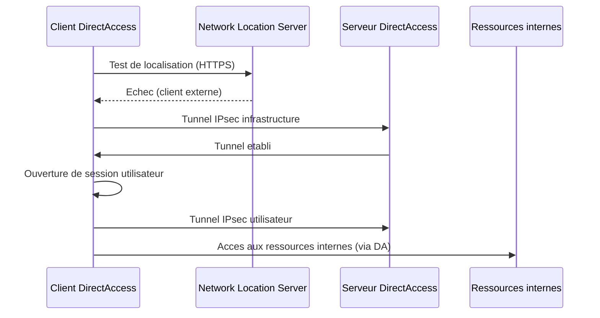
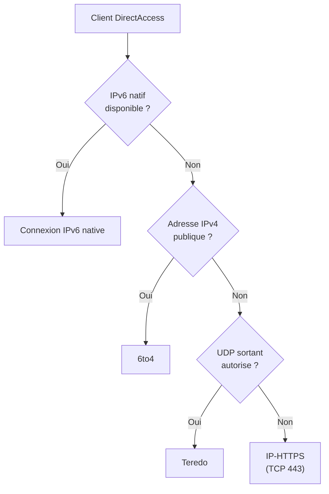

# DirectAccess

## Introduction

**DirectAccess** est une technologie d'acces distant introduite avec Windows Server 2008 R2 qui permet aux ordinateurs joints au domaine de se connecter automatiquement et de maniere transparente au reseau d'entreprise, sans intervention de l'utilisateur. Contrairement au VPN traditionnel, DirectAccess ne necessite pas de connexion manuelle : des que l'ordinateur client detecte qu'il est sur un reseau externe, le tunnel est etabli automatiquement.

!!! warning "Technologie en fin de vie"

    Microsoft considere DirectAccess comme une technologie **en fin de vie** et recommande **Always On VPN** comme successeur. DirectAccess reste disponible dans Windows Server 2022 mais ne recoit plus d'evolutions fonctionnelles.

---

!!! example "Analogie"

    DirectAccess est comparable a une **ligne telephonique directe** entre votre domicile et le bureau. Des que vous decrochez le telephone (le PC demarre), la ligne est automatiquement etablie sans avoir a composer un numero (pas de connexion manuelle). Cependant, cette ligne ne fonctionne qu'avec un modele de telephone tres specifique (Windows Enterprise), necessite un cablage complexe (IPv6, IPsec, NLS) et le fournisseur a annonce qu'il arretait la maintenance de ce type de ligne.

## Principes de fonctionnement

### Connexion transparente

DirectAccess etablit des tunnels **IPsec** bidirectionnels entre le client et le serveur DirectAccess. Ces tunnels sont crees automatiquement au demarrage de l'ordinateur, avant meme l'ouverture de session de l'utilisateur.



### Deux tunnels

| Tunnel              | Moment de creation           | Utilisation                               |
|---------------------|------------------------------|-------------------------------------------|
| Tunnel infrastructure | Au demarrage de l'ordinateur | GPO, scripts de demarrage, gestion machine |
| Tunnel utilisateur    | Apres ouverture de session   | Acces aux ressources par l'utilisateur     |

### Network Location Server (NLS)

Le **NLS** est un serveur web interne (HTTPS) que le client DirectAccess contacte pour determiner s'il se trouve sur le reseau interne ou externe :

- **NLS accessible** : le client est sur le reseau interne, DirectAccess est desactive
- **NLS inaccessible** : le client est sur un reseau externe, DirectAccess s'active

!!! danger "Disponibilite du NLS"

    Le NLS est un composant critique. S'il est inaccessible depuis le reseau interne (panne, maintenance), les clients internes activeront DirectAccess a tort, causant des problemes de connectivite. Il est imperatif d'assurer la haute disponibilite du NLS.

---

## Technologies de transition IPv6

DirectAccess repose fondamentalement sur **IPv6**. Puisque la plupart des reseaux utilisent encore IPv4, DirectAccess utilise des technologies de transition pour encapsuler le trafic IPv6 dans des paquets IPv4.

### 6to4

| Propriete      | Detail                                                |
|----------------|-------------------------------------------------------|
| Prefixe        | `2002::/16`                                           |
| Encapsulation  | IPv6 dans IPv4 (protocole 41)                         |
| Prerequis      | Adresse IPv4 publique sur le client                   |
| Inconvenient   | Ne fonctionne pas derriere un NAT                     |
| Statut         | Obsolete (RFC 7526)                                   |

### Teredo

| Propriete      | Detail                                                |
|----------------|-------------------------------------------------------|
| Prefixe        | `2001:0000::/32`                                      |
| Encapsulation  | IPv6 dans UDP/IPv4                                    |
| Prerequis      | Serveur Teredo accessible                             |
| Avantage       | Fonctionne derriere un NAT                            |
| Inconvenient   | Performance reduite, necessite un serveur relais       |
| Statut         | En fin de vie                                         |

### ISATAP (Intra-Site Automatic Tunnel Addressing Protocol)

| Propriete      | Detail                                                |
|----------------|-------------------------------------------------------|
| Utilisation    | Communication IPv6 au sein d'un reseau IPv4 interne   |
| Encapsulation  | IPv6 dans IPv4 (protocole 41)                         |
| Portee         | Intra-site uniquement                                 |
| Statut         | Obsolete                                              |

### IP-HTTPS (protocole prefere)

| Propriete      | Detail                                                |
|----------------|-------------------------------------------------------|
| Encapsulation  | IPv6 dans HTTPS (TCP 443)                             |
| Avantage       | Traverse tous les pare-feux et proxys                 |
| Prerequis      | Certificat SSL valide sur le serveur DirectAccess     |
| Utilisation    | Methode de repli par defaut quand 6to4/Teredo echouent|



!!! info "En pratique"

    La grande majorite des clients DirectAccess utilisent **IP-HTTPS** car la plupart se trouvent derriere un NAT sans acces UDP direct. IP-HTTPS est le seul protocole qui fonctionne de maniere fiable dans tous les environnements.

---

## Prerequis de deploiement

### Cote serveur

| Prerequis                      | Detail                                          |
|--------------------------------|-------------------------------------------------|
| Windows Server 2012+           | Role Acces distant avec DirectAccess             |
| Active Directory               | Domaine AD DS obligatoire                        |
| Certificats                    | PKI interne pour les certificats machine         |
| DNS                            | Enregistrements DNS internes et externes         |
| NLS                            | Serveur web HTTPS interne (haute disponibilite)  |
| Interfaces reseau              | 2 interfaces recommandees (interne + externe)    |

### Cote client

| Prerequis                      | Detail                                          |
|--------------------------------|-------------------------------------------------|
| Windows Enterprise/Education   | Les editions Pro ne sont **pas** supportees      |
| Joint au domaine               | L'ordinateur doit etre membre du domaine AD      |
| Certificat machine             | Delivre par la PKI interne                       |
| IPv6                           | Active sur l'interface (par defaut)              |

!!! warning "Limitation majeure"

    DirectAccess ne fonctionne qu'avec les editions **Enterprise** et **Education** de Windows. Cette restriction exclut de nombreuses organisations utilisant Windows Pro, ce qui a contribue a son abandon au profit d'Always On VPN.

---

## Avantages et inconvenients

### Avantages

| Avantage                        | Description                                    |
|---------------------------------|------------------------------------------------|
| Connexion transparente          | Pas d'action requise de l'utilisateur           |
| Tunnel machine                  | Gestion a distance meme sans ouverture de session|
| Gestion par GPO                 | Configuration centralisee via Active Directory  |
| Securite IPsec                  | Chiffrement et authentification robustes        |
| Toujours connecte              | Application automatique des mises a jour et GPO |

### Inconvenients

| Inconvenient                    | Description                                    |
|---------------------------------|------------------------------------------------|
| Complexite de deploiement       | PKI, IPv6, NLS, certificats : mise en place lourde |
| Dependance IPv6                 | Necessite des technologies de transition        |
| Windows Enterprise uniquement   | Exclut les editions Pro                         |
| Performance IP-HTTPS            | Encapsulation dans HTTPS = surcharge            |
| Depreciation                    | Plus d'evolution, successeur : Always On VPN    |
| NLS critique                    | Point de defaillance unique si non redonde      |
| Diagnostic complexe             | Problemes difficiles a debugger (IPv6, IPsec)   |

---

## Statut de depreciation

Microsoft a annonce que DirectAccess est en **mode maintenance** :

- **Pas de nouvelles fonctionnalites** dans les versions futures de Windows Server
- Le role reste disponible dans Windows Server 2022 pour la compatibilite
- **Always On VPN** est le remplacement officiel
- Microsoft recommande la migration vers Always On VPN pour tous les nouveaux deployements

### Comparaison DirectAccess vs Always On VPN

| Critere                | DirectAccess            | Always On VPN             |
|------------------------|-------------------------|---------------------------|
| Editions Windows       | Enterprise uniquement   | Toutes les editions       |
| Dependance IPv6        | Obligatoire             | Non requise               |
| Infrastructure         | PKI + NLS + DA Server   | RRAS + NPS (plus simple)  |
| Protocoles VPN         | IPsec uniquement        | IKEv2, SSTP, etc.         |
| Gestion                | GPO uniquement          | GPO, MDM, SCCM            |
| Azure AD               | Non supporte            | Supporte                  |
| Statut                 | Maintenance             | Actif, en evolution       |

---

## Commandes de diagnostic

```powershell
# Check DirectAccess client status (on the client machine)
Get-DAConnectionStatus

# Display DirectAccess client configuration
Get-DAClientExperienceConfiguration

# Display DirectAccess server configuration
Get-RemoteAccess

# Test IP-HTTPS connectivity
Get-NetIPHttpsState

# Check DirectAccess infrastructure tunnel
netsh interface httpstunnel show interfaces

# Display transition technology status
netsh interface 6to4 show state
netsh interface teredo show state
netsh interface isatap show state
```

Resultat :

```text
Status           : ConnectedRemotely
Substatus        : None
TunnelType       : IpHttps
ServerIPAddress  : 2002:836b:2:1::1

CorporateResources : lab.local
FriendlyName       : DirectAccess - lab.local
GslbFqdn           :
PreferLocalNames   : False

VpnStatus        : Uninstalled
DAStatus         : Installed
RoutingStatus    : Uninstalled

InterfaceName    : IPHTTPSInterface
InterfaceStatus  : IPHTTPS interface active
URL              : https://da.lab.local/IPHTTPS

6to4 State  : Default
Teredo State: Default
ISATAP State: Default
```

---

## Points cles a retenir

| Concept                  | Detail                                                      |
|--------------------------|-------------------------------------------------------------|
| Connexion transparente   | Tunnel automatique sans action de l'utilisateur             |
| IPv6 obligatoire         | Technologies de transition : 6to4, Teredo, IP-HTTPS         |
| IP-HTTPS                 | Methode de repli la plus fiable (TCP 443)                   |
| Windows Enterprise       | Les editions Pro ne sont pas supportees                     |
| NLS                      | Serveur critique pour la detection de localisation           |
| Deprecie                 | Remplace par Always On VPN pour les nouveaux deployements    |

---

!!! example "Scenario pratique"

    **Contexte** : Antoine, responsable IT, gere un environnement DirectAccess herite dans le domaine `lab.local`. Plusieurs utilisateurs se plaignent de deconnexions frequentes lorsqu'ils travaillent depuis des hotels. Il doit diagnostiquer le probleme.

    **Diagnostic** :

    ```powershell
    # Step 1: Check DirectAccess status on a client
    Get-DAConnectionStatus
    ```

    ```text
    Status    : ConnectedRemotely
    Substatus : None
    TunnelType: IpHttps
    ```

    Le client utilise IP-HTTPS, ce qui est normal derriere un pare-feu restrictif. Le probleme est intermittent.

    ```powershell
    # Step 2: Check IP-HTTPS interface details
    Get-NetIPHttpsState
    ```

    ```text
    InterfaceStatus : IPHTTPS interface active
    LastError       : 0x2AFC (timeout during TLS handshake)
    ```

    Le proxy de l'hotel interrompt les connexions TLS longues.

    **Solution** : Migrer vers Always On VPN avec SSTP (plus resilient aux proxys) ou configurer un keepalive plus agressif sur l'interface IP-HTTPS. A moyen terme, planifier la migration vers Always On VPN.

    ```powershell
    # Step 3: Document the migration plan
    Get-RemoteAccess | Select-Object DAStatus, VpnStatus
    ```

    ```text
    DAStatus  VpnStatus
    --------  ---------
    Installed Uninstalled
    ```

!!! danger "Erreurs courantes"

    - **Deployer DirectAccess pour de nouveaux projets** : DirectAccess est en fin de vie. Tout nouveau deploiement doit utiliser Always On VPN.
    - **Ignorer la haute disponibilite du NLS** : si le Network Location Server tombe, tous les clients internes activeront DirectAccess a tort, perdant leur connectivite reseau normale.
    - **Desactiver IPv6 sur les clients** : DirectAccess depend entierement d'IPv6. Desactiver IPv6 rend DirectAccess inoperant.
    - **Oublier les restrictions d'edition Windows** : DirectAccess ne fonctionne qu'avec Windows Enterprise/Education. Deployer le profil sur un poste Windows Pro ne generera aucune erreur visible, mais le tunnel ne s'etablira jamais.
    - **Ne pas surveiller les technologies de transition** : les performances de 6to4 et Teredo sont souvent mauvaises. Verifier que les clients utilisent IP-HTTPS, le protocole le plus fiable.

## Pour aller plus loin

- Decouvrir le remplacement de DirectAccess : voir la page [Always On VPN](always-on-vpn.md)
- Configurer un serveur VPN classique : voir la page [Serveur VPN (RRAS)](vpn-server.md)
- Centraliser l'authentification : voir la page [NPS / RADIUS](nps-radius.md)
