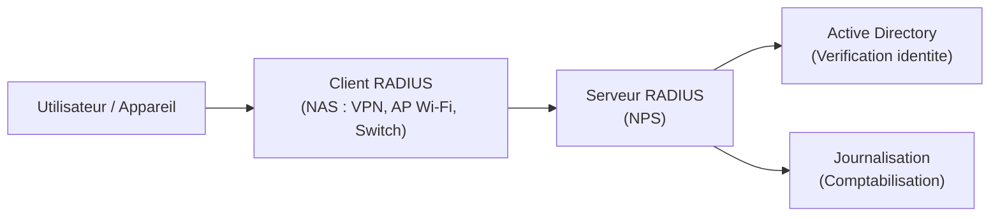
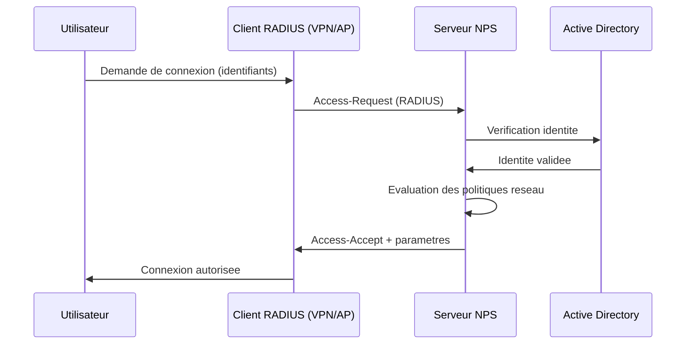
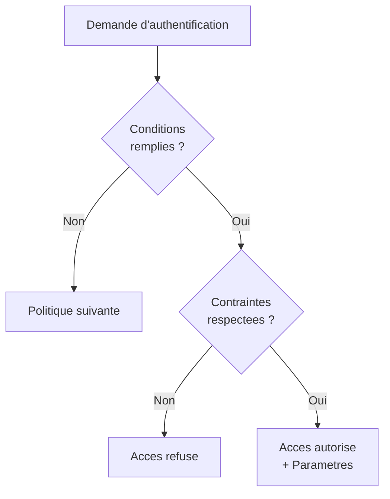
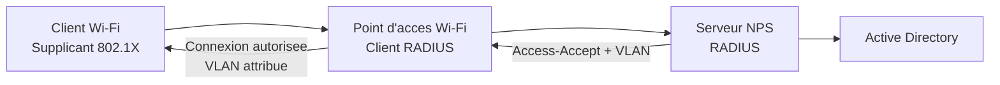

# NPS (Network Policy Server) / RADIUS

## Introduction

**NPS** (Network Policy Server) est l'implementation Microsoft du protocole **RADIUS** (Remote Authentication Dial-In User Service). NPS centralise l'authentification, l'autorisation et la comptabilisation (AAA) pour les acces reseau : connexions VPN, Wi-Fi d'entreprise, connexions filaires 802.1X et passerelles Bureau a distance.

!!! info "Role central de NPS"

    NPS est le point de decision unique pour determiner si un utilisateur ou un appareil est autorise a acceder au reseau, quelles politiques s'appliquent et quels parametres de connexion sont attribues. Cela evite de gerer l'authentification sur chaque point d'acces individuellement.

---

## Architecture RADIUS

Le protocole RADIUS fonctionne selon un modele client/serveur :



### Terminologie

| Terme              | Description                                                |
|--------------------|------------------------------------------------------------|
| **Client RADIUS**  | Equipement reseau qui relaie les demandes d'authentification (appele aussi NAS - Network Access Server) : serveur VPN, point d'acces Wi-Fi, switch 802.1X |
| **Serveur RADIUS** | Serveur NPS qui traite les demandes d'authentification     |
| **Proxy RADIUS**   | Serveur NPS qui relaie les demandes vers un autre serveur RADIUS |
| **Secret partage** | Cle secrete entre le client et le serveur RADIUS            |

### Flux d'authentification



---

## Installation de NPS

### Via PowerShell

```powershell
# Install the NPS role
Install-WindowsFeature NPAS -IncludeManagementTools

# Verify installation
Get-WindowsFeature NPAS | Select-Object Name, InstallState
```

### Via le Gestionnaire de serveur

1. **Ajouter des roles et fonctionnalites**
2. Selectionner **Services de strategie et d'acces reseau**
3. Cocher **Serveur NPS (Network Policy Server)**
4. Terminer l'installation

### Enregistrer NPS dans Active Directory

NPS doit etre enregistre dans AD pour pouvoir lire les proprietes d'acces des comptes utilisateur :

```powershell
# Register NPS server in Active Directory
netsh ras add registeredserver

# Or via the NPS console: right-click the server > "Register server in Active Directory"
```

---

## Console de gestion NPS

Ouvrir la console NPS :

```powershell
# Launch the NPS management console
nps.msc
```

### Structure de la console

| Section                             | Role                                                  |
|-------------------------------------|-------------------------------------------------------|
| **Clients et serveurs RADIUS**      | Declaration des clients RADIUS (NAS)                  |
| **Strategies**                      | Politiques de demande de connexion et politiques reseau|
| **Gestion de comptes**             | Journalisation des evenements d'authentification       |

---

## Configuration des clients RADIUS

Chaque equipement reseau (NAS) qui envoie des demandes d'authentification a NPS doit etre declare comme **client RADIUS** :

```powershell
# Add a VPN server as a RADIUS client
New-NpsRadiusClient -Name "VPN-Server-01" `
    -Address "192.168.1.50" `
    -SharedSecret "YourComplexSharedSecret123!" `
    -VendorName "Microsoft"

# Add a Wi-Fi access point as a RADIUS client
New-NpsRadiusClient -Name "AP-WiFi-Building-A" `
    -Address "192.168.2.10" `
    -SharedSecret "AnotherComplexSecret456!" `
    -VendorName "RADIUS Standard"

# List all configured RADIUS clients
Get-NpsRadiusClient | Select-Object Name, Address, Enabled
```

!!! warning "Secret partage"

    Le secret partage (shared secret) doit etre identique sur le client RADIUS (NAS) et sur le serveur NPS. Utilisez des secrets complexes et uniques pour chaque client RADIUS.

---

## Politiques de demande de connexion

Les **politiques de demande de connexion** (Connection Request Policies) determinent si NPS traite la demande localement ou la relaie a un autre serveur RADIUS (proxy).

### Politique par defaut

NPS inclut une politique par defaut qui traite toutes les demandes localement. Pour la plupart des deployements, cette politique suffit.

```powershell
# List connection request policies
netsh nps show crp
```

### Creer une politique de demande de connexion

Via la console NPS :

1. **Strategies** > **Strategies de demande de connexion**
2. Clic droit > **Nouveau**
3. Configurer les conditions (ex : type de NAS, heure d'acces)
4. Choisir : traiter localement ou rediriger vers un groupe de serveurs RADIUS

### Cas d'utilisation du proxy RADIUS

| Scenario                          | Configuration                                     |
|-----------------------------------|----------------------------------------------------|
| Entreprise multi-sites            | NPS local relaie vers un NPS central               |
| Federation (partenaires)          | Demandes relayees selon le domaine de l'utilisateur |
| Repartition de charge             | Plusieurs serveurs NPS en rotation                  |

---

## Politiques reseau (Network Policies)

Les **politiques reseau** sont le coeur de NPS. Elles definissent les conditions d'acces et les parametres attribues aux connexions autorisees.

### Structure d'une politique reseau



### Conditions

Les conditions filtrent les demandes auxquelles la politique s'applique :

| Condition                    | Exemple                                              |
|------------------------------|------------------------------------------------------|
| Groupes Windows              | Membres du groupe "VPN-Users"                        |
| Type de NAS                  | VPN, Wi-Fi, filaire (802.1X)                         |
| Adresse IP du client RADIUS  | Demandes provenant de 192.168.1.50                   |
| Heure d'acces                | Lundi-Vendredi, 8h-20h                               |
| Type de tunnel               | L2TP, SSTP, IKEv2                                    |

### Contraintes

Les contraintes definissent les exigences techniques de la connexion :

| Contrainte                   | Description                                          |
|------------------------------|------------------------------------------------------|
| Methode d'authentification   | EAP-TLS, PEAP-MSCHAPv2, etc.                        |
| Delai d'inactivite           | Deconnexion apres X minutes d'inactivite             |
| Duree de session             | Duree maximale de connexion                          |
| Type de port NAS             | VPN, Ethernet, Wi-Fi                                 |

### Parametres

Les parametres sont appliques aux connexions autorisees :

| Parametre                    | Description                                          |
|------------------------------|------------------------------------------------------|
| Attributs RADIUS             | Valeurs retournees au NAS (VLAN, filtres IP, etc.)   |
| Filtrage IP                  | Restriction des flux autorises                       |
| Chiffrement                  | Niveau de chiffrement requis                         |
| Routage                      | Configuration du routage pour le client              |

---

## Exemple : politique VPN

### Creer une politique pour les utilisateurs VPN

Via la console NPS :

1. **Strategies** > **Strategies reseau** > **Nouveau**
2. **Nom** : "VPN Access - Domain Users"
3. **Conditions** :
    - Groupes Windows : "VPN-Users"
    - Type de port NAS : "Virtual (VPN)"
4. **Autorisation** : Accorder l'acces
5. **Contraintes** :
    - Methode d'authentification : EAP > EAP-TLS (certificat)
    - Ou PEAP > MSCHAPv2 (mot de passe)
6. **Parametres** :
    - Chiffrement : Maximum
    - Attributs RADIUS : selon besoins

### Equivalent PowerShell (partiel)

```powershell
# NPS policy management is limited in PowerShell
# Most configuration is done via the NPS console (nps.msc) or via netsh

# Export NPS configuration (for backup or replication)
Export-NpsConfiguration -Path "C:\Backup\nps-config.xml"

# Import NPS configuration on another server
Import-NpsConfiguration -Path "C:\Backup\nps-config.xml"
```

---

## Exemple : politique Wi-Fi 802.1X

### Architecture Wi-Fi avec NPS



### Politique Wi-Fi

1. **Conditions** :
    - Groupes Windows : "WiFi-Corp-Users"
    - Type de port NAS : "Wireless - IEEE 802.11"
2. **Contraintes** :
    - Methode d'authentification : PEAP > EAP-TLS
3. **Parametres** :
    - Attribut RADIUS "Tunnel-Pvt-Group-ID" : ID du VLAN (ex : 10)
    - Attribut "Tunnel-Type" : VLAN
    - Attribut "Tunnel-Medium-Type" : 802

---

## Haute disponibilite NPS

### Replication de la configuration

NPS ne dispose pas de mecanisme de replication natif. La haute disponibilite est assuree en repliquant manuellement la configuration :

```powershell
# Export NPS configuration from the primary server
Export-NpsConfiguration -Path "C:\Backup\nps-config.xml"

# Copy to the secondary server and import
# On the secondary NPS server:
Import-NpsConfiguration -Path "C:\Backup\nps-config.xml"
```

### Configuration des clients RADIUS pour la haute disponibilite

Sur chaque equipement NAS (VPN, AP Wi-Fi), configurer deux serveurs RADIUS :

| Parametre          | Serveur primaire     | Serveur secondaire    |
|--------------------|----------------------|-----------------------|
| Adresse            | 192.168.1.50         | 192.168.1.51          |
| Port               | 1812 (auth), 1813 (acct) | 1812, 1813        |
| Secret partage     | (identique)          | (identique)           |
| Priorite           | Primaire              | Secondaire (failover) |

---

## Journalisation et comptabilisation

NPS peut journaliser les evenements d'authentification dans un fichier local ou dans une base SQL Server.

### Journalisation fichier

```powershell
# Configure NPS accounting to log to a local file
# Via NPS console: Accounting > Configure Accounting
# Select "Log to a text file on the local computer"

# Default log location
# %SystemRoot%\System32\LogFiles\
```

### Journalisation SQL

Pour les environnements a fort volume, NPS peut envoyer les logs vers une base SQL Server, permettant des requetes d'audit avancees.

### Evenements Windows

```powershell
# View NPS authentication events in the Security log
Get-WinEvent -LogName Security -FilterXPath "*[System[EventID=6272 or EventID=6273]]" -MaxEvents 20 |
    Select-Object TimeCreated, Id, Message

# Event ID 6272: Network Policy Server granted access
# Event ID 6273: Network Policy Server denied access
```

---

## Ports RADIUS

| Port     | Protocole | Utilisation                    |
|----------|-----------|--------------------------------|
| UDP 1812 | RADIUS    | Authentification               |
| UDP 1813 | RADIUS    | Comptabilisation (Accounting)  |
| UDP 1645 | RADIUS    | Authentification (ancien port) |
| UDP 1646 | RADIUS    | Comptabilisation (ancien port) |

```powershell
# Firewall rules for NPS (RADIUS) server
New-NetFirewallRule -DisplayName "Allow RADIUS Auth" `
    -Direction Inbound -Protocol UDP -LocalPort 1812 -Action Allow -Profile Domain

New-NetFirewallRule -DisplayName "Allow RADIUS Accounting" `
    -Direction Inbound -Protocol UDP -LocalPort 1813 -Action Allow -Profile Domain
```

---

## Points cles a retenir

| Concept                     | Detail                                                    |
|-----------------------------|-----------------------------------------------------------|
| NPS = RADIUS Microsoft      | Authentification, autorisation, comptabilisation (AAA)    |
| Client RADIUS               | Equipement NAS (VPN, AP Wi-Fi, switch) declare dans NPS   |
| Politique reseau             | Conditions + Contraintes + Parametres = decision d'acces  |
| Methodes d'authentification  | EAP-TLS (certificat) ou PEAP-MSCHAPv2 (mot de passe)     |
| Haute disponibilite          | Export/Import de la configuration entre serveurs NPS       |
| Journalisation               | Fichier local ou SQL Server pour l'audit                  |

---

## Pour aller plus loin

- Configurer un serveur VPN avec NPS : voir la page [Serveur VPN (RRAS)](vpn-server.md)
- Deployer Always On VPN avec NPS : voir la page [Always On VPN](always-on-vpn.md)
- Comprendre DirectAccess : voir la page [DirectAccess](directaccess.md)
