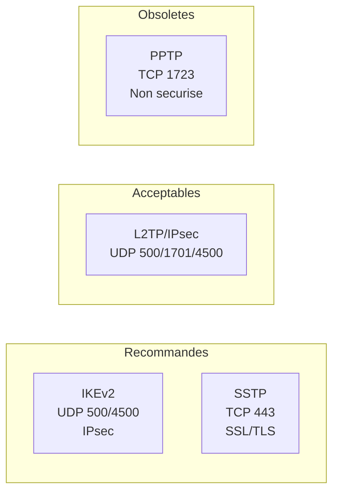
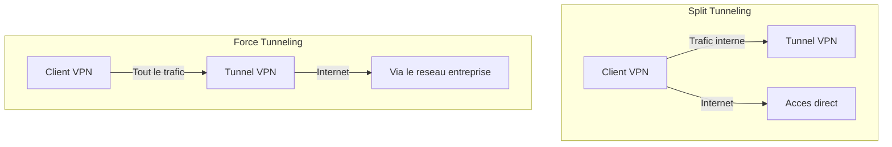

# Serveur VPN (RRAS)

## Introduction

Le role **RRAS** (Routing and Remote Access Service) de Windows Server 2022 permet de deployer un serveur VPN qui offre un acces distant securise aux ressources du reseau d'entreprise. RRAS prend en charge plusieurs protocoles VPN, chacun avec ses propres caracteristiques de securite et de compatibilite.

!!! info "Cas d'utilisation"

    Un serveur VPN RRAS est adapte pour :

    - Les travailleurs a distance qui doivent acceder au reseau interne
    - La connexion securisee de sites distants (VPN site-a-site)
    - L'acces aux ressources internes depuis des reseaux non fiables

---

!!! example "Analogie"

    Un serveur VPN fonctionne comme un **tunnel prive creuse sous une route publique**. Imaginez que vos donnees sont un vehicule blinde : au lieu de circuler a decouvert sur l'autoroute (Internet), le vehicule emprunte un souterrain securise (le tunnel VPN) qui relie directement votre domicile au bureau. Personne sur l'autoroute ne peut voir ni intercepter ce qui circule dans le tunnel.

## Protocoles VPN disponibles

Windows Server 2022 prend en charge les protocoles VPN suivants :

| Protocole     | Port(s)                  | Chiffrement          | Traverse NAT | Recommandation          |
|---------------|--------------------------|----------------------|--------------|-------------------------|
| **IKEv2**     | UDP 500, 4500            | IPsec                | Oui          | Recommande              |
| **SSTP**      | TCP 443                  | SSL/TLS              | Oui          | Recommande (pare-feux)  |
| **L2TP/IPsec**| UDP 500, 1701, 4500      | IPsec                | Oui (NAT-T)  | Acceptable              |
| **PPTP**      | TCP 1723 + GRE (IP 47)  | MPPE (faible)        | Problematique| Obsolete, a eviter      |



### IKEv2 (recommande)

- Protocole le plus moderne et le plus performant
- Supporte **MOBIKE** : reconnexion automatique en cas de changement de reseau (Wi-Fi vers 4G)
- Necessite un certificat serveur
- Ideal pour les appareils mobiles

### SSTP (recommande derriere pare-feux)

- Utilise le port TCP 443 (HTTPS) : traverse tous les pare-feux et proxys
- Necessite un certificat SSL valide
- Fonctionne uniquement sur les clients Windows
- Ideal lorsque les ports UDP sont bloques

### L2TP/IPsec

- Chiffrement robuste via IPsec
- Peut etre bloque par certains NAT mal configures
- Supporte l'authentification par cle pre-partagee ou certificat

!!! danger "PPTP"

    Le protocole PPTP est considere comme **non securise**. Son chiffrement MPPE est vulnerable et ne doit plus etre utilise dans un environnement de production.

---

## Installation du role RRAS

### Via PowerShell

```powershell
# Install the Remote Access role with VPN feature
Install-WindowsFeature RemoteAccess -IncludeManagementTools
Install-WindowsFeature DirectAccess-VPN -IncludeManagementTools
Install-WindowsFeature Routing -IncludeManagementTools

# Verify installation
Get-WindowsFeature RemoteAccess, DirectAccess-VPN, Routing |
    Select-Object Name, InstallState
```

Resultat :

```text
Name                InstallState
----                ------------
RemoteAccess           Installed
DirectAccess-VPN       Installed
Routing                Installed
```

### Via le Gestionnaire de serveur

1. **Gestionnaire de serveur** > **Ajouter des roles et fonctionnalites**
2. Selectionner **Acces a distance**
3. Cocher **DirectAccess et VPN (RAS)**
4. Terminer l'installation

---

## Configuration du serveur VPN

### Configuration initiale via PowerShell

```powershell
# Install and configure RRAS for VPN access
Install-RemoteAccess -VpnType Vpn

# Verify RRAS status
Get-RemoteAccess | Select-Object VpnStatus, VpnS2SStatus
```

Resultat :

```text
VpnStatus  VpnS2SStatus
---------  ------------
Installed  Uninstalled
```

### Configuration via la console RRAS

1. Ouvrir **rrasmgmt.msc** (console Routage et acces distant)
2. Clic droit sur le serveur > **Configurer et activer le routage et l'acces distant**
3. Selectionner **Acces a distance (connexion d'acces a distance ou VPN)**
4. Cocher **VPN**
5. Selectionner l'interface reseau connectee a Internet
6. Configurer l'attribution d'adresses (pool statique ou DHCP)
7. Configurer l'authentification (RADIUS ou locale)

### Configurer le pool d'adresses IP

```powershell
# Configure a static IP address pool for VPN clients
# This must be done through the RRAS console or netsh
netsh ras ip set addrassign method = pool

# Add an IP address range for VPN clients
netsh ras ip add range from = 10.0.100.1 to = 10.0.100.50
```

---

## Configuration SSTP

SSTP necessite un **certificat SSL** valide dont le nom correspond au nom DNS public du serveur VPN.

### Prerequis

- Un certificat SSL valide (emis par une CA publique ou interne)
- Le nom DNS public (ex : `vpn.contoso.com`) doit correspondre au SAN ou CN du certificat
- Le port TCP 443 doit etre accessible depuis Internet

### Installer le certificat et configurer SSTP

```powershell
# List certificates in the Local Machine store
Get-ChildItem Cert:\LocalMachine\My | Select-Object Subject, Thumbprint, NotAfter

# Bind the certificate to SSTP (using the certificate thumbprint)
$thumbprint = "AABBCCDD1122334455667788"
netsh http add sslcert ipport=0.0.0.0:443 certhash=$thumbprint appid="{ba195980-cd49-458b-9e23-c84ee0adcd75}"

# Alternatively, configure via RRAS console:
# Properties > Security > SSL Certificate Binding
```

Resultat :

```text
Subject                         Thumbprint                               NotAfter
-------                         ----------                               --------
CN=vpn.lab.local                AABBCCDD11223344556677889900AABBCCDD1122  01/06/2027 00:00:00
CN=SRV-01.lab.local             1122334455667788990011223344556677889900  15/03/2027 00:00:00

SSL Certificate successfully added
```

### Regles de pare-feu pour SSTP

```powershell
# Allow SSTP traffic (TCP 443)
New-NetFirewallRule -DisplayName "Allow SSTP VPN" `
    -Direction Inbound `
    -Protocol TCP `
    -LocalPort 443 `
    -Action Allow `
    -Profile Public
```

---

## Configuration IKEv2

### Prerequis

- Un certificat machine valide sur le serveur VPN
- Les ports UDP 500 et 4500 ouverts sur le pare-feu perimetrique

### Regles de pare-feu pour IKEv2

```powershell
# Allow IKEv2 traffic
New-NetFirewallRule -DisplayName "Allow IKEv2 VPN UDP 500" `
    -Direction Inbound `
    -Protocol UDP `
    -LocalPort 500 `
    -Action Allow `
    -Profile Public

New-NetFirewallRule -DisplayName "Allow IKEv2 VPN UDP 4500" `
    -Direction Inbound `
    -Protocol UDP `
    -LocalPort 4500 `
    -Action Allow `
    -Profile Public
```

### Configurer les parametres de securite IKEv2

```powershell
# Configure IKEv2 security settings via the RRAS console
# Or via registry for advanced tuning

# Set IKEv2 idle timeout (in seconds, default: 300)
Set-VpnServerConfiguration -IdleDisconnectSeconds 300

# Set maximum number of IKEv2 connections
Set-VpnServerConfiguration -Ikev2Ports 50
```

---

## Configuration L2TP/IPsec

### Avec cle pre-partagee (PSK)

```powershell
# Configure the pre-shared key for L2TP/IPsec
# Via the RRAS console: Properties > Security > "Allow custom IPsec policy for L2TP/IKEv2 connection"
# Set the pre-shared key value

# Or via registry
Set-ItemProperty -Path "HKLM:\SYSTEM\CurrentControlSet\Services\RemoteAccess\Parameters" `
    -Name "L2tpPsk" -Value "YourSecurePreSharedKey"
```

### Regles de pare-feu pour L2TP/IPsec

```powershell
# Allow L2TP/IPsec traffic
New-NetFirewallRule -DisplayName "Allow L2TP VPN" `
    -Direction Inbound `
    -Protocol UDP `
    -LocalPort 500, 1701, 4500 `
    -Action Allow `
    -Profile Public
```

!!! tip "Certificats vs cle pre-partagee"

    L'utilisation de certificats est toujours preferable a une cle pre-partagee. La PSK est partagee entre tous les clients et le serveur, ce qui pose un risque en cas de compromission.

---

## Configuration du client VPN

### Via PowerShell (Windows 10/11)

```powershell
# Create a VPN connection using IKEv2
Add-VpnConnection -Name "VPN Entreprise" `
    -ServerAddress "vpn.contoso.com" `
    -TunnelType Ikev2 `
    -AuthenticationMethod MachineCertificate `
    -EncryptionLevel Maximum

# Create a VPN connection using SSTP
Add-VpnConnection -Name "VPN Entreprise SSTP" `
    -ServerAddress "vpn.contoso.com" `
    -TunnelType Sstp `
    -AuthenticationMethod MSChapv2 `
    -EncryptionLevel Required

# Create a VPN connection using L2TP/IPsec with PSK
Add-VpnConnection -Name "VPN Entreprise L2TP" `
    -ServerAddress "vpn.contoso.com" `
    -TunnelType L2tp `
    -L2tpPsk "YourSecurePreSharedKey" `
    -AuthenticationMethod MSChapv2 `
    -EncryptionLevel Required

# Configure split tunneling (only route internal traffic through VPN)
Set-VpnConnection -Name "VPN Entreprise" -SplitTunneling $true
Add-VpnConnectionRoute -ConnectionName "VPN Entreprise" -DestinationPrefix "10.0.0.0/8"
```

### Split tunneling vs Force tunneling

| Mode              | Description                                              | Usage                          |
|-------------------|----------------------------------------------------------|--------------------------------|
| Split tunneling   | Seul le trafic interne passe par le VPN                  | Performance optimale           |
| Force tunneling   | Tout le trafic passe par le VPN                          | Securite maximale              |



---

## Authentification

### Methodes d'authentification

| Methode        | Securite  | Description                                       |
|----------------|-----------|---------------------------------------------------|
| EAP-TLS        | Elevee    | Authentification par certificat (utilisateur/machine) |
| PEAP-MSCHAPv2  | Moyenne   | Mot de passe protege par TLS                       |
| MSCHAPv2       | Faible    | Mot de passe (uniquement via SSTP/L2TP)            |
| Certificat machine | Elevee | Authentification au niveau machine (IKEv2)         |

!!! tip "Recommandation"

    Utiliser **EAP-TLS** avec des certificats utilisateur pour la meilleure securite, ou **PEAP-MSCHAPv2** avec NPS comme solution intermediaire.

### Integration avec NPS (RADIUS)

Pour centraliser l'authentification et appliquer des politiques d'acces, il est recommande de coupler le serveur VPN avec un serveur **NPS** (Network Policy Server) :

```powershell
# Configure RRAS to use RADIUS for authentication
# This is typically done via the RRAS console:
# Properties > Security > Authentication provider: RADIUS Authentication
# Add the NPS server address and shared secret
```

---

## Surveillance et diagnostics

```powershell
# Display active VPN connections
Get-RemoteAccessConnectionStatistics

# Display VPN server status
Get-RemoteAccess

# Check RRAS service status
Get-Service RemoteAccess | Select-Object Name, Status

# Display RRAS event log entries
Get-WinEvent -LogName "Application" -FilterXPath "*[System[Provider[@Name='RemoteAccess']]]" -MaxEvents 20
```

Resultat :

```text
ClientIPAddress  UserName           ConnectionType  ConnectionDuration
---------------  --------           --------------  ------------------
10.0.100.3       LAB\jdupont        Ikev2           01:23:45
10.0.100.7       LAB\mmartin        Sstp            00:45:12

Name          Status
----          ------
RemoteAccess  Running
```

---

## Points cles a retenir

| Concept              | Detail                                                        |
|----------------------|---------------------------------------------------------------|
| Protocoles           | IKEv2 et SSTP recommandes, PPTP a proscrire                  |
| SSTP                 | TCP 443, traverse les pare-feux, necessite certificat SSL     |
| IKEv2                | UDP 500/4500, MOBIKE (reconnexion mobile), certificat requis  |
| Split tunneling      | Seul le trafic interne emprunte le VPN                        |
| Authentification     | EAP-TLS (certificat) prefere, NPS pour les politiques         |
| Pool IP              | Definir un pool d'adresses dedie aux clients VPN              |

---

!!! example "Scenario pratique"

    **Contexte** : Pierre, administrateur systeme chez une PME, doit deployer un serveur VPN (`SRV-VPN01`, 10.0.0.50) pour permettre aux commerciaux de se connecter au reseau `lab.local` depuis l'exterieur. Les commerciaux sont derriere des pare-feux restrictifs qui bloquent tout sauf le port 443.

    **Solution** : Deployer SSTP (port TCP 443) comme protocole VPN principal.

    ```powershell
    # Step 1: Install the RRAS role
    Install-WindowsFeature RemoteAccess, DirectAccess-VPN -IncludeManagementTools
    Install-RemoteAccess -VpnType Vpn

    # Step 2: Configure the VPN IP pool
    netsh ras ip set addrassign method = pool
    netsh ras ip add range from = 10.0.100.1 to = 10.0.100.25

    # Step 3: Open the firewall for SSTP
    New-NetFirewallRule -DisplayName "Allow SSTP VPN" `
        -Direction Inbound -Protocol TCP -LocalPort 443 `
        -Action Allow -Profile Public

    # Step 4: Verify VPN service
    Get-RemoteAccess | Select-Object VpnStatus
    Get-Service RemoteAccess | Select-Object Name, Status
    ```

    ```text
    VpnStatus
    ---------
    Installed

    Name          Status
    ----          ------
    RemoteAccess  Running
    ```

    ```powershell
    # Step 5: Create client VPN profile (on a commercial's laptop)
    Add-VpnConnection -Name "VPN Lab" `
        -ServerAddress "vpn.lab.local" `
        -TunnelType Sstp `
        -AuthenticationMethod MSChapv2 `
        -EncryptionLevel Required
    ```

    Les commerciaux peuvent desormais se connecter au VPN meme derriere des pare-feux restrictifs.

!!! danger "Erreurs courantes"

    - **Utiliser PPTP en production** : le protocole PPTP est obsolete et son chiffrement MPPE est vulnerable. Toujours utiliser IKEv2 ou SSTP.
    - **Oublier d'ouvrir les ports sur le pare-feu perimetrique** : le serveur VPN doit etre accessible depuis Internet. Verifier que les ports UDP 500/4500 (IKEv2) ou TCP 443 (SSTP) sont ouverts.
    - **Ne pas configurer de pool d'adresses IP** : sans pool IP, les clients VPN ne recevront pas d'adresse et la connexion echouera.
    - **Utiliser un certificat auto-signe pour SSTP** : les clients ne feront pas confiance au certificat et la connexion echouera. Utiliser un certificat emis par une CA reconnue.
    - **Oublier le split tunneling** : sans split tunneling, tout le trafic Internet des clients passe par le VPN, surchargeant la bande passante du serveur.

## Pour aller plus loin

- Centraliser l'authentification VPN : voir la page [NPS / RADIUS](nps-radius.md)
- Decouvrir Always On VPN : voir la page [Always On VPN](always-on-vpn.md)
- Comprendre DirectAccess (historique) : voir la page [DirectAccess](directaccess.md)
