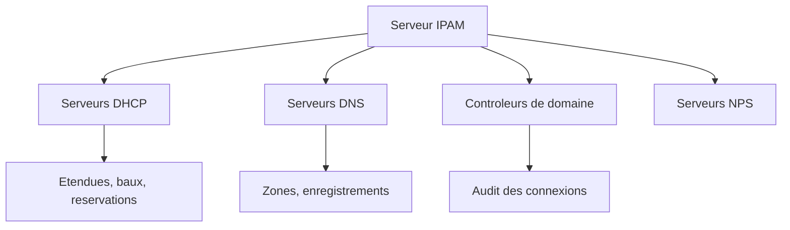

# IPAM (IP Address Management)

## Introduction

**IPAM** (IP Address Management) est un role Windows Server qui fournit une plateforme centralisee pour la decouverte, la surveillance et la gestion de l'espace d'adressage IP dans un reseau d'entreprise. IPAM s'integre nativement avec les serveurs DHCP et DNS de l'infrastructure Windows.

!!! info "Pourquoi IPAM ?"

    Dans les grandes infrastructures, la gestion des adresses IP via des feuilles de calcul devient vite ingerable. IPAM offre une vue consolidee de tous les blocs d'adresses, etendues DHCP et zones DNS, avec des fonctionnalites d'audit et de suivi.

---

!!! example "Analogie"

    IPAM est comme le **registre centralisee d'un gestionnaire immobilier** qui possede des dizaines d'immeubles. Au lieu de tenir un carnet par batiment (une feuille de calcul par sous-reseau), le gestionnaire utilise un systeme unique qui repertorie tous les appartements (adresses IP), sait lesquels sont occupes (baux DHCP), par qui (audit), et declenche une alerte quand un immeuble est presque plein (seuil de saturation DHCP).

## Fonctionnalites principales

| Fonctionnalite                | Description                                              |
|-------------------------------|----------------------------------------------------------|
| **Decouverte de l'infrastructure** | Detection automatique des serveurs DHCP et DNS       |
| **Gestion de l'espace d'adressage** | Blocs IP, sous-reseaux, plages, adresses individuelles |
| **Surveillance DHCP**         | Utilisation des etendues, baux actifs, alertes de saturation |
| **Surveillance DNS**          | Zones, enregistrements, etat des serveurs                |
| **Audit et suivi**            | Historique des adresses IP, baux DHCP, connexions         |
| **Controle d'acces base sur les roles** | RBAC granulaire pour la delegation              |



---

## Architecture

### Composants

| Composant               | Role                                                      |
|-------------------------|-----------------------------------------------------------|
| **Serveur IPAM**        | Serveur central executant le role IPAM                    |
| **Base de donnees IPAM**| Windows Internal Database (WID) ou SQL Server             |
| **Serveurs geres**      | Serveurs DHCP/DNS decouverts et geres par IPAM            |
| **Console IPAM**        | Interface graphique (Server Manager) ou PowerShell        |

### Topologies de deploiement

| Topologie            | Description                                              |
|----------------------|----------------------------------------------------------|
| **Centralise**       | Un seul serveur IPAM pour toute l'infrastructure         |
| **Distribue**        | Un serveur IPAM par site ou par foret AD                 |

!!! warning "Limitations"

    - IPAM ne peut **pas** etre installe sur un controleur de domaine
    - Un serveur IPAM gere une seule foret Active Directory
    - IPAM ne doit pas etre installe sur un serveur DHCP (conflit possible)
    - La base WID est limitee : SQL Server est recommande pour les grandes infrastructures

---

## Installation

### Via PowerShell

```powershell
# Install the IPAM feature
Install-WindowsFeature IPAM -IncludeManagementTools

# Verify installation
Get-WindowsFeature IPAM | Select-Object Name, InstallState
```

Resultat :

```text
Name InstallState
---- ------------
IPAM    Installed
```

### Provisionnement IPAM

Apres l'installation du role, IPAM doit etre provisionne pour configurer la base de donnees et les parametres initiaux :

```powershell
# Provision IPAM with Windows Internal Database (WID)
Invoke-IpamServerProvisioning -WidSchemaPath "C:\Windows\System32\ipam\Database"

# Or provision IPAM with Group Policy Based provisioning
Invoke-IpamGpoProvisioning -Domain "contoso.local" `
    -GpoPrefixName "IPAM" `
    -DelegatedGpoUser "CONTOSO\IPAMAdmin" `
    -IpamServerFqdn "ipam.contoso.local"
```

### Configuration via l'assistant (recommande pour la premiere fois)

1. Ouvrir le **Gestionnaire de serveur**
2. Cliquer sur **IPAM** dans le volet de navigation
3. Suivre les etapes de l'assistant :
    - **Etape 1** : Provisionner le serveur IPAM
    - **Etape 2** : Configurer la decouverte des serveurs
    - **Etape 3** : Demarrer la decouverte
    - **Etape 4** : Selectionner les serveurs a gerer
    - **Etape 5** : Recuperer les donnees des serveurs geres

---

## Decouverte de l'infrastructure

### Configurer la decouverte automatique

```powershell
# Configure IPAM to discover servers in the domain
Set-IpamDiscoveryDomain -Name "lab.local" -DiscoverDc $true -DiscoverDhcp $true -DiscoverDns $true

# Start a manual discovery scan
Invoke-IpamServerDiscovery

# Display discovered servers
Get-IpamServerInventory | Select-Object ServerName, ServerType, ManageabilityStatus |
    Format-Table -AutoSize
```

Resultat :

```text
ServerName              ServerType  ManageabilityStatus
----------              ----------  -------------------
DC-01.lab.local         DC          Unspecified
SRV-DHCP01.lab.local    DHCP        Unspecified
SRV-DNS01.lab.local     DNS         Unspecified
```

### Approuver les serveurs decouverts

Apres la decouverte, les serveurs doivent etre approuves pour la gestion :

```powershell
# Set a discovered server to "Managed" state
Set-IpamServerInventory -ServerName "SRV-DHCP01.lab.local" -ManageabilityStatus Managed
Set-IpamServerInventory -ServerName "SRV-DNS01.lab.local" -ManageabilityStatus Managed

# Verify managed servers
Get-IpamServerInventory | Where-Object ManageabilityStatus -eq "Managed"
```

Resultat :

```text
ServerName              ServerType  ManageabilityStatus
----------              ----------  -------------------
SRV-DHCP01.lab.local    DHCP        Managed
SRV-DNS01.lab.local     DNS         Managed
```

### Appliquer les GPO d'acces

IPAM utilise des GPO pour obtenir les permissions necessaires sur les serveurs geres :

```powershell
# Apply IPAM GPOs to managed servers (if using GPO-based provisioning)
Invoke-IpamGpoProvisioning -Domain "contoso.local" `
    -GpoPrefixName "IPAM" `
    -DelegatedGpoUser "CONTOSO\IPAMAdmin" `
    -IpamServerFqdn "ipam.contoso.local"

# Force GPO update on managed servers
Invoke-Command -ComputerName "DHCP01", "DNS01" -ScriptBlock {
    gpupdate /force
}
```

---

## Gestion de l'espace d'adressage

### Blocs d'adresses IP

Les blocs d'adresses representent les allocations de haut niveau :

```powershell
# Add a top-level IP address block
Add-IpamBlock -NetworkId "10.0.0.0/8" `
    -StartIPAddress "10.0.0.0" `
    -EndIPAddress "10.255.255.255" `
    -Description "Corporate Network"

# Add a subnet block
Add-IpamSubnet -NetworkId "10.0.1.0/24" `
    -Name "Server VLAN" `
    -Description "Production servers subnet"

# List all IP address blocks
Get-IpamBlock | Select-Object NetworkId, StartIPAddress, EndIPAddress, Description
```

Resultat :

```text
NetworkId    StartIPAddress EndIPAddress    Description
---------    -------------- ------------   -----------
10.0.0.0/8   10.0.0.0      10.255.255.255 Corporate Network
```

### Plages d'adresses IP

```powershell
# Add an IP address range
Add-IpamRange -NetworkId "10.0.1.0/24" `
    -StartIPAddress "10.0.1.1" `
    -EndIPAddress "10.0.1.254" `
    -Description "Server subnet range" `
    -ManagedByService "IPAM"

# List all IP address ranges with utilization
Get-IpamRange | Select-Object NetworkId, StartIPAddress, EndIPAddress, PercentageUtilized |
    Format-Table -AutoSize
```

### Adresses IP individuelles

```powershell
# Add a static IP address entry
Add-IpamAddress -IpAddress "10.0.1.10" `
    -Description "DC01 - Domain Controller" `
    -DeviceName "DC01" `
    -ManagedByService "IPAM"

# Find all IP addresses in a range
Get-IpamAddress | Where-Object {
    $_.IpAddress -like "10.0.1.*"
} | Select-Object IpAddress, Description, DeviceName
```

---

## Integration DHCP

IPAM collecte et affiche les donnees des serveurs DHCP geres :

```powershell
# Display DHCP scopes monitored by IPAM
Get-IpamDhcpScope | Select-Object ServerName, ScopeId, Name, StartRange, EndRange, PercentageInUse |
    Format-Table -AutoSize
```

Resultat :

```text
ServerName            ScopeId      Name           StartRange  EndRange     PercentageInUse
----------            -------      ----           ----------  --------     ---------------
SRV-DHCP01.lab.local  10.0.0.0     Servers        10.0.0.100  10.0.0.200              65
SRV-DHCP01.lab.local  10.0.1.0     Workstations   10.0.1.100  10.0.1.250              82
SRV-DHCP01.lab.local  10.0.2.0     DMZ            10.0.2.100  10.0.2.150              30
```

```powershell

# Display active DHCP leases
Get-IpamDhcpScope | ForEach-Object {
    Get-DhcpServerv4Lease -ComputerName $_.ServerName -ScopeId $_.ScopeId
} | Select-Object IPAddress, HostName, LeaseExpiryTime -First 20

# Create a DHCP scope via IPAM (delegated management)
# This is typically done via the IPAM console for centralized management
```

### Surveillance de l'utilisation DHCP


!!! tip "Alertes de saturation"

    IPAM surveille automatiquement le taux d'utilisation des etendues DHCP. Configurez des seuils d'alerte pour etre prevenu avant l'epuisement d'une etendue.

---

## Integration DNS

IPAM peut surveiller et gerer les zones DNS des serveurs geres :

```powershell
# Display DNS zones monitored by IPAM
Get-IpamDnsZone | Select-Object ServerName, ZoneName, ZoneType, ZoneStatus |
    Format-Table -AutoSize

# Display DNS resource records
Get-IpamDnsResourceRecord -ZoneName "lab.local" |
    Select-Object Name, RecordType, RecordData -First 20
```

Resultat :

```text
ServerName            ZoneName        ZoneType  ZoneStatus
----------            --------        --------  ----------
SRV-DNS01.lab.local   lab.local       Primary   Running
SRV-DNS01.lab.local   0.0.10.in-addr  Primary   Running

Name         RecordType RecordData
----         ---------- ----------
DC-01        A          10.0.0.10
SRV-01       A          10.0.0.15
SRV-DHCP01   A          10.0.0.20
SRV-WEB01    A          10.0.0.30
```

---

## Controle d'acces base sur les roles (RBAC)

IPAM inclut un systeme RBAC granulaire pour deleguer l'administration :

### Roles integres

| Role                          | Permissions                                          |
|-------------------------------|------------------------------------------------------|
| IPAM Administrator            | Controle total sur IPAM                              |
| IPAM MSM Administrator        | Gestion des serveurs multi-sites                     |
| IPAM ASM Administrator        | Gestion de l'espace d'adressage                      |
| IPAM IP Audit Administrator   | Acces aux donnees d'audit IP                         |
| IPAM DNS Administrator        | Gestion DNS via IPAM                                 |
| IPAM DHCP Administrator       | Gestion DHCP via IPAM                                |
| IPAM DHCP Reservations Admin  | Gestion des reservations DHCP uniquement             |

```powershell
# Display IPAM access policies
Get-IpamAccessPolicy | Select-Object UserOrGroup, AccessScopePath, Role

# Create an access policy
# Typically configured via the IPAM console for fine-grained RBAC
```

---

## Audit et suivi

### Suivi des adresses IP

IPAM enregistre l'historique des attributions d'adresses IP, permettant de repondre a des questions d'audit comme "Quel appareil utilisait l'adresse 10.0.1.50 le 15 janvier ?".

```powershell
# Search IP address audit trail
Get-IpamIpAddressAuditEvent -IpAddress "10.0.0.150" |
    Select-Object IpAddress, ClientId, HostName, StartDate, EndDate |
    Sort-Object StartDate -Descending
```

Resultat :

```text
IpAddress    ClientId              HostName       StartDate            EndDate
---------    --------              --------       ---------            -------
10.0.0.150   AA-BB-CC-DD-EE-FF     PC-USER05     2026-02-18 08:15:00  2026-02-20 08:15:00
10.0.0.150   11-22-33-44-55-66     PC-USER12     2026-02-15 09:30:00  2026-02-18 09:30:00
```

### Suivi des baux DHCP

```powershell
# Audit DHCP lease events
Get-IpamDhcpConfigurationEvent | Select-Object -First 20
```

---

## Sauvegarde et restauration

```powershell
# Backup IPAM database
Backup-IpamDatabase -Path "C:\Backup\IPAM" -Force

# Verify the backup
Get-ChildItem "C:\Backup\IPAM"
```

Resultat :

```text
    Directory: C:\Backup\IPAM

Mode                LastWriteTime         Length Name
----                -------------         ------ ----
-a----        20/02/2026    16:45       2457600  IPAM_DB_Backup.mdf
-a----        20/02/2026    16:45        524288  IPAM_DB_Backup_log.ldf
```

!!! warning "Base de donnees WID"

    Si IPAM utilise la base Windows Internal Database (WID), la sauvegarde est essentielle car WID n'offre pas les memes outils de sauvegarde qu'un SQL Server complet.

---

## Bonnes pratiques

| Pratique                          | Recommandation                                    |
|-----------------------------------|---------------------------------------------------|
| Base de donnees                   | SQL Server pour les infrastructures de plus de 500 serveurs |
| Serveur dedie                     | Ne pas installer IPAM sur un DC ou un serveur DHCP |
| Decouverte planifiee              | Planifier des scans reguliers (quotidiens)         |
| RBAC                              | Deleguer avec le moindre privilege                 |
| Sauvegarde                        | Sauvegarder regulierement la base IPAM             |
| Documentation                     | Renseigner les champs Description et DeviceName    |
| Surveillance                      | Configurer les seuils d'alerte DHCP                |

---

## Points cles a retenir

| Concept                  | Detail                                                      |
|--------------------------|-------------------------------------------------------------|
| Role                     | Gestion centralisee de l'espace d'adressage IP              |
| Integration              | DHCP, DNS et Active Directory nativement                    |
| Decouverte               | Scan automatique des serveurs DHCP/DNS du domaine           |
| Audit                    | Historique complet des attributions d'adresses IP            |
| RBAC                     | Delegation granulaire de l'administration                   |
| Base de donnees          | WID (petites infras) ou SQL Server (grandes infras)         |

---

!!! example "Scenario pratique"

    **Contexte** : Francois, administrateur reseau, recoit une demande de l'equipe securite : "Quel appareil utilisait l'adresse 10.0.0.150 le 15 fevrier a 10h ?" L'entreprise dispose d'un serveur IPAM (`SRV-IPAM01`) dans le domaine `lab.local`.

    **Solution** :

    ```powershell
    # Step 1: Query the IPAM audit trail
    Get-IpamIpAddressAuditEvent -IpAddress "10.0.0.150" |
        Where-Object {
            $_.StartDate -le "2026-02-15 10:00:00" -and
            $_.EndDate -ge "2026-02-15 10:00:00"
        } | Select-Object IpAddress, ClientId, HostName, StartDate, EndDate
    ```

    ```text
    IpAddress    ClientId              HostName    StartDate            EndDate
    ---------    --------              --------    ---------            -------
    10.0.0.150   11-22-33-44-55-66     PC-USER12   2026-02-15 09:30:00  2026-02-18 09:30:00
    ```

    ```powershell
    # Step 2: Get more details about this device
    Get-IpamAddress -IpAddress "10.0.0.150" |
        Select-Object IpAddress, DeviceName, Description, ManagedByService
    ```

    ```text
    IpAddress    DeviceName  Description             ManagedByService
    ---------    ----------  -----------             ----------------
    10.0.0.150   PC-USER12   Poste Jean Martin RH    DHCP
    ```

    L'adresse 10.0.0.150 etait attribuee via DHCP au poste `PC-USER12` (Jean Martin, service RH) le 15 fevrier a 10h.

!!! danger "Erreurs courantes"

    - **Installer IPAM sur un controleur de domaine** : c'est explicitement interdit par Microsoft. IPAM doit etre installe sur un serveur membre dedie.
    - **Installer IPAM sur un serveur DHCP** : bien que techniquement possible, cette configuration peut provoquer des conflits. Utiliser un serveur separe.
    - **Oublier d'appliquer les GPO de provisionnement** : sans les GPO IPAM, le serveur IPAM n'a pas les permissions pour interroger les serveurs DHCP/DNS geres. Les serveurs restent en statut "Blocked" ou "Unmanaged".
    - **Ne pas planifier la decouverte automatique** : sans scans reguliers, les nouveaux serveurs DHCP/DNS ne sont pas detectes. Configurer une tache de decouverte quotidienne.
    - **Utiliser WID pour une grande infrastructure** : Windows Internal Database est limitee en capacite et en performance. Pour plus de 500 serveurs geres, migrer vers SQL Server.

## Pour aller plus loin

- Configurer le NIC Teaming : voir la page [NIC Teaming](nic-teaming.md)
- Configurer le routage : voir la page [Routage](routage.md)
- Gerer les adresses IP sur les interfaces : voir la page [Configuration des interfaces](../tcpip/configuration-interfaces.md)
